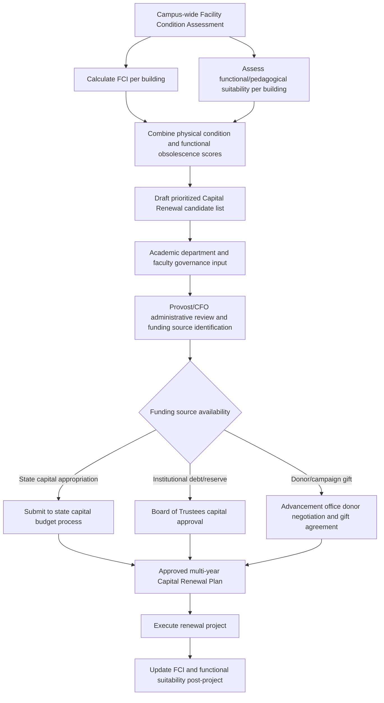

## Higher Education and Institutional Asset Management

### Overview

Higher education and institutional asset management addresses the distinctive lifecycle management challenges of college and university physical plants — academic buildings, research facilities, residence halls, athletics complexes, and campus infrastructure — combined with the specialized equipment portfolios that support teaching and research missions (laboratory instrumentation, IT/AV classroom technology, library collections infrastructure). This domain builds directly on the Facility Condition Index (FCI) and building-systems lifecycle frameworks common to facilities asset management generally, but is shaped by institution-specific structural features: **heterogeneous funding sources** (state appropriations for public institutions, tuition/endowment revenue, restricted research grants, capital campaign gifts), **shared governance decision-making** (faculty senates, boards of trustees, and administration each holding influence over capital priorities), and **research infrastructure** with regulatory and continuity requirements that have no equivalent in typical commercial facilities management.

The sector is also distinguished by a well-developed, long-standing benchmarking tradition — organizations such as APPA (the association of higher education facilities professionals) and its Center for Facilities Research have produced widely referenced facilities condition and capital renewal benchmarking data for decades, giving higher education one of the more mature comparative datasets in institutional asset management.

### Key Points

- **Deferred Maintenance (DM) backlog**: In higher education, this is a particularly prominent and often publicly reported metric — the accumulated, unfunded renewal need across campus facilities, frequently cited in board of trustees and state legislative capital budget discussions.
- **Capital Renewal and Replacement (CRR) funding**: The ongoing, typically annual funding stream (often expressed as a percentage of Current Replacement Value, commonly benchmarked around 1.5–3% annually per APPA/sector guidance) dedicated to systematic building system renewal, distinct from new construction or major deferred-maintenance catch-up funding.
- **Space utilization and classroom/lab efficiency metrics**: Institution-specific metrics (student contact hours per square foot, classroom utilization rate against a target occupancy/fill threshold) used to justify or challenge new construction requests against existing underutilized space.
- **Research continuity and core facility management**: Asset management for shared research infrastructure (vivariums, core imaging/instrumentation facilities, cleanrooms) where equipment failure can jeopardize live experiments, animal welfare compliance, or grant-funded research timelines — introducing risk consequences distinct from typical academic building systems.
- **Sponsored research equipment and federal compliance**: Equipment purchased under federal grants is subject to specific federal property management standards (2 CFR 200 Subpart D, the Uniform Guidance) governing inventory control, use restrictions, and disposition — a compliance layer absent from most non-grant-funded institutional assets.

### Facilities Asset Management in the Higher Education Context

The FCI framework (see general facilities asset management principles) applies directly to campus buildings, but higher education institutions typically layer additional institution-specific dimensions onto standard condition assessment:

- **Academic mission alignment**: Capital renewal prioritization must weigh not only physical condition (FCI) but also **functional obsolescence** relative to evolving pedagogy (e.g., a physically sound but rigidly lecture-hall-configured building may score well on FCI yet poorly support active-learning teaching models increasingly demanded by academic departments).
- **Multi-source capital funding stacking**: A single major renewal project often blends state capital appropriation (for public institutions), institutional reserve/debt financing, and donor capital gifts — each with different approval processes, timing constraints, and sometimes donor-imposed restrictions on use (naming rights agreements, specific programmatic requirements) that constrain how flexibly the resulting asset can later be repurposed.
- **Shared governance capital planning**: Unlike a corporate facilities function where executive leadership can generally direct capital priorities, higher education capital planning typically involves formal input processes through faculty governance bodies, academic deans, and student affairs, alongside board of trustees final approval — extending decision timelines but also embedding broader institutional buy-in into the resulting capital plan.

### Diagram: Higher Education Capital Renewal Prioritization Process (svg_diagram)

### Research Infrastructure and Specialized Equipment Asset Management

Research-intensive institutions manage a distinct asset category with elevated continuity and compliance requirements:

- **Core facilities and shared instrumentation**: Centralized research equipment (mass spectrometers, electron microscopes, sequencing platforms, high-performance computing clusters) typically managed through a **core facility model** with dedicated technical staff, service/maintenance contracts, and cost-recovery fee structures for internal and external users — asset management here directly affects institutional research competitiveness and grant funding capacity.
- **Vivarium and animal research facility systems**: HVAC, backup power, and environmental control systems supporting animal research facilities carry compliance obligations under the Animal Welfare Act and institutional IACUC (Institutional Animal Care and Use Committee) oversight; system failure (e.g., loss of environmental control) can constitute a reportable welfare incident, elevating these systems' criticality classification well above comparable systems in non-research buildings.
- **Cleanroom and specialized environment maintenance**: Semiconductor fabrication labs, nanotechnology facilities, and similar specialized research environments require maintenance protocols (particle count monitoring, HVAC filtration performance) that follow specific ISO cleanroom classification standards rather than standard building HVAC maintenance practice.
- **Emergency/backup power for research continuity**: Given the potential for catastrophic loss of irreplaceable research materials or long-running experiments during power interruption, research building backup power and generator maintenance programs typically receive higher-tier maintenance rigor than administrative or classroom building equivalents.

### Federal Grant-Funded Equipment Compliance

Equipment acquired using federal research grant funds is subject to distinct property management requirements under **2 CFR 200 Subpart D** (Uniform Guidance), which higher education institutions must incorporate into their broader asset management/inventory systems:

- **Equipment inventory requirements**: Federally funded equipment (typically defined by an acquisition cost threshold, commonly $5,000, though specific thresholds can vary by agency/award terms) must be tracked with records including description, funding source/award number, acquisition date and cost, location, use/condition, and ultimate disposition.
- **Physical inventory verification**: Institutions are required to conduct a physical inventory of federally funded equipment at least once every two years and reconcile results against equipment records.
- **Use restrictions**: Federally funded equipment must generally be used for the project/program for which it was acquired, with specific rules governing use on other federally funded or federally related work when not needed for the original project.
- **Disposition rules**: Upon completion of the award or when equipment is no longer needed, disposition follows federal guidance based on current fair market value thresholds, potentially requiring the awarding federal agency to be compensated for its share of the equipment's value — distinct from purely institutionally-owned equipment, which the institution can dispose of per its own policy.

This compliance layer means a research university's asset management/inventory system must maintain funding-source attribution at the individual asset level — a data requirement not typically present in general facilities or fleet asset management systems, since a piece of equipment's federal versus institutional funding origin determines its applicable disposition rules years after acquisition.

### Space Management and Utilization Analytics

Higher education institutions face persistent pressure to justify new capital construction against existing space utilization, given that new academic building requests compete for the same constrained state or institutional capital pools as renewal/deferred maintenance needs:

- **Classroom utilization rate**: Commonly measured as scheduled hours used against total available scheduling hours, and/or seat fill-rate during scheduled use — institutions with low utilization rates face greater scrutiny when requesting new classroom construction.
- **Net assignable square feet (NASF) per student/FTE benchmarking**: Used to compare an institution's space efficiency against peer institutions, often via data reported to state higher education coordinating boards (for public institutions) or through voluntary benchmarking consortia.
- **Space inventory systems (often integrated with the registrar's course scheduling system)**: Required to produce reliable utilization data; poor space inventory data quality is a common practical obstacle to defensible utilization-based capital justification.

### Practical Example

A public research university faces a $340 million deferred maintenance backlog across its 210-building, 11-million-square-foot campus, alongside a state capital appropriations process that funds only a fraction of the annual APPA-benchmarked CRR target. Facing this gap, the institution implements a triage framework combining FCI, functional/pedagogical suitability score, and research continuity risk (for research buildings) to rank renewal candidates, rather than treating all deferred maintenance as equally urgent. A 1970s-era chemistry research building with FCI of 0.28 and aging fume hood/HVAC systems supporting active federally funded research is prioritized ahead of a similarly-FCI-scored administrative building, reflecting the elevated consequence-of-failure weighting appropriate to active research continuity — illustrating how institutional asset management must extend beyond pure physical condition scoring to incorporate mission-specific risk dimensions that a generic commercial facilities FCI model would not capture on its own. [Inference: the specific triage weighting methodology described is illustrative of common practice patterns in the sector rather than a single standardized formula mandated across all institutions.]

### Benchmarking and Sector Data Resources

- **APPA (Association of Higher Education Facilities Officers)** and its Center for Facilities Research publish widely referenced benchmarking surveys covering facilities operating cost per square foot, CRR funding levels, and deferred maintenance backlog trends across participating institutions — a maturity of sector-specific benchmarking data less commonly available in some other institutional asset classes.
- **State higher education coordinating/governing board reporting**: Public institutions in many states report space inventory and condition data to a state coordinating body as part of capital budget request processes, creating a standardized (though state-specific) data reporting requirement layered on top of institutional internal asset management systems.
- **Sightlines and similar commercial benchmarking services**: Third-party facilities benchmarking firms provide comparative FCI, CRR funding ratio, and operational cost benchmarking specifically calibrated to higher education and similar institutional portfolios. [Unverified: specific current service offerings and market presence of named benchmarking vendors should be verified independently, as this is a competitive commercial vendor landscape subject to change.]

### Common Pitfalls

- **Treating FCI as the sole capital prioritization input**, missing functional obsolescence and mission-criticality dimensions that matter significantly in an academic/research context.
- **Inadequate funding-source attribution in equipment inventory systems**, creating federal compliance risk (2 CFR 200 Subpart D violations) that surfaces during federal audits or award closeout, sometimes years after acquisition.
- **Underinvesting in space utilization data quality**, undermining the institution's ability to defend against — or credibly request — new capital construction relative to existing space capacity.
- **Applying uniform maintenance rigor across research and non-research buildings**, under-resourcing critical research continuity systems (vivarium environmental control, core facility backup power) relative to their true failure consequence.
- **Allowing deferred maintenance backlog to become a purely budgetary/reporting metric** disconnected from an active, funded Capital Renewal and Replacement program — backlog reporting without a credible funding strategy tends to compound the underlying problem rather than resolve it.

### Related Topics

- APPA Facilities Condition Assessment and Capital Renewal Benchmarking
- Federal Uniform Guidance (2 CFR 200 Subpart D) Equipment Compliance
- Research Core Facility Management and Cost-Recovery Models
- Vivarium and IACUC-Regulated Facility Systems Management
- Space Utilization Analytics and Academic Space Planning
- Capital Campaign Gift Restrictions and Facilities Naming Agreements
- Cleanroom and Specialized Research Environment Maintenance Standards
- Shared Governance Models in Institutional Capital Planning
- Deferred Maintenance Backlog Reporting and State Capital Budget Processes