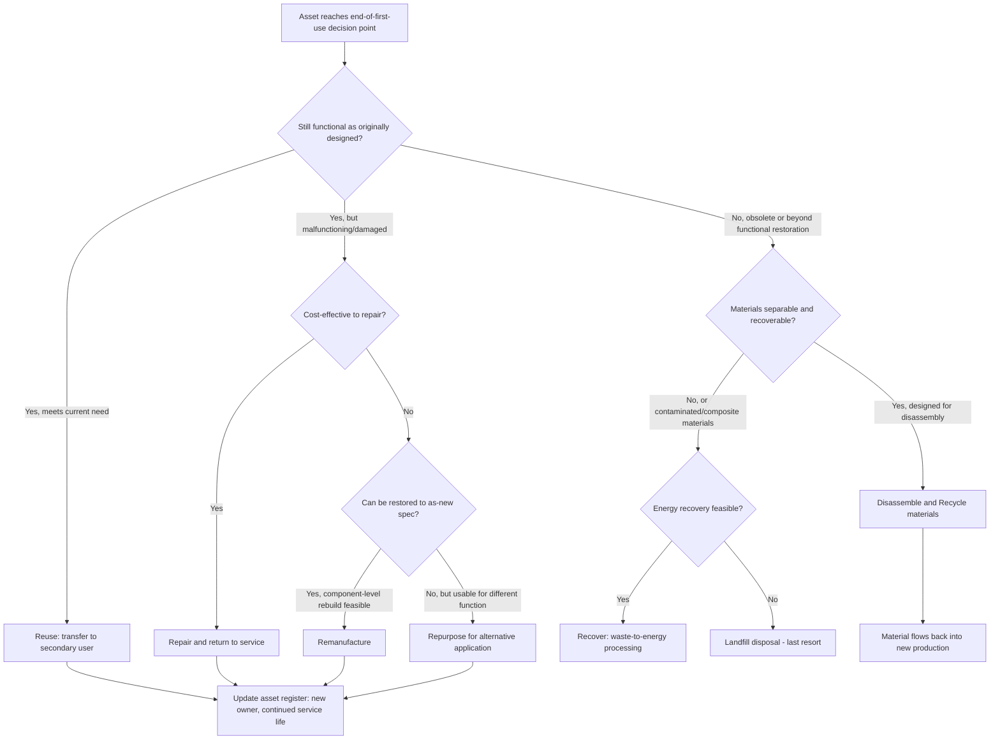

## Circular Economy Principles Applied to Asset Lifecycles

### Overview

Circular economy principles applied to asset lifecycles represent a fundamental reframing of asset management away from the traditional linear model — acquire, use, dispose — toward a model designed to retain material and product value across multiple use cycles, minimize resource extraction, and eliminate waste as a design output rather than an end-of-life afterthought. Where conventional asset lifecycle management typically treats disposal as the terminal stage of an asset's life, circular economy thinking treats end-of-first-use as a decision point among several value-retention pathways — reuse, repair, refurbishment, remanufacturing, and material recycling — each preserving a different proportion of the original embedded economic and environmental value.

This chapter's principles apply across every asset class covered elsewhere in this course: public infrastructure, industrial equipment, healthcare devices, utility assets, fleets, and facilities all generate end-of-life material flows, and circular economy thinking increasingly shapes procurement specifications, contract structures (e.g., product-as-a-service models), and disposal decision frameworks across all of them. The foundational conceptual framework most widely referenced in professional and policy contexts is the **Ellen MacArthur Foundation's** circular economy model, alongside ISO 59004/59010/59020 standards (the ISO 59000 series, published to formalize circular economy terminology, business model transition guidance, and performance measurement).

### Key Points

- **Value retention hierarchy (the "R-strategies")**: A structured hierarchy of circularity interventions — commonly ordered Refuse, Rethink, Reduce, Reuse, Repair, Refurbish, Remanufacture, Repurpose, Recycle, Recover — ranked from highest to lowest value/resource retention.
- **Design for Disassembly (DfD) / Design for Circularity**: An engineering design principle specifying that products and assets be designed from the outset to enable easy separation of components and materials at end-of-life, directly enabling higher-value R-strategies later in the lifecycle.
- **Product-as-a-Service (PaaS) / servitization**: A business model in which a manufacturer or provider retains ownership of the physical asset and sells its function/output (e.g., "lighting as a service" rather than selling light fixtures), creating a direct manufacturer incentive to design for durability, repairability, and end-of-life recovery since the manufacturer bears the asset's full lifecycle cost.
- **Material Flow Analysis (MFA) / Material Passport**: A documentation approach recording the material composition, origin, and disassembly information for a product or asset, enabling future recyclers or remanufacturers to recover value more effectively than would be possible from an undocumented asset.
- **Extended Producer Responsibility (EPR)**: A policy mechanism (increasingly mandated by regulation in many jurisdictions, notably the EU and a growing number of U.S. states for specific product categories such as electronics and packaging) making manufacturers financially and/or physically responsible for the end-of-life management of their products, creating a regulatory driver for circular design.

### The Value Retention Hierarchy

The R-strategy framework orders circularity interventions by the proportion of original product/material value preserved, generally corresponding inversely to the amount of reprocessing energy and material transformation required:

1. **Refuse** — eliminate the need for the asset/product entirely (e.g., through service redesign that removes the underlying need).
2. **Rethink** — redesign the product/system to fundamentally change how the function is delivered (e.g., shared/pooled assets replacing individually-owned ones).
3. **Reduce** — decrease material/resource intensity per unit of function delivered.
4. **Reuse** — a product is used again for its original purpose by another user with little to no modification, retaining nearly all original value.
5. **Repair** — restoring a broken or malfunctioning product to working condition, extending the current use cycle.
6. **Refurbish** — restoring an older product to good working condition, typically involving more extensive intervention than repair but retaining the original product structure.
7. **Remanufacture** — disassembling a product to component level, restoring/replacing components to as-new specification, and reassembling — retains substantial embedded value and is common in industrial equipment, automotive components, and some medical device categories.
8. **Repurpose** — using a discarded product or its components for a different function than originally intended (e.g., retired EV batteries repurposed for stationary grid storage).
9. **Recycle** — processing material back into raw material inputs for new production, retaining material value but losing the product's embodied manufacturing energy/labor value.
10. **Recover** — extracting energy content from materials that cannot be recycled (e.g., waste-to-energy), representing the lowest value-retention tier above landfill disposal.

$$ValueRetained_{strategy} \propto \frac{1}{ReprocessingEnergyRequired_{strategy}}$$

This inverse relationship is the core economic and environmental logic underlying R-strategy prioritization: strategies higher in the hierarchy generally require less energy/material transformation and therefore retain more of the original value (both economic and embodied environmental value) than strategies lower in the hierarchy.

### Diagram: Circular Asset Lifecycle Decision Flow (svg_diagram)

### Design for Circularity in Asset Specification

Applying circular economy principles requires intervention at the asset acquisition/specification stage, not merely at disposal:

- **Modularity and standardized interfaces**: Specifying components with standardized connection interfaces enables easier component-level replacement/upgrade, extending useful life without full asset replacement — a principle already embedded in some industrial equipment and IT hardware design, increasingly extended to infrastructure and building systems specification.
- **Material selection and material passports**: Specifying materials with known recyclability pathways and documenting material composition (a "material passport") at acquisition significantly improves end-of-life recovery value, since undocumented mixed-material assets are frequently downcycled or landfilled due to the cost/difficulty of material identification and separation.
- **Durability and repairability specification in procurement**: Public and institutional procurement processes increasingly incorporate total lifecycle circularity criteria (repairability scoring, availability of spare parts commitments, take-back program requirements) alongside traditional price and performance criteria — a shift from purchasing solely on acquisition cost/performance toward lifecycle circularity as an explicit procurement evaluation dimension.
- **Design for Disassembly (DfD) principles**: Avoiding permanent bonding (adhesives, welds) where mechanical fastening would allow future separation; minimizing the number of distinct material types in a single component; labeling materials clearly for future sorting.

### Business Model Structures Enabling Circularity

**Product-as-a-Service (PaaS) / servitization**

Under PaaS models, the asset owner/manufacturer retains title to the physical asset throughout its life and sells the functional output instead (illumination, cooling, mobility, computing capacity). This structurally realigns incentives:

$$Incentive_{manufacturer} = f(AssetDurability, RepairEase, ResidualMaterialValue)$$

Because the manufacturer bears full lifecycle cost and captures any residual/recovered material value, PaaS models create a direct commercial incentive toward durable, repairable, and disassembly-friendly design — a sharp contrast to a traditional sale model where the manufacturer's commercial interest can, absent countervailing regulation or reputation effects, favor shorter product life and lower repairability.

**Take-back and reverse logistics programs**

Structured programs (manufacturer-operated or third-party) that recover end-of-life products from users for refurbishment, remanufacturing, or material recycling — increasingly common for electronics, medical devices, and industrial equipment with known material or component value, and often driven or accelerated by Extended Producer Responsibility regulatory requirements.

**Asset-sharing and pooling models**

Shared-use models (equipment pools, car-sharing/fleet-sharing, tool libraries) increase the utilization rate of each physical unit, reducing the total number of units required to deliver the same aggregate service — a "Reduce" and "Rethink" strategy applied at the system level rather than the individual product level.

### Cross-Sector Application Examples

- **Public infrastructure**: Reclaimed asphalt pavement (RAP) and recycled aggregate are established circular material streams in road construction; municipal LED streetlight programs increasingly incorporate manufacturer take-back commitments for end-of-life fixtures.
- **Industrial equipment**: Remanufacturing is a mature, well-established practice for components such as engines, transmissions, hydraulic pumps, and electric motors, often supported by industry certification standards for remanufactured parts.
- **Healthcare equipment**: Reprocessing of certain single-use medical devices (under FDA-regulated third-party or hospital-based reprocessing programs) and refurbished/remanufactured imaging equipment represent established circular pathways in a sector otherwise dominated by strict single-use and sterility requirements that constrain circularity options relative to other asset classes.
- **Utilities**: Retired EV batteries repurposed for stationary grid energy storage (a "Repurpose" strategy) is an actively growing application, leveraging batteries that have degraded below acceptable vehicle-range performance but retain substantial capacity for less demanding stationary storage duty cycles.
- **Fleet assets**: End-of-life vehicle recycling programs recover significant proportions of vehicle material by weight (particularly metals), though composite materials and electronics present ongoing recycling challenges. [Unverified: specific current material recovery rate percentages vary by vehicle type, jurisdiction, and recycling infrastructure maturity, and should be sourced from current industry data rather than assumed as a fixed universal figure.]
- **Facilities**: Deconstruction (selective disassembly for material salvage) versus demolition of end-of-life buildings, and material reuse in renovation projects (salvaged structural timber, reclaimed fixtures), represent growing circular practice in the built environment sector.

### Measuring Circularity Performance

- **Material Circularity Indicator (MCI)**: A metric (developed by the Ellen MacArthur Foundation in collaboration with Granta Design) scoring a product between 0 (fully linear) and 1 (fully circular) based on recycled/reused input content, product utility/lifetime extension, and end-of-life recovery pathway.
- **ISO 59020**: Part of the ISO 59000 series specifically addressing circularity performance measurement at the organizational level, providing standardized methodology for organizations to measure and report circular economy performance. [Unverified: as a relatively recently published standard, organizations should confirm current adoption status and specific measurement methodology details against the current published standard text.]
- **Asset-level circularity tracking integration**: Forward-looking asset management/EAM systems increasingly incorporate end-of-life pathway tracking (reuse/repair/remanufacture/recycle/dispose classification) as a data field alongside traditional asset register attributes, enabling portfolio-level circularity reporting analogous to how condition/FCI data enables portfolio-level condition reporting.

### Practical Example

A regional transit agency's bus fleet replacement program is redesigned around circular economy principles. Rather than the traditional path (retire buses at end-of-service-life, sell for scrap), the agency establishes a tiered disposition process: buses retired from primary revenue service but still mechanically sound are refurbished and reassigned to lower-demand routes or paratransit service (Reuse/Refurbish), extending total fleet-unit service life by an estimated 3–4 additional years before final retirement. At final retirement, engines and transmissions meeting condition thresholds are sent to a certified remanufacturer rather than scrapped (Remanufacture), and remaining structural/material content is processed through a metals recycler with documented recovery reporting (Recycle). This tiered approach is projected to reduce the agency's net new-bus acquisition rate and associated capital expenditure relative to a purely linear retire-and-scrap policy, while also reducing the embodied-carbon footprint associated with new vehicle manufacturing — illustrating how R-strategy hierarchy application at the fleet level can generate both direct capital cost avoidance and environmental co-benefits simultaneously. [Inference: the specific service-life extension figures and capital avoidance magnitude are illustrative of the general pattern circular fleet strategies can produce; actual results depend heavily on fleet-specific condition, remanufacturing market access, and route network characteristics.]

### Common Pitfalls

- **"Downcycling" mistaken for genuine circularity**: Recycling processes that convert material into a lower-value application (e.g., high-grade plastic recycled into a lower-grade product) retain some material value but do not achieve the higher-value retention that reuse, repair, or remanufacture strategies provide — organizations should track which R-strategy tier is actually being achieved rather than treating all "recycling" outcomes as equivalent.
- **Retrofitting circularity onto assets not designed for it**: Attempting to apply Design for Disassembly principles or material passport documentation retroactively to already-acquired assets is far less effective than incorporating circularity criteria at the original specification/procurement stage.
- **Underestimating reverse logistics cost and complexity**: Take-back and remanufacturing programs require functioning collection, transportation, and processing infrastructure; circularity ambitions without corresponding reverse logistics investment tend to default back to linear disposal in practice.
- **Treating circular economy metrics as purely an environmental/sustainability reporting exercise** disconnected from actual asset management and procurement decision-making, missing the direct capital cost avoidance and risk reduction benefits genuine circular practice can deliver.
- **Ignoring regulatory compliance interactions**: Certain circular pathways (medical device reprocessing, hazardous material recycling) are subject to specific regulatory oversight, and pursuing circularity without corresponding regulatory compliance review can create liability exposure that offsets the intended benefit.

### Related Topics

- ISO 59000 Series — Circular Economy Terminology, Transition, and Performance Measurement
- Design for Disassembly (DfD) and Modular Product Architecture
- Extended Producer Responsibility (EPR) Policy Frameworks
- Product-as-a-Service Business Models and Servitization Economics
- Material Circularity Indicator (MCI) and Circularity Performance Reporting
- Remanufacturing Standards and Certification (Industrial and Automotive Components)
- Reclaimed and Recycled Materials in Infrastructure Construction
- Battery Second-Life Applications and Repurposing for Grid Storage
- Deconstruction and Material Salvage in Building End-of-Life Management