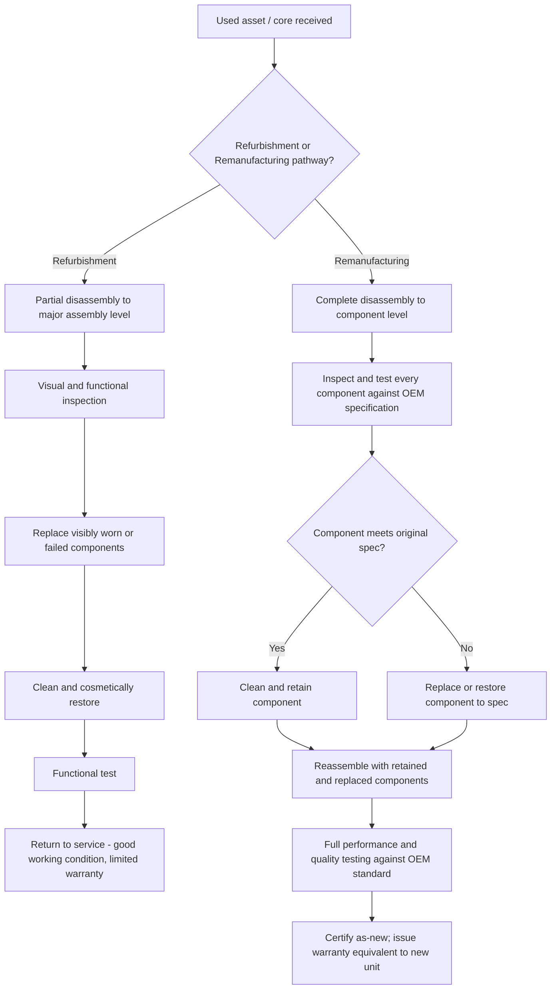

## Extending Asset Life through Refurbishment and Remanufacturing

### Overview

Extending asset life through refurbishment and remanufacturing addresses the technical, economic, and quality-assurance frameworks that allow an asset to be restored to renewed service — either at a level below original specification (refurbishment) or to a certified as-new performance standard (remanufacturing) — rather than being replaced outright. These two strategies sit high on the circular economy value retention hierarchy, below only reuse and repair, and represent the primary mechanisms by which asset-intensive organizations (industrial, fleet, healthcare, utility) capture a substantial fraction of an asset's original embedded value while avoiding the full capital and environmental cost of new acquisition. Where the previous topic addressed circular economy principles at a conceptual and cross-sector level, this topic focuses specifically on the engineering, quality, and financial decision frameworks required to execute refurbishment and remanufacturing programs effectively.

The distinction between refurbishment and remanufacturing is not merely semantic — it carries different quality assurance obligations, different applicable standards, and, in regulated sectors (medical devices, aviation), different regulatory treatment. Getting this distinction right is foundational to sound program design.

### Key Points

- **Refurbishment**: The process of restoring a used asset to good working condition, typically involving cleaning, cosmetic restoration, and replacement of visibly worn or failed components, but generally without full disassembly to component level or restoration to original manufacturer specification across all components.
- **Remanufacturing**: A more rigorous, standardized process involving complete disassembly to component level, inspection and testing of every component against original specification, replacement or restoration of any component not meeting that specification, and reassembly with full quality testing — producing a unit with performance and warranty comparable to new (often literally certified "as-new" per standards such as **ISO 8887** for remanufacturing terminology, or SAE and industry-specific remanufacturing standards).
- **Core**: The industry term for the used component or unit returned by a customer as the starting point for remanufacturing, typically credited against the price of a remanufactured replacement unit (a "core charge/deposit" mechanism common in automotive parts, industrial components, and toner cartridge remanufacturing).
- **Remaining Useful Life (RUL) assessment**: The engineering evaluation determining how much service life remains in a used asset or its components — a prerequisite decision input for choosing among repair, refurbishment, remanufacturing, or replacement.
- **Warranty parity**: A key commercial and quality differentiator — genuine remanufactured components typically carry warranty terms equivalent to new components, while refurbished units typically carry shorter or more limited warranty coverage reflecting the less rigorous restoration process.

### Refurbishment vs. Remanufacturing: Process and Quality Distinction

| Dimension | Refurbishment | Remanufacturing |
| --- | --- | --- |
| Disassembly level | Partial — typically to major assembly/module level | Complete — to individual component level |
| Component testing | Selective, often visual/functional spot-check | Comprehensive — every component tested against original spec |
| Component replacement basis | Visibly worn, damaged, or failed components only | Any component not meeting original specification, regardless of visible condition |
| Performance standard | Good working condition, may not match original spec | As-new performance, certified against original OEM specification |
| Warranty | Typically limited/shorter than new | Often equivalent to new-unit warranty |
| Typical cost relative to new | Lowest (30–50% of new, illustrative range) | Moderate (50–75% of new, illustrative range) |
| Common applications | Consumer electronics, office furniture, some medical imaging equipment | Automotive components (engines, transmissions, alternators), industrial motors/pumps, aerospace components |

[Inference: the cost-percentage ranges shown are commonly cited illustrative industry figures rather than fixed universal values; actual cost ratios vary significantly by asset category, market, and specific remanufacturer.]

### Diagram: Refurbishment vs. Remanufacturing Process Flow (svg_diagram)

### Remaining Useful Life Assessment and Decision Criteria

Before committing an asset to refurbishment or remanufacturing, organizations typically evaluate several decision inputs:

$$Decision_{pathway} = f(RUL_{core}, CostRatio_{refurb/reman\,vs\,new}, PerformanceGap, RegulatoryConstraint)$$

- **Core condition and RUL assessment**: Determines whether the base unit/core has sufficient structural or high-value component integrity to justify the remanufacturing investment — a core with a cracked or corroded primary housing, for instance, may be rejected regardless of otherwise-good component condition.
- **Cost ratio analysis**: Comparing refurbishment/remanufacturing cost against new-unit acquisition cost; a common rule-of-thumb threshold in several industrial contexts treats remanufacturing as favorable when cost remains meaningfully below new-unit cost (commonly cited around 50–70% of new, though this varies substantially by asset type and should be validated against asset-specific data rather than applied as a universal rule).
- **Performance gap tolerance**: Whether the application can accept a refurbished unit's potentially lower performance/reliability profile, or requires remanufactured (as-new) performance — e.g., a non-critical backup pump may be an acceptable refurbishment candidate where a primary life-safety system component would require remanufacturing or new replacement only.
- **Regulatory constraints**: Certain regulated equipment categories (specific medical devices, aviation components) have explicit regulatory frameworks governing whether and how remanufacturing/refurbishment is permitted, sometimes prohibiting certain approaches entirely for specific device/component classes.

### Sector-Specific Standards and Practice

**Automotive and Industrial Components**

Remanufacturing is most mature in this sector, supported by established industry standards and trade associations (e.g., the Motor & Equipment Remanufacturers Association, MERA, in North America) covering component categories such as engines, transmissions, alternators/starters, turbochargers, and hydraulic pumps. The **core exchange model** — where a customer's failed unit is exchanged for a remanufactured replacement, with the failed unit becoming the next remanufacturing cycle's core — creates an efficient closed-loop supply chain that has operated at scale for decades in this sector.

**Aerospace Components**

Remanufacturing (often termed overhaul in this sector) of aircraft components follows stringent FAA (or equivalent international aviation authority) certification requirements, with maintenance, repair, and overhaul (MRO) facilities operating under specific regulatory certification (e.g., FAA Part 145 repair station certification in the U.S.) — reflecting the extreme safety consequence profile of this asset category. [Unverified: specific current FAA certification requirements and applicable component categories should be verified against current FAA regulations, as aviation regulatory detail is highly specific and subject to periodic update.]

**Medical Device Reprocessing and Refurbishment**

As referenced in the circular economy overview, single-use device reprocessing and medical imaging equipment refurbishment operate under FDA regulatory oversight, with specific requirements distinguishing permitted reprocessing/refurbishment activities from prohibited "remanufacturing" that would require the reprocessor/refurbisher to meet original manufacturer premarket approval standards — a regulatory line where the general remanufacturing/refurbishment terminology used elsewhere in this topic does not map directly onto FDA's specific regulatory categories, and organizations in this sector should apply FDA's own definitions rather than general industry terminology. [Unverified: FDA's specific regulatory boundary between permitted reprocessing/refurbishment and regulated remanufacturing is a detailed and evolving regulatory area that should be verified against current FDA guidance for the specific device category in question.]

**Industrial Motors, Pumps, and Electrical Equipment**

Large industrial motor and transformer rewinding/remanufacturing is a well-established practice supported by standards from organizations such as EASA (Electrical Apparatus Service Association), addressing quality procedures for motor rewind and repair that preserve or restore original efficiency and reliability performance — an important consideration since improperly executed motor rewinds can measurably reduce motor efficiency relative to the original unit.

### Financial and Accounting Treatment

Refurbishment and remanufacturing decisions interact with asset accounting treatment in ways relevant to the broader lifecycle cost management theme of this course:

- **Capitalize vs. expense determination**: Whether refurbishment/remanufacturing cost is capitalized (added to the asset's book value, typically when the work extends useful life or increases capacity/performance beyond original specification) or expensed as a repair (when merely restoring to previously expected condition) follows standard capital asset accounting policy — this determination should align with the organization's capitalization policy threshold and definition of a betterment versus a repair.
- **Core value accounting**: In core-exchange remanufacturing programs, the core itself often carries a distinct accounting/inventory value, and core deposit/credit mechanisms require appropriate inventory and revenue recognition treatment.
- **Extended useful life re-estimation**: When an asset undergoes remanufacturing, its remaining depreciable useful life is typically reassessed and often reset (fully or partially) to reflect the as-new condition achieved — the specific accounting treatment depends on applicable accounting standards (GASB for public sector, FASB/ASC for private sector) and the organization's asset capitalization policy.

### Practical Example

An industrial facility operating 40 large centrifugal pumps evaluates its maintenance strategy for units reaching end of first service life (approximately 15 years). New pump replacement cost is $85,000 per unit; a qualified remanufacturer offers full component-level remanufacturing (including impeller replacement, bearing and seal renewal, and casing inspection/repair) at $38,000 per unit with a warranty equivalent to a new unit. RUL assessment of the pump casings (the highest-value, longest-lived component) confirms sufficient remaining structural integrity across the fleet to support remanufacturing. Given the approximately 45% cost ratio relative to new and warranty parity, the facility adopts a remanufacture-first policy for this pump class, reserving new-unit replacement only for cases where casing inspection reveals disqualifying damage. This decision is projected to reduce the facility's pump replacement capital expenditure substantially over the remaining fleet renewal cycle while maintaining equivalent reliability performance to new-unit replacement — illustrating the core economic logic that makes remanufacturing attractive specifically when core condition supports it and warranty parity removes the performance-risk objection that might otherwise favor refurbishment or new replacement. [Inference: the specific cost figures and resulting fleet-wide savings are illustrative of the type of analysis performed in practice; actual figures depend on the specific equipment, remanufacturer capability, and market pricing at the time of decision.]

### Quality Assurance and Certification Frameworks

- **ISO 8887 series**: Provides standardized terminology and technical documentation guidance for design for manufacturing, assembly, disassembly, and end-of-life processing, underpinning consistent remanufacturing terminology and process documentation across industries.
- **Third-party remanufacturing certification programs**: Various industry-specific certification schemes (varying by sector and region) allow remanufacturers to certify that their process and output meet defined quality standards, providing purchasers with quality assurance comparable to OEM certification without requiring the purchaser to independently audit each remanufacturer's process.
- **Traceability and documentation**: Robust remanufacturing programs maintain component-level traceability records (which components were replaced versus retained, test results for retained components) — both for quality assurance and, in regulated sectors, for regulatory compliance documentation purposes.

### Common Pitfalls

- **Conflating refurbishment with remanufacturing in procurement specifications or vendor contracts**, leading to a mismatch between the performance/warranty expectation and what was actually delivered — procurement documentation should specify the required process rigor explicitly rather than relying on ambiguous general terminology.
- **Insufficient core condition assessment before committing to remanufacturing**, resulting in cost overruns when disassembly reveals disqualifying damage not detected in initial inspection.
- **Applying a uniform refurbishment/remanufacturing policy across all asset criticality tiers**, rather than reserving remanufacturing (with its warranty-parity benefit) for higher-criticality applications and refurbishment for lower-criticality, cost-sensitive applications.
- **Neglecting regulatory boundary awareness in regulated sectors** (medical devices, aviation), where general industry remanufacturing/refurbishment terminology and practice may not align with the sector's specific regulatory definitions and requirements.
- **Failing to reassess useful life and update asset accounting records** following remanufacturing, leading to either premature future replacement scheduling (if the reset useful life is not reflected) or inconsistent capitalization treatment across similar remanufacturing events.

### Related Topics

- Circular Economy Principles and the Value Retention Hierarchy (R-Strategies)
- ISO 8887 Design for Manufacturing, Assembly, and Disassembly Standards
- Core Exchange Programs and Reverse Logistics for Remanufacturing Supply Chains
- Remaining Useful Life (RUL) Estimation Methodologies
- Capital vs. Expense Determination for Major Asset Restoration
- FDA Regulatory Framework for Medical Device Reprocessing and Refurbishment
- FAA Part 145 Repair Station Certification and Aerospace Component Overhaul
- EASA Standards for Industrial Motor and Transformer Rewind Quality
- Total Cost of Ownership Comparison: New Acquisition vs. Remanufactured Replacement