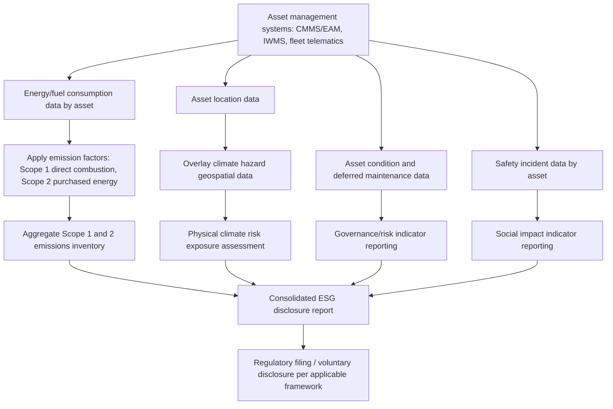

## Environmental, Social, and Governance Reporting for Assets

### Overview

Environmental, Social, and Governance (ESG) reporting for assets addresses the frameworks, metrics, and disclosure obligations through which organizations measure and report the sustainability performance of their physical asset portfolios — energy consumption and greenhouse gas emissions, resource use, safety and social impact, and asset governance practices. Unlike the operationally-focused asset management topics covered elsewhere in this course, ESG reporting is fundamentally a **disclosure and accountability discipline**, shaped by an evolving and increasingly mandatory regulatory landscape (rather than purely voluntary corporate reporting), and requires asset management data systems to capture and structure information in ways that traditional maintenance and financial asset registers were not originally designed to support.

Physical assets are central to ESG performance because they are typically the primary source of an organization's direct environmental footprint (energy and fuel consumption, emissions, water use, waste generation) and a major driver of governance risk (asset failure consequences, safety incidents, supply chain/embodied-carbon exposure). Effective ESG asset reporting therefore depends on close integration between asset management systems (condition, energy, utilization data) and sustainability/finance reporting functions — a convergence that is reshaping asset data architecture requirements across the sectors covered in this course.

### Key Points

- **Scope 1, 2, and 3 emissions**: The GHG Protocol's foundational categorization — Scope 1 (direct emissions from owned/controlled assets, e.g., fleet fuel combustion, on-site fuel-fired equipment), Scope 2 (indirect emissions from purchased electricity/heat/steam), and Scope 3 (all other indirect emissions across the value chain, including embodied carbon in purchased assets and materials) — asset management data is a primary input for accurately calculating all three scopes.
- **Embodied carbon**: The cumulative greenhouse gas emissions associated with a material or asset's extraction, manufacturing, and transportation before it enters service — an increasingly significant consideration in capital asset decisions (new construction, major equipment purchases) as operational emissions are reduced and embodied carbon becomes a proportionally larger share of an asset's total lifecycle emissions.
- **Double materiality**: A reporting concept (central to the EU's Corporate Sustainability Reporting Directive, CSRD) requiring organizations to report both how sustainability issues affect the organization financially (financial materiality) and how the organization's activities affect people and the environment (impact materiality) — a broader disclosure scope than traditional single-materiality financial reporting.
- **Physical climate risk**: The exposure of physical assets to climate hazards (flooding, extreme heat, wildfire, sea-level rise), increasingly a required disclosure element distinguishing acute risks (event-driven, e.g., a specific flood) from chronic risks (gradual, e.g., rising average temperatures affecting equipment performance).
- **TCFD / ISSB frameworks**: The Task Force on Climate-related Financial Disclosures framework (now substantially incorporated into the IFRS Foundation's International Sustainability Standards Board, ISSB, standards — IFRS S1 and S2) providing the dominant global structure for climate-related financial disclosure, organized around governance, strategy, risk management, and metrics/targets.

### Regulatory and Standards Landscape

The ESG reporting landscape has moved rapidly from voluntary, fragmented frameworks toward mandatory, standardized disclosure regimes in many major jurisdictions:

- **EU Corporate Sustainability Reporting Directive (CSRD)** and the associated **European Sustainability Reporting Standards (ESRS)**: Mandate detailed sustainability disclosure for a broad and expanding population of companies operating in the EU, applying the double materiality concept and requiring granular asset-related data (energy consumption by asset category, physical climate risk exposure by facility location, among many other data points).
- **IFRS S1 and S2 (ISSB standards)**: Global baseline sustainability and climate disclosure standards, with S2 specifically addressing climate-related disclosures largely building on the TCFD framework structure, increasingly being adopted or referenced by securities regulators in multiple jurisdictions.
- **U.S. SEC climate disclosure rulemaking**: U.S. climate-related disclosure requirements for public companies have been the subject of extended and evolving rulemaking activity; the specific current status, scope, and requirements should be verified against current SEC guidance given the significant legal and regulatory developments this rule has undergone. [Unverified: given active litigation and regulatory changes affecting this specific rule, current status should be confirmed via current SEC publications rather than assumed static.]
- **State and local building performance standards**: As referenced in the facilities asset management topic, a growing number of jurisdictions mandate building-level energy/emissions performance reporting and improvement targets, creating asset-level (rather than only enterprise-level) ESG reporting obligations.
- **GHG Protocol**: While not itself a mandatory regulatory framework, the GHG Protocol's Scope 1/2/3 accounting methodology underlies virtually all of the mandatory disclosure frameworks above, making it the de facto technical foundation for asset-level emissions calculation regardless of which specific regulatory regime an organization reports under.

[Inference: given the pace of regulatory change in this specific area — spanning EU, U.S., and other jurisdictions concurrently — organizations should treat the specific regulatory landscape as a point-in-time snapshot requiring ongoing verification rather than a stable reference framework, more so than most other regulatory content in this course.]

### Asset Data Requirements for ESG Reporting

Accurate ESG reporting depends on asset management systems capturing specific data categories not always present in traditional maintenance-focused CMMS/EAM systems:

$$Emissions_{asset,annual} = \sum_{fuel/energy\,sources} (Consumption_{source} \times EmissionFactor_{source})$$

- **Energy and fuel consumption by asset/facility**: Granular metering or estimation data (electricity, natural gas, fleet fuel) attributable to specific assets or facilities, rather than only aggregated organizational totals — necessary to identify high-impact assets for targeted improvement and to support facility-level disclosure requirements under frameworks like CSRD.
- **Asset material composition and embodied carbon data**: Increasingly required for major capital asset decisions, drawing on Environmental Product Declarations (EPDs) — standardized, third-party verified documents disclosing a product's lifecycle environmental impact — for construction materials and major equipment.
- **Physical climate risk exposure by asset location**: Geospatial mapping of asset locations against climate hazard data (flood zones, wildfire risk areas, heat projections) to support physical risk disclosure requirements.
- **Asset condition and maintenance data as a governance indicator**: Deferred maintenance backlog and asset condition metrics (as covered in facilities and infrastructure asset management topics) increasingly appear in ESG governance disclosures as indicators of asset risk management quality and capital stewardship.
- **Safety and incident data linked to specific assets**: Equipment-related safety incidents, particularly relevant in industrial, utility, and healthcare asset categories, feeding into the "Social" dimension of ESG reporting.

### Diagram: Asset Data Flow into ESG Reporting (svg_diagram)

### Embodied Carbon and Capital Asset Decisions

As building and equipment operational energy efficiency improves, embodied carbon (emissions from material extraction, manufacturing, and transport prior to asset operation) represents a growing proportion of an asset's total lifecycle emissions, introducing new considerations into capital asset decisions:

- **Whole-life carbon assessment**: Combining embodied carbon (material/construction phase) with projected operational carbon (energy use over the asset's service life) to compare capital investment options on a total lifecycle emissions basis, rather than operational efficiency alone.
- **Environmental Product Declarations (EPDs)**: Increasingly requested or required in procurement specifications for major construction materials (concrete, steel) and equipment, providing standardized embodied carbon data to inform comparative material/product selection.
- **Renovate vs. replace embodied carbon trade-off**: A significant consideration in facilities asset management — retaining and renovating an existing building structure typically avoids substantial embodied carbon compared to demolition and new construction, creating an environmental consideration that can weigh against a purely condition/FCI-based renovate-vs-replace decision, even when new construction might otherwise appear more cost-effective on a purely operational basis.

$$WholeLifeCarbon = EmbodiedCarbon_{materials/construction} + \sum_{t=1}^{n} OperationalCarbon_{t}$$

### Physical Climate Risk Assessment for Asset Portfolios

- **Acute vs. chronic risk categorization**: Acute physical risks are event-driven (a specific flood, wildfire, or extreme storm event), while chronic risks involve longer-term shifts (rising average temperatures, changing precipitation patterns, sea-level rise) that gradually affect asset performance, maintenance requirements, or viability.
- **Asset-level vulnerability assessment**: Overlaying asset location and design specifications (e.g., flood elevation, HVAC design temperature range) against projected climate hazard data to identify specific assets at elevated risk — a methodology increasingly required under frameworks like TCFD/IFRS S2 for material physical risk disclosure.
- **Adaptation planning integration**: Physical risk assessment findings increasingly feed into capital planning (e.g., flood-proofing critical infrastructure, upgrading HVAC systems for higher design temperatures) — connecting ESG risk disclosure directly to the capital renewal and replacement planning processes covered elsewhere in this course.

### Practical Example

A multi-site industrial manufacturer preparing its first CSRD-aligned sustainability report discovers that its existing CMMS tracks equipment maintenance history thoroughly but captures no facility-level energy consumption data disaggregated below the whole-site utility meter level, making it unable to attribute emissions to specific high-impact equipment or production lines as required for meaningful Scope 1/2 disclosure and internal reduction target-setting. The organization implements sub-metering on major energy-consuming equipment (compressors, furnaces, HVAC systems) across its five facilities and integrates this data into its asset management system alongside existing maintenance records, enabling both accurate emissions attribution for regulatory disclosure and identification of specific aging, energy-inefficient equipment as priority candidates for the capital replacement program — illustrating how ESG reporting requirements are increasingly driving asset data architecture investment that also yields direct operational asset management value, rather than functioning as a purely separate compliance reporting exercise.

### Integration with Traditional Asset Management Practice

ESG reporting requirements increasingly reshape asset management practice covered elsewhere in this course, rather than functioning as an independent parallel discipline:

- **Capital planning criteria expansion**: Asset replacement and capital renewal prioritization frameworks (FCI-based facilities prioritization, risk-based utility asset replacement) increasingly incorporate emissions reduction potential alongside traditional condition/risk criteria, particularly for major system replacement decisions where a like-for-like replacement and a decarbonization-oriented replacement (e.g., electrification) represent materially different capital and emissions outcomes.
- **Procurement specification evolution**: As referenced in the circular economy topic, procurement processes increasingly incorporate embodied carbon, EPD documentation, and lifecycle emissions criteria alongside traditional price/performance specifications.
- **Asset management system data architecture**: The growing ESG data requirements described above are driving many organizations to extend or integrate their CMMS/EAM/IWMS systems with dedicated sustainability data management platforms, creating a data architecture challenge — avoiding duplicate, inconsistent data entry across systems while meeting both operational asset management and regulatory disclosure needs — that is itself becoming a distinct area of asset management systems practice.

### Common Pitfalls

- **Treating ESG reporting as a standalone compliance/reporting function disconnected from operational asset management**, missing opportunities to use the underlying data (energy consumption, condition, safety incidents) for direct operational improvement and duplicating data collection effort across separate systems.
- **Underestimating asset-level data granularity requirements**, particularly the shift from whole-facility utility billing data (sufficient for basic historical reporting) to sub-metered, asset-attributable data increasingly required for both regulatory disclosure detail and meaningful internal decarbonization target-setting.
- **Focusing exclusively on operational carbon while ignoring embodied carbon** in major capital asset decisions, potentially favoring replacement over renovation/retention even when whole-life carbon assessment would favor the latter.
- **Assuming current regulatory requirements are stable**, given the genuinely active and evolving state of climate/ESG disclosure regulation across multiple major jurisdictions — organizations should build reporting systems with sufficient flexibility to accommodate evolving requirements rather than optimizing narrowly for a single current regulatory specification.
- **Neglecting physical climate risk in asset location and design decisions** for new capital investment, given that assets placed into service today may face materially different climate hazard exposure over their multi-decade service life than historical climate data alone would suggest.

### Related Topics

- GHG Protocol Scope 1, 2, and 3 Emissions Accounting Methodology
- IFRS S1/S2 (ISSB) and TCFD Climate Disclosure Frameworks
- EU Corporate Sustainability Reporting Directive (CSRD) and ESRS Requirements
- Embodied Carbon Assessment and Environmental Product Declarations (EPDs)
- Physical Climate Risk Assessment and Asset Vulnerability Mapping
- Building Performance Standards and Municipal Energy Benchmarking Ordinances
- Whole-Life Carbon Assessment in Capital Asset Decision-Making
- Sub-Metering and Asset-Level Energy Data Architecture
- Circular Economy Principles and Material Circularity Reporting