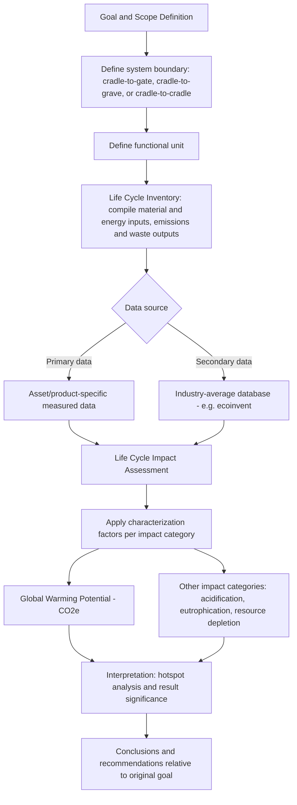

## Carbon Footprint and Life Cycle Assessment of Assets

### Overview

Carbon footprint and Life Cycle Assessment (LCA) of assets provide the technical, quantitative methodology underlying the ESG carbon reporting and embodied carbon concepts introduced in the previous topic. Where ESG reporting addresses *what* organizations must disclose and to whom, Life Cycle Assessment is the *engineering and scientific methodology* used to actually calculate the environmental impact — carbon and beyond — of an asset across its full life, from raw material extraction through manufacturing, use, and end-of-life. LCA is standardized internationally through **ISO 14040 and ISO 14044**, and is the technical foundation underlying carbon footprint calculation, Environmental Product Declarations (EPDs), embodied carbon assessment, and increasingly, asset-level decision-making frameworks that weigh environmental impact alongside traditional cost and reliability criteria.

While carbon footprint is often used colloquially to mean any greenhouse gas accounting exercise, in the LCA context it specifically refers to the **Global Warming Potential (GWP)** impact category result derived from a full or partial life cycle assessment — one of several possible environmental impact categories an LCA can quantify, alongside others such as acidification, eutrophication, and resource depletion.

### Key Points

- **ISO 14040/14044**: The international standard framework defining LCA methodology, structured around four phases — goal and scope definition, life cycle inventory (LCI), life cycle impact assessment (LCIA), and interpretation.
- **System boundary**: The defined scope of processes and life cycle stages included in an assessment — commonly categorized as **cradle-to-gate** (raw material extraction through factory gate, excluding use and end-of-life), **cradle-to-grave** (full life cycle including use and disposal), and **cradle-to-cradle** (full life cycle including recycling/circular return to production, aligning LCA methodology directly with the circular economy concepts covered earlier in this chapter).
- **Functional unit**: The quantified reference unit against which all LCA inputs and outputs are normalized (e.g., "per kilometer traveled," "per square meter of floor area over a 50-year building life," "per kWh of electricity delivered") — essential for making meaningful comparisons between alternative asset/material options.
- **Global Warming Potential (GWP)**: The specific impact category expressing greenhouse gas emissions in carbon dioxide equivalent ($CO_2e$) terms, using standardized characterization factors (commonly from IPCC assessment reports) to convert different greenhouse gases (methane, nitrous oxide, etc.) into a common $CO_2e$ metric based on their relative warming effect over a specified time horizon (typically 100 years).
- **Environmental Product Declaration (EPD)**: A standardized, third-party-verified document (per ISO 14025 and relevant Product Category Rules) reporting a product's LCA results in a consistent format, enabling comparison across manufacturers/products within the same category.

### The Four Phases of LCA Methodology (ISO 14040/14044)

1. **Goal and scope definition**: Establishes the purpose of the assessment, the system boundary (cradle-to-gate, cradle-to-grave, or cradle-to-cradle), the functional unit, and the impact categories to be assessed.
2. **Life Cycle Inventory (LCI)**: The data collection phase, compiling all material and energy inputs and all emissions/waste outputs across every process within the system boundary — typically the most data-intensive phase, often drawing on both primary data (specific to the asset/product being assessed) and secondary/generic databases (industry-average data for common processes and materials, such as the ecoinvent database).
3. **Life Cycle Impact Assessment (LCIA)**: Translates the raw inventory data (kilograms of each substance emitted, units of each resource consumed) into standardized environmental impact category results using established characterization factors — GWP/carbon footprint being one impact category among several (others include ozone depletion potential, acidification potential, eutrophication potential, and resource depletion).
4. **Interpretation**: Analyzing results for significance, consistency, and completeness, identifying the life cycle stages or processes contributing most significantly to overall impact (often termed "hotspot analysis"), and drawing conclusions relevant to the original goal and scope.

### Diagram: LCA Methodology and System Boundary Framework (svg_diagram)

### System Boundaries Applied to Asset Lifecycle Stages

For physical assets specifically, the LCA system boundary maps onto recognizable asset lifecycle stages, each contributing differently to total lifecycle carbon footprint depending on asset type:

$$GWP_{total} = GWP_{material\,extraction} + GWP_{manufacturing} + GWP_{transport} + GWP_{use\,phase} + GWP_{end\,of\,life}$$

- **Material extraction and manufacturing (embodied carbon)**: For most durable capital assets (buildings, industrial equipment, vehicles), this stage represents a fixed, one-time emissions "debt" incurred before the asset enters service — the primary focus of embodied carbon assessment discussed in the ESG reporting topic.
- **Transport**: Emissions associated with moving materials and the finished asset from manufacturing to point of use — generally a smaller contributor to total lifecycle GWP for most asset categories relative to manufacturing and use-phase emissions, though this varies by asset size/weight and transport distance.
- **Use phase**: For energy-consuming assets (buildings, vehicles, industrial equipment), the use phase is often the dominant contributor to total lifecycle GWP over a multi-decade service life, particularly for assets powered by electricity from a carbon-intensive grid or by direct fossil fuel combustion — though this balance is shifting as grids decarbonize and equipment efficiency improves, increasing the *relative* significance of embodied carbon even where absolute use-phase emissions also decline.
- **End-of-life**: Emissions (or emissions avoidance credit, under cradle-to-cradle system boundaries) associated with disposal, recycling, or repurposing — directly connecting LCA methodology to the circular economy value retention hierarchy covered earlier in this chapter, since higher-value-retention end-of-life pathways generally correspond to lower end-of-life-stage emissions.

### The Embodied-vs-Operational Carbon Crossover

A central analytical insight for capital asset decision-making is that the *relative* balance between embodied and operational (use-phase) carbon shifts as a function of both time horizon and background grid/energy decarbonization:

$$Ratio_{embodied/operational}(t) = \frac{GWP_{embodied}}{GWP_{operational,cumulative}(t)}$$

As electricity grids decarbonize over an asset's service life (reducing the operational carbon intensity per unit of energy consumed) and as building/equipment operational efficiency improves through better design, the operational carbon component of total lifecycle GWP for a given asset tends to decline relative to the fixed embodied carbon component — meaning that for new assets entering service today, especially in jurisdictions with rapidly decarbonizing grids, embodied carbon can represent a substantially larger share of total lifecycle GWP than equivalent historical analyses would have found. [Inference: the specific magnitude of this shift is highly dependent on jurisdiction-specific grid decarbonization trajectories and asset-specific efficiency characteristics, and should be evaluated using current, asset/location-specific data rather than generalized industry rules of thumb.] This dynamic is a primary driver behind the growing emphasis on embodied carbon and whole-life carbon assessment referenced in the ESG reporting topic, and directly informs renovate-vs-replace and new-construction material selection decisions.

### Comparative LCA for Asset Decision-Making

LCA methodology is increasingly applied as a direct input to comparative asset decisions across the sectors covered in this course:

- **Material selection in construction/infrastructure**: Comparative cradle-to-gate LCA (often via EPD comparison) between structural material options (e.g., concrete mix designs with varying supplementary cementitious material content, steel with varying recycled content, timber versus concrete/steel structural systems) informs material specification decisions where embodied carbon is a stated project criterion.
- **Renovate vs. replace decisions**: As introduced in the ESG reporting topic, whole-life carbon comparison between renovating an existing building/asset (avoiding most embodied carbon by retaining the existing structure) versus new construction/replacement (incurring full embodied carbon but potentially achieving superior operational efficiency) requires LCA methodology to make a defensible, quantified comparison rather than a qualitative judgment.
- **Fleet and equipment procurement**: Comparative LCA between vehicle powertrain options (internal combustion, hybrid, battery electric) requires careful system boundary definition, since battery electric vehicles typically show higher embodied/manufacturing-phase emissions (driven substantially by battery production) offset by lower use-phase emissions — meaning the comparative result depends heavily on assumed use-phase mileage, grid carbon intensity, and battery end-of-life treatment assumptions built into the specific study. [Unverified: specific comparative LCA results for powertrain options vary significantly across published studies depending on methodology and regional grid assumptions, and any specific figures should be sourced from a current, methodologically transparent study relevant to the specific context rather than generalized.]

### Data Sources and Practical Implementation Challenges

- **Generic/secondary databases**: Widely used databases (such as ecoinvent, or region/sector-specific equivalents) provide standardized process-level emissions data for common materials and manufacturing processes, enabling LCA studies without requiring primary data collection for every input — at the cost of reduced specificity to the exact asset/supplier being assessed.
- **Environmental Product Declarations as primary data source**: Where available, manufacturer-specific EPDs provide more precise, verified LCA data for a specific product than generic database averages, and are increasingly requested in procurement specifications for exactly this reason.
- **Data quality and uncertainty**: LCA results carry inherent uncertainty from data quality variation (primary versus secondary/generic data), characterization factor selection, and system boundary/allocation methodology choices — meaning LCA comparative results should generally be interpreted with appropriate sensitivity analysis rather than treated as precise point estimates, particularly when comparing closely-scored alternatives.
- **Allocation methodology in multi-output processes**: When a single process produces multiple outputs (e.g., a manufacturing process yielding both a primary product and a valuable co-product or recyclable scrap), LCA methodology requires an allocation approach (mass-based, economic value-based, or system expansion) to appropriately distribute environmental burden — the choice of allocation method can meaningfully affect results and is a common source of methodological variation between studies of similar products.

### Practical Example

A transit agency evaluating a new bus procurement conducts a comparative cradle-to-grave LCA between a battery-electric bus option and a diesel bus option, using a functional unit of "per passenger-kilometer traveled over a 12-year service life." The assessment finds the battery-electric option carries meaningfully higher embodied/manufacturing-phase GWP (driven primarily by battery cell production), but substantially lower use-phase GWP given the agency's regional grid carbon intensity, resulting in a total lifecycle GWP crossover point at approximately year 4 of service — after which the battery-electric bus's cumulative lifecycle emissions fall below the diesel bus's cumulative emissions and remain lower through the full 12-year assessment period. Sensitivity analysis reveals this crossover point is meaningfully sensitive to assumed grid carbon intensity, prompting the agency to also model a scenario reflecting the region's forecast grid decarbonization trajectory over the bus's service life, which moves the crossover point earlier — illustrating how sensitivity analysis around key uncertain parameters (grid intensity, battery production data quality) is essential to drawing a defensible conclusion from a comparative LCA rather than relying on a single point estimate. [Inference: this example illustrates the type of crossover dynamic and sensitivity analysis approach commonly found in comparative vehicle powertrain LCA studies; the specific year-4 crossover figure is illustrative rather than a general industry finding, since actual crossover timing depends heavily on the specific grid, vehicle, and usage assumptions of any given study.]

### Common Pitfalls

- **Comparing LCA results across studies with different system boundaries or functional units** without adjustment — a cradle-to-gate result is not comparable to a cradle-to-grave result, and this mismatch is a common source of misleading comparative claims.
- **Treating a single-point LCA result as precise** without accompanying sensitivity or uncertainty analysis, particularly for comparisons where alternatives score closely and the ranking could plausibly reverse under different reasonable assumptions.
- **Ignoring embodied carbon in favor of operational carbon alone**, especially as background grid decarbonization and efficiency improvements shift the relative balance between these two components over an asset's service life.
- **Using generic/secondary database data when manufacturer-specific EPD data is available and material to the decision**, sacrificing accuracy for convenience in cases where the decision stakes justify more precise primary data.
- **Overlooking allocation methodology choices in comparative studies**, which can meaningfully affect results for asset categories involving significant co-products or recycled material content, without disclosing which allocation approach was used.

### Related Topics

- ISO 14040/14044 Life Cycle Assessment Methodology
- ISO 14025 and Environmental Product Declaration (EPD) Development
- Global Warming Potential Characterization and IPCC Assessment Report Factors
- Embodied Carbon Assessment and Whole-Life Carbon Comparison
- Cradle-to-Cradle System Boundaries and Circular Economy Integration
- Comparative LCA for Fleet Powertrain and Material Selection Decisions
- Life Cycle Inventory Databases (ecoinvent and Sector-Specific Equivalents)
- Sensitivity Analysis and Uncertainty Quantification in LCA Studies
- ESG Reporting Frameworks and Asset-Level Carbon Disclosure