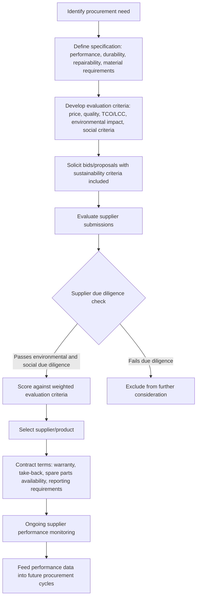

## Sustainable Procurement Criteria

### Overview

Sustainable procurement criteria are the formal evaluation standards, specifications, and contractual requirements organizations embed into purchasing decisions to incorporate environmental, social, and governance performance alongside traditional price, quality, and delivery criteria. This topic operationalizes the concepts introduced earlier in this chapter — circular economy design principles, embodied carbon/LCA methodology, and ESG disclosure requirements — at the point where they matter most for future asset lifecycle outcomes: the acquisition decision itself. Decisions made at procurement (material selection, durability specification, supplier requirements, contract structure) fundamentally constrain or enable every subsequent lifecycle stage covered in this course, from maintenance strategy through end-of-life circularity options.

Sustainable procurement is formalized internationally through **ISO 20400**, *Sustainable Procurement — Guidance*, and is increasingly mandatory rather than voluntary in public sector procurement across many jurisdictions, driven by government sustainability policy, climate commitments, and — for organizations subject to frameworks like the EU CSRD — the need to manage Scope 3 (value chain) emissions disclosed under ESG reporting obligations.

### Key Points

- **ISO 20400**: The international guidance standard for sustainable procurement, structuring the discipline around integrating sustainability considerations into procurement policy, strategy, organization, and the procurement process itself, from need identification through contract management and supplier relationship management.
- **Total Cost of Ownership (TCO) vs. lowest initial price**: A foundational sustainable procurement principle shifting evaluation criteria from acquisition price alone toward full lifecycle cost (energy/operating cost, maintenance cost, disposal cost) — directly connecting to the TCO frameworks covered in fleet, industrial, and facilities asset management topics elsewhere in this course.
- **Life Cycle Costing (LCC)**: The formal quantitative technique for comparing procurement alternatives on a total lifecycle cost basis, often paired with LCA (environmental) analysis to produce a combined economic-and-environmental comparative evaluation.
- **Supply chain due diligence**: Increasingly mandatory requirements (driven by regulations such as the EU Corporate Sustainability Due Diligence Directive and various national supply chain/modern slavery legislation) requiring organizations to assess and address environmental and human rights risks throughout their supplier base, not only at the immediate (Tier 1) supplier level.
- **Ecolabels and third-party certification**: Standardized, independently verified certification schemes (ENERGY STAR, EPEAT for electronics, FSC for wood products, and numerous sector-specific equivalents) that procurement specifications can reference to establish sustainability performance thresholds without requiring the purchasing organization to independently verify every claim.

### ISO 20400 Framework Structure

ISO 20400 organizes sustainable procurement implementation around several core components:

1. **Fundamentals**: Establishing organizational understanding of sustainability principles (accountability, transparency, ethical behavior, respect for stakeholder interests, rule of law, international norms of behavior, human rights) as they apply to procurement decisions.
2. **Sustainable procurement policy and strategy**: Aligning procurement sustainability objectives with overall organizational sustainability strategy and governance, including leadership commitment and resource allocation.
3. **Organizing the procurement function**: Establishing roles, responsibilities, competencies, and performance measurement structures needed to execute sustainable procurement consistently.
4. **Process integration**: Embedding sustainability considerations at each procurement process stage — planning, specification development, supplier selection, contract management, and performance monitoring — rather than treating sustainability as a separate, bolt-on evaluation criterion.

### Diagram: Sustainable Procurement Decision Process (svg_diagram)

### Life Cycle Costing in Procurement Evaluation

Life Cycle Costing formalizes the TCO principle into a structured procurement evaluation methodology:

$$LCC = C_{acquisition} + \sum_{t=1}^{n} \frac{C_{operating,t} + C_{maintenance,t}}{(1+r)^t} + C_{end\,of\,life} - C_{residual\,value}$$

Where $r$ is the discount rate applied to future cost streams, consistent with standard net present value methodology. Applying LCC in procurement evaluation — rather than evaluating bids on acquisition price alone — directly incentivizes suppliers to offer more durable, energy-efficient, and lower-maintenance products, since these characteristics reduce the total evaluated cost even when initial acquisition price is higher. Many public procurement frameworks now explicitly permit or require LCC-based evaluation (sometimes termed "most economically advantageous tender," MEAT, in EU public procurement terminology) rather than mandating lowest-initial-price award, specifically to enable this shift.

### Specification-Level Sustainability Criteria

Sustainable procurement criteria are typically embedded directly into technical specifications, connecting to circular economy design principles covered earlier in this chapter:

- **Durability and repairability requirements**: Minimum expected service life specifications, requirements for accessible/serviceable design (avoiding permanently bonded components that preclude repair), and spare parts availability commitments (e.g., manufacturer commitment to supply spare parts for a minimum period post-sale).
- **Recycled content requirements**: Minimum percentage recycled material content specifications for applicable material categories (common in construction materials, paper products, and increasingly electronics and textiles).
- **Energy/resource efficiency thresholds**: Minimum efficiency performance standards, often referencing established ecolabel/certification thresholds (ENERGY STAR ratings, WaterSense for water-using fixtures) rather than requiring the procuring organization to independently define efficiency benchmarks.
- **Embodied carbon/EPD requirements**: As referenced in the LCA topic, requiring Environmental Product Declaration documentation for major material categories, sometimes with maximum embodied carbon thresholds for specific product categories in more advanced sustainable procurement programs.
- **Packaging and logistics requirements**: Minimizing packaging material, specifying recyclable/reusable packaging, and consolidating delivery logistics to reduce transport-related emissions.
- **Take-back and end-of-life requirements**: Contractual requirements for supplier take-back of the product at end-of-life, directly connecting procurement specification to the circular economy R-strategy hierarchy and Extended Producer Responsibility concepts covered earlier in this chapter.

### Supplier Due Diligence and Social Criteria

Beyond environmental specification, sustainable procurement increasingly incorporates social and governance due diligence:

- **Labor practice and human rights due diligence**: Assessing supplier (and, increasingly, sub-supplier/Tier 2+) compliance with labor standards, driven by both voluntary corporate responsibility commitments and mandatory regulatory frameworks (e.g., supply chain due diligence legislation in the EU and various national jurisdictions) addressing forced labor, child labor, and working condition standards.
- **Diversity and local/small business participation criteria**: Common in public sector procurement, incorporating supplier diversity certification requirements or local economic development objectives alongside environmental criteria.
- **Supplier code of conduct and audit requirements**: Formal supplier agreements specifying expected environmental and social performance standards, often paired with audit rights or third-party certification requirements to verify compliance rather than relying solely on supplier self-attestation.
- **Anti-corruption and governance criteria**: Ensuring supplier selection processes and ongoing supplier relationships meet governance standards addressing conflicts of interest, bribery, and corruption risk.

### Ecolabels and Third-Party Certification Schemes

Procurement specifications frequently reference established, independently verified certification schemes rather than requiring the procuring organization to independently define and verify sustainability criteria for every purchase category:

- **ENERGY STAR**: Energy efficiency certification for a wide range of equipment and appliance categories, widely referenced in both public and private sector procurement specifications.
- **EPEAT**: A certification and rating system specifically for electronic products, evaluating environmental criteria across the product lifecycle including material selection, energy efficiency, design for end-of-life, and corporate performance criteria.
- **FSC (Forest Stewardship Council) and similar certifications**: Sustainable forestry/wood product certification, commonly required in construction material and paper product procurement specifications.
- **Sector-specific ecolabels**: Numerous additional certification schemes exist for specific product categories (cleaning products, textiles, furniture) — procurement organizations typically maintain a reference list of accepted certifications applicable to their common purchase categories rather than researching certification schemes for every individual purchase. [Unverified: the specific set of currently active and credible certification schemes for any given product category should be verified against current, reputable certification body information, as this landscape includes significant variation in certification rigor and some schemes have faced credibility scrutiny.]

### Application Across Asset Categories Covered in This Course

Sustainable procurement criteria manifest differently depending on the asset category being acquired, connecting directly to sector-specific topics covered earlier in this course:

- **Infrastructure and construction materials**: Recycled aggregate/reclaimed asphalt content requirements, EPD-based embodied carbon comparison between structural material options, and sustainable forestry certification for timber products.
- **Industrial and utility equipment**: Energy efficiency specification (motor efficiency standards, equivalent to those referenced in industrial asset management), remanufactured/refurbished equipment eligibility in procurement evaluation (connecting to the remanufacturing topic), and spare parts availability commitments supporting long-term maintainability.
- **Fleet vehicles**: Alternative fuel/electrification requirements or scoring preferences, fuel efficiency thresholds, and end-of-life vehicle recycling program requirements.
- **Healthcare/biomedical equipment**: Balancing sustainability criteria against the patient safety and regulatory compliance primacy discussed in the healthcare asset management topic — sustainability criteria in this sector typically operate as secondary evaluation factors within a procurement process still primarily governed by clinical safety and regulatory requirements.
- **Facilities and building materials**: Embodied carbon thresholds, recycled content requirements, and increasingly, whole-life carbon evaluation criteria comparing renovation versus new construction material sourcing, connecting directly to the LCA and embodied carbon topics.

### Practical Example

A city government revises its vehicle procurement policy to incorporate Life Cycle Costing evaluation rather than lowest-acquisition-price award for its light-duty fleet replacement program. The revised evaluation weights acquisition price, projected 10-year fuel/energy cost (using the city's actual fleet utilization data as the basis for projected mileage), projected maintenance cost (informed by historical fleet maintenance data for comparable vehicle classes), and a scored sustainability criterion incorporating tailpipe emissions and manufacturer environmental certification. Under this revised evaluation, a battery-electric option with a higher acquisition price than the incumbent internal-combustion option scores favorably once projected fuel and maintenance savings are incorporated into the LCC calculation — a result that would not have been visible under a lowest-initial-price evaluation, illustrating the core mechanism by which LCC-based procurement evaluation can shift purchasing outcomes toward genuinely lower total-cost, lower-impact options without requiring the procuring organization to simply accept a higher price for sustainability's sake. [Inference: this example illustrates the general mechanism by which LCC evaluation can favor higher-upfront-cost, lower-lifecycle-cost options; whether a specific vehicle option scores favorably in any actual procurement depends entirely on the specific vehicles, utilization pattern, and cost data involved, and should not be assumed as a general finding.]

### Contract Structuring for Sustainability Outcomes

Beyond specification and supplier selection criteria, contract terms themselves can be structured to reinforce sustainable asset lifecycle outcomes:

- **Extended warranty and performance guarantee requirements**: Longer warranty periods incentivize supplier confidence in product durability and shift some lifecycle risk back to the supplier.
- **Product-as-a-Service contract structures**: As covered in the circular economy topic, structuring the procurement as a service contract (retaining supplier ownership and end-of-life responsibility) rather than an outright purchase directly aligns supplier incentives with durability and circularity.
- **Performance-based contracting with sustainability KPIs**: Contracts incorporating ongoing performance measurement against sustainability metrics (energy performance guarantees, emissions performance) rather than treating sustainability criteria as relevant only at the point of initial award.
- **Take-back and disposition clauses**: Explicit contractual requirements addressing end-of-life handling, connecting procurement contract structure directly to the circular economy R-strategy considerations covered earlier in this chapter.

### Common Pitfalls

- **Treating sustainability criteria as a minor scoring factor disconnected from core evaluation**, allowing price and immediate performance criteria to dominate award decisions despite nominal sustainability criteria inclusion.
- **Specifying sustainability requirements without verification mechanisms**, relying on supplier self-attestation for claims (recycled content, energy efficiency, labor practice compliance) that would benefit from third-party certification or audit verification.
- **Applying uniform sustainability criteria across radically different asset categories** without adapting to sector-specific realities — for example, applying the same weighting approach to healthcare equipment procurement (where safety/regulatory compliance must remain primary) as to general office equipment procurement.
- **Underestimating supply chain due diligence complexity**, particularly the difficulty of extending due diligence beyond immediate (Tier 1) suppliers to the broader multi-tier supply chain where significant environmental and social risks often actually originate.
- **Failing to integrate LCC/TCO evaluation data with actual post-acquisition asset performance tracking**, missing the opportunity to validate and refine procurement evaluation assumptions (projected maintenance cost, energy consumption) against real operational data from previously acquired assets.

### Related Topics

- ISO 20400 Sustainable Procurement Guidance Standard
- Life Cycle Costing (LCC) Methodology and Discount Rate Selection
- Environmental Product Declarations (EPDs) and Ecolabel Certification Schemes
- Circular Economy Principles and Design for Disassembly Specification
- Product-as-a-Service Contract Structures and Servitization
- Supply Chain Due Diligence and Human Rights Risk Assessment
- Public Procurement Regulation and Most Economically Advantageous Tender (MEAT) Evaluation
- Embodied Carbon Thresholds in Construction Material Specification
- Extended Producer Responsibility (EPR) and Contractual Take-Back Requirements