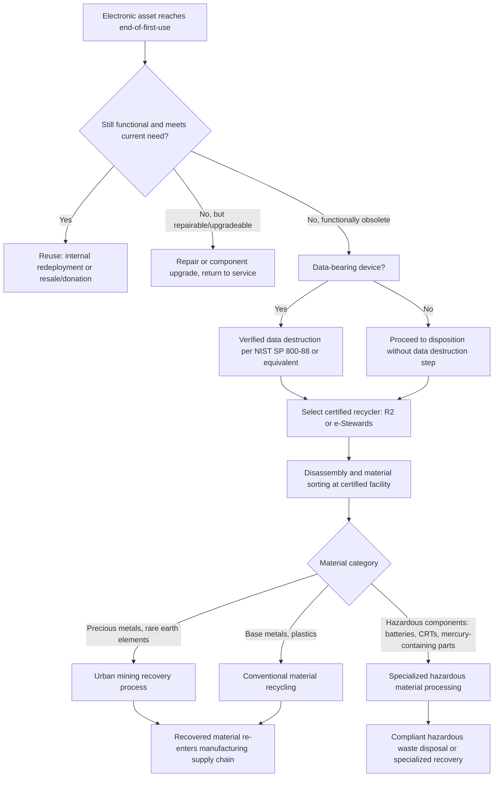

## E-Waste Reduction and Responsible Recycling Programs

### Overview

E-waste reduction and responsible recycling programs address the specific end-of-life management challenges posed by electronic and electrical equipment — IT hardware, telecommunications equipment, medical electronic devices, industrial control systems, and the growing category of electronic components embedded in otherwise non-electronic assets (vehicles, building systems, appliances). E-waste presents a distinct set of asset management challenges relative to other material streams covered in this chapter: it combines genuinely hazardous material content (heavy metals, flame retardants, certain battery chemistries) with genuinely valuable recoverable material content (precious metals, rare earth elements, engineered plastics), creating both a strong regulatory compliance imperative and a strong circular economy value-recovery opportunity within the same waste stream. This topic closes the chapter by applying the circular economy, LCA, and sustainable procurement principles covered earlier specifically to the electronics asset category, where end-of-life management has the most mature regulatory infrastructure of any asset category covered in this course.

E-waste is regulated through a patchwork of international, national, and (in the U.S.) state-level frameworks, most built around **Extended Producer Responsibility (EPR)** principles introduced earlier in this chapter, making this topic a direct practical application of that policy mechanism.

### Key Points

- **WEEE Directive (Waste Electrical and Electronic Equipment Directive)**: The EU's foundational e-waste regulation, establishing EPR obligations requiring producers to finance the collection, treatment, recycling, and environmentally sound disposal of electronic equipment, structured around defined product categories with specific collection and recycling rate targets.
- **RoHS Directive (Restriction of Hazardous Substances)**: A complementary EU regulation restricting the use of specific hazardous substances (lead, mercury, cadmium, hexavalent chromium, certain flame retardants) in electrical and electronic equipment at the design/manufacturing stage — a preventive complement to WEEE's end-of-life management focus.
- **R2 (Responsible Recycling) and e-Stewards certification**: The two predominant third-party certification standards for electronics recyclers in North America, both establishing environmental, health/safety, and data security standards for certified recycling facilities, though differing in specific scope and governance (e-Stewards, for instance, prohibits export of hazardous e-waste to developing countries as a certification condition).
- **Data destruction and sanitization**: A distinguishing e-waste management requirement absent from most other material recycling streams — electronic devices (computers, servers, mobile devices, and increasingly networked equipment across other asset categories) require verified data destruction meeting standards such as **NIST SP 800-88** before recycling, reuse, or disposal, given the data security risk posed by improperly sanitized storage media.
- **Urban mining**: The concept of recovering valuable and often geopolitically constrained materials (precious metals, rare earth elements, cobalt, lithium) from end-of-life electronics as an alternative to virgin material extraction — an increasingly economically and strategically significant driver for e-waste recycling investment beyond pure environmental/regulatory compliance motivation.

### Regulatory Framework Landscape

**EU: WEEE and RoHS**

The WEEE Directive establishes producer responsibility across defined equipment categories (large and small household appliances, IT and telecommunications equipment, consumer equipment, lighting equipment, electronic tools, and others), with member states implementing collection targets and financing mechanisms (often through producer-funded compliance schemes) to meet directive-mandated collection and recycling rate targets. RoHS operates upstream of WEEE, restricting hazardous substance content at the design stage to reduce both the hazard profile of resulting e-waste and to simplify eventual recycling processes.

**United States: State-Level Framework**

Unlike the EU's harmonized directive approach, U.S. e-waste regulation operates primarily at the state level, with a majority of states having enacted some form of e-waste EPR or collection legislation, though specific covered product categories, collection targets, and financing mechanisms vary meaningfully by state — creating a more fragmented compliance landscape for organizations operating across multiple states compared to the EU's harmonized framework. [Unverified: the specific current count and details of state e-waste laws change as state legislatures act, and organizations with multi-state operations should verify current requirements against each applicable state's current statute rather than assuming uniformity.]

**International Basel Convention**

The Basel Convention (and its Ban Amendment) governs the international transboundary movement of hazardous waste, including certain categories of e-waste, restricting export of hazardous e-waste from developed to developing countries — a framework directly relevant to responsible recycler certification standards (as referenced in the e-Stewards certification distinction above) given historical concerns about e-waste being exported to jurisdictions with less rigorous environmental and worker safety protections for informal/unregulated processing.

### Diagram: E-Waste Lifecycle Management and Recycling Decision Flow (svg_diagram)

### Data Security in E-Waste Management

Data destruction represents a compliance dimension unique to electronic asset disposition, directly intersecting with organizational cybersecurity and privacy compliance obligations covered in the healthcare asset management topic and relevant across virtually every asset category in this course that involves networked or data-storing equipment:

- **NIST SP 800-88 media sanitization guidelines**: The predominant U.S. reference standard for media sanitization, defining three sanitization categories — **Clear** (logical techniques applied to all addressable storage locations, protecting against simple non-invasive data recovery techniques), **Purge** (physical or logical techniques rendering data recovery infeasible using state-of-the-art laboratory techniques), and **Destroy** (physical destruction rendering the media unusable and data unrecoverable) — with the appropriate category selected based on the data's sensitivity classification and the media's intended disposition (reuse, resale, or destruction).
- **Chain of custody documentation**: Responsible e-waste and IT asset disposition (ITAD) programs maintain documented chain of custody from asset retirement through data destruction verification and final material disposition, providing an audit trail supporting both regulatory compliance and, where applicable, insurance/liability risk management.
- **On-site vs. off-site data destruction**: Organizations handling highly sensitive data (healthcare, financial services, government) often require on-site data destruction (before equipment leaves organizational custody) rather than relying solely on a downstream recycler's off-site destruction process, reducing chain-of-custody risk.
- **Certificate of destruction**: Formal documentation issued by the data destruction provider or recycler confirming the specific devices processed and the sanitization method applied, serving as compliance documentation for data protection regulatory requirements (e.g., relevant provisions of data protection regulations that require demonstrable secure disposal of records containing personal data).

### IT Asset Disposition (ITAD) Program Structure

Organizations with meaningful IT/electronic equipment volume typically formalize e-waste management through a structured **IT Asset Disposition (ITAD)** program, integrating several of the concepts covered elsewhere in this chapter specifically for the electronics category:

- **Asset tracking integration**: ITAD processes connect to the broader asset management/inventory system (as covered in general asset lifecycle topics), ensuring retired electronic assets are properly removed from active inventory, network access systems, and software licensing records — an important governance control distinct from purely physical/environmental e-waste concerns.
- **Value recovery maximization**: A well-structured ITAD program applies the value retention hierarchy (R-strategies) covered earlier in this chapter specifically to IT equipment — prioritizing resale/redeployment of still-functional equipment, followed by certified component harvesting/remanufacturing, with material recycling as the pathway for equipment with no remaining functional or component value.
- **Vendor certification requirements**: Responsible ITAD programs require downstream recycling/disposition vendors to hold R2 or e-Stewards certification (or equivalent regional certification), providing assurance that the full downstream chain — not just the organization's immediate disposition vendor — meets environmental and data security standards, since e-waste can pass through multiple processing tiers before final material recovery or disposal.
- **Regulatory reporting support**: For organizations subject to WEEE-equivalent producer responsibility obligations (relevant primarily to equipment manufacturers rather than equipment users, though large organizational users may have adjacent reporting obligations under some jurisdictional frameworks), ITAD program data supports required collection/recycling volume reporting.

### Hazardous Material Considerations in Electronics Recycling

Certain electronic waste components require specialized handling distinct from general material recycling processes:

- **Battery chemistries**: Lithium-ion batteries (increasingly prevalent given growth in portable electronics, laptops, and the battery-electric asset categories covered in fleet and utility asset management topics) require specialized collection and processing given fire risk during handling/transport and the distinct chemical recovery processes needed to recapture lithium, cobalt, and other valuable battery materials — connecting directly to the battery second-life/repurposing concepts covered in the circular economy topic.
- **Cathode ray tubes (CRTs)**: Legacy display technology containing significant leaded glass content, requiring specialized processing distinct from modern flat-panel display recycling — a declining but still relevant waste stream as older equipment continues reaching end-of-life.
- **Mercury-containing components**: Certain older equipment components (some older display backlighting, certain switches/relays) contain mercury requiring specialized handling under hazardous waste regulations.
- **Flame retardants and plastic additives**: Certain older electronic equipment plastics contain flame retardant chemicals restricted under RoHS-equivalent regulations for new equipment but still present in legacy equipment reaching end-of-life, requiring recyclers to appropriately identify and handle affected plastic streams separately from unrestricted plastic recycling.

### Practical Example

A large healthcare system's IT department manages annual retirement of approximately 3,000 networked devices (workstations, mobile devices, and networked medical equipment components with embedded computing/storage, connecting to the healthcare asset management and cybersecurity topics covered earlier in this course) across its hospital network. The organization implements an ITAD program requiring on-site hard drive removal and physical destruction (NIST SP 800-88 "Destroy" category) for any device that has stored protected health information, given the elevated data sensitivity in this sector, while lower-sensitivity devices (public-facing kiosk equipment with no PHI exposure) undergo standard off-site data wiping ("Purge" category) at an R2-certified downstream recycler. Devices passing data sanitization and retaining functional value are redeployed internally or donated to a certified refurbishment partner, while non-functional devices proceed to certified material recycling. This tiered approach reflects a common pattern in responsible e-waste program design: aligning data destruction rigor with actual data sensitivity risk, and aligning material disposition pathway with the R-strategy value retention hierarchy, rather than applying a single uniform process across a heterogeneous equipment population. [Inference: this example illustrates a common tiered ITAD program design pattern; the specific volume figures and category assignments are illustrative rather than reflecting any particular organization's actual program.]

### Common Pitfalls

- **Relying on downstream recycler certification claims without verification**, particularly given documented historical cases of e-waste labeled as "recycled" by an intermediate processor ultimately being exported to jurisdictions with inadequate environmental and worker safety protections — responsible programs verify certification status directly and, where volume/risk justifies it, conduct downstream vendor audits rather than relying solely on contractual assurances.
- **Inadequate data destruction verification**, treating data destruction as complete based on recycler assurance alone rather than obtaining and retaining certificates of destruction with device-level detail supporting audit and compliance requirements.
- **Failing to integrate ITAD with broader asset/network inventory management**, leaving retired devices with active network credentials, software licenses, or asset records — a governance gap connecting directly to the cybersecurity asset management concerns raised in the healthcare and utility asset management topics.
- **Defaulting to material recycling without exhausting higher-value R-strategy options first** (reuse, resale, component harvesting), missing both the greater environmental benefit and the greater residual value recovery available from higher-tier circular economy pathways.
- **Underestimating multi-jurisdictional compliance complexity** for organizations operating across multiple U.S. states or internationally, given the meaningfully fragmented regulatory landscape (particularly the state-by-state U.S. framework) compared to more harmonized frameworks like the EU's WEEE Directive.

### Related Topics

- Extended Producer Responsibility (EPR) Policy Frameworks
- WEEE and RoHS Directive Compliance Requirements
- R2 and e-Stewards Electronics Recycler Certification Standards
- NIST SP 800-88 Media Sanitization Guidelines
- IT Asset Disposition (ITAD) Program Design and Vendor Management
- Battery Recycling and Second-Life Applications for Lithium-Ion Chemistries
- Urban Mining and Critical Material Recovery Economics
- Basel Convention and Transboundary Hazardous Waste Movement
- Circular Economy Value Retention Hierarchy Applied to IT Equipment