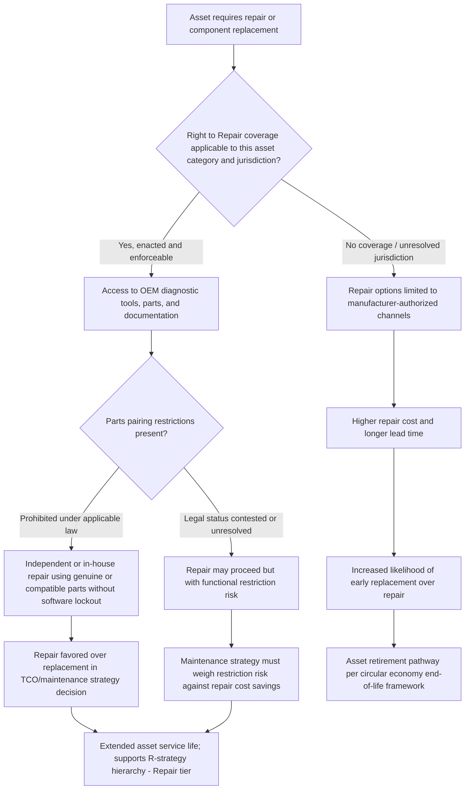

## Right to Repair Legislation and Its Impact on Maintenance Strategy

### Overview

Right to Repair legislation refers to a growing body of state, national, and (in the EU) supranational law requiring manufacturers to make repair parts, diagnostic tools, service documentation, and firmware/software access available to product owners and independent repair providers, rather than restricting repair exclusively to manufacturer-authorized channels. This closes the chapter's circular economy arc by addressing a specific legal and policy force acting directly on the value retention hierarchy, remanufacturing, and sustainable procurement concepts covered earlier: Right to Repair legislation is, in substance, a regulatory intervention designed to push maintenance strategy and asset lifecycle decisions higher up the R-strategy hierarchy (toward Repair and Refurbish) by removing manufacturer-imposed barriers that would otherwise push assets toward premature replacement.

The regulatory landscape in this area is genuinely unsettled and fast-moving even by the standards of this course's more dynamic regulatory topics, spanning consumer electronics, agricultural equipment, medical devices, powered wheelchairs, and motor vehicles, with meaningfully different legal status across each category and jurisdiction. As of 2026, no federal right to repair law has passed in the United States, leaving the primary enforceable legal framework at the state level, while federal right to repair legislation for motor vehicles specifically remains stalled, though the outcome remains contested and ongoing rather than settled. [Collectons](https://www.collectons.org/which-states-have-right-to-repair-laws/)[APEX Tech Nation](https://apextechnation.com/articles/right-to-repair-2026)

### Key Points

- **Parts pairing**: A manufacturer practice of using software/firmware to cryptographically link specific replacement parts to a specific unit, such that a genuine replacement part installed by an unauthorized repairer triggers reduced functionality or persistent error alerts — a primary target of recent Right to Repair legislative language.
- **Diagnostic and service documentation access**: The core substantive requirement in most Right to Repair statutes — mandating manufacturers make available the same diagnostic tools, software, parts, and repair documentation to independent repair providers and consumers that are available to authorized/dealer repair networks.
- **Magnuson-Moss Warranty Act**: The existing federal law establishing that manufacturers cannot void a warranty simply because a consumer used independent repair services or non-OEM parts — the pre-existing federal baseline protection that state Right to Repair laws build upon and reinforce, rather than replace. [PlainRegWatch](https://plainregwatch.com/guides/right-to-repair/)
- **Telematics data access**: A distinct and heavily contested Right to Repair sub-issue, particularly in the automotive sector, concerning whether independent repair shops and vehicle owners can access vehicle-generated diagnostic and operational data transmitted wirelessly to manufacturers, rather than accessible only through a physical onboard diagnostic port.
- **Category fragmentation**: Right to Repair law is not a single unified framework but a patchwork varying by product category (consumer electronics, agricultural equipment, medical devices, powered wheelchairs, motor vehicles) and jurisdiction, each with distinct scope, enacted status, and enforcement mechanisms.

### Current Regulatory Landscape by Category

**Consumer Electronics**

As of 2026, California, Colorado, Minnesota, New York, and Oregon have passed laws covering consumer electronics repair, with Massachusetts also having enacted a relevant right-to-repair law. Colorado's HB 1121, signed in 2024, restricts parts pairing and prohibits manufacturers from using parts-identification software to prevent repair or generate misleading alerts, and took effect January 1, 2026. Legislative language in this area continues to evolve year over year, with the 2026 legislative template expanding the 2025 prohibition on parts pairing by clarifying that manufacturers may not use software-based restrictions to limit access to parts or tools, or to control who is permitted to perform repairs. [Right to Repair Laws in the US: State-by-State Guide 2026 +3](https://plainregwatch.com/guides/right-to-repair/)

At the federal level, the Fair Repair Act for digital electronics was introduced on February 6, 2026, but neither the Fair Repair Act nor the REPAIR Act had passed both chambers of Congress as of mid-2026, though the Fair Repair Act has bipartisan support and has been reintroduced in the current Congress. [Morgan Lewis](https://www.morganlewis.com/pubs/2026/06/navigating-the-right-to-repair-landscape-in-2026-a-refresher-on-basics-and-best-practices)[Collectons](https://www.collectons.org/which-states-have-right-to-repair-laws/)

**Motor Vehicles**

Automotive Right to Repair presents the most legally contested category, centered on telematics data access rather than physical parts/tools alone. As of 2026, only Massachusetts and Maine have automotive right to repair laws; Massachusetts passed via ballot initiative in 2020 and Maine via ballot initiative in 2023 with 84.4% approval, with Maine's implementing legislation signed in April 2026. The Massachusetts law has faced sustained legal challenge: automakers' trade association sued the state before the law could take effect, and a federal judge issued an injunction blocking enforcement while the case was litigated. A district court upheld the law as not preempted by federal law in a February 2025 ruling, the case was appealed and argued before the First Circuit in February 2026, and no appellate decision had issued as of late July 2026. At the federal level, the House Energy and Commerce Committee's Commerce, Manufacturing, and Trade Subcommittee advanced the REPAIR Act for motor vehicles to the full committee on February 10, 2026, though the REPAIR Act has cleared committee consideration in multiple sessions without reaching a floor vote. [Right to Repair in 2026: Where the Law Actually Stands - Garage Auto +4](https://garageauto.app/right-to-repair-2026/)

**Agricultural Equipment**

Federal lawmakers introduced the Farm Act in October (2025), which would make parts, software, and tools available for farmers to fix their own agricultural equipment, reflecting long-standing concern in this sector (particularly regarding tractor and combine repairability) predating much of the consumer electronics legislative activity. [Waste Dive](https://www.wastedive.com/news/right-to-repair-bills-2026-electronics-automotbiles-wheelchairs/809993/)

**Powered Wheelchairs and Medical Devices**

Nevada and Oregon's right-to-repair laws specifically covering wheelchairs took effect as of January 1 (2026). This category carries particular significance given the direct disability-access and quality-of-life consequences of repair delay, distinguishing its policy rationale somewhat from the primarily economic/environmental rationale driving consumer electronics legislation. [Waste Dive](https://www.wastedive.com/news/right-to-repair-bills-2026-electronics-automotbiles-wheelchairs/809993/)

### Diagram: Right to Repair Impact on Maintenance Strategy Options (svg_diagram)

### FTC Enforcement as a Parallel Regulatory Track

Independent of state legislative activity, the FTC issued a landmark report in May 2021 finding that manufacturer repair restrictions are largely not justified, and pledged to enforce existing laws against unfair repair restrictions, subsequently taking enforcement actions against companies that illegally restricted repairs through warranty void threats. The regulatory center of gravity at the federal level has remained the FTC, which has pursued enforcement under existing warranty law while stopping short of formal rulemaking. This means organizations should track two parallel enforcement/compliance tracks — state statutory requirements and FTC enforcement risk under existing warranty and consumer protection law — rather than treating the absence of federal Right to Repair statute as equivalent to the absence of federal regulatory exposure. Separately, the FTC's own internal repair-restriction rulemaking activity (referenced in some sector commentary as the "Nixing the Fix" agenda) has been characterized as expected to be finalized in 2026, though this specific claim should be verified against current FTC publications given the pace of change in this area. [Unverified: given the rapid pace of both legislative and FTC regulatory activity in this specific area, the precise current status of any specific bill or rulemaking should be verified against current legislative tracking sources rather than treated as settled based on this synthesis.] [Right to Repair Laws in the US: State-by-State Guide 2026 +2](https://plainregwatch.com/guides/right-to-repair/)

### Impact on Maintenance Strategy Decision-Making

Right to Repair legislation directly affects several maintenance and asset management decision points covered elsewhere in this course:

- **Repair vs. replace economics**: Where enacted and enforceable, Right to Repair requirements reduce the cost and lead-time barrier to independent/in-house repair by mandating access to parts, tools, and documentation previously available only through manufacturer-authorized channels — shifting the repair-vs-replace TCO calculation (as covered in fleet and industrial asset management topics) toward repair for a broader range of failure scenarios.
- **Maintenance strategy independence from OEM service networks**: Organizations managing large asset fleets (industrial equipment, agricultural equipment, fleet vehicles) gain increased ability to build in-house repair capability or use competitively-priced independent service providers rather than being structurally dependent on manufacturer-authorized service networks — directly relevant to the depot/shop capacity planning considerations covered in the fleet asset management topic.
- **Remanufacturing and third-party parts market enablement**: Parts-pairing prohibitions and mandated documentation access directly support the third-party remanufacturing ecosystem covered in the refurbishment/remanufacturing topic, since remanufacturers depend on component-level technical specifications and, increasingly, freedom from software-based restrictions that could otherwise prevent a remanufactured or independently-repaired component from functioning correctly.
- **Procurement specification implications**: Sustainable procurement criteria (covered earlier in this chapter) increasingly incorporate repairability and Right to Repair compliance as an explicit evaluation factor, particularly for organizations seeking to maximize the durability/repair R-strategy tiers over the asset's service life.
- **Jurisdictional complexity for multi-state/multi-national operations**: Organizations operating fleets or facilities across multiple states or countries face a genuinely fragmented compliance landscape, requiring maintenance strategy and vendor/parts sourcing policy to account for jurisdiction-specific legal status rather than applying a single uniform approach — directly analogous to the multi-jurisdictional complexity noted in the e-waste regulatory topic.

### Practical Example

An agricultural equipment fleet operator (a large farming operation, not a manufacturer) evaluates its tractor and combine maintenance strategy in light of ongoing federal Farm Act legislative activity and existing manufacturer telematics-based diagnostic lockout practices. Under current practice, certain repairs — even simple component replacements — require a manufacturer-authorized dealer technician to run proprietary diagnostic software to "unlock" full functionality post-repair, creating both cost and multi-day lead-time burden during critical planting/harvest windows when equipment downtime carries a direct yield-loss cost. The operator's maintenance strategy currently maintains a higher-than-otherwise-necessary spare equipment reserve specifically to buffer against this dealer-dependency lead-time risk. Were applicable Right to Repair legislation enacted and enforceable in the operator's jurisdiction (a genuinely unresolved question given the federal Farm Act's current status), the operator's maintenance strategy could shift toward in-house diagnostic capability and reduced spare equipment buffering — illustrating how the passage (or non-passage) of Right to Repair legislation in a given category is a direct, quantifiable input into fleet-level maintenance strategy and even capital reserve planning, not merely an abstract policy question. [Inference: this example illustrates the general mechanism by which legislative status affects maintenance strategy in equipment-intensive operations; it does not reflect the actual policy or practice of any specific agricultural operator, and actual current legal status should be verified against current Farm Act legislative tracking.]

### Manufacturer Counterarguments and Policy Tension

Understanding the policy debate context is relevant to anticipating how the regulatory landscape may continue to evolve: manufacturers, represented in federal proceedings primarily by industry trade associations and individual company filings, have advanced arguments against broad right-to-repair mandates including that sharing repair documentation and diagnostic software creates cybersecurity exposure by giving third parties access to firmware and system-level tools. Industry representatives have also argued that numerous state proposals seek to limit the use of aftermarket parts and that repair choice remains tied up in costly automaker litigation, while some in the industry have discussed a federal proposal to limit repair options and accessibility even further — indicating the policy debate remains genuinely contested rather than moving uniformly in one direction. This tension is directly relevant to the cybersecurity considerations raised in the healthcare, utility, and e-waste topics elsewhere in this course, where third-party access to diagnostic/firmware systems carries legitimate security considerations that must be weighed against repair-access policy goals. [Consumerelectronicsdaily](https://consumerelectronicsdaily.com/right-to-repair/right-to-repair-laws-us-tracker/)[Autobody News](https://www.autobodynews.com/news/right-to-repair-in-2026-where-laws-courts-and-automakers-stand)

### Common Pitfalls

- **Assuming Right to Repair status is uniform across product categories**: An organization's automotive fleet, agricultural equipment, and IT hardware may each fall under meaningfully different legal regimes even within the same state, given the category-specific (rather than blanket) nature of most enacted legislation.
- **Treating the absence of enacted state law as the absence of relevant legal risk**: FTC enforcement activity under existing warranty and consumer protection law operates independently of state Right to Repair statutes and can create compliance exposure even in jurisdictions without a specific enacted Right to Repair law.
- **Failing to monitor legislative and litigation status on an ongoing basis**: Given the genuinely active state of both legislative activity (multiple bills annually across dozens of states) and litigation (e.g., the ongoing Massachusetts automotive telematics case), maintenance strategy and vendor contracting decisions premised on current legal status should be revisited periodically rather than treated as a fixed input.
- **Overlooking the cybersecurity dimension of expanded diagnostic/firmware access**, particularly relevant for networked industrial, medical, and utility equipment where third-party diagnostic access intersects directly with the cybersecurity asset management considerations covered elsewhere in this course.
- **Underestimating the connection between Right to Repair and upstream circular economy strategy**: Organizations focused narrowly on immediate repair cost savings may miss the broader strategic connection between Right to Repair access and their ability to execute higher-tier R-strategy approaches (refurbishment, remanufacturing) covered earlier in this chapter.

### Related Topics

- Circular Economy Value Retention Hierarchy and R-Strategy Prioritization
- Refurbishment and Remanufacturing Quality Standards
- Parts Pairing and Software-Based Repair Restrictions
- Magnuson-Moss Warranty Act and Federal Warranty Protections
- FTC Repair Restriction Enforcement and "Nixing the Fix" Policy Agenda
- Automotive Telematics Data Access and Massachusetts Question 1 Litigation
- Sustainable Procurement Criteria and Repairability Specification
- Medical Device Right to Repair and FDA Regulatory Intersection
- Multi-Jurisdictional Compliance Strategy for Fleet and Equipment Operators