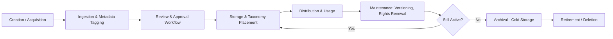
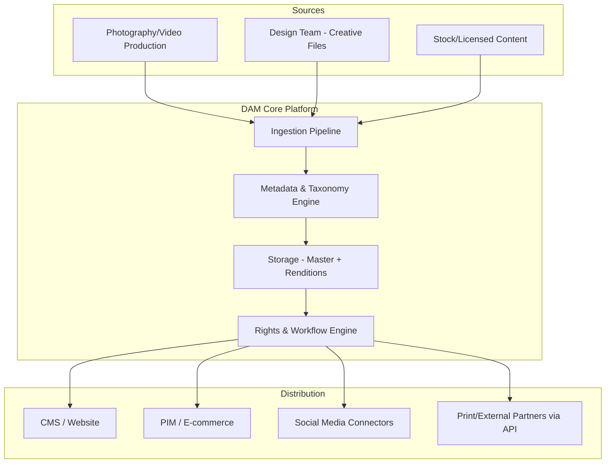

## Digital Asset Management Systems and Scope


### Definition and Core Concept

Digital Asset Management (DAM) is the discipline and technology practice of organizing, storing, retrieving, securing, and distributing digital files — such as images, videos, audio, documents, and design assets — throughout their usable life. A DAM system is the software platform that centralizes these files in a structured repository, attaches descriptive metadata, and governs how users find, share, version, and retire them.

Within Asset Lifecycle Management (ALM), DAM is a related but distinct discipline. ALM traditionally governs *physical* or *IT infrastructure* assets (servers, equipment, licenses) through stages like procurement, deployment, maintenance, and disposal. DAM applies analogous lifecycle thinking to *digital* assets — files that have no physical form but still require creation, approval, storage, usage tracking, versioning, and eventual archival or deletion.

**Key Points**

- DAM systems function as a system of record for digital files, similar to how a CMMS (Computerized Maintenance Management System) is the system of record for physical equipment in traditional ALM.
- The "asset" in DAM is intangible but has real cost: storage, licensing, creation labor, and brand/legal risk if misused.
- DAM overlaps with but differs from Content Management Systems (CMS), Product Information Management (PIM), and Media Asset Management (MAM) — distinctions covered below.

### Why DAM Is Treated as a Related Discipline to ALM

Traditional ALM frameworks (ISO 55000, ITIL asset management) were built around tangible or IT hardware/software assets with clear depreciation schedules and physical maintenance needs. Digital assets do not depreciate physically, but they do have:

- **Version decay** — outdated logos, expired stock photography licenses, superseded product images.
- **Rights and compliance lifecycles** — usage rights that expire or are geographically restricted, analogous to warranty/compliance windows in physical ALM.
- **Utilization tracking** — knowing which assets are actively used vs. dormant, similar to asset utilization metrics in equipment ALM.
- **Disposal/retirement** — archiving or deleting assets whose rights have expired or that are no longer brand-compliant, paralleling end-of-life disposal in physical ALM.

This shared lifecycle vocabulary (acquire → onboard → use → maintain → retire) is why organizations increasingly govern DAM under the same strategic umbrella as broader asset management, even though the tooling and stakeholders differ.

### Core System Components

**Key Points**

- **Central Repository** — cloud or on-prem storage layer holding original (master) files and their renditions.
- **Metadata Engine** — structured and custom fields (title, author, rights, tags, usage restrictions) attached to each asset.
- **Taxonomy and Controlled Vocabulary** — hierarchical categories and standardized tags ensuring consistent classification.
- **Search and Retrieval** — full-text, metadata-based, and increasingly AI-driven visual/semantic search.
- **Rendition Management** — automatic generation of derivative formats/sizes (thumbnails, web-optimized JPEGs, print-ready TIFFs) from a master file.
- **Version Control** — tracking of revisions with rollback capability, distinct from simple file overwriting.
- **Rights Management (DRM/Usage Rights)** — enforcement of licensing terms, embargo dates, and geographic/channel restrictions.
- **Workflow and Approval Engine** — routing assets through review, legal, and brand-approval stages before publication.
- **Access Control** — role-based permissions determining who can view, edit, download, or distribute an asset.
- **Distribution and Integration Layer** — APIs and connectors pushing assets to CMS, e-commerce, PIM, and social platforms.
- **Analytics and Reporting** — usage statistics, download counts, and ROI tracking per asset.

### Digital Asset Lifecycle Stages

The DAM lifecycle mirrors general ALM phase structures, adapted for intangible files.

1. **Creation/Acquisition** — asset produced internally (photography, design, video) or acquired externally (stock licensing, partner-supplied content).
2. **Ingestion** — upload into the DAM with metadata tagging, either manual or via automated pipelines (watch folders, API ingestion).
3. **Review and Approval** — legal, brand, and quality review; often gated by workflow states (Draft → In Review → Approved → Published).
4. **Storage and Organization** — placement into taxonomy structures, collections, or galleries.
5. **Distribution and Usage** — retrieval by internal teams or external partners; syndication to downstream systems.
6. **Maintenance** — metadata updates, re-tagging, version updates, rights renewal or expiration tracking.
7. **Archival** — moving inactive but potentially reusable assets to cold storage tiers.
8. **Retirement/Deletion** — permanent removal when rights expire, brand relevance ends, or legal holds are lifted.



### Scope: What DAM Covers vs. Adjacent Systems

A frequent point of confusion is distinguishing DAM scope from neighboring systems. This matters for ALM practitioners deciding which system of record governs which asset class.

| System | Primary Scope | Typical Asset Type |
| --- | --- | --- |
| DAM | Rich media storage, rights, distribution | Images, video, audio, creative files |
| MAM (Media Asset Management) | Broadcast/video-centric workflows, frame-accurate metadata | Video/film production assets |
| PIM (Product Information Management) | Structured product data (price, specs, SKUs) | Product attributes, not files themselves |
| CMS (Content Management System) | Web page structure and publishing | Web content referencing DAM-hosted assets |
| ECM (Enterprise Content Management) | Business documents, records, compliance | Contracts, invoices, policies |
| PLM (Product Lifecycle Management) | Physical product design/engineering lifecycle | CAD files, BOMs |

**Key Points**

- DAM often integrates with, rather than replaces, PIM, CMS, and PLM — DAM supplies the media; PIM supplies the data; CMS renders the combined output.
- [Inference] Organizations with heavy video production frequently deploy a MAM alongside a general-purpose DAM, since MAM systems offer frame-level metadata and editorial timeline integration that generic DAM platforms often lack.

### Metadata Schema Design

Metadata is the backbone of DAM findability and governance. A well-designed schema typically separates:

- **Descriptive metadata** — title, description, keywords, alt text (supports search and accessibility).
- **Administrative metadata** — creator, creation date, file format, resolution, checksum.
- **Rights metadata** — license type, usage restrictions, expiration date, territory.
- **Technical metadata** — auto-extracted EXIF/IPTC/XMP data (camera settings, color profile).
- **Relational metadata** — links between master files and their renditions or related assets.

Standards commonly referenced include **IPTC Photo Metadata Standard**, **XMP (Extensible Metadata Platform)**, and **Dublin Core** for descriptive fields.

**Example**

```json
{
  "assetId": "DAM-00234871",
  "title": "Q3 Product Launch - Hero Banner",
  "descriptive": {
    "keywords": ["product launch", "hero image", "Q3-2026"],
    "altText": "Team unveiling new product line on stage"
  },
  "rights": {
    "licenseType": "internal-use-only",
    "expirationDate": "2027-03-31",
    "territory": "APAC"
  },
  "technical": {
    "format": "TIFF",
    "resolution": "300dpi",
    "colorProfile": "Adobe RGB"
  },
  "version": "3.1",
  "status": "Approved"
}
```

### Taxonomy and Controlled Vocabulary

A taxonomy organizes assets into navigable hierarchies (e.g., Region > Campaign > Asset Type), while a controlled vocabulary constrains tag values to a predefined list to prevent tagging drift (e.g., enforcing "Q3" instead of allowing "Quarter 3", "Q-3", "third quarter" as separate uncontrolled tags).

**Key Points**

- Flat tagging alone does not scale past a few thousand assets; hierarchical taxonomy paired with faceted search is standard for enterprise-scale repositories.
- Governance typically assigns a taxonomy owner (often a metadata librarian or content strategist) to prevent tag sprawl.

### Access Control and Rights Management

Role-based access control (RBAC) in DAM typically governs at multiple granularities:

- **System-level roles** — Admin, Contributor, Approver, Viewer, Guest.
- **Collection-level permissions** — restricting visibility to specific brand, region, or department folders.
- **Asset-level rights enforcement** — automated expiration that hides or flags assets once usage rights lapse.
- **Watermarking and download restrictions** — lower-resolution previews for unapproved users; full-resolution download gated behind approval.

[Inference] Rights expiration enforcement mechanisms vary significantly by vendor — some systems automatically unpublish expired assets, while others only flag them for manual review, so behavior should be verified against the specific platform's documentation before relying on it for compliance-critical workflows.

### Architecture Patterns

Most modern DAM platforms follow one of these architectural approaches:

- **Monolithic SaaS DAM** — vendor-hosted, single integrated platform (e.g., typical enterprise DAM offerings) covering storage, metadata, workflow, and delivery in one system.
- **Headless DAM** — asset storage and metadata management decoupled from presentation, exposing content via APIs for consumption by any front-end (website, app, PIM-driven commerce site).
- **Hybrid/Composable DAM** — DAM as one service within a broader MACH (Microservices, API-first, Cloud-native, Headless) content supply chain, integrated with CMS, PIM, and CDN layers.



### Integration Patterns with ALM-Adjacent Systems

**Key Points**

- **PIM Integration** — DAM supplies product imagery/video linked by SKU; PIM supplies structured attributes. Integration is typically bidirectional via REST APIs or connector middleware.
- **CMS Integration** — DAM assets are referenced (not duplicated) in CMS content via embed APIs or DAM widgets, ensuring a single source of truth and simplifying rights compliance when an asset is updated or retired.
- **ERP/Physical ALM Integration** — in organizations managing both physical assets and their digital documentation (manuals, certification PDFs, equipment photos), DAM can serve as the document repository referenced by asset IDs in the physical ALM/CMMS system.
- **CDN Integration** — approved renditions are pushed to a Content Delivery Network for low-latency global delivery, with the DAM remaining the authoritative master repository.

### Storage Considerations

**Key Points**

- **Master files** are typically stored in original, uncompressed or high-fidelity formats (TIFF, RAW, ProRes) to preserve maximum quality for future rendition generation.
- **Renditions** are automatically generated derivative files (web JPEG, mobile-optimized WebP, social media crop ratios) cached for fast delivery.
- **Storage tiering** — hot storage for actively used assets, cool/cold or archive-tier storage (e.g., object storage archive classes) for inactive assets, mirroring tiered storage strategies common in general IT asset lifecycle cost management.
- Storage cost is a direct, quantifiable component of the digital asset's lifecycle cost, analogous to maintenance cost in physical asset ALM.

### Search Mechanisms

- **Metadata/Keyword Search** — traditional field-based and full-text search against tags and descriptions.
- **Faceted/Filtered Search** — narrowing results by controlled vocabulary facets (asset type, campaign, rights status).
- **Visual/AI-Powered Search** — content-based image retrieval using computer vision (e.g., searching "red shoes on white background" without manual tagging) and automated tagging via machine learning models.
- **Similarity Search** — finding visually or semantically similar assets to a reference image.

[Inference] AI-powered auto-tagging accuracy varies by domain and vendor model quality; auto-generated tags are commonly treated as a starting point requiring human review rather than authoritative metadata, particularly for brand-sensitive or compliance-relevant classifications.

### Governance and Compliance Scope

- **Brand governance** — ensuring only approved, on-brand assets are distributed, often enforced through mandatory approval workflows before an asset reaches "Published" status.
- **Legal/rights compliance** — tracking licensing terms to avoid using expired-rights or improperly licensed content, a significant liability concern for organizations with large stock photography libraries.
- **Data privacy** — managing assets containing personal data (e.g., photos with identifiable people) under regulations such as GDPR, including consent tracking and right-to-erasure workflows.
- **Retention and legal hold** — some assets must be retained for a minimum period (contracts, compliance documentation) even if otherwise inactive, and some must be placed under legal hold, overriding normal retirement schedules.

### Common Implementation Challenges

**Key Points**

- **Metadata debt** — legacy assets migrated without complete or consistent metadata, requiring retroactive tagging efforts.
- **Taxonomy drift** — inconsistent tagging practices across departments without centralized governance.
- **Duplicate proliferation** — the same asset uploaded multiple times across disconnected folders/systems prior to DAM consolidation.
- **Adoption resistance** — creative and marketing teams continuing to use local drives or ad hoc cloud folders instead of the DAM, undermining single-source-of-truth goals.
- **Integration complexity** — connecting DAM to multiple downstream systems (CMS, PIM, social, print) each with different API capabilities and rendition requirements.

### Illustrative Scope Diagram

<svg xmlns="http://www.w3.org/2000/svg" viewBox="0 0 760 460" font-family="sans-serif">
<text x="380" y="28" text-anchor="middle" font-size="18" font-weight="bold" fill="#1a1a2e">DAM System Scope (svg_diagram)</text>
<rect x="40" y="60" width="680" height="360" rx="12" fill="none" stroke="#555" stroke-width="1.5" stroke-dasharray="6,4" />
<text x="60" y="85" font-size="13" fill="#555">Enterprise Digital Content Ecosystem</text>
<rect x="70" y="110" width="280" height="290" rx="10" fill="#e8f0fe" stroke="#3b5bdb" stroke-width="2" />
<text x="210" y="135" text-anchor="middle" font-size="15" font-weight="bold" fill="#1e3a8a">DAM Core Scope</text>
<text x="90" y="160" font-size="12" fill="#1e3a8a">- Master file storage</text>
<text x="90" y="182" font-size="12" fill="#1e3a8a">- Metadata &amp; taxonomy</text>
<text x="90" y="204" font-size="12" fill="#1e3a8a">- Rendition generation</text>
<text x="90" y="226" font-size="12" fill="#1e3a8a">- Version control</text>
<text x="90" y="248" font-size="12" fill="#1e3a8a">- Rights/DRM enforcement</text>
<text x="90" y="270" font-size="12" fill="#1e3a8a">- Approval workflow</text>
<text x="90" y="292" font-size="12" fill="#1e3a8a">- Role-based access control</text>
<text x="90" y="314" font-size="12" fill="#1e3a8a">- Usage analytics</text>
<text x="90" y="336" font-size="12" fill="#1e3a8a">- Search &amp; retrieval</text>
<rect x="410" y="110" width="280" height="290" rx="10" fill="#fef3e2" stroke="#d97706" stroke-width="2" />
<text x="550" y="135" text-anchor="middle" font-size="15" font-weight="bold" fill="#92400e">Adjacent / Out of Core Scope</text>
<text x="430" y="160" font-size="12" fill="#92400e">- Structured product data (PIM)</text>
<text x="430" y="182" font-size="12" fill="#92400e">- Web page layout (CMS)</text>
<text x="430" y="204" font-size="12" fill="#92400e">- Physical asset maintenance</text>
<text x="430" y="226" font-size="12" fill="#92400e">- CAD/engineering data (PLM)</text>
<text x="430" y="248" font-size="12" fill="#92400e">- Financial depreciation ledgers</text>
<text x="430" y="270" font-size="12" fill="#92400e">- Contract/invoice records (ECM)</text>
<text x="430" y="292" font-size="12" fill="#92400e">- Frame-accurate editorial (MAM)</text>
<line x1="350" y1="255" x2="410" y2="255" stroke="#333" stroke-width="2" marker-end="url(#arrow)" />
<text x="380" y="245" text-anchor="middle" font-size="10" fill="#333">API</text>
</svg>

### Selecting DAM Scope for an Organization

Practical scoping decisions typically weigh:

- **Volume and diversity of asset types** — organizations with primarily static marketing images need less specialized functionality than those handling video, 3D, or CAD-adjacent files.
- **Regulatory exposure** — heavily regulated industries (pharma, finance) require stricter rights and audit-trail capabilities.
- **Integration breadth** — number and complexity of downstream systems requiring automated asset syndication.
- **User base size and technical sophistication** — self-service search/download needs vs. centralized, request-based asset distribution.

**Next Steps / Related Topics**

- DAM Metadata Standards (IPTC, XMP, Dublin Core) in Depth
- Headless vs. Composable DAM Architecture
- Digital Rights Management (DRM) and License Expiration Automation
- DAM–PIM–CMS Integration Patterns
- Taxonomy Governance and Controlled Vocabulary Design
- AI-Driven Auto-Tagging and Visual Search Implementation
- Storage Tiering Strategies for Digital Assets
- Legal Hold and Retention Policy Design in DAM
- Comparing DAM to MAM for Video-Centric Organizations
- DAM ROI Measurement and Usage Analytics