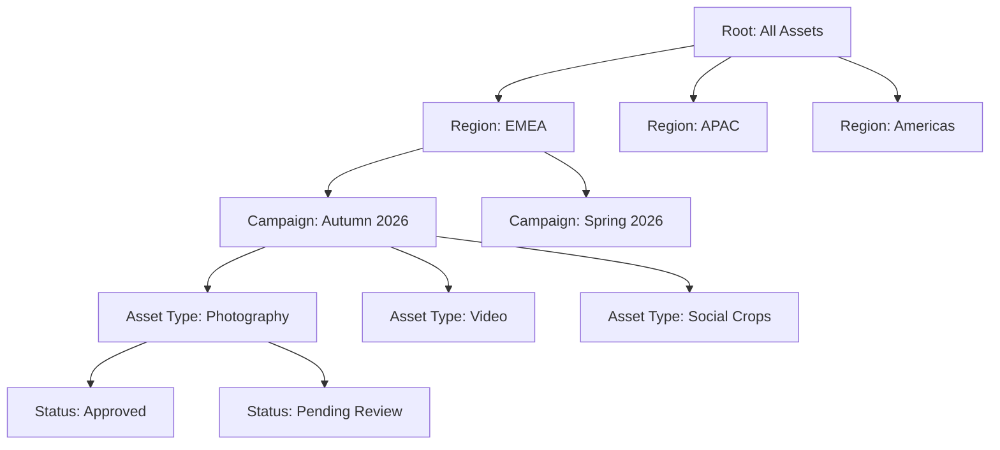
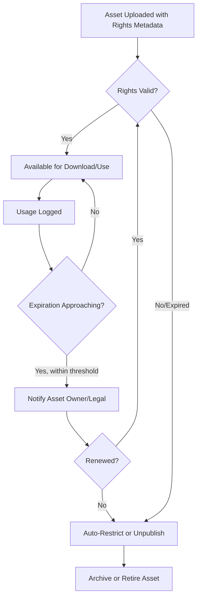

## Metadata, Taxonomy, and Rights Management for Digital Assets


### Overview

Metadata, taxonomy, and rights management form the governance backbone of any Digital Asset Management (DAM) system. Together they determine whether an asset can be found, whether it is used correctly, and whether its use exposes the organization to legal or brand risk. Within Asset Lifecycle Management (ALM), these three layers function as the digital equivalent of asset identification, classification, and compliance tracking applied to physical assets — but adapted to the intangible, infinitely-copyable nature of digital files.

**Key Points**

- Metadata answers "what is this asset and its attributes."
- Taxonomy answers "where does this asset belong, and how is it classified."
- Rights management answers "who can use this asset, how, where, and until when."
- All three are interdependent: rights metadata is a subset of metadata, and taxonomy often incorporates rights-status categories as a navigable facet.

### Metadata: Core Concepts

Metadata is structured data describing an asset. Without it, a repository is a flat, unsearchable file dump. DAM metadata is generally organized into distinct categories:

- **Descriptive metadata** — title, caption, keywords, alt text, description. Supports discoverability and accessibility (e.g., screen-reader alt text).
- **Administrative metadata** — creator/photographer, creation date, department, project ID, approval status.
- **Technical metadata** — file format, dimensions, resolution, color profile, codec, bit depth — largely auto-extracted at ingestion.
- **Rights metadata** — license type, usage terms, expiration date, territory, model/property releases.
- **Structural/relational metadata** — links between a master file and its renditions, or between related assets (e.g., a campaign's hero image and its social crops).
- **Preservation metadata** — checksums, format migration history, used for long-term archival integrity verification.

**Example**

```json
{
  "assetId": "DAM-00551209",
  "descriptive": {
    "title": "Autumn Collection - Lookbook Cover",
    "keywords": ["fashion", "autumn 2026", "lookbook", "outdoor"],
    "altText": "Model wearing autumn coat standing in a park"
  },
  "administrative": {
    "creator": "J. Alvarez Photography",
    "department": "Marketing - EMEA",
    "createdDate": "2026-08-14",
    "approvalStatus": "Approved"
  },
  "technical": {
    "format": "TIFF",
    "colorProfile": "Adobe RGB (1998)",
    "resolution": "300dpi",
    "dimensions": "6000x4000"
  },
  "rights": {
    "licenseType": "Editorial-Limited",
    "territory": ["EU", "UK"],
    "expirationDate": "2027-01-31",
    "modelRelease": true
  }
}
```

### Metadata Standards and Schemas

Interoperability across systems depends on adopting recognized metadata standards rather than proprietary field sets:

- **IPTC Photo Metadata Standard** — industry standard for embedding descriptive, rights, and administrative fields directly into image files (JPEG, TIFF).
- **XMP (Extensible Metadata Platform)** — Adobe-originated, now widely adopted, XML-based framework for embedding metadata across file types (images, video, PDF); supports custom namespaces.
- **Dublin Core** — a 15-element generic metadata standard (Title, Creator, Subject, Rights, etc.) commonly used as a baseline schema for cross-domain interoperability.
- **EXIF** — camera-generated technical metadata (focal length, aperture, GPS coordinates), automatically embedded and typically imported into the DAM at ingestion rather than manually authored.
- **PLUS (Picture Licensing Universal System)** — a controlled vocabulary and standard specifically for rights and licensing terminology, designed to remove ambiguity in usage rights language across markets.

**Key Points**

- Embedded metadata (written into the file itself via XMP/IPTC) persists even if the file is downloaded and moved outside the DAM, unlike database-only metadata.
- [Inference] Reliance on embedded metadata alone is generally considered insufficient for enterprise governance, since downstream edits (e.g., in image editors) can strip or overwrite embedded fields; DAM platforms typically maintain the authoritative metadata in their own database and re-sync or reconcile with embedded data during ingestion.

### Metadata Schema Design Principles

- **Required vs. optional fields** — mandatory fields (title, rights status) enforced at upload to prevent incomplete records; optional fields for supplementary context.
- **Controlled fields vs. free text** — dropdowns/controlled vocabularies for consistency (e.g., "Department" as a fixed list) vs. free-text fields for unique descriptions.
- **Field inheritance** — child assets (e.g., renditions) inherit core metadata from the parent master file to avoid redundant re-entry.
- **Extensibility** — custom fields/namespaces to support industry-specific or organization-specific needs (e.g., a pharmaceutical company tagging assets with a regulatory approval ID).
- **Validation rules** — format constraints (date fields, enumerated values) to prevent malformed metadata entry.

### Taxonomy: Core Concepts

Taxonomy is the hierarchical classification structure that organizes assets into a navigable tree, distinct from (but complementary to) flat tagging.

- **Hierarchical taxonomy** — nested categories, e.g., `Region > Market > Campaign > Asset Type`.
- **Faceted classification** — multiple independent classification dimensions applied simultaneously (e.g., an asset can be filtered by Region AND Product Line AND Asset Type at once, rather than forced into one branch).
- **Controlled vocabulary** — a fixed, approved list of terms for a given field, preventing variant spellings or synonyms from fragmenting search results (e.g., enforcing "United Kingdom" rather than allowing "UK", "U.K.", "Britain" as separate uncontrolled values).
- **Thesaurus relationships** — broader term/narrower term/related term mappings that improve search recall (e.g., a search for "footwear" also surfacing assets tagged "sneakers").



**Key Points**

- Taxonomy design typically balances depth against usability — excessive nesting (6+ levels) tends to slow navigation, while flat structures with only tags tend to reduce precision at scale.
- A **taxonomy owner** or metadata librarian role is commonly assigned in mature DAM governance programs to prevent uncontrolled tag proliferation ("tag sprawl") as multiple departments contribute content.
- Faceted search UIs are the primary user-facing benefit of well-designed taxonomy, allowing simultaneous filtering across independent dimensions rather than forcing users to browse a single hierarchical path.

### Taxonomy Governance Workflow

1. **Vocabulary definition** — stakeholders (marketing, legal, brand) agree on top-level categories and controlled terms.
2. **Mapping legacy tags** — existing uncontrolled tags are reconciled against the new controlled vocabulary (often the most labor-intensive migration step).
3. **Enforcement at ingestion** — new uploads are restricted to controlled vocabulary values, with free-text fields limited to genuinely descriptive (non-classificatory) content.
4. **Periodic review** — vocabulary is revisited on a governance cadence (e.g., quarterly) to add new categories (new product lines, campaigns) without fragmenting historical data.
5. **Deprecation handling** — obsolete terms are retired but retained as aliases mapping to current terms, preserving searchability of legacy assets.

### Rights Management: Core Concepts

Rights management (sometimes termed Digital Rights Management or DRM in this context, distinct from consumer media DRM/copy-protection) governs the legal permissions attached to an asset's use.

- **License type** — categories such as Royalty-Free, Rights-Managed, Editorial-Only, Internal-Use-Only, Exclusive.
- **Usage scope** — permitted channels (web, print, social, paid media), permitted duration, and permitted territory.
- **Expiration tracking** — a defined end-date after which the asset's approved use lapses, requiring either renewal or retirement from active use.
- **Model and property releases** — signed consent documentation for identifiable people or private property appearing in an asset, required for most commercial uses.
- **Attribution requirements** — some licenses (e.g., certain Creative Commons variants) require crediting the original creator wherever the asset is used.
- **Embargo dates** — a "do not use before" date, common for pre-release product imagery or announcements under press embargo.

**Key Points**

- Rights metadata is typically the single field set most tied to legal liability; improper use of expired or restricted-rights assets is a common source of licensing disputes and takedown demands.
- [Inference] Automated enforcement of rights expiration (auto-unpublishing or blocking download of expired assets) is a differentiating capability across DAM vendors — some platforms enforce this natively, others only surface expiration as a report requiring manual action, so this should be verified against specific platform documentation when compliance is business-critical.

### Rights Enforcement Mechanisms

- **Pre-download warnings/blocks** — the system flags or prevents download of an asset whose rights are expired, region-restricted, or pending legal review.
- **Watermarking** — comp/preview versions carry a visible watermark until final licensing/approval is confirmed, common for stock or client-approval workflows.
- **Time-bound access** — download links or portal access can be set to auto-expire in line with license terms.
- **Automated notification workflows** — alerts sent to asset owners or legal teams a set number of days before a license expires, enabling renewal or removal before non-compliant use occurs.
- **Audit logging** — a record of who downloaded/used which asset and when, supporting compliance audits and dispute resolution.



### Interplay Between the Three Layers

**Key Points**

- Taxonomy often includes a **rights-status facet** (e.g., "Cleared for Use", "Restricted", "Expired") so users can filter search results by legal usability, not just subject matter.
- Metadata schema design must reserve dedicated, structured fields for rights data rather than embedding license terms in free-text descriptions, since structured fields are what enable automated enforcement and reporting.
- Controlled vocabulary for rights terminology (e.g., adopting the PLUS standard) reduces ambiguity when the same asset is used across multiple markets with differing legal interpretations of terms like "editorial use."

### Illustrative Diagram: Layered Governance Model

<svg xmlns="http://www.w3.org/2000/svg" viewBox="0 0 720 420" font-family="sans-serif">
<text x="360" y="28" text-anchor="middle" font-size="18" font-weight="bold" fill="#1a1a2e">Metadata / Taxonomy / Rights Layers (svg_diagram)</text>
<rect x="60" y="60" width="600" height="90" rx="10" fill="#e8f0fe" stroke="#3b5bdb" stroke-width="2" />
<text x="360" y="90" text-anchor="middle" font-size="15" font-weight="bold" fill="#1e3a8a">Metadata Layer</text>
<text x="360" y="115" text-anchor="middle" font-size="12" fill="#1e3a8a">Descriptive, Administrative, Technical, Rights, Structural fields</text>
<text x="360" y="135" text-anchor="middle" font-size="11" fill="#1e3a8a">(Foundation: every asset attribute is a metadata field)</text>
<rect x="60" y="170" width="600" height="90" rx="10" fill="#fef3e2" stroke="#d97706" stroke-width="2" />
<text x="360" y="200" text-anchor="middle" font-size="15" font-weight="bold" fill="#92400e">Taxonomy Layer</text>
<text x="360" y="225" text-anchor="middle" font-size="12" fill="#92400e">Hierarchical categories + controlled vocabulary + facets</text>
<text x="360" y="245" text-anchor="middle" font-size="11" fill="#92400e">(Organizes metadata values into navigable structure)</text>
<rect x="60" y="280" width="600" height="90" rx="10" fill="#fde8e8" stroke="#c92a2a" stroke-width="2" />
<text x="360" y="310" text-anchor="middle" font-size="15" font-weight="bold" fill="#7f1d1d">Rights Management Layer</text>
<text x="360" y="335" text-anchor="middle" font-size="12" fill="#7f1d1d">License, territory, expiration, releases, enforcement rules</text>
<text x="360" y="355" text-anchor="middle" font-size="11" fill="#7f1d1d">(A specialized, high-stakes subset of metadata)</text>
<line x1="360" y1="150" x2="360" y2="170" stroke="#333" stroke-width="2" marker-end="url(#arrow2)" />
<line x1="360" y1="260" x2="360" y2="280" stroke="#333" stroke-width="2" marker-end="url(#arrow2)" />
<text x="380" y="400" text-anchor="middle" font-size="10" fill="#555">All layers surfaced together via faceted search</text>

</svg>

### Common Implementation Pitfalls

**Key Points**

- **Free-text rights fields** — recording license terms as unstructured notes rather than structured fields, making automated enforcement and reporting impossible.
- **Uncontrolled tagging at scale** — allowing arbitrary free-text tags without a governed vocabulary leads to fragmented, low-precision search results as the library grows.
- **Missing expiration tracking** — failing to record or monitor license expiration dates, leading to inadvertent use of expired-rights assets.
- **Metadata debt from migration** — legacy assets imported without full metadata backfill, degrading findability and rights compliance for older content.
- **Ignoring model/property releases** — commercial use of people-containing imagery without verifying release documentation, a frequent source of legal exposure.

### Related Topics

- IPTC, XMP, and Dublin Core Schema Implementation in Practice
- Designing a Controlled Vocabulary and Thesaurus for Enterprise DAM
- Automated Rights Expiration Workflows and Notification Design
- PLUS Coalition Licensing Standard in Depth
- AI-Assisted Auto-Tagging and Its Impact on Taxonomy Governance
- Metadata Migration Strategies for Legacy Asset Libraries
- Faceted Search UX Design for Large Digital Asset Repositories
- Legal Hold and Retention Overlays on Rights-Managed Assets