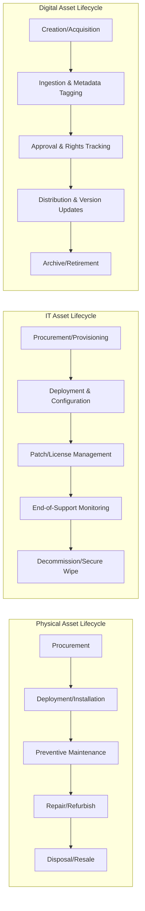
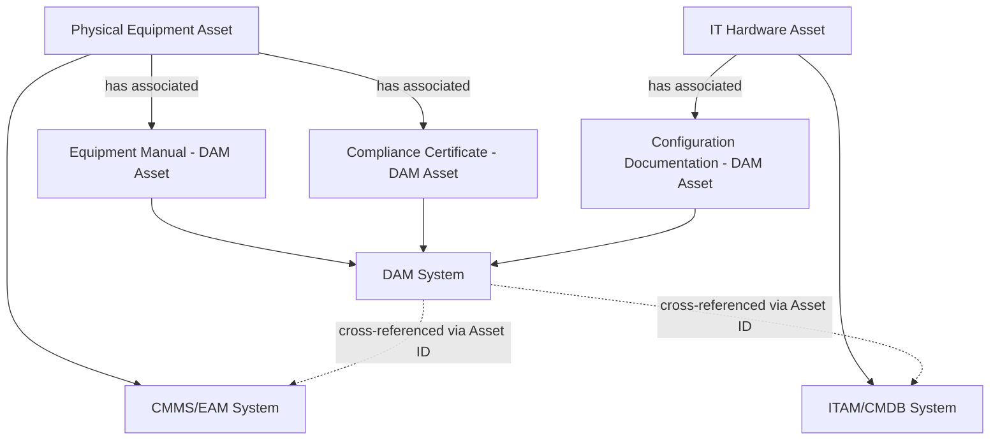

## Distinguishing Digital Asset Management from Physical and IT Asset Lifecycle Management

### Overview

Digital Asset Management (DAM), Physical Asset Lifecycle Management, and IT Asset Management (ITAM) all apply lifecycle governance principles — acquisition, use, maintenance, retirement — to categorically different asset types. While the vocabulary overlaps heavily (lifecycle stages, ownership, depreciation-like decay, compliance, disposal), the underlying asset characteristics, tooling, stakeholders, and risk profiles diverge substantially. Understanding these distinctions is essential for organizations deciding which framework, system of record, and governance model applies to a given asset class.

**Key Points**

- Physical Asset Lifecycle Management governs tangible equipment, machinery, facilities, and infrastructure.
- IT Asset Management (ITAM) governs hardware and software technology assets, including licenses and configuration items.
- Digital Asset Management (DAM) governs digital media/content files — images, video, audio, documents, and creative assets.
- All three share a lifecycle mental model but differ fundamentally in asset nature, valuation logic, and operational risk.

### Fundamental Asset Nature Differences

| Dimension | Physical ALM | IT Asset Management | Digital Asset Management |
| --- | --- | --- | --- |
| Tangibility | Tangible, physical object | Tangible (hardware) + intangible (software/licenses) | Fully intangible (files) |
| Depreciation | Physical wear, real depreciation | Technical obsolescence, license amortization | No physical depreciation; relevance/rights decay instead |
| Duplication | Cannot be duplicated | Software can be duplicated (licensing-controlled) | Infinitely and costlessly duplicable |
| Location | Single physical location at a time | Fixed or virtualized location | Simultaneously usable/distributed across many locations |
| Primary risk | Breakdown, safety, downtime | Security vulnerability, license non-compliance | Brand misuse, rights infringement, outdated content circulation |
| Disposal | Physical decommissioning, resale, scrap | Secure data wipe, e-waste disposal | Deletion or archival; no physical disposal process |

**Key Points**

- The core distinguishing factor is **duplicability**: a physical asset exists in one place; a digital asset can exist in unlimited identical copies simultaneously, which fundamentally changes how "control" and "usage tracking" must be implemented.
- Physical and IT hardware assets have real, calculable depreciation schedules (straight-line, declining balance); digital assets do not depreciate financially in the same sense — their "decay" is functional or legal (outdated branding, expired license) rather than accounting-based.

### Lifecycle Stage Comparison

Although the stage *names* are similar across disciplines, the *activities* within each stage differ substantially.

**Key Points**

- **Maintenance** in physical ALM means preventing mechanical failure; in ITAM it means patching and updating software/firmware; in DAM it means updating metadata, refreshing renditions, and renewing usage rights — no physical or functional "wear" occurs.
- **Disposal** in physical ALM involves scrapping, resale, or recycling; in ITAM it involves secure data destruction and e-waste compliance; in DAM "disposal" is simply deletion or archival, with no physical process, though legal retention requirements can still apply.
- **Utilization tracking** differs in method: physical/IT assets are tracked via sensors, barcodes/RFID, or CMDB records of a single instance; digital assets are tracked via download/usage logs across potentially thousands of simultaneous instances.

### Systems and Tooling Differences

| Function | Physical ALM Tooling | ITAM Tooling | DAM Tooling |
| --- | --- | --- | --- |
| System of record | CMMS (Computerized Maintenance Management System), EAM (Enterprise Asset Management) | ITAM platform, CMDB (Configuration Management Database) | DAM platform |
| Identification method | Asset tags, barcodes, RFID, serial numbers | Asset tags, MAC addresses, software license keys | Unique asset IDs, checksums, embedded metadata |
| Tracking focus | Location, condition, maintenance history | Configuration, patch level, license compliance | Version, rights status, usage/distribution |
| Key metrics | MTBF, MTTR, uptime, utilization rate | License compliance rate, patch coverage, end-of-life exposure | Download/usage counts, rights compliance, findability |

**Key Points**

- CMMS/EAM platforms are built around work orders, maintenance schedules, and failure tracking — concepts with no direct equivalent in DAM, since digital files do not mechanically fail.
- ITAM platforms often integrate with a CMDB to track configuration relationships between hardware and software; DAM platforms instead track relationships between master files and their derivative renditions.
- [Inference] Some organizations attempt to manage digital assets (product photography, manuals, technical documentation) within a general ECM or file-share system rather than a purpose-built DAM; this is generally considered a scope mismatch, since ECM/generic file storage typically lacks rendition management, rights enforcement, and rich media search capabilities that DAM provides natively.

### Compliance and Risk Profile Differences

- **Physical ALM compliance** — safety regulations (OSHA-type standards), environmental compliance, equipment certification and inspection schedules.
- **ITAM compliance** — software license audits, data security standards (e.g., ISO 27001-aligned controls), end-of-life security patching obligations.
- **DAM compliance** — copyright and licensing law, brand usage governance, data privacy regulations when assets contain personal data (e.g., identifiable people in photos/video), and territorial/channel usage restrictions.

**Key Points**

- Physical and IT asset risk is largely **operational and security-driven** (a machine fails, a server is breached); DAM risk is largely **legal and reputational** (unlicensed image use, off-brand content circulating publicly, outdated or non-compliant materials still in active use).
- Audit mechanisms differ accordingly: physical/IT audits typically verify asset existence, condition, and configuration; DAM audits typically verify rights validity and brand/version compliance of *in-use* content.

### Where the Disciplines Converge

Despite the differences, there are legitimate points of overlap and integration:

- **Shared lifecycle vocabulary** — acquisition, active use, maintenance, retirement stages map conceptually across all three, supporting shared governance frameworks and unified reporting language at an executive level.
- **Documentation linkage** — physical and IT assets often have associated digital documentation (manuals, warranty certificates, equipment photos, compliance certificates) that is itself managed as a DAM asset, cross-referenced to the physical/IT asset record via an asset ID.
- **Unified governance programs** — some organizations adopt an overarching Asset Lifecycle Management governance framework spanning physical, IT, and digital domains for consistency in ownership accountability, audit cadence, and lifecycle reporting, even though the underlying systems remain separate.
- **Cost accounting overlap** — digital asset storage costs (cloud storage tiers, egress/bandwidth) function similarly to a maintenance/holding cost line item familiar to physical/IT asset financial management, even though the underlying cost driver is entirely different.

### Illustrative Comparison Diagram

<svg xmlns="http://www.w3.org/2000/svg" viewBox="0 0 760 420" font-family="sans-serif">
<text x="380" y="28" text-anchor="middle" font-size="18" font-weight="bold" fill="#1a1a2e">Three Asset Management Disciplines (svg_diagram)</text>
<rect x="30" y="60" width="220" height="320" rx="10" fill="#e8f0fe" stroke="#3b5bdb" stroke-width="2" />
<text x="140" y="90" text-anchor="middle" font-size="14" font-weight="bold" fill="#1e3a8a">Physical ALM</text>
<text x="50" y="120" font-size="11" fill="#1e3a8a">Tangible equipment</text>
<text x="50" y="140" font-size="11" fill="#1e3a8a">Physical depreciation</text>
<text x="50" y="160" font-size="11" fill="#1e3a8a">CMMS / EAM systems</text>
<text x="50" y="180" font-size="11" fill="#1e3a8a">Barcode/RFID tracking</text>
<text x="50" y="200" font-size="11" fill="#1e3a8a">Safety/env. compliance</text>
<text x="50" y="220" font-size="11" fill="#1e3a8a">Risk: breakdown, downtime</text>
<text x="50" y="240" font-size="11" fill="#1e3a8a">Disposal: scrap/resale</text>
<rect x="270" y="60" width="220" height="320" rx="10" fill="#fef3e2" stroke="#d97706" stroke-width="2" />
<text x="380" y="90" text-anchor="middle" font-size="14" font-weight="bold" fill="#92400e">IT Asset Mgmt</text>
<text x="290" y="120" font-size="11" fill="#92400e">Hardware + software</text>
<text x="290" y="140" font-size="11" fill="#92400e">Tech obsolescence</text>
<text x="290" y="160" font-size="11" fill="#92400e">ITAM / CMDB systems</text>
<text x="290" y="180" font-size="11" fill="#92400e">License key tracking</text>
<text x="290" y="200" font-size="11" fill="#92400e">License/security compliance</text>
<text x="290" y="220" font-size="11" fill="#92400e">Risk: breach, non-compliance</text>
<text x="290" y="240" font-size="11" fill="#92400e">Disposal: secure wipe</text>
<rect x="510" y="60" width="220" height="320" rx="10" fill="#e6f9f0" stroke="#0f9960" stroke-width="2" />
<text x="620" y="90" text-anchor="middle" font-size="14" font-weight="bold" fill="#065f46">Digital Asset Mgmt</text>
<text x="530" y="120" font-size="11" fill="#065f46">Intangible files</text>
<text x="530" y="140" font-size="11" fill="#065f46">Rights/relevance decay</text>
<text x="530" y="160" font-size="11" fill="#065f46">DAM platforms</text>
<text x="530" y="180" font-size="11" fill="#065f46">Metadata/checksum ID</text>
<text x="530" y="200" font-size="11" fill="#065f46">Copyright/brand compliance</text>
<text x="530" y="220" font-size="11" fill="#065f46">Risk: misuse, infringement</text>
<text x="530" y="240" font-size="11" fill="#065f46">Disposal: delete/archive</text>

<text x="380" y="405" text-anchor="middle" font-size="12" fill="#333">Shared vocabulary: Acquire → Use → Maintain → Retire</text>

</svg>

### Decision Guidance: Which Framework Applies

**Key Points**

- If the asset is a physical, tangible object requiring maintenance, calibration, or physical location tracking → **Physical Asset Lifecycle Management / CMMS-EAM**.
- If the asset is computing hardware, software, or a license entitlement → **ITAM**.
- If the asset is a digital media file (image, video, audio, document, design file) whose value lies in its content and legal usage rights rather than physical form → **DAM**.
- If an asset spans categories (e.g., a piece of equipment with an associated digital manual, or a software product with associated marketing creative), the physical/IT record and the DAM record are typically maintained as **separate but cross-referenced** entries rather than forced into a single system.

### Related Topics

- CMMS and EAM Systems: Core Functions and Comparison to DAM
- ITAM and CMDB Fundamentals for IT Asset Governance
- Cross-Referencing Physical Asset IDs with DAM Documentation
- Unified Asset Governance Frameworks Spanning Physical, IT, and Digital Domains
- Cost Modeling: Depreciation vs. Rights Decay vs. Storage Cost
- Compliance Frameworks Compared: Safety Standards vs. Software Licensing vs. Copyright Law
- Building a Cross-Functional Asset Taxonomy Spanning Physical and Digital Records