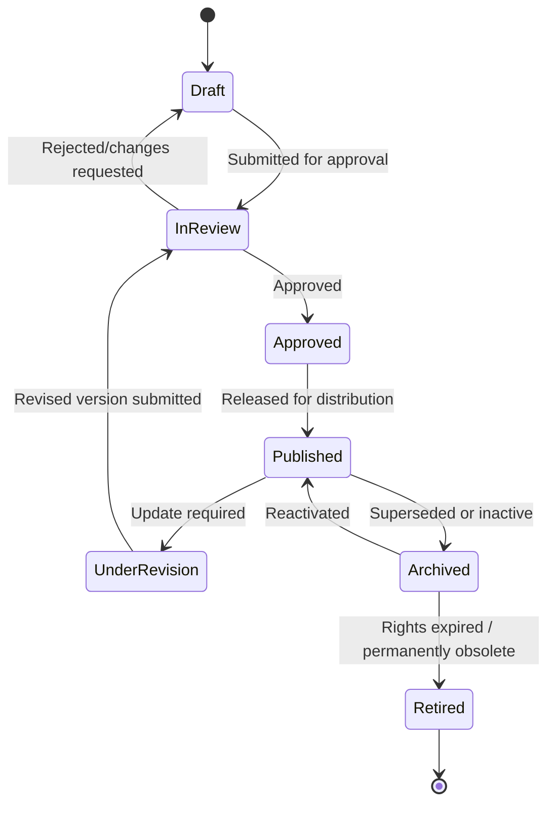
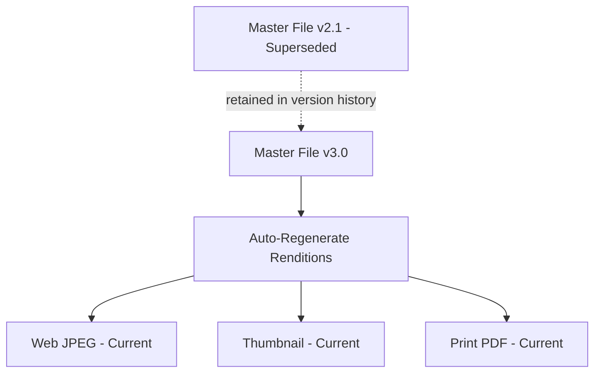

## Content Lifecycle and Version Control


### Overview

Content lifecycle and version control govern how a digital asset evolves from initial creation through successive revisions to final retirement, while preserving a reliable history of changes. In Digital Asset Management (DAM), this discipline ensures that users always know which version of an asset is current, why prior versions were superseded, and whether it is safe to roll back if an error is discovered downstream. This is the DAM analog to change management and revision control practices found in physical and IT asset lifecycle disciplines, adapted for files that can be edited, duplicated, and redistributed without physical constraint.

**Key Points**

- Content lifecycle describes the full sequence of states an asset passes through (creation, review, active use, revision, archival, retirement).
- Version control describes the mechanism for tracking, storing, and retrieving successive iterations of the same underlying asset.
- Together they prevent two common failure modes: outdated assets remaining in active circulation, and loss of the ability to recover a prior approved version.

### Content Lifecycle States

A typical DAM content lifecycle is modeled as a state machine, with each asset occupying exactly one state at a time and moving between states via defined transitions (often gated by workflow approval).



**Key Points**

- **Draft** — initial creation or upload; not yet visible to general users.
- **In Review** — routed through an approval workflow (legal, brand, quality) before becoming usable.
- **Approved/Published** — cleared for active distribution and use.
- **Under Revision** — a published asset requiring an update; typically a new version is created rather than overwriting the live asset directly, preserving continuity of access during revision.
- **Archived** — inactive but retained, often because it may be reused, referenced for audit, or is under a retention requirement.
- **Retired** — permanently removed from active circulation, whether deleted or retained solely for compliance/legal-hold purposes.

### Version Control Models

DAM platforms generally implement one of two version-tracking approaches, sometimes in combination:

- **Linear versioning** — each save creates a new sequential version (v1, v2, v3...), with the platform retaining full version history and allowing rollback to any prior version.
- **Major/minor versioning** — analogous to semantic versioning conventions, distinguishing substantive revisions (major, e.g., v2.0) from minor corrections (minor, e.g., v1.1), often tied to differing approval requirements (a major version may require full re-approval; a minor version may not).

**Example**

```json
{
  "assetId": "DAM-00782341",
  "currentVersion": "3.0",
  "versionHistory": [
    {
      "version": "1.0",
      "createdDate": "2026-02-01",
      "status": "Superseded",
      "changeNote": "Initial upload"
    },
    {
      "version": "2.0",
      "createdDate": "2026-04-15",
      "status": "Superseded",
      "changeNote": "Updated pricing overlay per Q2 promotion"
    },
    {
      "version": "2.1",
      "createdDate": "2026-04-20",
      "status": "Superseded",
      "changeNote": "Corrected color profile for print output"
    },
    {
      "version": "3.0",
      "createdDate": "2026-08-14",
      "status": "Current",
      "changeNote": "Rebranded per updated visual identity guidelines"
    }
  ]
}
```

### Master File vs. Rendition Versioning

A key architectural distinction in DAM version control is separating the **master file** (the original, highest-fidelity source) from its **renditions** (derivative outputs generated for specific uses).

- The master file is the authoritative version subject to formal version control.
- Renditions (web JPEG, thumbnail, social crop, print-ready PDF) are typically regenerated automatically whenever the master is updated, rather than independently version-controlled.
- This ensures all downstream renditions stay synchronized with the latest approved master, preventing a scenario where an outdated rendition continues circulating after the master has been corrected.



**Key Points**

- [Inference] Rendition regeneration behavior on master update varies by platform configuration — some DAM systems regenerate renditions automatically and immediately, while others require a manual re-publish trigger; this should be confirmed against the specific platform's configuration before assuming synchronization is automatic.
- Treating the master as the single point of version truth avoids the maintenance burden and drift risk of independently versioning every derivative format.

### Check-In / Check-Out and Concurrency Control

To prevent conflicting simultaneous edits, DAM platforms commonly implement a check-in/check-out mechanism, analogous to file locking in traditional document management systems:

- **Check-out** — a user "locks" an asset for editing, preventing others from making conflicting concurrent changes.
- **Check-in** — the edited file is uploaded back, creating a new version and releasing the lock.
- **Conflict resolution** — if concurrent editing is technically permitted, the system may require manual merge/resolution or simply preserve both edits as parallel version branches for manual reconciliation.

**Key Points**

- Check-out locking is most common for structured/editable source files (design files, documents); it is less commonly applied to finished rendered media (final JPEGs, videos) where edits typically produce an entirely new version rather than an in-place modification.
- Some platforms display a visual indicator ("checked out by [user]") to prevent duplicate concurrent work without a hard lock.

### Approval Workflow Integration with Versioning

Version transitions are frequently gated by workflow approval states rather than occurring freely:

1. A contributor uploads a revised file, creating a new **draft version**.
2. The draft version is routed to designated **approvers** (brand, legal, subject-matter reviewers).
3. Approvers can **approve** (promoting the version to Published/Current), **reject** (returning to Draft with comments), or **request changes**.
4. Upon approval, the new version becomes the **current/live version**, and the prior version is automatically set to **superseded** status but retained in history.

**Key Points**

- Automatic supersession (rather than manual deprecation) reduces the risk of multiple "approved-looking" versions coexisting and being mistakenly used interchangeably.
- Workflow audit trails (who approved which version, and when) support both quality governance and legal/compliance evidence requirements.

### Rollback and Recovery

**Key Points**

- Rollback capability allows reverting the "current" designation to a prior version — for example, if a newly published version is later found to contain an error or an expired-rights component.
- A true rollback in most DAM platforms creates a *new* version that duplicates the content of the earlier version, rather than deleting intervening history, preserving a complete and non-destructive audit trail.
- Retention of full version history (rather than only the current version) is what enables rollback; some platforms allow configuring a maximum retained version count or a retention policy governing how long historical versions are kept before automatic pruning.

### Retention, Archival, and Retirement of Superseded Versions

- **Active retention** — recent superseded versions remain immediately accessible for comparison or rollback.
- **Cold/archive storage** — older superseded versions are moved to lower-cost storage tiers if retained long-term, mirroring storage-tiering strategies used elsewhere in DAM and general ALM.
- **Legal hold override** — normal version pruning or asset retirement schedules are suspended for any version subject to an active legal hold, regardless of age or superseded status.
- **Final retirement** — permanent deletion of all versions, performed only after confirming no legal, contractual, or compliance retention obligation applies.

### Common Implementation Pitfalls

**Key Points**

- **Overwriting instead of versioning** — replacing a master file in place without creating a new version record, which destroys rollback capability and audit history.
- **Rendition drift** — allowing derivative renditions to fall out of sync with an updated master due to manual, non-automated regeneration processes.
- **Ambiguous "current" designation** — multiple team members independently uploading revisions without a clear approval gate, resulting in uncertainty about which version is authoritative.
- **Unbounded version accumulation** — retaining unlimited version history without an archival/pruning policy, leading to unmanaged storage growth over time.
- **Missing change notes** — version history entries lacking a description of *what* changed and *why*, reducing the audit trail's practical usefulness even though the file history itself is preserved.

### Illustrative Diagram: Version Control and Rendition Sync

<svg xmlns="http://www.w3.org/2000/svg" viewBox="0 0 740 380" font-family="sans-serif">
<text x="370" y="28" text-anchor="middle" font-size="18" font-weight="bold" fill="#1a1a2e">Version Lifecycle with Rendition Sync (svg_diagram)</text>
<rect x="40" y="60" width="160" height="60" rx="8" fill="#f1f3f5" stroke="#868e96" stroke-width="1.5" />
<text x="120" y="95" text-anchor="middle" font-size="12" fill="#495057">Master v1.0 (Superseded)</text>
<rect x="290" y="60" width="160" height="60" rx="8" fill="#f1f3f5" stroke="#868e96" stroke-width="1.5" />
<text x="370" y="95" text-anchor="middle" font-size="12" fill="#495057">Master v2.0 (Superseded)</text>
<rect x="540" y="60" width="160" height="60" rx="8" fill="#d3f9d8" stroke="#2f9e44" stroke-width="2" />
<text x="620" y="90" text-anchor="middle" font-size="12" font-weight="bold" fill="#2b8a3e">Master v3.0</text>
<text x="620" y="106" text-anchor="middle" font-size="11" fill="#2b8a3e">(Current)</text>
<line x1="200" y1="90" x2="290" y2="90" stroke="#868e96" stroke-width="2" marker-end="url(#arrow3)" />
<line x1="450" y1="90" x2="540" y2="90" stroke="#868e96" stroke-width="2" marker-end="url(#arrow3)" />
<line x1="620" y1="120" x2="620" y2="160" stroke="#2f9e44" stroke-width="2" marker-end="url(#arrow4)" />
<rect x="500" y="170" width="240" height="150" rx="8" fill="#e6f9f0" stroke="#0f9960" stroke-width="1.5" />
<text x="620" y="195" text-anchor="middle" font-size="12" font-weight="bold" fill="#065f46">Auto-Regenerated Renditions</text>
<text x="520" y="220" font-size="11" fill="#065f46">- Web JPEG (current)</text>
<text x="520" y="242" font-size="11" fill="#065f46">- Thumbnail (current)</text>
<text x="520" y="264" font-size="11" fill="#065f46">- Print PDF (current)</text>
<text x="520" y="286" font-size="11" fill="#065f46">- Social crop 1:1 (current)</text>
<text x="520" y="308" font-size="10" fill="#065f46">All synced to Master v3.0</text>

<text x="30" y="360" font-size="11" fill="#555">Full history (v1.0, v2.0) retained for rollback and audit</text>

</svg>

### Related Topics

- Workflow and Approval Engine Design in DAM
- Storage Tiering for Archived Asset Versions
- Legal Hold Mechanisms and Their Interaction with Version Retention
- Rendition Pipeline Automation and Regeneration Triggers
- Audit Trail and Compliance Reporting for Version History
- Check-In/Check-Out Concurrency Patterns Compared to Source Control Systems (e.g., Git)
- Designing Change Note Standards for Enterprise Version Histories