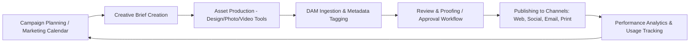
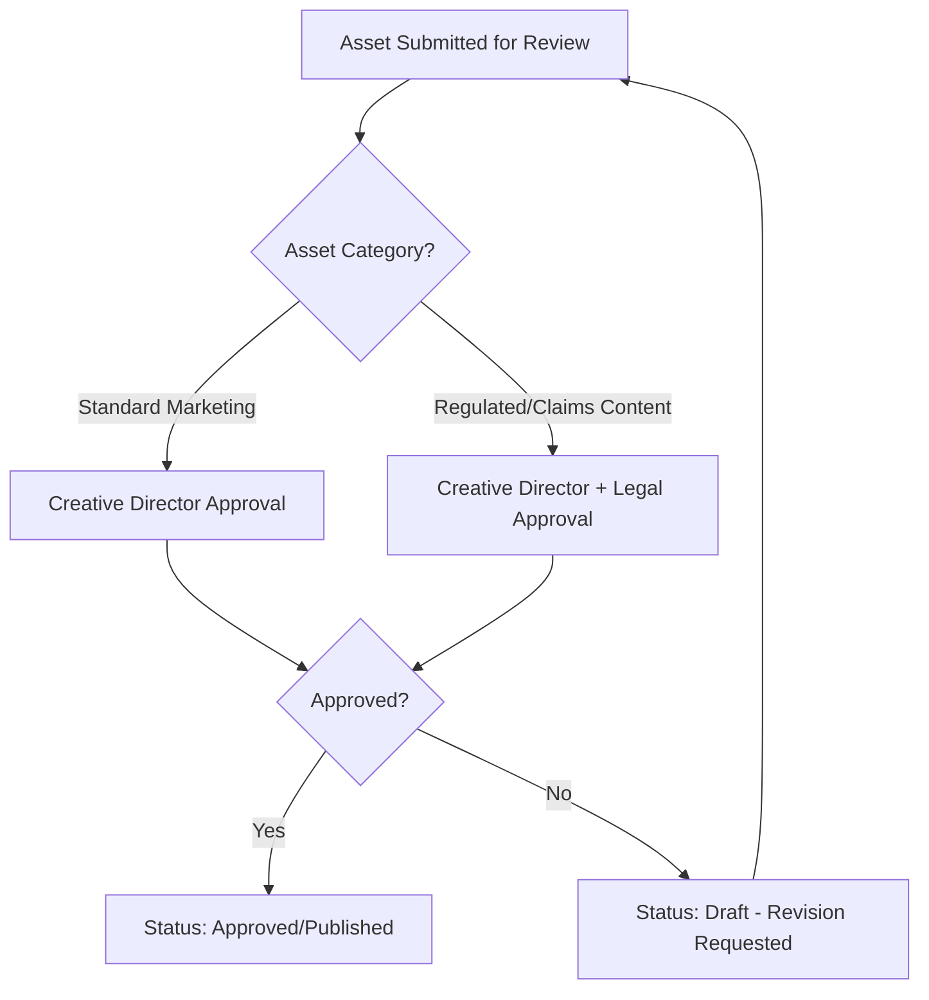

## Integrating Digital Asset Management with Marketing and Creative Operations


### Overview

Marketing and creative operations (often abbreviated "CreativeOps" or "MarOps") represent the primary day-to-day consumer and producer of digital assets within most organizations. Integrating DAM with these functions means embedding the asset repository directly into the tools, workflows, and approval processes creative and marketing teams already use — campaign planning, brief management, creative production, proofing, and multichannel publishing — rather than treating DAM as an isolated storage silo accessed only after work is complete.

**Key Points**

- Marketing/creative operations manage the *process* of producing campaigns and content; DAM manages the *assets* that process produces and consumes.
- Effective integration eliminates duplicate storage, version confusion, and manual re-uploading between creative tools and the DAM.
- Poor integration is one of the most common causes of DAM adoption failure, since teams default back to local drives or ad hoc cloud folders if the DAM sits outside their working tools.

### Points of Integration Across the Marketing/Creative Workflow



**Key Points**

- **Campaign planning integration** — DAM collections or campaign folders are provisioned automatically when a campaign is created in a marketing calendar or project management tool, giving production teams a pre-structured destination for new assets.
- **Creative brief integration** — briefs reference or link directly to required source assets (existing brand elements, prior campaign creative) stored in the DAM, reducing time spent locating reference material.
- **Production tool integration** — plugins/extensions for design and editing software (e.g., Adobe Creative Cloud) allow assets to be pulled from and pushed back to the DAM without leaving the editing application.
- **Proofing and approval integration** — DAM-hosted assets are routed through review workflows with in-context commenting, avoiding disconnected email- or chat-based feedback loops.
- **Publishing integration** — approved assets are syndicated directly to CMS, social media schedulers, email platforms, and print vendors via API connectors, maintaining the DAM as the single source of truth even after distribution.
- **Analytics feedback loop** — usage and performance data (which assets were used, how often, in which campaigns) feeds back into planning for future campaigns.

### Creative Production Tool Integration Patterns

- **Native plugins/panels** — DAM vendor-provided panels embedded directly within design applications, enabling search, check-out, and check-in of assets without switching applications.
- **Connector/middleware integration** — API-based connectors linking DAM to project management or creative workflow platforms, synchronizing task status with asset approval status.
- **Watch-folder/hot-folder ingestion** — automated ingestion pipelines that monitor a designated folder (local or cloud) and auto-upload new files into the DAM with pre-configured metadata templates, commonly used for high-volume photography or video production pipelines.
- **API-first/headless integration** — for organizations building custom creative production tooling, direct REST/GraphQL API integration against the DAM's asset and metadata endpoints.

**Example**



```
POST /api/v2/assets/ingest
Content-Type: multipart/form-data

{
  "file": <binary>,
  "metadata": {
    "campaignId": "CAMP-2026-Q4-LAUNCH",
    "department": "Creative - EMEA",
    "assetType": "Hero Banner",
    "status": "Draft",
    "tags": ["Q4-2026", "product-launch", "hero"]
  },
  "workflow": {
    "route": "brand-review-standard",
    "assignee": "brand.review@company.example"
  }
}
```

### Brand Portal and Self-Service Access

Many marketing/creative integrations extend beyond internal production teams to external or semi-external users:

- **Brand portals** — curated, permission-scoped front-ends onto the DAM, allowing external agencies, franchisees, or resellers to self-serve approved, on-brand assets without direct DAM system access.
- **Guest/external user roles** — restricted accounts limited to specific collections, download resolutions, or usage rights categories.
- **Brand guideline embedding** — portals frequently surface brand usage guidelines alongside the assets themselves, reducing off-brand usage by external parties.

**Key Points**

- Brand portals typically expose only **published/approved** status assets, filtering out drafts and in-review content to prevent premature or unapproved external use.
- [Inference] Watermarking of preview-resolution assets is commonly applied in brand portals intended for review/selection purposes, with full-resolution downloads gated behind explicit rights acceptance or approval, though the specific mechanism varies by platform.

### Proofing and Approval Workflow Design

Marketing/creative operations typically require more nuanced approval routing than a simple single-step gate:

- **Sequential approval** — reviewers approve in a defined order (e.g., creative director, then legal, then brand).
- **Parallel approval** — multiple reviewers evaluate simultaneously, with approval requiring all (or a quorum) to sign off.
- **Conditional routing** — different asset types or campaign categories are routed to different approver groups automatically based on metadata (e.g., assets tagged "regulated-industry-claim" route additionally through legal/compliance).
- **In-context annotation/markup** — reviewers comment directly on specific regions of an image or timestamped points in a video, rather than providing feedback disconnected from the visual context.



### Multichannel Publishing Integration

- **CMS syndication** — approved assets and their web-optimized renditions are pushed automatically to the corporate website's CMS, avoiding manual re-upload and ensuring rights/version consistency between DAM and published content.
- **Social media scheduling integration** — approved, channel-specific renditions (correct aspect ratios, file sizes) are made available directly within social scheduling tools.
- **Email/marketing automation platform integration** — creative assets are pulled directly into email template builders, maintaining a live link back to the DAM master for version updates.
- **Print/vendor integration** — high-resolution, print-ready renditions and associated brand/legal metadata are transmitted to external print vendors via secure file transfer or API, often accompanied by rights and usage restriction data to ensure compliant external use.

**Key Points**

- A core benefit of syndication integration (versus manual export/upload) is that updating the master asset in the DAM propagates corrected renditions to connected channels without requiring manual re-publishing in each downstream system, though the specific propagation mechanism (push vs. pull, real-time vs. scheduled sync) varies by integration architecture.

### Governance Considerations Specific to Marketing/Creative Integration

**Key Points**

- **Brand consistency enforcement** — integration should prevent unapproved or outdated assets from being usable within connected creative and publishing tools, typically by exposing only "Published"-status assets to downstream integrations.
- **Rights compliance at the point of use** — since creative teams often reuse stock or licensed imagery across multiple campaigns, integration should surface rights/expiration warnings directly within the creative tool, not only within the DAM interface itself.
- **Metadata consistency across systems** — campaign, department, and product taxonomy values should be synchronized (or at least mapped) between the DAM and the marketing calendar/project management system to avoid duplicate or conflicting classification schemes.
- **Access scoping for external parties** — agency and freelancer access should be time-bound and collection-scoped, reducing exposure if external accounts are not deprovisioned promptly after project completion.

### Measuring Integration Effectiveness

Common indicators used to assess how well DAM is embedded into marketing/creative operations:

- **Asset reuse rate** — proportion of campaigns leveraging existing DAM assets versus commissioning new production, indicating whether teams are actually finding and reusing what already exists.
- **Time-to-publish** — elapsed time from asset creation to approved publication, which integration (versus manual handoffs) is intended to reduce.
- **Off-DAM asset usage incidents** — instances of marketing materials found to have bypassed the DAM/approval workflow, often surfaced through brand audits.
- **Rights compliance incident rate** — frequency of expired or improperly licensed assets identified in active campaigns, which tighter rights-metadata integration into creative tools is intended to reduce.

### Illustrative Diagram: Integration Touchpoints

<svg xmlns="http://www.w3.org/2000/svg" viewBox="0 0 760 440" font-family="sans-serif">
<text x="380" y="28" text-anchor="middle" font-size="18" font-weight="bold" fill="#1a1a2e">DAM Integration Across Marketing/Creative Ops (svg_diagram)</text>
<circle cx="380" cy="220" r="80" fill="#e8f0fe" stroke="#3b5bdb" stroke-width="2" />
<text x="380" y="215" text-anchor="middle" font-size="14" font-weight="bold" fill="#1e3a8a">DAM</text>
<text x="380" y="233" text-anchor="middle" font-size="12" fill="#1e3a8a">Core Platform</text>
<rect x="40" y="60" width="170" height="60" rx="8" fill="#fef3e2" stroke="#d97706" stroke-width="1.5" />
<text x="125" y="95" text-anchor="middle" font-size="11" fill="#92400e">Marketing Calendar /</text>
<text x="125" y="109" text-anchor="middle" font-size="11" fill="#92400e">Campaign Planning</text>
<rect x="550" y="60" width="170" height="60" rx="8" fill="#fef3e2" stroke="#d97706" stroke-width="1.5" />
<text x="635" y="95" text-anchor="middle" font-size="11" fill="#92400e">Design/Creative</text>
<text x="635" y="109" text-anchor="middle" font-size="11" fill="#92400e">Production Tools</text>
<rect x="40" y="340" width="170" height="60" rx="8" fill="#e6f9f0" stroke="#0f9960" stroke-width="1.5" />
<text x="125" y="375" text-anchor="middle" font-size="11" fill="#065f46">CMS / Website</text>
<rect x="550" y="340" width="170" height="60" rx="8" fill="#e6f9f0" stroke="#0f9960" stroke-width="1.5" />
<text x="635" y="365" text-anchor="middle" font-size="11" fill="#065f46">Social/Email</text>
<text x="635" y="379" text-anchor="middle" font-size="11" fill="#065f46">Scheduling Tools</text>
<rect x="295" y="380" width="170" height="50" rx="8" fill="#fde8e8" stroke="#c92a2a" stroke-width="1.5" />
<text x="380" y="410" text-anchor="middle" font-size="11" fill="#7f1d1d">Brand Portal (External)</text>
<line x1="210" y1="90" x2="310" y2="180" stroke="#333" stroke-width="1.5" />
<line x1="550" y1="90" x2="450" y2="180" stroke="#333" stroke-width="1.5" />
<line x1="210" y1="370" x2="310" y2="260" stroke="#333" stroke-width="1.5" />
<line x1="550" y1="370" x2="450" y2="260" stroke="#333" stroke-width="1.5" />
<line x1="380" y1="300" x2="380" y2="380" stroke="#333" stroke-width="1.5" />
</svg>

### Common Integration Pitfalls

**Key Points**

- **Tool fragmentation** — creative teams continuing to work locally and treating DAM upload as an afterthought rather than an embedded step, defeating the single-source-of-truth objective.
- **Metadata mismatch between systems** — campaign or taxonomy fields that don't align between the marketing calendar and DAM, complicating cross-system reporting and asset discovery.
- **Overexposed brand portals** — external portals surfacing too broad a set of assets or insufficiently scoped permissions, increasing misuse or off-brand usage risk.
- **Manual re-upload dependency** — publishing integrations that stop short of full automation, requiring manual export/import steps that reintroduce version drift between the DAM and live channels.

### Related Topics

- Creative Production Plugin Architecture (Adobe Creative Cloud and Similar Integrations)
- Brand Portal Design and External User Governance
- Proofing and Annotation Workflow Tools in DAM
- API-Driven Multichannel Publishing Pipelines
- Marketing Calendar and Campaign-Based Asset Collection Provisioning
- Measuring DAM ROI via Asset Reuse and Time-to-Publish Metrics
- Watch-Folder and Automated Ingestion Pipeline Design