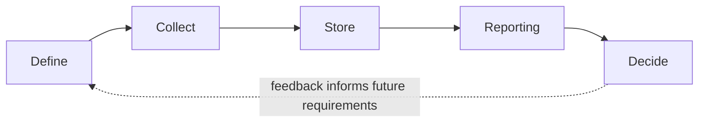
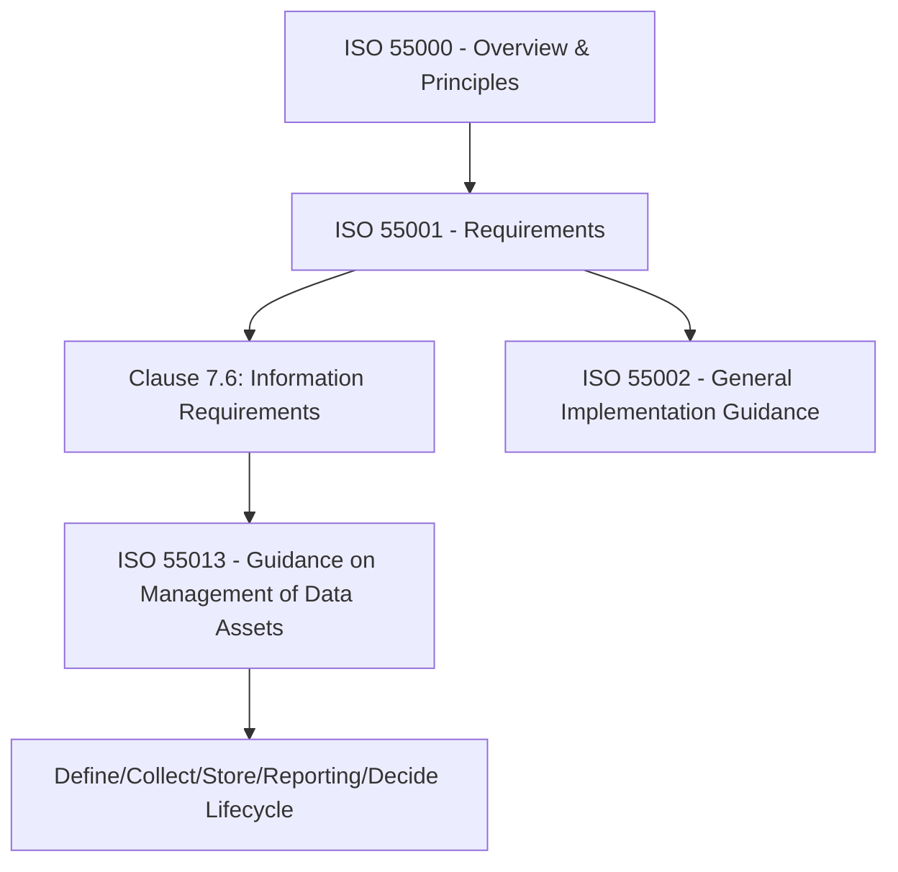

## Data Assets and Information Governance under ISO 55013

### Overview

ISO 55013:2024, *Asset management — Guidance on the management of data assets*, is a guidance standard published by ISO/TC 251 (the technical committee responsible for the ISO 55000 asset management series) in July 2024. It elaborates specifically on Clause 7.6 ("Information requirements") of ISO 55001, providing guidance on the identification, description, format, adequacy, availability, and protection of asset data and related documented information. Where ISO 55001 states organizations *must* manage information supporting asset management decisions, ISO 55013 explains *how* to do so, treating data itself as a manageable asset class subject to asset management principles. [iTech](https://standards.iteh.ai/catalog/standards/sist/1605a8f2-c272-430c-b9ef-be8d0c47bbae/sist-iso-55013-2024)

**Key Points**

- ISO 55013 sits within the broader ISO 55000 family alongside ISO 55000 (overview/principles), ISO 55001 (requirements), and ISO 55002 (implementation guidance).
- The document gives guidance on managing data to support an organization in meeting its asset management objectives and, by extension, its organizational objectives, and is applicable to any organization regardless of type or size. [ISO](https://www.iso.org/standard/82455.html)
- The standard explicitly does not provide methodologies to derive or appraise financial value for data assets, nor does it direct organizations on whether they need to calculate financial values for asset data. [ISO](https://www.iso.org/standard/82455.html)
- This makes ISO 55013 a *guidance* document (not a certifiable requirements standard like ISO 55001) — it informs practice rather than defining an auditable compliance bar.

### Relevance to Digital Asset Management

ISO 55013 is grouped in this chapter as a related discipline because it formalizes, at a governance-standard level, many of the same concerns DAM systems operationalize at a technical level — data quality, metadata sufficiency, lifecycle stages, and information protection — but applied specifically to **asset data** (information *about* physical, IT, or other organizational assets) rather than to rich media content files.

**Key Points**

- DAM governs digital media/content assets (images, video, documents); ISO 55013 governs the broader category of **data assets** used to support decisions about *any* asset type in an organization's asset management system.
- A useful framing distinguishes "Asset Data" (risk, performance, lifecycle cost data about a physical or IT asset) from "Non-asset Digital data products" (e.g., traffic patterns, weather data, consumption data) and combinations of both. [Theiam](https://theiam.org/knowledge-library/understanding-iso55013-guidance-on-management-of-data-assets/)
- Where these overlap: documentation assets managed in a DAM (equipment manuals, compliance certificates, inspection photos) are themselves a form of asset data falling within ISO 55013's guidance scope, even though the DAM platform itself is a content/media system rather than a data-governance framework.
- [Inference] Organizations applying both disciplines together would typically use DAM as the technical repository/tooling layer for asset-related documentation and media, while using ISO 55013 principles to govern the *quality, structure, and lifecycle discipline* applied to that data — the standard does not mandate or reference specific DAM tooling.

### Core Concepts: Data Asset and Asset Data

ISO 55013 draws a terminological distinction relevant to governance scope:

- **Asset data** — data specifically describing or relating to a managed asset (condition, performance, risk, lifecycle cost).
- **Data asset** — data itself, treated and managed as an asset subject to asset management discipline (i.e., applying ISO 55000-series principles to the data, not just to the physical/IT/other asset the data describes).

**Key Points**

- The standard states that while its focus is on the management of data for asset management, it acknowledges that organizations can manage data itself as an asset to support their organizational management, using the principles of asset management outlined elsewhere in the ISO 55000 series. [Anmut](https://www.anmut.co.uk/reviewing-iso-55013-guidance-on-the-management-of-data-assets/)
- A noted limitation of the current edition is that it does not provide guidance on valuing data assets — i.e., no methodology for prioritizing which data assets to focus management effort on first — with commentary suggesting this may be addressed in a future revision or companion standard. [Anmut](https://www.anmut.co.uk/reviewing-iso-55013-guidance-on-the-management-of-data-assets/)

### Data Lifecycle Stages under ISO 55013

ISO 55013 specifies typical data lifecycle stages and their interrelationships, providing a structured model analogous to the physical/digital asset lifecycles covered elsewhere in this chapter: [Asset Dynamics](https://www.assetdynamics.co.nz/news-articles/new-iso-55013-standard)

- **Define** — activities to provide guidance on the asset data required by the organization. [Asset Dynamics](https://www.assetdynamics.co.nz/news-articles/new-iso-55013-standard)
- **Collect** — data acquisition, gathering, and creation. [Asset Dynamics](https://www.assetdynamics.co.nz/news-articles/new-iso-55013-standard)
- **Store** — locating the data where it can be retrieved. [Asset Dynamics](https://www.assetdynamics.co.nz/news-articles/new-iso-55013-standard)
- **Reporting** — extraction and analysis of data for use in decision-making, distribution, or disposal. [Asset Dynamics](https://www.assetdynamics.co.nz/news-articles/new-iso-55013-standard)
- **Decide** — making a decision based upon the reports produced. [Asset Dynamics](https://www.assetdynamics.co.nz/news-articles/new-iso-55013-standard)

**Key Points**

- This lifecycle model parallels the general ALM pattern (identify need → acquire → maintain/use → evaluate → act) but is scoped to *data* rather than to physical or digital media assets.
- The explicit inclusion of "Decide" as a lifecycle stage reflects the standard's core premise that data management's purpose is enabling asset management decision-making, not simply data storage or retention for its own sake.

### Data Quality and the Cost-Risk-Performance Balance

**Key Points**

- In alignment with Clause 7.6 of ISO 55001, ISO 55013 identifies the need for organizations to determine their data requirements and associated quality requirements. [Asset Dynamics](https://www.assetdynamics.co.nz/news-articles/new-iso-55013-standard)
- The standard points out the need for a balance of cost, risk, and performance when determining data quality requirements, and suggests that data quality may be considered analogous to asset health and assessed using similar schemas. [Asset Dynamics](https://www.assetdynamics.co.nz/news-articles/new-iso-55013-standard)
- This mirrors a core ALM principle applied elsewhere in this discipline: not all data (or assets) warrant the same investment in quality or maintenance — the appropriate rigor is determined by the cost of poor data quality weighed against the risk of decisions made on flawed data and the performance value gained from higher-quality data.

### Scope and Applicability

The standard's stated scope covers: (1) definition of the range of factors that can be generally applied to data across many types of assets in varied business contexts; (2) definition of "usefulness" and guidance on how data assets become useful to an organization in relation to its objectives; (3) definition of the types of value data assets could hold and the types of stakeholders relevant to each value type; and (4) alignment with other bodies of knowledge regarding key terms such as data asset, asset data, data quality, and data governance. [ISO](https://committee.iso.org/sites/tc251/home/projects/published/iso-55013.html)

**Key Points**

- ISO 55013:2024 provides recommendations to organizations on factors to consider in increasing and sustaining the usefulness of data assets to meet asset management objectives, and by extension, organizational objectives. [ISO](https://committee.iso.org/files/live/sites/tc251/files/guidance/ISO%20TC251%20ISO55013%20Rev3.pdf)
- The emphasis on *usefulness* (rather than volume or completeness) as the central evaluative concept distinguishes this standard's approach from generic data governance frameworks that may prioritize comprehensiveness or regulatory compliance as primary goals.
- The standard is explicitly non-prescriptive about data valuation methodology, leaving organizations to determine their own approach to prioritizing which data assets merit management investment.

### Relationship to ISO 55001 Clause 7.6

**Key Points**

- ISO 55013:2024 is described as a first attempt at spotlighting the Data and Information clause (7.6) in ISO 55001:2024, intended to help asset managers elevate their treatment of data within their organizations. [Theiam](https://theiam.org/knowledge-library/understanding-iso55013-guidance-on-management-of-data-assets/)
- ISO 55001 can be applied by organizations to establish and implement an asset management system, and this also applies to an asset management system for data assets specifically; since an organization's asset management system is supported by decision-making based on information/data and its analysis, the process of determining decision-making criteria under ISO 55001 generally includes the process of managing data — meaning ISO 55013 facilitates organizations in formally including data assets within their broader asset management system. [iTech](https://standards.iteh.ai/catalog/standards/sist/1605a8f2-c272-430c-b9ef-be8d0c47bbae/sist-iso-55013-2024)
- Organizations already certified or working toward ISO 55001 compliance would typically use ISO 55013 as supplementary, non-certifiable guidance to strengthen how Clause 7.6 obligations are met in practice, rather than as a separate compliance target.

### Illustrative Diagram: Data Asset Governance Model

<svg xmlns="http://www.w3.org/2000/svg" viewBox="0 0 740 400" font-family="sans-serif">
<text x="370" y="28" text-anchor="middle" font-size="18" font-weight="bold" fill="#1a1a2e">ISO 55013 Data Asset Governance Model (svg_diagram)</text>
<rect x="40" y="60" width="300" height="140" rx="10" fill="#e8f0fe" stroke="#3b5bdb" stroke-width="2" />
<text x="190" y="85" text-anchor="middle" font-size="14" font-weight="bold" fill="#1e3a8a">Asset Data</text>
<text x="60" y="110" font-size="11" fill="#1e3a8a">Describes a specific asset:</text>
<text x="60" y="130" font-size="11" fill="#1e3a8a">- Condition / performance</text>
<text x="60" y="150" font-size="11" fill="#1e3a8a">- Risk profile</text>
<text x="60" y="170" font-size="11" fill="#1e3a8a">- Lifecycle cost</text>
<text x="60" y="190" font-size="11" fill="#1e3a8a">- Inspection/compliance records</text>
<rect x="400" y="60" width="300" height="140" rx="10" fill="#fef3e2" stroke="#d97706" stroke-width="2" />
<text x="550" y="85" text-anchor="middle" font-size="14" font-weight="bold" fill="#92400e">Data Asset</text>
<text x="420" y="110" font-size="11" fill="#92400e">Data managed as an asset itself:</text>
<text x="420" y="130" font-size="11" fill="#92400e">- Subject to ISO 55000 principles</text>
<text x="420" y="150" font-size="11" fill="#92400e">- Has "usefulness" to stakeholders</text>
<text x="420" y="170" font-size="11" fill="#92400e">- Quality assessed like asset health</text>
<text x="420" y="190" font-size="11" fill="#92400e">- No mandated financial valuation</text>
<rect x="220" y="240" width="300" height="130" rx="10" fill="#e6f9f0" stroke="#0f9960" stroke-width="2" />
<text x="370" y="265" text-anchor="middle" font-size="14" font-weight="bold" fill="#065f46">Cost / Risk / Performance Balance</text>
<text x="240" y="290" font-size="11" fill="#065f46">Determines appropriate data quality</text>
<text x="240" y="310" font-size="11" fill="#065f46">investment per data type</text>
<text x="240" y="330" font-size="11" fill="#065f46">(analogous to asset health assessment)</text>
<line x1="190" y1="200" x2="300" y2="240" stroke="#333" stroke-width="1.5" />
<line x1="550" y1="200" x2="440" y2="240" stroke="#333" stroke-width="1.5" />
</svg>

### Practical Implementation Considerations

**Key Points**

- **Data requirements definition** — organizations must first determine *what* data is required to meet asset management objectives before applying quality or lifecycle discipline, avoiding indiscriminate collection of data with no clear decision-support purpose.
- **Stakeholder-relevant value types** — since the standard defines types of value data assets could hold and the types of stakeholders relevant to each value type, implementation typically involves mapping which stakeholder groups (engineering, finance, compliance, executive leadership) derive value from which data assets, informing prioritization. [ISO](https://committee.iso.org/sites/tc251/home/projects/published/iso-55013.html)
- **Terminology alignment** — because the standard aligns key terms such as data asset, asset data, data quality, and data governance with other bodies of knowledge, organizations integrating ISO 55013 alongside existing data governance frameworks (e.g., DAMA-DMBOK) should reconcile terminology to avoid conflicting internal definitions. [ISO](https://committee.iso.org/sites/tc251/home/projects/published/iso-55013.html)
- [Inference] Because ISO 55013 is guidance rather than a requirements standard, organizations have latitude in how rigorously they formalize adoption — some may treat it as informal best-practice reference material, while others embed its lifecycle model directly into formal asset management system documentation supporting ISO 55001 certification; the standard itself does not mandate a specific implementation depth.

### Common Points of Confusion

**Key Points**

- **ISO 55013 is not a data privacy or cybersecurity standard** — it addresses data's role in supporting asset management decisions, not data protection regulation compliance (e.g., GDPR) or information security controls (covered by standards such as ISO/IEC 27001).
- **ISO 55013 is not a data valuation standard** — it explicitly does not provide methodologies to derive financial values for data assets or direct organizations on whether such valuation is needed. [ISO](https://www.iso.org/standard/82455.html)
- **ISO 55013 is not specific to digital media/content assets** — unlike DAM, its scope is asset-supporting data broadly (sensor readings, inspection records, performance metrics), which may or may not include rich media files depending on organizational context.

### Related Topics

- ISO 55000 Series Overview: ISO 55000, 55001, and 55002 Compared
- Clause 7.6 of ISO 55001: Information Requirements in Depth
- Data Quality Frameworks and Their Analogy to Asset Health Assessment
- Aligning ISO 55013 Terminology with DAMA-DMBOK Data Governance Concepts
- Data Asset Valuation Approaches (Beyond ISO 55013's Stated Scope)
- Applying the Define-Collect-Store-Reporting-Decide Lifecycle to Asset Documentation in DAM
- Information Security Considerations for Asset Data (Cross-Reference to ISO/IEC 27001)