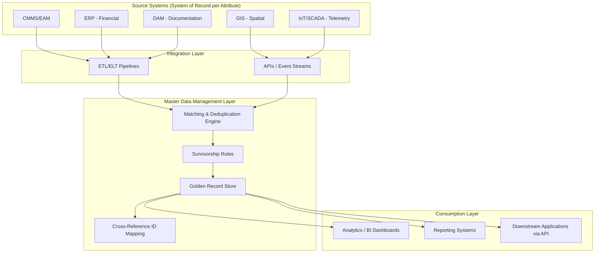

## Asset Data Architecture and Master Data Management


### Overview

Asset data architecture defines how asset-related information is structured, stored, integrated, and governed across the systems an organization uses to manage assets throughout their lifecycle. Master Data Management (MDM) is the discipline and technology practice within that architecture responsible for establishing a single, authoritative, deduplicated record for each asset — the "golden record" — that all downstream systems reference or synchronize against, rather than each system maintaining its own inconsistent copy.

**Key Points**

- Asset data architecture is the overall blueprint: which systems hold which data, how they connect, and how data flows between them.
- MDM is the specific governance and technical layer ensuring core asset identity and attribute data remains consistent, accurate, and non-duplicated across that architecture.
- Without MDM, organizations commonly accumulate multiple, conflicting records for the same physical or digital asset across CMMS, ERP, GIS, and other systems — a problem generally referred to as data fragmentation or "system of record ambiguity."

### The Master Data Problem in Asset Management

Asset-related data is typically scattered across multiple specialized systems, each optimized for a different function:

- **CMMS/EAM** — maintenance history, work orders, condition data.
- **ERP** — financial value, depreciation, procurement, cost center assignment.
- **GIS** — spatial/location data for geographically distributed assets.
- **IoT/SCADA platforms** — real-time sensor and telemetry data.
- **DAM** — associated documentation, manuals, and media.
- **Project/engineering systems** — design specifications, BIM/CAD data for capital assets.

**Key Points**

- Each system typically holds a *partial* view of a given asset, identified by its own internal ID, often with no reliable cross-reference to the same asset's ID in other systems.
- Without a master data layer, common failure modes include: the same physical asset represented as multiple distinct records across systems, conflicting attribute values (e.g., different installation dates recorded in ERP vs. CMMS), and broken analytics/reporting because aggregation cannot reliably determine "is this the same asset."
- [Inference] This fragmentation problem tends to scale with organizational complexity — organizations with a single CMMS instance may sustain informal reconciliation processes, while multi-system, multi-site, or post-merger organizations generally require formal MDM tooling to avoid unmanageable data quality degradation.

### Core MDM Concepts

- **Golden record** — the single authoritative, most trusted version of an asset's core attributes, reconciled from all contributing source systems.
- **Master data domain** — the category of data being mastered; in asset management this is typically the "Asset" domain, alongside related domains like "Location," "Supplier," and "Product."
- **System of record (SOR)** — the designated authoritative source for a specific attribute (e.g., ERP may be the SOR for financial value; CMMS may be the SOR for maintenance status).
- **Cross-reference/ID mapping** — the mechanism linking each source system's local asset ID to a single master asset ID, enabling reconciliation without requiring source systems to change their own identifiers.
- **Survivorship rules** — the logic determining which source system's value "wins" when multiple systems report conflicting values for the same attribute.
- **Data stewardship** — the assigned organizational responsibility for maintaining and resolving data quality issues within a master data domain.

**Example**

```json
{
  "masterAssetId": "MDM-ASSET-0004821",
  "goldenRecord": {
    "assetName": "Chiller Unit 3 - Building C",
    "assetType": "HVAC - Chiller",
    "installDate": "2019-03-14",
    "financialValue": 142500.00,
    "location": {
      "site": "Building C",
      "floor": "Mechanical Level",
      "coordinates": [40.7128, -74.0060]
    },
    "maintenanceStatus": "Active - Scheduled PM"
  },
  "sourceCrossReferences": [
    { "system": "CMMS", "localId": "CMMS-77213", "sorFor": ["maintenanceStatus", "installDate"] },
    { "system": "ERP", "localId": "ERP-FA-119904", "sorFor": ["financialValue"] },
    { "system": "GIS", "localId": "GIS-BLDGC-0091", "sorFor": ["location"] }
  ],
  "lastReconciled": "2026-09-01T04:00:00Z"
}
```

### Asset Data Architecture Layers



**Key Points**

- **Source systems** remain the operational systems of record for their specialized domain (CMMS still handles work orders; ERP still handles depreciation) — MDM does not replace them, it reconciles a shared subset of core attributes across them.
- **Integration layer** — batch ETL/ELT pipelines or real-time API/event-streaming mechanisms that move data from source systems into the MDM layer for matching and reconciliation.
- **MDM layer** — the matching engine, survivorship logic, and golden record store forming the reconciliation core.
- **Consumption layer** — analytics, reporting, and downstream applications query the golden record (directly or via synchronized copies) rather than querying inconsistent source-system data independently.

### MDM Architectural Patterns

Four common architectural patterns govern how the golden record relates to source systems, differing primarily in where updates originate and how synchronization occurs:

- **Registry pattern** — the MDM layer stores only cross-reference IDs and minimal matching attributes, not a full golden record; consuming systems query source systems directly using the MDM registry to know where to look. Lowest implementation overhead, but limited single-source-of-truth benefit.
- **Consolidation pattern** — the MDM layer aggregates data from source systems into a golden record used primarily for reporting/analytics; source systems remain the authoritative systems for transactional updates, and the golden record is refreshed periodically (not real-time authoritative for write operations).
- **Coexistence pattern** — the golden record is authoritative and actively synchronized bidirectionally with source systems; updates can originate in either the MDM layer or a source system and propagate outward.
- **Centralized/transactional pattern** — the MDM system becomes the single point of data entry and the authoritative system for the mastered attributes; source systems consume from MDM rather than maintaining independent copies of mastered fields.

**Key Points**

- [Inference] The centralized pattern offers the strongest consistency guarantee but requires the most significant organizational and technical change, since it typically requires source systems to be re-architected to defer to MDM for mastered fields rather than maintaining independent local copies — adoption of this pattern varies significantly by organizational maturity and is not always pursued in full.
- The consolidation pattern is commonly the starting point for asset-heavy organizations building analytics/reporting capability, since it delivers reporting value without requiring transactional system re-architecture.

### Matching and Deduplication

Since source systems typically use independent local identifiers, MDM matching logic must determine when records from different systems represent the same underlying asset:

- **Deterministic matching** — exact-match rules on a reliable shared identifier (e.g., a serial number or asset tag present in multiple systems).
- **Probabilistic/fuzzy matching** — statistical similarity scoring across multiple attributes (name, location, install date, manufacturer) when no reliable shared identifier exists, producing a confidence score for whether two records represent the same asset.
- **Manual stewardship review** — records falling within an ambiguous confidence range are routed to a data steward for manual confirmation or rejection of a proposed match.

**Key Points**

- Deterministic matching is preferred wherever a reliable shared key exists (e.g., a barcode/RFID tag scanned into both CMMS and ERP), since it eliminates match ambiguity.
- [Inference] Probabilistic matching accuracy is directly dependent on the quality and consistency of the underlying attribute data across source systems; organizations with highly inconsistent naming conventions or incomplete location data across systems typically see lower automated match confidence and higher manual review volume, though the specific thresholds vary by matching engine configuration.

### Asset Data Governance Roles

- **Data owner** — typically a business stakeholder (e.g., Head of Maintenance, CFO for financial asset data) accountable for the accuracy and appropriate use of a data domain.
- **Data steward** — the operational role responsible for day-to-day data quality monitoring, match review, and issue resolution within the mastered domain.
- **Data architect** — designs the technical schema, integration pipelines, and matching/survivorship logic.
- **Governance council/board** — cross-functional body setting policy for survivorship rules, attribute ownership assignment, and escalation of unresolved data conflicts.

### Data Quality Dimensions Applied to Master Asset Data

**Key Points**

- **Completeness** — the proportion of mastered attributes populated with a non-null, valid value across the asset population.
- **Accuracy** — the degree to which recorded values reflect the true state of the asset (verified through audit or physical reconciliation).
- **Consistency** — the degree to which the same attribute value agrees across all source systems referencing that asset.
- **Timeliness** — the currency of data relative to real-world changes (e.g., a location update reflected in the golden record within an acceptable lag window after a physical asset move).
- **Uniqueness** — the absence of duplicate golden records representing the same physical or digital asset.

### Reference Data vs. Master Data vs. Transactional Data

A common architectural distinction clarifies MDM's scope relative to other data categories:

| Data Type | Description | Example in Asset Management |
| --- | --- | --- |
| Reference data | Static, shared classification values | Asset type codes, unit-of-measure lists, region codes |
| Master data | Core, relatively stable entity attributes describing "what/where" an asset is | Asset name, location, manufacturer, install date |
| Transactional data | High-volume, time-stamped event/activity records | Work orders, sensor readings, maintenance logs |

**Key Points**

- MDM specifically governs master data, not transactional data — transactional records (a work order, a sensor reading) *reference* a master asset ID but are not themselves mastered or deduplicated in the same way.
- Reference data (controlled vocabularies/code lists) is often governed alongside master data since master records depend on consistent reference values (e.g., all systems using the same "Asset Type" code list).

### Implementation Lifecycle for Asset MDM

1. **Domain and scope definition** — determining which asset attributes are in scope for mastering (typically core identity/location/classification fields, not every attribute in every source system).
2. **Source system inventory and profiling** — cataloging which systems hold relevant asset data and assessing current data quality within each.
3. **Matching and survivorship rule design** — defining how records are matched and which source wins for each attribute in conflict.
4. **Golden record schema design** — defining the canonical structure of the mastered asset record.
5. **Integration build** — implementing ETL/API pipelines connecting source systems to the MDM platform.
6. **Initial reconciliation/cleanup** — a typically labor-intensive first-pass deduplication and conflict resolution across historical data.
7. **Governance operationalization** — assigning stewardship roles and establishing ongoing monitoring/exception-handling processes.
8. **Consumption enablement** — connecting analytics, reporting, and downstream applications to the golden record.

### Illustrative Diagram: Golden Record Reconciliation

<svg xmlns="http://www.w3.org/2000/svg" viewBox="0 0 740 400" font-family="sans-serif">
<text x="370" y="28" text-anchor="middle" font-size="18" font-weight="bold" fill="#1a1a2e">Golden Record Reconciliation (svg_diagram)</text>
<rect x="30" y="60" width="150" height="60" rx="8" fill="#e8f0fe" stroke="#3b5bdb" stroke-width="1.5" />
<text x="105" y="95" text-anchor="middle" font-size="11" fill="#1e3a8a">CMMS Record</text>
<rect x="30" y="150" width="150" height="60" rx="8" fill="#fef3e2" stroke="#d97706" stroke-width="1.5" />
<text x="105" y="185" text-anchor="middle" font-size="11" fill="#92400e">ERP Record</text>
<rect x="30" y="240" width="150" height="60" rx="8" fill="#e6f9f0" stroke="#0f9960" stroke-width="1.5" />
<text x="105" y="275" text-anchor="middle" font-size="11" fill="#065f46">GIS Record</text>
<rect x="270" y="130" width="200" height="140" rx="10" fill="#fde8e8" stroke="#c92a2a" stroke-width="2" />
<text x="370" y="160" text-anchor="middle" font-size="13" font-weight="bold" fill="#7f1d1d">Matching Engine +</text>
<text x="370" y="178" text-anchor="middle" font-size="13" font-weight="bold" fill="#7f1d1d">Survivorship Rules</text>
<text x="290" y="205" font-size="10" fill="#7f1d1d">Deterministic + fuzzy match</text>
<text x="290" y="222" font-size="10" fill="#7f1d1d">Attribute-level SOR logic</text>
<text x="290" y="239" font-size="10" fill="#7f1d1d">Steward review queue</text>
<rect x="560" y="150" width="150" height="100" rx="10" fill="#f3f0ff" stroke="#7048e8" stroke-width="2" />
<text x="635" y="180" text-anchor="middle" font-size="12" font-weight="bold" fill="#4c2889">Golden Record</text>
<text x="635" y="200" text-anchor="middle" font-size="10" fill="#4c2889">Master Asset ID</text>
<text x="635" y="216" text-anchor="middle" font-size="10" fill="#4c2889">Reconciled attributes</text>
<text x="635" y="232" text-anchor="middle" font-size="10" fill="#4c2889">Cross-reference map</text>
<line x1="180" y1="90" x2="270" y2="180" stroke="#333" stroke-width="1.5" />
<line x1="180" y1="180" x2="270" y2="195" stroke="#333" stroke-width="1.5" />
<line x1="180" y1="270" x2="270" y2="215" stroke="#333" stroke-width="1.5" />
<line x1="470" y1="200" x2="560" y2="200" stroke="#333" stroke-width="2" marker-end="url(#arrow5)" />
</svg>

### Common Implementation Pitfalls

**Key Points**

- **Over-scoping the mastered attribute set** — attempting to master every field from every system rather than focusing on core identity/classification attributes genuinely needed across multiple consumers, leading to excessive implementation complexity.
- **Undefined survivorship logic** — failing to establish clear, documented rules for which system wins on conflicting values, resulting in unpredictable or manually arbitrated golden-record updates.
- **Treating MDM as a one-time project** — deduplicating and reconciling data once without establishing ongoing governance and stewardship, allowing data quality to degrade again as new records are created in source systems.
- **Ignoring change management** — underestimating the organizational effort required to get source-system teams to adopt cross-reference IDs and defer to the golden record for mastered fields, particularly under the coexistence or centralized patterns.
- **Insufficient match confidence tuning** — overly permissive fuzzy matching thresholds creating false-positive merges of distinct assets, or overly strict thresholds leaving true duplicates unmerged.

### Related Topics

- ETL vs. ELT Pipeline Design for Asset Data Integration
- Data Stewardship Program Design and RACI Models for Asset Domains
- Probabilistic Matching Algorithms and Confidence Scoring in MDM Platforms
- Asset Hierarchy and Classification Taxonomy Design
- Integrating MDM Golden Records with BI/Analytics Platforms
- Data Quality Monitoring and Exception Dashboards for Master Asset Data
- API and Event-Streaming Patterns for Real-Time MDM Synchronization