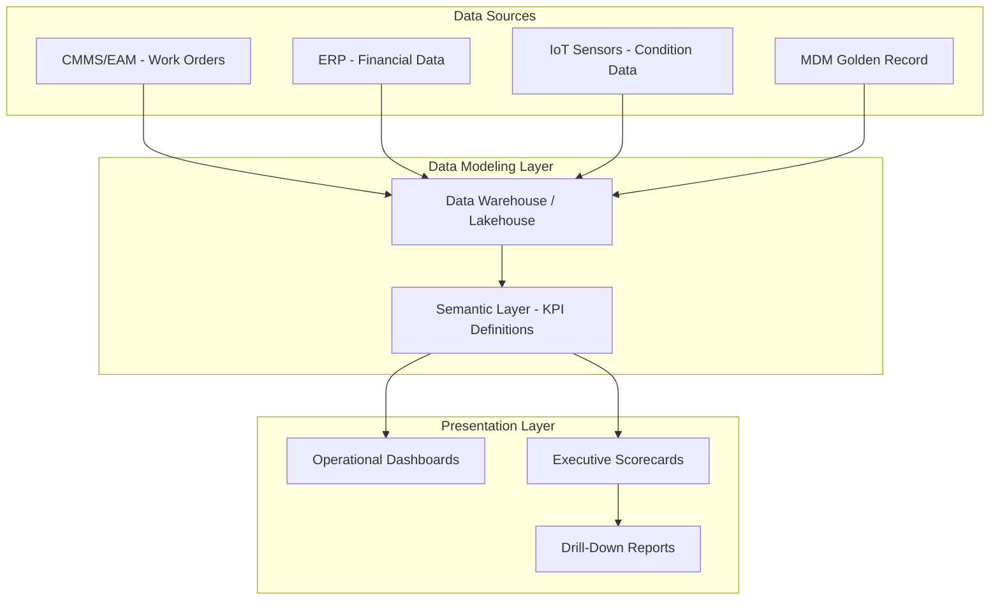
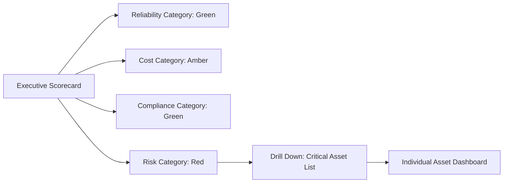

## Building Asset Management Dashboards and Scorecards


### Overview

Dashboards and scorecards are the primary visualization mechanisms through which asset management data is translated into decision-ready insight. A **dashboard** typically provides a real-time or near-real-time operational view (current asset condition, open work orders, live alerts), while a **scorecard** provides a periodic, often KPI-and-target-driven view assessing performance against strategic asset management objectives over a defined reporting period. Both draw on the underlying asset data architecture and master data (golden records) established elsewhere in the data and analytics discipline.

**Key Points**

- Dashboards are generally optimized for monitoring and operational response (what needs attention right now).
- Scorecards are generally optimized for governance and strategic review (how are we performing against targets over time).
- Both require clean, reconciled, well-modeled data as a prerequisite — a dashboard built on fragmented or duplicated asset records will surface misleading figures regardless of visualization quality.

### Distinguishing Dashboards from Scorecards

| Attribute | Dashboard | Scorecard |
| --- | --- | --- |
| Primary purpose | Operational monitoring, situational awareness | Strategic performance evaluation |
| Update frequency | Real-time or near-real-time | Periodic (weekly, monthly, quarterly) |
| Primary audience | Operations/maintenance teams, asset managers | Executives, asset management steering committees |
| Typical content | Live status, alerts, current condition, open tasks | KPIs vs. targets, trends, RAG (red/amber/green) status |
| Interaction pattern | Frequent glance-and-act | Scheduled review and discussion |

**Key Points**

- The two are complementary rather than competing — a scorecard often aggregates the same underlying metrics a dashboard exposes at a more granular, real-time level.
- Some platforms blend both patterns into a single interface with drill-down (a scorecard summary view linking into dashboard-level operational detail).

### Core KPI Categories for Asset Management

**Key Points**

- **Reliability/performance KPIs** — Mean Time Between Failures (MTBF), Mean Time To Repair (MTTR), asset uptime/availability percentage, failure rate.
- **Maintenance efficiency KPIs** — planned vs. unplanned maintenance ratio, schedule compliance rate, backlog of open work orders, maintenance cost per asset.
- **Financial/lifecycle KPIs** — total cost of ownership (TCO), remaining useful life estimates, replacement asset value vs. book value, capital expenditure vs. budget.
- **Condition/risk KPIs** — asset health score/index, criticality-weighted risk score, number of assets in "poor" or "critical" condition category.
- **Compliance/safety KPIs** — inspection completion rate, overdue certifications, safety incident count associated with asset failure.
- **Utilization KPIs** — asset utilization rate, idle time percentage, throughput per asset (relevant for production/operational equipment).

### KPI Definition Framework

A well-specified KPI for asset management dashboards/scorecards typically documents:

- **Name and definition** — precise, unambiguous description of what is measured.
- **Formula/calculation logic** — the exact computation, including data sources and any exclusions.
- **Target/threshold** — the goal value and the RAG (red/amber/green) boundaries.
- **Data source and refresh cadence** — which system(s) supply the underlying data and how current it is.
- **Owner** — the accountable role for the metric's performance and data quality.

**Example**

```json
{
  "kpiId": "KPI-MTBF-001",
  "name": "Mean Time Between Failures",
  "definition": "Average operating time between successive failures for a given asset class",
  "formula": "Total Operating Hours / Number of Failures",
  "dataSource": "CMMS work order records (failure-type = 'Breakdown')",
  "refreshCadence": "Daily",
  "target": { "green": ">500 hrs", "amber": "300-500 hrs", "red": "<300 hrs" },
  "owner": "Reliability Engineering Manager"
}
```

$$\text{MTBF} = \frac{\text{Total Operating Time}}{\text{Number of Failures}}$$


$$\text{MTTR} = \frac{\text{Total Repair Time}}{\text{Number of Repairs}}$$


$$\text{Asset Availability} = \frac{\text{MTBF}}{\text{MTBF} + \text{MTTR}} \times 100\%$$

### Dashboard/Scorecard Architecture



**Key Points**

- **Data modeling/semantic layer** — a centralized layer where KPI formulas and business logic are defined once and consumed consistently across all dashboards/scorecards, preventing the common problem of the "same" metric being calculated differently in different reports.
- Building dashboards directly against raw source-system data (bypassing a modeling layer) is a common anti-pattern that leads to inconsistent metric definitions across teams and difficulty reconciling numbers between reports.
- The MDM golden record (established in asset data architecture) should generally be the source of asset identity/classification dimensions used to slice and filter dashboard metrics, ensuring consistent asset grouping across all visualizations.

### Design Principles for Effective Dashboards

**Key Points**

- **Audience-appropriate density** — operational dashboards for maintenance technicians typically prioritize immediate actionability (what's broken, what's overdue) over historical trend analysis; executive scorecards prioritize trend and target-comparison over granular operational detail.
- **Visual hierarchy** — most critical/urgent information (safety alerts, critical asset failures) positioned prominently; supporting detail available via drill-down rather than cluttering the primary view.
- **Consistent RAG thresholds** — red/amber/green status boundaries should be consistently defined and documented (as in the KPI definition framework above) rather than varying by report author's subjective judgment.
- **Appropriate chart selection** — trend-over-time data suited to line charts; categorical comparisons (e.g., asset condition by site) suited to bar charts; part-to-whole relationships suited sparingly to pie/donut charts, generally avoided for more than a handful of categories.
- **Avoiding vanity metrics** — including only metrics that drive a decision or action, rather than metrics that are easy to calculate but not actionable.

### Common Dashboard Types in Asset Management

- **Fleet/asset health overview** — aggregate condition status across an asset population, typically filterable by asset class, location, or criticality.
- **Maintenance operations dashboard** — open work orders, technician assignments, schedule adherence, parts availability.
- **Reliability dashboard** — MTBF/MTTR trends, failure mode analysis, Pareto charts of top failure causes.
- **Financial/lifecycle dashboard** — capital planning status, TCO trends, budget-to-actual maintenance spend.
- **Compliance/risk dashboard** — inspection due dates, overdue certifications, regulatory compliance status by asset.
- **Executive summary scorecard** — a condensed, high-level RAG-status view spanning reliability, cost, compliance, and risk categories for governance review.



### Balanced Scorecard Approach in Asset Management

A commonly referenced structuring pattern adapts the general balanced scorecard concept to asset management, organizing KPIs into perspective categories rather than a single undifferentiated metric list:

- **Financial perspective** — cost efficiency, TCO, budget adherence.
- **Operational/process perspective** — reliability, maintenance efficiency, schedule compliance.
- **Risk/compliance perspective** — safety incidents, regulatory compliance, inspection completion.
- **Stakeholder/service perspective** — service level attainment, asset availability for end users, customer/internal-user satisfaction where applicable.

**Key Points**

- [Inference] Organizing a scorecard into balanced perspective categories, rather than a flat list of metrics, is a widely used practice for surfacing trade-offs (e.g., cost reduction achieved at the expense of reliability) that a single-dimension view might otherwise obscure; the specific categories used vary by organization and industry.

### Data Governance Considerations for Dashboards

**Key Points**

- **Single metric definition source** — KPI formulas should be defined and maintained in one governed location (the semantic layer) and referenced by all dashboards/scorecards, rather than independently recalculated per report.
- **Access control alignment** — dashboard/scorecard visibility should respect the same role-based access controls applied to underlying asset and financial data, particularly for cost and compliance-sensitive metrics.
- **Data lineage transparency** — users should be able to trace a displayed metric back to its underlying source data and calculation logic, supporting trust and audit requirements.
- **Refresh cadence disclosure** — dashboards should clearly indicate data currency (e.g., "last updated" timestamps) to prevent users from mistaking stale data for real-time status.

### Illustrative Diagram: Executive Scorecard Layout

<svg xmlns="http://www.w3.org/2000/svg" viewBox="0 0 740 420" font-family="sans-serif">
<text x="370" y="28" text-anchor="middle" font-size="18" font-weight="bold" fill="#1a1a2e">Balanced Asset Scorecard Layout (svg_diagram)</text>
<rect x="40" y="60" width="320" height="140" rx="10" fill="#e6f9f0" stroke="#0f9960" stroke-width="2" />
<text x="200" y="85" text-anchor="middle" font-size="13" font-weight="bold" fill="#065f46">Operational/Reliability</text>
<circle cx="70" cy="110" r="8" fill="#2f9e44" />
<text x="90" y="115" font-size="11" fill="#065f46">MTBF: 620 hrs (Target: 500)</text>
<circle cx="70" cy="135" r="8" fill="#2f9e44" />
<text x="90" y="140" font-size="11" fill="#065f46">Availability: 96.2%</text>
<circle cx="70" cy="160" r="8" fill="#f08c00" />
<text x="90" y="165" font-size="11" fill="#065f46">Schedule Compliance: 82%</text>
<rect x="380" y="60" width="320" height="140" rx="10" fill="#fef3e2" stroke="#d97706" stroke-width="2" />
<text x="540" y="85" text-anchor="middle" font-size="13" font-weight="bold" fill="#92400e">Financial</text>
<circle cx="410" cy="110" r="8" fill="#f08c00" />
<text x="430" y="115" font-size="11" fill="#92400e">Maintenance Cost/Asset: +8% vs budget</text>
<circle cx="410" cy="135" r="8" fill="#2f9e44" />
<text x="430" y="140" font-size="11" fill="#92400e">TCO Trend: Declining</text>
<circle cx="410" cy="160" r="8" fill="#2f9e44" />
<text x="430" y="165" font-size="11" fill="#92400e">CapEx Utilization: 94%</text>
<rect x="40" y="220" width="320" height="140" rx="10" fill="#fde8e8" stroke="#c92a2a" stroke-width="2" />
<text x="200" y="245" text-anchor="middle" font-size="13" font-weight="bold" fill="#7f1d1d">Risk/Compliance</text>
<circle cx="70" cy="270" r="8" fill="#c92a2a" />
<text x="90" y="275" font-size="11" fill="#7f1d1d">Overdue Inspections: 14</text>
<circle cx="70" cy="295" r="8" fill="#2f9e44" />
<text x="90" y="300" font-size="11" fill="#7f1d1d">Safety Incidents: 0 (30 days)</text>
<circle cx="70" cy="320" r="8" fill="#f08c00" />
<text x="90" y="325" font-size="11" fill="#7f1d1d">Critical Assets at Risk: 3</text>
<rect x="380" y="220" width="320" height="140" rx="10" fill="#f3f0ff" stroke="#7048e8" stroke-width="2" />
<text x="540" y="245" text-anchor="middle" font-size="13" font-weight="bold" fill="#4c2889">Stakeholder/Service</text>
<circle cx="410" cy="270" r="8" fill="#2f9e44" />
<text x="430" y="275" font-size="11" fill="#4c2889">Service Level Attainment: 98%</text>
<circle cx="410" cy="295" r="8" fill="#2f9e44" />
<text x="430" y="300" font-size="11" fill="#4c2889">Asset Downtime Impact: Low</text>
</svg>

### Implementation Workflow

1. **Stakeholder requirements gathering** — identifying which decisions each dashboard/scorecard audience needs to make, and which metrics support those decisions.
2. **KPI definition and governance sign-off** — formally documenting metric definitions, formulas, targets, and ownership before build begins.
3. **Data source and semantic layer validation** — confirming underlying data quality and establishing the governed calculation layer.
4. **Wireframe/prototype design** — validating layout and visual hierarchy with target users before full build.
5. **Build and integration** — connecting the visualization tool to the semantic layer/data warehouse.
6. **User acceptance testing** — validating calculated figures against known/manually verified values.
7. **Rollout and training** — ensuring the target audience understands how to interpret and act on the dashboard/scorecard.
8. **Ongoing review cadence** — periodic reassessment of KPI relevance, target appropriateness, and dashboard usage/adoption.

### Common Implementation Pitfalls

**Key Points**

- **Metric sprawl** — including too many KPIs without prioritization, diluting focus and making it unclear which metrics genuinely drive decisions.
- **Inconsistent calculation logic across reports** — the same-named KPI computed differently in different dashboards due to bypassing a shared semantic layer, undermining trust in the data.
- **Static targets never revisited** — RAG thresholds set once at initial build and never reassessed as asset population, criticality mix, or organizational priorities change.
- **Real-time dashboards built on stale batch data** — presenting data with an implied real-time freshness that the underlying refresh cadence does not actually support, misleading operational decisions.
- **Ignoring data quality at the source** — building visually polished dashboards on top of unreconciled or duplicate asset records (bypassing MDM), producing confidently wrong figures.

### Related Topics

- Semantic Layer and Metrics Governance for BI Platforms
- Reliability Engineering Metrics: MTBF, MTTR, and Failure Mode Analysis in Depth
- Total Cost of Ownership (TCO) Modeling for Asset Portfolios
- RAG Threshold Governance and Target-Setting Methodology
- Data Warehouse vs. Lakehouse Architecture for Asset Analytics
- Role-Based Access Control for Financial and Compliance Dashboards
- Balanced Scorecard Methodology Applied to Infrastructure and Equipment Assets