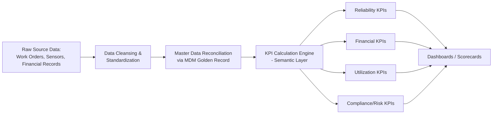

## Common Asset KPIs and How to Calculate Them


### Overview

Key Performance Indicators (KPIs) translate raw asset data — work orders, sensor readings, financial records — into standardized, comparable measures of reliability, cost, utilization, and risk. This reference catalogs the most widely used asset management KPIs, their calculation formulas, required data inputs, and interpretation guidance. These metrics form the calculation logic that underlies the dashboards and scorecards covered elsewhere in this chapter, and depend on clean, reconciled data from the master data architecture.

**Key Points**

- KPIs should always be paired with a precise formula, defined data source, and calculation period — an undefined KPI name (e.g., "uptime") is not a usable metric until its exact computation is specified.
- Most asset KPIs fall into five categories: reliability/performance, maintenance efficiency, financial/lifecycle cost, utilization, and compliance/risk.
- [Inference] Industry benchmark values for these KPIs (e.g., "good" MTBF) vary substantially by asset class, industry, and operating context, so target thresholds should generally be set against an organization's own historical baseline and criticality tiering rather than a universal external benchmark.

### Reliability and Performance KPIs

**Mean Time Between Failures (MTBF)**

Average operating time between successive unplanned failures for a given asset or asset class.

$$\text{MTBF} = \frac{\text{Total Operating Time}}{\text{Number of Failures}}$$

**Mean Time To Repair (MTTR)**

Average time required to repair an asset and restore it to operational status after a failure.

$$\text{MTTR} = \frac{\text{Total Repair Time}}{\text{Number of Repairs}}$$

**Mean Time To Failure (MTTF)**

Average operating time to failure for non-repairable assets (i.e., assets replaced rather than repaired upon failure).

$$\text{MTTF} = \frac{\text{Total Operating Time (Non-Repairable Assets)}}{\text{Number of Units Failed}}$$

**Asset Availability**

The proportion of scheduled operating time an asset is actually available for use.

$$\text{Availability} = \frac{\text{MTBF}}{\text{MTBF} + \text{MTTR}} \times 100\%$$

**Overall Equipment Effectiveness (OEE)**

A composite metric combining availability, performance, and quality, commonly used in manufacturing/production asset contexts.

$$\text{OEE} = \text{Availability} \times \text{Performance} \times \text{Quality}$$

**Key Points**

- MTBF and MTTR are typically calculated per asset class or criticality tier rather than as a single organization-wide average, since averaging across dissimilar asset types produces a number with limited decision value.
- [Inference] MTBF calculations are sensitive to how "failure" is defined and logged in the source CMMS — inconsistent failure-code tagging by technicians is a common source of MTBF/MTTR data quality issues, so calculation accuracy depends heavily on maintenance data entry discipline.
- OEE's three components (Availability × Performance × Quality) allow diagnosing *why* effectiveness is low — a low OEE driven by poor availability points to different corrective action than one driven by quality defects.

### Maintenance Efficiency KPIs

**Planned Maintenance Percentage (PMP)**

The proportion of total maintenance work that is planned/preventive rather than reactive/unplanned.

$$\text{PMP} = \frac{\text{Planned Maintenance Hours}}{\text{Total Maintenance Hours}} \times 100\%$$

**Schedule Compliance Rate**

The proportion of scheduled preventive maintenance tasks completed within their designated time window.

$$\text{Schedule Compliance} = \frac{\text{PM Tasks Completed On Schedule}}{\text{Total PM Tasks Scheduled}} \times 100\%$$

**Maintenance Backlog**

The volume of approved, outstanding work orders not yet completed, typically expressed in labor-hours or task count, and often normalized against available labor capacity.

$$\text{Backlog (Weeks)} = \frac{\text{Total Outstanding Work Order Hours}}{\text{Weekly Available Labor Hours}}$$

**Work Order Completion Rate**

$$\text{Completion Rate} = \frac{\text{Work Orders Completed}}{\text{Work Orders Created}} \times 100\%$$

**Key Points**

- A rising Planned Maintenance Percentage is generally interpreted as a positive reliability trend, since it indicates a shift from reactive (post-failure) to proactive maintenance strategy.
- Backlog measured in weeks-of-labor (rather than raw task count) is generally more actionable, since it directly indicates whether current staffing capacity is sufficient to address outstanding work within a reasonable timeframe.

### Financial and Lifecycle Cost KPIs

**Total Cost of Ownership (TCO)**

The sum of all costs associated with an asset across its full lifecycle, including acquisition, operation, maintenance, and disposal.

$$\text{TCO} = \text{Acquisition Cost} + \sum \text{Operating Costs} + \sum \text{Maintenance Costs} + \text{Disposal Cost} - \text{Salvage Value}$$

**Maintenance Cost as a Percentage of Replacement Asset Value (RAV)**

Maintenance spend normalized against the asset's current replacement value, a widely used cross-industry comparability metric.

$$\text{Maintenance Cost \% of RAV} = \frac{\text{Annual Maintenance Cost}}{\text{Replacement Asset Value}} \times 100\%$$

**Cost per Unit of Output**

Maintenance or operating cost normalized against production output, relevant for revenue-generating equipment.

$$\text{Cost per Unit} = \frac{\text{Total Operating + Maintenance Cost}}{\text{Units Produced}}$$

**Return on Assets (ROA)**

A financial performance metric indicating how efficiently asset investments generate earnings.

$$\text{ROA} = \frac{\text{Net Income}}{\text{Total Assets}} \times 100\%$$

**Key Points**

- Maintenance Cost as a Percentage of RAV is commonly used as a cross-facility or cross-industry benchmarking metric precisely because it normalizes for asset scale/value, unlike raw maintenance spend figures.
- TCO calculation requires reliable data across the full asset lifecycle (acquisition through disposal); gaps in historical cost data — particularly older or migrated assets — are a common practical obstacle to accurate TCO reporting.

### Utilization KPIs

**Asset Utilization Rate**

The proportion of available time an asset is actively used, relative to total available operating time.

$$\text{Utilization Rate} = \frac{\text{Actual Operating Time}}{\text{Total Available Time}} \times 100\%$$

**Capacity Utilization**

The proportion of an asset's maximum production/throughput capacity actually used.

$$\text{Capacity Utilization} = \frac{\text{Actual Output}}{\text{Maximum Possible Output}} \times 100\%$$

**Idle Time Percentage**

$$\text{Idle Time \%} = \frac{\text{Idle Hours}}{\text{Total Available Hours}} \times 100\%$$

**Key Points**

- Utilization Rate and Availability are related but distinct: Availability measures whether the asset *could* operate (not in failure/downtime state); Utilization measures whether it *was actually used* during that available time — an asset can have high availability but low utilization if it sits idle despite being operational.
- Low utilization combined with high maintenance cost is a common signal used to flag candidate assets for disposal, consolidation, or capacity right-sizing decisions.

### Compliance and Risk KPIs

**Inspection/Certification Compliance Rate**

$$\text{Compliance Rate} = \frac{\text{Inspections Completed On Time}}{\text{Inspections Due}} \times 100\%$$

**Asset Criticality-Weighted Risk Score**

A composite score combining probability of failure and consequence of failure, often used to prioritize maintenance and capital investment attention.

$$\text{Risk Score} = \text{Probability of Failure} \times \text{Consequence of Failure}$$

**Overdue Work Order Percentage**

$$\text{Overdue WO \%} = \frac{\text{Work Orders Past Due Date}}{\text{Total Open Work Orders}} \times 100\%$$

**Key Points**

- Criticality-weighted risk scoring is commonly used to prioritize a limited maintenance/capital budget toward assets whose failure would have the highest consequence, rather than treating all assets as equally deserving of attention.
- [Inference] The specific scales and weighting used for "Probability of Failure" and "Consequence of Failure" vary considerably by organization and industry standard (e.g., a 1–5 qualitative scale vs. a quantitative failure-rate-based scale); consistency in scale definition across the asset portfolio matters more than the specific scale chosen for the risk score to remain comparable.

### KPI Calculation Data Requirements Summary

| KPI | Primary Data Inputs | Typical Source System |
| --- | --- | --- |
| MTBF / MTTR | Operating hours, failure timestamps, repair duration | CMMS/EAM |
| Availability / OEE | Downtime logs, production output, quality reject counts | CMMS, MES/production systems |
| PMP / Schedule Compliance | Work order type flags, scheduled vs. actual completion dates | CMMS/EAM |
| Maintenance Backlog | Open work order hours, labor capacity | CMMS/EAM, workforce management |
| TCO / Maintenance % of RAV | Acquisition cost, maintenance spend, replacement value | ERP, CMMS |
| Utilization Rate | Operating hours, scheduled hours | CMMS, IoT/telemetry |
| Compliance Rate | Inspection due dates, completion records | CMMS/EAM, compliance systems |
| Risk Score | Failure probability data, consequence classification | CMMS, risk register |

### KPI Calculation Data Flow



**Key Points**

- KPI calculation accuracy is only as reliable as the underlying data cleansing and master data reconciliation steps preceding it — a KPI calculated on unreconciled duplicate asset records will misstate the true metric value.
- Centralizing KPI formula logic in a single calculation/semantic layer (rather than recalculating independently within each report) ensures consistency across all consuming dashboards and scorecards.

### Example: Applied KPI Calculation

**Example**

Given the following data for a pump asset class over a 90-day period:

- Total operating time: 2,000 hours
- Number of failures: 4
- Total repair time: 40 hours
- Planned maintenance hours: 60
- Total maintenance hours: 100



```
MTBF = 2,000 / 4 = 500 hours
MTTR = 40 / 4 = 10 hours
Availability = 500 / (500 + 10) × 100% = 98.04%
Planned Maintenance Percentage = 60 / 100 × 100% = 60%
```

**Interpretation** — a pump class with 500-hour MTBF, 98% availability, and 60% planned maintenance suggests reasonably reliable performance with room to improve the proactive/reactive maintenance mix; whether these figures represent "good" performance depends on comparison against the organization's own historical baseline and the criticality tier of this asset class.

### Common Pitfalls in KPI Calculation and Use

**Key Points**

- **Inconsistent failure/downtime definitions** — different sites or teams classifying "failure" or "downtime" differently, producing MTBF/MTTR figures that are not genuinely comparable across the organization.
- **Averaging across dissimilar asset classes** — blending high-criticality and low-criticality, or old and new, assets into a single average metric, obscuring meaningful variation.
- **Ignoring denominator data quality** — utilization and availability calculations depend on accurate "total available time" figures; errors in scheduled-hours data directly distort the resulting percentage.
- **Static benchmarks never revisited** — using a KPI target set years earlier without reassessing whether it still reflects current asset condition, criticality mix, or organizational priorities.
- **Reporting KPIs without underlying data lineage** — presenting a calculated figure without traceability to its source data and formula, undermining trust and making error diagnosis difficult when a number looks anomalous.

### Related Topics

- Reliability-Centered Maintenance (RCM) and Its Relationship to MTBF/MTTR Targets
- Failure Mode and Effects Analysis (FMEA) for Criticality-Weighted Risk Scoring
- Replacement Asset Value (RAV) Estimation Methodologies
- Benchmarking Asset KPIs Against Industry Standards vs. Internal Baselines
- Designing a Semantic Layer for Consistent KPI Calculation Across Reports
- Data Quality Requirements for Reliable MTBF/MTTR Reporting
- Overall Equipment Effectiveness (OEE) Deep Dive for Manufacturing Assets