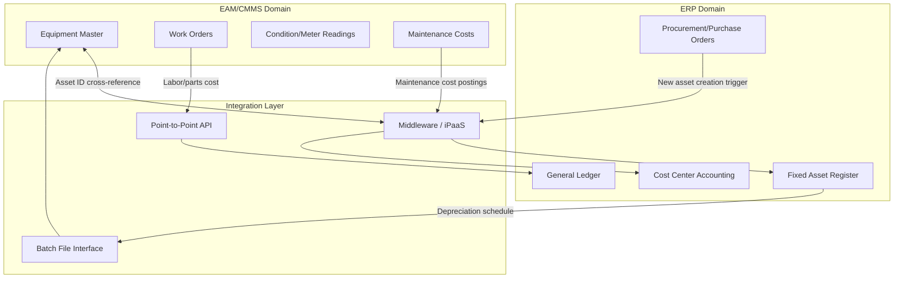
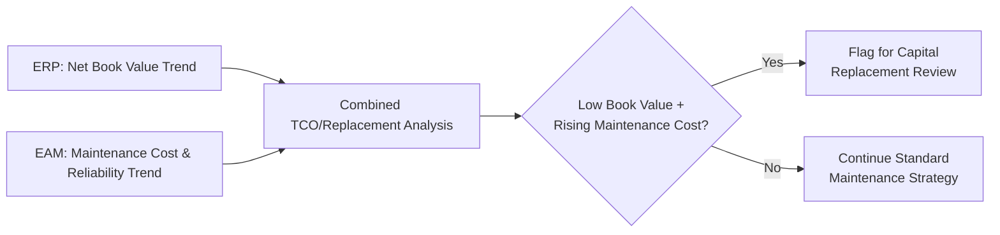

## Integrating Data across EAM, ERP, and Financial Systems

### Overview

Enterprise Asset Management (EAM) systems govern the operational lifecycle of physical assets — maintenance, condition, work orders — while Enterprise Resource Planning (ERP) systems, particularly their Financial/Fixed Asset modules, govern the financial lifecycle of the same assets — acquisition cost, depreciation, capitalization, disposal accounting. These two domains describe the same underlying assets from fundamentally different perspectives, and integrating them is essential for accurate total-cost-of-ownership reporting, capital planning, and regulatory financial compliance. This integration builds directly on the master data architecture and feeds the KPI/dashboard layers covered elsewhere in this chapter.

**Key Points**

- EAM answers "what condition is this asset in and what maintenance does it need" — its data is operational, event-driven, and often high-frequency.
- ERP Financial/Fixed Asset modules answer "what is this asset worth on the books and how is it depreciating" — its data is accounting-driven, period-based, and governed by financial reporting standards.
- Without integration, organizations commonly cannot reliably answer questions spanning both domains, such as "what is the true total cost of ownership per asset" or "which assets are fully depreciated but still operationally critical."

### Why EAM and ERP Diverge Structurally

| Dimension | EAM | ERP (Financial/Fixed Asset) |
| --- | --- | --- |
| Asset granularity | Often tracks individual components/sub-assets for maintenance purposes | Often tracks at a capitalized asset level for accounting purposes |
| Identifier | Asset tag, equipment ID, functional location | Fixed asset number, GL account, cost center |
| Update frequency | Continuous (work orders, condition readings) | Periodic (monthly/quarterly depreciation runs, period close) |
| Governing logic | Reliability/maintenance strategy | Accounting standards (depreciation method, capitalization thresholds) |
| Primary users | Maintenance/reliability engineers | Finance, accounting, controllers |

**Key Points**

- A single physical asset (e.g., a production line) may be represented in EAM as multiple maintainable components (motor, gearbox, control panel) but capitalized in ERP as one or a small number of fixed asset records — a granularity mismatch that must be explicitly mapped for integration to work.
- [Inference] This granularity mismatch is one of the most common technical obstacles in EAM-ERP integration projects, since a one-to-one record mapping assumption frequently breaks down and requires a many-to-one or hierarchical mapping model instead.

### Integration Architecture Patterns



**Key Points**

- **Point-to-point API integration** — direct, typically real-time or near-real-time synchronization between specific EAM and ERP endpoints for time-sensitive data (e.g., new asset creation triggering an EAM equipment record).
- **Middleware/integration platform (iPaaS)** — a centralized integration layer mediating multiple data flows between EAM, ERP, and other systems, reducing point-to-point complexity as the number of connected systems grows.
- **Batch file interfaces** — scheduled file-based exchanges (e.g., nightly depreciation schedule export from ERP into EAM, or maintenance cost summary export from EAM into ERP) suited to less time-sensitive, periodic data.
- Larger, multi-system landscapes generally favor middleware/iPaaS architecture over point-to-point integration to avoid the maintenance burden of an unmanageable web of direct connections as additional systems are added.

### Core Data Flows Between EAM and ERP

**EAM → ERP**

- Maintenance cost postings (labor, parts, contractor costs) flowing into cost centers/GL accounts for financial reporting.
- Asset condition/criticality data informing capital planning and replacement budget requests.
- Work order completion triggering procurement requests for parts (linking to ERP purchasing/inventory modules).

**ERP → EAM**

- New asset acquisition (capitalization) triggering creation of a corresponding EAM equipment record.
- Depreciation schedules and current book value informing lifecycle/replacement decision-making within EAM.
- Cost center and organizational hierarchy data providing consistent financial dimension tagging for EAM cost reporting.
- Vendor/supplier master data for consistent parts and service provider records across systems.

**Key Points**

- The asset acquisition trigger (ERP → EAM) is a commonly cited integration checkpoint: when a new fixed asset is capitalized in ERP, a corresponding maintainable equipment record should be automatically provisioned in EAM to avoid a gap where a financially recognized asset has no operational maintenance record, or vice versa.
- Maintenance cost postings (EAM → ERP) require consistent cost center and GL account mapping to ensure costs are attributed correctly for financial reporting and departmental budget accountability.

### Master Data Cross-Referencing

As with the broader MDM discipline, EAM-ERP integration depends on a reliable cross-reference between each system's independent asset identifier:

**Example**

```json
{
  "masterAssetId": "MDM-ASSET-0004821",
  "eamRecord": {
    "system": "EAM",
    "equipmentId": "EQ-77213",
    "functionalLocation": "PLANT-A/LINE-3/PUMP-02",
    "maintenanceStrategy": "Predictive"
  },
  "erpRecord": {
    "system": "ERP",
    "fixedAssetNumber": "FA-119904",
    "glAccount": "1520-Machinery",
    "costCenter": "CC-4400-Production",
    "acquisitionCost": 142500.00,
    "depreciationMethod": "Straight-Line",
    "usefulLifeYears": 15,
    "netBookValue": 89250.00
  },
  "granularityMapping": "1:1"
}
```

**Key Points**

- Where granularity mismatches exist (one ERP fixed asset corresponding to multiple EAM equipment records), the cross-reference structure must support one-to-many mapping rather than assuming a strict one-to-one relationship.
- This cross-reference is typically maintained within or alongside the organization's MDM golden record layer, extending the asset domain's mastered attributes to include both EAM and ERP identifiers.

### Depreciation and Total Cost of Ownership Integration

**Key Points**

- Combining ERP depreciation/net book value data with EAM maintenance cost history enables true Total Cost of Ownership (TCO) calculation, which neither system can produce accurately in isolation.
- A common analytical use case is identifying assets that are fully or near-fully depreciated on the books (low remaining book value) but still incurring significant maintenance cost or exhibiting declining reliability in EAM — often used to flag replacement/capital planning candidates.
- [Inference] Accounting depreciation schedules (based on useful life assumptions set at acquisition) frequently diverge from an asset's actual physical/operational remaining useful life as reflected in EAM condition data; reconciling this divergence is a common driver for integrating the two data sets into unified capital planning analysis, though the specific analytical approach varies by organization.



### Procurement and Inventory Integration

- **Parts/materials linkage** — EAM work orders consuming spare parts should decrement inventory and trigger procurement workflows managed in ERP, avoiding disconnected parts-tracking between the two systems.
- **Vendor/contractor data consistency** — service providers and suppliers used in EAM work order records should reference the same vendor master maintained in ERP, avoiding duplicate or inconsistent vendor records.
- **Purchase order to work order linkage** — capital project or major repair work orders in EAM often need to reference associated ERP purchase orders for budget tracking and approval workflow consistency.

### Governance and Data Ownership in Cross-System Integration

**Key Points**

- **System of record clarity** — explicit designation of which system is authoritative for each shared attribute (e.g., ERP as SOR for financial value and depreciation; EAM as SOR for maintenance status and condition) prevents conflicting updates.
- **Change management coordination** — organizational processes ensuring that asset creation, transfer, and disposal events are coordinated across both EAM and ERP teams, since these events typically require corresponding updates in both systems.
- **Reconciliation cadence** — periodic (e.g., monthly) reconciliation processes comparing EAM and ERP asset populations to identify and resolve discrepancies (assets present in one system but missing in the other, mismatched cost center assignments).

### Common Implementation Pitfalls

**Key Points**

- **Granularity mismatch left unmapped** — assuming a one-to-one asset relationship between EAM and ERP without explicit mapping logic, leading to reconciliation failures and inaccurate cost roll-ups.
- **Asynchronous asset lifecycle events** — new assets created in ERP without a corresponding EAM record (or vice versa), leaving gaps in either financial or maintenance tracking.
- **Inconsistent cost center/GL mapping** — maintenance costs posted to incorrect or inconsistent financial dimensions, undermining departmental budget accountability and cost reporting accuracy.
- **Batch-only integration for time-sensitive data** — relying solely on infrequent batch synchronization for data that requires more immediate consistency (e.g., asset disposal status), creating windows where systems show conflicting asset status.
- **No formal reconciliation process** — treating initial integration as a one-time project without establishing ongoing reconciliation, allowing drift to accumulate between the two systems' asset populations over time.

### Related Topics

- Fixed Asset Accounting and Depreciation Methods (Straight-Line, Declining Balance)
- Master Data Management Cross-Reference Design for Multi-System Asset Records
- iPaaS and Middleware Platform Selection for Enterprise Integration
- Procurement-to-Maintenance Workflow Integration (P2P and Work Order Linkage)
- Capital Planning Using Combined Book Value and Reliability Data
- Cost Center and GL Account Mapping Standards for Maintenance Cost Allocation
- Reconciliation Process Design for Cross-System Asset Population Auditing