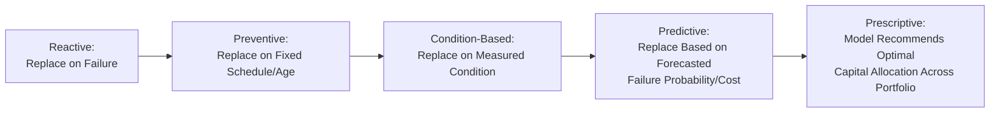
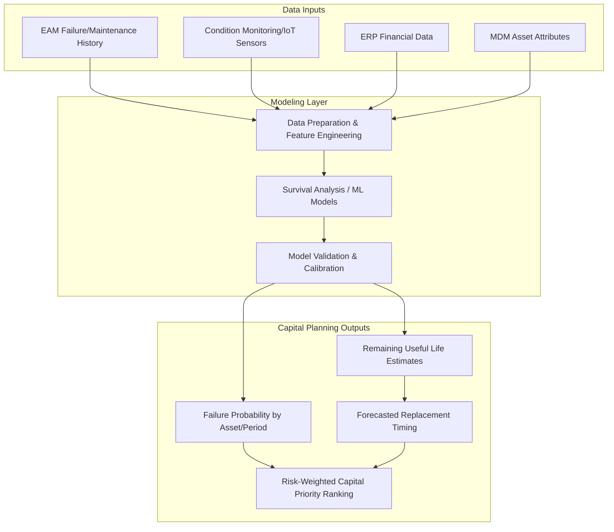

## Predictive Analytics for Capital Planning


### Overview

Predictive analytics for capital planning applies statistical modeling and machine learning techniques to historical and real-time asset data to forecast future asset performance, failure likelihood, and replacement needs — enabling capital budget decisions to be informed by data-driven projections rather than solely by fixed replacement schedules or reactive triggers. This discipline sits at the intersection of the reliability KPIs, EAM-ERP integrated data, and MDM golden records established elsewhere in this chapter, using them as modeling inputs to produce forward-looking capital investment guidance.

**Key Points**

- Traditional capital planning has often relied on fixed asset age or scheduled useful-life expiration as the primary replacement trigger; predictive analytics instead models actual condition, failure probability, and cost trajectory to inform timing.
- The objective is not to eliminate capital risk but to prioritize a constrained capital budget toward the assets where replacement or major investment delivers the greatest risk reduction or cost avoidance.
- Predictive capital planning depends heavily on data quality and history depth — models built on sparse, inconsistent, or short-duration historical data will produce correspondingly unreliable forecasts.

### From Reactive to Predictive Capital Planning: A Maturity Spectrum



**Key Points**

- **Reactive** — capital replacement decided only after failure; highest operational risk, lowest planning sophistication.
- **Preventive (age/schedule-based)** — replacement scheduled at a fixed interval or useful-life expiration, regardless of actual condition; simple to administer but can result in premature replacement of still-serviceable assets or late replacement of degrading ones.
- **Condition-based** — replacement triggered by measured condition indicators (vibration, thermal, inspection scores) crossing a defined threshold.
- **Predictive** — statistical/ML models forecast future failure probability or performance degradation trajectory, informing *when* replacement will likely become necessary before the threshold is reached.
- **Prescriptive** — the most advanced stage, where models not only predict but recommend an optimized capital allocation sequence across the full asset portfolio given budget constraints.
- [Inference] Most organizations progress through this spectrum incrementally rather than jumping directly to predictive/prescriptive capability, since each stage typically depends on data and process maturity established at the prior stage.

### Data Inputs for Predictive Capital Planning Models

**Key Points**

- **Historical failure and maintenance data** — from EAM/CMMS work order history, providing failure timestamps, failure modes, and repair costs used as model training data.
- **Condition monitoring data** — vibration, thermal imaging, oil analysis, or other sensor/inspection readings providing leading indicators of degradation.
- **Financial data** — acquisition cost, accumulated depreciation, and maintenance cost history from ERP, used to model cost trajectory and remaining economic value.
- **Utilization/operating data** — operating hours, load profiles, and environmental conditions affecting wear rate.
- **Asset attributes** — manufacturer, model, install date, and classification data from the MDM golden record, used to group similar assets for comparative modeling.
- **External factors** — where relevant, factors such as regulatory change dates, technology obsolescence timelines, or supply chain part-availability risk.

### Common Modeling Approaches

- **Survival analysis (time-to-failure modeling)** — statistical techniques (e.g., Weibull analysis, Kaplan-Meier estimation) modeling the probability distribution of an asset's remaining useful life given its age and observed failure history within its asset class.
- **Regression-based remaining useful life (RUL) estimation** — models predicting remaining useful life as a function of condition monitoring variables and operating history.
- **Classification models for failure risk** — machine learning classifiers (e.g., logistic regression, random forest, gradient boosting) predicting the probability of failure within a defined future window, based on current condition and historical patterns.
- **Time-series forecasting** — projecting future maintenance cost or performance degradation trends based on historical trajectories.
- **Anomaly detection** — identifying deviations from normal operating patterns in sensor/condition data as early indicators of developing failure modes, often feeding into shorter-term maintenance triggers that complement longer-term capital planning models.

**Example**



```
Weibull Survival Function (simplified conceptual form):
R(t) = probability asset survives beyond time t

R(t) = exp(-(t/η)^β)

Where:
  η (eta)  = scale parameter (characteristic life)
  β (beta) = shape parameter (failure pattern: increasing/
             decreasing/constant hazard rate)
  t        = time (age or operating hours)
```

$$R(t) = \exp\left(-\left(\frac{t}{\eta}\right)^{\beta}\right)$$

**Key Points**

- Survival analysis is widely used in reliability engineering specifically because it accounts for **censored data** — assets that have not yet failed at the time of analysis still contribute valid information about the survival distribution, unlike simple failure-rate averaging which would ignore or misuse this information.
- [Inference] The choice of modeling approach depends significantly on available data volume and quality: survival analysis and simpler statistical methods are often more practical and interpretable for organizations with limited historical failure data per asset class, while machine learning classification/regression approaches generally require larger, richer historical datasets to train reliably.

### Predictive Capital Planning Architecture



**Key Points**

- **Feature engineering** — deriving model-ready variables from raw data (e.g., converting a stream of vibration readings into a rolling trend statistic, or converting maintenance history into failure counts per operating-hour bucket) is typically the most labor-intensive stage of the modeling pipeline.
- **Model validation/calibration** — backtesting model predictions against known historical outcomes to assess accuracy before the model is trusted for forward-looking capital decisions.
- Outputs are typically expressed probabilistically (e.g., "70% probability of failure within 18 months") rather than as a single deterministic replacement date, reflecting genuine uncertainty in the underlying forecast.

### Risk-Weighted Capital Prioritization

Predictive outputs are commonly combined with consequence-of-failure data (criticality) to produce a prioritized capital investment list, since probability of failure alone does not indicate which failures matter most:

$$\text{Capital Priority Score} = P(\text{Failure}) \times \text{Consequence of Failure} \times \text{Cost Avoidance Potential}$$

**Key Points**

- A high-probability failure on a low-criticality, easily-replaceable asset may rank lower in capital priority than a moderate-probability failure on a mission-critical, high-replacement-cost, long-lead-time asset.
- This scoring approach directly extends the criticality-weighted risk scoring concept used in general asset KPI reporting, applying it specifically to forward-looking capital allocation rather than current-state risk assessment.
- Capital planning outputs are typically presented as a ranked candidate list with supporting rationale (predicted failure window, financial exposure, consequence rating) rather than a single "replace/don't replace" binary recommendation, supporting human decision-makers in final budget approval.

### Illustrative Diagram: Risk-Weighted Prioritization Matrix

<svg xmlns="http://www.w3.org/2000/svg" viewBox="0 0 700 460" font-family="sans-serif">
<text x="350" y="28" text-anchor="middle" font-size="18" font-weight="bold" fill="#1a1a2e">Capital Priority Matrix (svg_diagram)</text>
<line x1="80" y1="400" x2="80" y2="60" stroke="#333" stroke-width="2" />
<line x1="80" y1="400" x2="640" y2="400" stroke="#333" stroke-width="2" />
<text x="40" y="230" text-anchor="middle" font-size="12" fill="#333" transform="rotate(-90 40 230)">Consequence of Failure →</text>
<text x="360" y="430" text-anchor="middle" font-size="12" fill="#333">Predicted Failure Probability →</text>
<rect x="360" y="60" width="280" height="170" fill="#fde8e8" opacity="0.6" />
<text x="500" y="90" text-anchor="middle" font-size="12" font-weight="bold" fill="#7f1d1d">High Priority</text>
<text x="500" y="108" text-anchor="middle" font-size="10" fill="#7f1d1d">Immediate capital review</text>
<rect x="80" y="60" width="280" height="170" fill="#fef3e2" opacity="0.6" />
<text x="220" y="90" text-anchor="middle" font-size="12" font-weight="bold" fill="#92400e">Monitor Closely</text>
<text x="220" y="108" text-anchor="middle" font-size="10" fill="#92400e">High consequence, lower probability</text>
<rect x="360" y="230" width="280" height="170" fill="#fef3e2" opacity="0.6" />
<text x="500" y="260" text-anchor="middle" font-size="12" font-weight="bold" fill="#92400e">Scheduled Replacement</text>
<text x="500" y="278" text-anchor="middle" font-size="10" fill="#92400e">High probability, lower consequence</text>
<rect x="80" y="230" width="280" height="170" fill="#e6f9f0" opacity="0.6" />
<text x="220" y="260" text-anchor="middle" font-size="12" font-weight="bold" fill="#065f46">Low Priority</text>
<text x="220" y="278" text-anchor="middle" font-size="10" fill="#065f46">Continue standard maintenance</text>
<circle cx="560" cy="120" r="10" fill="#c92a2a" />
<text x="580" y="124" font-size="10" fill="#333">Turbine A-3</text>
<circle cx="480" cy="150" r="8" fill="#c92a2a" />
<text x="500" y="154" font-size="10" fill="#333">Transformer B-1</text>
<circle cx="200" cy="130" r="7" fill="#d97706" />
<text x="220" y="134" font-size="10" fill="#333">Backup Gen C-2</text>
<circle cx="240" cy="320" r="7" fill="#2f9e44" />
<text x="260" y="324" font-size="10" fill="#333">Pump D-7</text>
</svg>

### Model Governance and Validation

**Key Points**

- **Backtesting** — validating model predictions against actual historical outcomes on a holdout data set to assess predictive accuracy before deployment.
- **Ongoing recalibration** — models should be periodically retrained/recalibrated as new failure and condition data accumulates, since asset population characteristics and operating conditions evolve over time.
- **Uncertainty communication** — capital planning outputs should convey confidence intervals or probability ranges rather than presenting forecasts as certainties, supporting appropriately calibrated decision-making by capital committees.
- **Explainability for stakeholder trust** — particularly for higher-stakes capital decisions, model outputs are generally more actionable when accompanied by an interpretable explanation of contributing factors (e.g., "elevated vibration trend + age beyond 80% of class-average MTBF"), rather than an opaque score alone.
- [Inference] Simpler, more interpretable models (e.g., survival analysis, rule-based scoring) are sometimes preferred over more complex machine learning approaches specifically for capital planning use cases, since capital committees and finance stakeholders often require clear justification for large expenditure decisions that a "black box" model output may not adequately provide; this trade-off between model complexity and explainability varies by organizational risk tolerance and governance requirements.

### Integration with the Capital Planning Process

1. **Model output generation** — predictive analytics platform produces ranked, risk-weighted candidate list of assets for capital consideration.
2. **Engineering/reliability review** — subject matter experts review model outputs against field knowledge, adjusting or annotating recommendations where model blind spots are identified.
3. **Financial feasibility assessment** — finance/ERP data (replacement cost estimates, available capital budget) is layered onto the risk-weighted list to assess affordability and ROI.
4. **Capital committee prioritization** — final budget allocation decisions made by capital planning governance, informed by but not mechanically dictated by model output.
5. **Post-decision tracking** — outcomes of capital decisions (whether predicted failures materialized as forecast) fed back into model validation for continuous improvement.

### Common Implementation Pitfalls

**Key Points**

- **Insufficient historical data depth** — attempting predictive modeling on asset classes with too few historical failure events to produce statistically meaningful patterns, resulting in unreliable forecasts.
- **Treating model output as final decision rather than decision support** — removing human engineering and financial judgment from the process, particularly risky for high-consequence or unusual assets that may fall outside typical model training patterns.
- **Ignoring data quality dependencies** — building predictive models on top of fragmented or unreconciled EAM/ERP data (bypassing the master data and integration work covered elsewhere in this chapter), propagating underlying data quality issues into forecast unreliability.
- **Model drift without recalibration** — deploying a model once and failing to periodically retrain it as new data, changed operating conditions, or asset population shifts occur, causing predictive accuracy to degrade over time.
- **Overreliance on a single modeling technique** — applying one modeling approach uniformly across dissimilar asset classes when different asset types may be better suited to different modeling techniques (e.g., survival analysis for slowly-degrading rotating equipment vs. anomaly detection for electronics with less predictable failure modes).

### Related Topics

- Weibull Analysis and Survival Modeling for Reliability Engineering
- Condition Monitoring and IoT Sensor Integration for RUL Estimation
- Criticality Analysis and Failure Mode and Effects Analysis (FMEA)
- Machine Learning Model Validation and Backtesting Practices
- Capital Budget Governance and Prioritization Frameworks
- Remaining Useful Life (RUL) Estimation Techniques Compared
- Explainable AI Approaches for High-Stakes Asset Investment Decisions