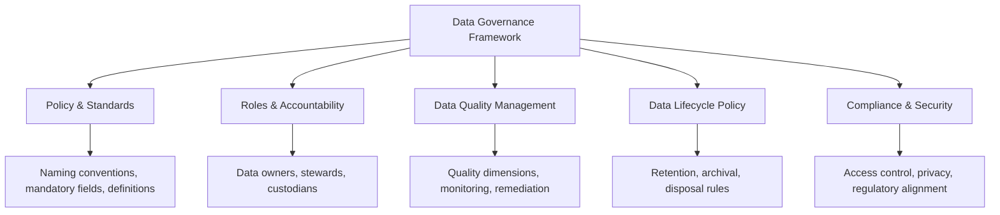
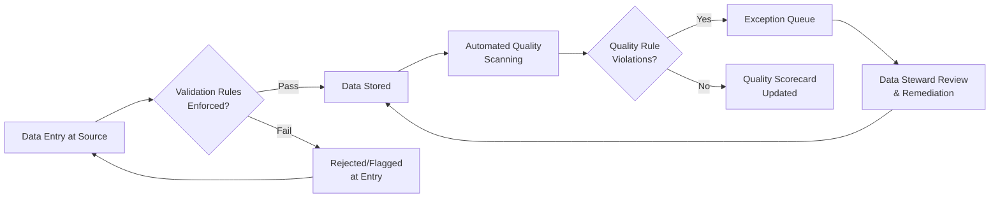

## Data Governance and Asset Data Quality Assurance


### Overview

Data governance is the organizational framework of policies, roles, standards, and processes that determine how asset data is created, validated, secured, and maintained across its lifecycle. Data quality assurance is the operational discipline within that framework focused specifically on ensuring asset data meets defined accuracy, completeness, consistency, and timeliness standards. Together they form the governing layer underneath every other data and analytics capability covered in this chapter — master data management, KPI reporting, dashboards, EAM-ERP integration, and predictive analytics all depend on the data quality foundation this discipline establishes.

**Key Points**

- Data governance defines *policy and accountability* (who decides what data standards apply, who is responsible for enforcing them).
- Data quality assurance defines *operational practice* (how data is measured, validated, and corrected against those standards).
- Poor data governance is a commonly cited root cause of failed analytics, MDM, and predictive modeling initiatives, since even sophisticated technical architecture cannot compensate for unreliable underlying data.

### Core Data Governance Components



**Key Points**

- **Policy and standards** — documented rules governing data structure, naming conventions, mandatory fields, and acceptable value ranges for asset data.
- **Roles and accountability** — the assignment of specific individuals or functions responsible for each data domain, distinct from generic "IT owns the data" defaults.
- **Data quality management** — the measurement, monitoring, and remediation processes ensuring data meets defined standards on an ongoing basis.
- **Data lifecycle policy** — rules governing how long data is retained, when it is archived, and when it is disposed of.
- **Compliance and security** — access control and regulatory alignment ensuring asset data (particularly where it intersects with financial, safety, or personal data) is appropriately protected.

### Governance Roles and Accountability Model

- **Data owner** — a business-side accountable individual (e.g., Head of Reliability Engineering, CFO) responsible for the overall quality, appropriate use, and business value of a data domain; typically not involved in day-to-day data entry but accountable for outcomes.
- **Data steward** — the operational role responsible for day-to-day data quality monitoring, issue triage, and coordination of remediation within a domain; often embedded within the business function generating the data.
- **Data custodian** — typically an IT/technical role responsible for the physical storage, security, and technical maintenance of data systems, distinct from accountability for data content accuracy.
- **Data governance council/board** — a cross-functional body (often spanning IT, operations, finance, and compliance) setting overarching policy, resolving cross-domain disputes, and prioritizing governance investment.

**Key Points**

- A common governance failure mode is leaving data ownership implicitly assigned to "whoever built the system" rather than explicitly assigning business accountability — this tends to result in no one being positioned or incentivized to resolve data quality issues when they arise.
- Data stewardship is most effective when embedded close to where data originates (e.g., a reliability engineer serving as steward for maintenance/condition data) rather than centralized entirely within a generic data management function disconnected from domain expertise.

### Data Quality Dimensions for Asset Data

**Key Points**

- **Completeness** — the proportion of required fields populated with valid, non-null values across the asset population.
- **Accuracy** — the degree to which recorded data reflects the true, real-world state of the asset, typically verified through physical audit, sensor cross-check, or reconciliation against an independent source.
- **Consistency** — agreement of the same data value across all systems that reference it (a core concern addressed by MDM, but measurable independently as a quality dimension).
- **Timeliness** — the currency of data relative to real-world change — for example, whether a location update is reflected in system records within an acceptable lag window after a physical move.
- **Validity** — conformance of data values to defined format, range, and business rule constraints (e.g., an install date that is not in the future, a criticality rating within the defined scale).
- **Uniqueness** — absence of duplicate records representing the same underlying asset.
- **Integrity/referential consistency** — the presence of valid relationships between related records (e.g., a work order correctly referencing an existing asset ID rather than an orphaned or invalid reference).

### Data Quality Measurement and Monitoring

**Example**

```json
{
  "dataQualityRule": "DQ-ASSET-COMPLETENESS-001",
  "domain": "Asset Master",
  "dimension": "Completeness",
  "rule": "installDate, criticalityRating, and location must be non-null for all Active status assets",
  "measurementFrequency": "Daily",
  "currentScore": "94.2%",
  "target": "98%",
  "exceptionCount": 187,
  "owner": "Asset Data Steward - Facilities"
}
```

**Key Points**

- Data quality rules should be defined per data domain and dimension, with explicit measurement logic, target thresholds, and assigned ownership — analogous in structure to the KPI definition framework used for asset performance metrics.
- **Automated monitoring/scorecarding** — many organizations implement ongoing automated data quality dashboards (distinct from operational asset dashboards) tracking completeness, validity, and uniqueness scores by domain, surfaced to data stewards for remediation prioritization.
- **Exception-based workflow** — rather than manually reviewing all records, quality monitoring typically flags only records failing defined rules, routing them to stewards for correction, which scales more effectively than blanket manual review.

### Data Quality Assurance Processes

- **Validation at point of entry** — enforcing mandatory fields, format constraints, and business rules at data creation time (in CMMS, ERP, or other source systems) to prevent bad data from entering the pipeline in the first place, generally more effective and lower-cost than downstream correction.
- **Periodic data audits** — scheduled reviews (which may include physical asset verification/reconciliation) comparing recorded data against ground truth to identify accuracy gaps not caught by format-level validation alone.
- **Automated quality scanning** — scheduled or continuous rule-based scanning of the data store for completeness, validity, and uniqueness violations.
- **Root cause remediation** — addressing the underlying process or system cause of recurring data quality issues (e.g., a CMMS form allowing free-text entry where a controlled dropdown should be enforced), rather than only correcting individual bad records.
- **Data cleansing/remediation projects** — periodic, often significant, one-time efforts to correct accumulated historical data quality debt, frequently required as a prerequisite for MDM or analytics initiatives.



### Data Governance Policy Areas Specific to Asset Data

**Key Points**

- **Naming conventions and taxonomy alignment** — standardized asset naming, classification codes, and location hierarchies, coordinated with the broader taxonomy governance applied in adjacent disciplines (e.g., DAM taxonomy, MDM reference data).
- **Mandatory field definitions by asset lifecycle stage** — differing minimum data requirements depending on asset status (e.g., a "Planned" asset may require fewer populated fields than an "Active" asset).
- **Change control for master data changes** — governance requiring approval or review before certain high-impact asset master data changes (e.g., criticality rating downgrades, disposal status changes) take effect.
- **Retention and archival policy** — rules determining how long historical asset data (work order history, sensor logs) is retained in active systems versus archived, balancing storage cost, analytical/predictive modeling value, and any regulatory retention obligations.
- **Access control policy** — role-based restrictions on who can view or modify specific asset data categories, particularly for financial (ERP) and safety-critical data.

### Governance Maturity Model

A commonly referenced pattern for assessing organizational data governance maturity:

1. **Ad hoc** — no formal governance; data quality is inconsistent and dependent on individual diligence; no defined ownership.
2. **Defined** — policies and standards documented, but enforcement is inconsistent; roles assigned but not consistently exercised.
3. **Managed** — data quality actively measured and monitored; defined remediation processes; stewardship roles actively functioning.
4. **Optimized** — governance is proactive and continuously improved; data quality metrics feed into broader organizational performance management; governance scales effectively as new systems and data sources are added.

**Key Points**

- [Inference] Organizations generally cannot skip directly to advanced predictive analytics or fully automated MDM capability without first achieving at least "Managed" level governance maturity, since these advanced capabilities depend on the consistent, monitored data quality that earlier maturity stages establish; attempting to build sophisticated analytics on top of "Ad hoc" or "Defined"-stage governance is a common source of initiative failure.

### Illustrative Diagram: Governance Framework Structure

<svg xmlns="http://www.w3.org/2000/svg" viewBox="0 0 740 400" font-family="sans-serif">
<text x="370" y="28" text-anchor="middle" font-size="18" font-weight="bold" fill="#1a1a2e">Asset Data Governance Structure (svg_diagram)</text>
<rect x="270" y="55" width="200" height="55" rx="8" fill="#f3f0ff" stroke="#7048e8" stroke-width="2" />
<text x="370" y="87" text-anchor="middle" font-size="13" font-weight="bold" fill="#4c2889">Governance Council</text>
<rect x="60" y="150" width="180" height="60" rx="8" fill="#e8f0fe" stroke="#3b5bdb" stroke-width="2" />
<text x="150" y="175" text-anchor="middle" font-size="12" font-weight="bold" fill="#1e3a8a">Data Owners</text>
<text x="150" y="193" text-anchor="middle" font-size="10" fill="#1e3a8a">Business accountability</text>
<rect x="280" y="150" width="180" height="60" rx="8" fill="#fef3e2" stroke="#d97706" stroke-width="2" />
<text x="370" y="175" text-anchor="middle" font-size="12" font-weight="bold" fill="#92400e">Data Stewards</text>
<text x="370" y="193" text-anchor="middle" font-size="10" fill="#92400e">Day-to-day quality ops</text>
<rect x="500" y="150" width="180" height="60" rx="8" fill="#e6f9f0" stroke="#0f9960" stroke-width="2" />
<text x="590" y="175" text-anchor="middle" font-size="12" font-weight="bold" fill="#065f46">Data Custodians</text>
<text x="590" y="193" text-anchor="middle" font-size="10" fill="#065f46">Technical/IT maintenance</text>
<rect x="130" y="260" width="480" height="100" rx="8" fill="#fde8e8" stroke="#c92a2a" stroke-width="2" />
<text x="370" y="285" text-anchor="middle" font-size="13" font-weight="bold" fill="#7f1d1d">Data Quality Monitoring &amp; Remediation</text>
<text x="150" y="310" font-size="10" fill="#7f1d1d">- Completeness/Validity Rules</text>
<text x="150" y="328" font-size="10" fill="#7f1d1d">- Exception Queues</text>
<text x="420" y="310" font-size="10" fill="#7f1d1d">- Automated Scanning</text>
<text x="420" y="328" font-size="10" fill="#7f1d1d">- Root Cause Remediation</text>
<line x1="370" y1="110" x2="150" y2="150" stroke="#333" stroke-width="1.5" />
<line x1="370" y1="110" x2="370" y2="150" stroke="#333" stroke-width="1.5" />
<line x1="370" y1="110" x2="590" y2="150" stroke="#333" stroke-width="1.5" />
<line x1="150" y1="210" x2="250" y2="260" stroke="#333" stroke-width="1.5" />
<line x1="370" y1="210" x2="370" y2="260" stroke="#333" stroke-width="1.5" />
<line x1="590" y1="210" x2="490" y2="260" stroke="#333" stroke-width="1.5" />
</svg>

### Relationship to Other Data and Analytics Disciplines in This Chapter

**Key Points**

- **Master Data Management** — data governance provides the policy and stewardship structure MDM operationalizes technically (survivorship rules, match confidence review); MDM cannot succeed without an underlying governance framework assigning accountability for conflict resolution.
- **KPI reporting and dashboards** — KPI accuracy is directly dependent on the data quality dimensions (completeness, accuracy, consistency) this discipline governs; a KPI calculated on ungoverned data inherits that data's quality problems invisibly.
- **EAM-ERP integration** — governance policy determines system-of-record assignment and reconciliation cadence for cross-system integration, providing the accountability structure for resolving discrepancies integration surfaces.
- **Predictive analytics** — model reliability is fundamentally bounded by training data quality; governance-assured historical data depth and accuracy is a prerequisite for trustworthy predictive capital planning outputs.

### Common Implementation Pitfalls

**Key Points**

- **Governance as documentation only** — producing policy documents without operational enforcement mechanisms (validation rules, monitoring, assigned stewardship), resulting in policies that exist on paper but do not affect actual data quality.
- **Ownership assigned to IT by default** — treating data governance as a purely technical IT responsibility rather than assigning genuine business accountability to domain owners who understand what "correct" data looks like.
- **No feedback loop from quality issues to root cause** — repeatedly correcting the same category of data error without addressing the source-system process or validation gap causing it.
- **Governance treated as a one-time initiative** — establishing policies and roles at project launch without sustaining ongoing monitoring, review, and adaptation as systems, data sources, and organizational needs evolve.
- **Underestimating remediation effort** — initiating advanced analytics or MDM initiatives without first budgeting adequate time and resources for historical data cleansing, frequently causing project delays when data quality gaps are discovered mid-initiative rather than addressed upfront.

### Related Topics

- Master Data Management Survivorship and Stewardship Workflows
- Data Quality Rule Design and Automated Monitoring Architecture
- Data Governance Maturity Assessment Frameworks
- Root Cause Analysis for Recurring Data Quality Issues
- Retention and Archival Policy Design for Asset Historical Data
- Role-Based Access Control Design for Cross-Domain Asset Data
- Building a Business Case for Data Governance Investment