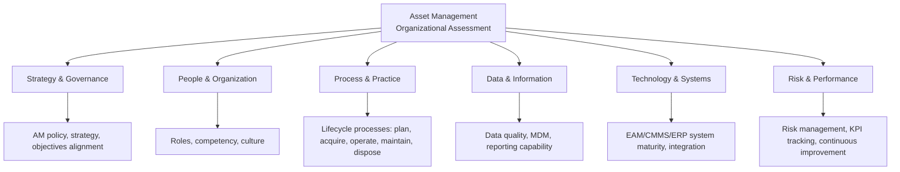
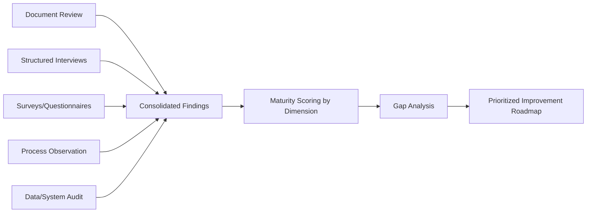

## Conducting an Organizational Asset Management Assessment


### Overview

An organizational asset management assessment is a structured diagnostic process evaluating an organization's current asset management capability — people, process, data, technology, and governance — against a defined maturity framework or standard (such as ISO 55001) to identify gaps, prioritize improvement initiatives, and establish a baseline for measuring program progress. It is typically the foundational first step in building or transforming an Asset Lifecycle Management (ALM) program, since improvement priorities cannot be meaningfully set without first understanding current-state capability and gaps.

**Key Points**

- The assessment produces two core outputs: a current-state capability baseline and a prioritized gap/improvement roadmap.
- Assessments are typically conducted at program launch, but are also periodically repeated (e.g., annually or at major program milestones) to measure progress and recalibrate priorities.
- A credible assessment requires input from multiple organizational levels and functions — assessments relying solely on leadership perception without operational-level validation tend to miss significant capability gaps.

### Assessment Scope Dimensions



**Key Points**

- **Strategy and governance** — the existence and quality of a documented asset management policy, strategic asset management plan (SAMP), and alignment between asset management objectives and broader organizational objectives.
- **People and organization** — role clarity, competency levels, organizational structure, and cultural attitudes toward asset management discipline.
- **Process and practice** — the maturity of lifecycle processes across planning, acquisition, operation, maintenance, and disposal.
- **Data and information** — data quality, system-of-record clarity, and reporting/analytics capability, drawing on the disciplines covered elsewhere in this program (MDM, governance, KPI reporting).
- **Technology and systems** — the maturity and integration level of EAM/CMMS, ERP, and related systems.
- **Risk and performance** — the presence of formal risk management practice and performance measurement/continuous improvement mechanisms.

### Common Assessment Frameworks and Reference Standards

- **ISO 55000 series (ISO 55000/55001/55002)** — the most widely referenced international framework for asset management systems; assessments are frequently structured around ISO 55001's management system requirements even when formal certification is not the goal.
- **IAM (Institute of Asset Management) Maturity Scale** — a commonly used capability maturity model assessing asset management practice across defined subjects/dimensions on a maturity scale.
- **Asset Management Excellence Model / self-assessment tools** — various industry-specific and vendor-neutral self-assessment questionnaires structured around similar dimensions to the above.
- **Organization-specific/custom frameworks** — many organizations adapt a recognized framework to their specific industry context (utilities, manufacturing, transportation infrastructure) rather than applying a generic model unmodified.

**Key Points**

- [Inference] Using a recognized external framework (such as ISO 55001-aligned assessment criteria) rather than a fully custom internal framework is generally advantageous for benchmarking purposes and external credibility (e.g., with regulators, auditors, or capital-approval bodies), though the specific framework selected should reflect the organization's industry context and improvement objectives.
- Assessment frameworks typically define maturity levels (e.g., a 1–5 scale from "Ad hoc/Unaware" to "Optimized/Excellent") applied consistently across each assessed dimension, enabling both a granular gap view and an aggregate maturity score.

### Assessment Methodology and Data Collection

**Key Points**

- **Document review** — examination of existing policies, procedures, strategic plans, and system documentation to assess formal/documented maturity.
- **Structured interviews** — conversations with leadership, asset management practitioners, and operational staff across relevant functions to assess both documented and actual (lived) practice, since formal documentation does not always reflect operational reality.
- **Surveys/self-assessment questionnaires** — broader-reach data collection tool enabling input from a larger population than interviews alone can practically cover.
- **Process observation** — direct observation of operational practices (e.g., how a work order is actually processed, how a maintenance decision is actually made) to validate stated process against actual practice.
- **Data and system audits** — technical review of underlying data quality and system capability, connecting to the data governance and quality assurance practices covered elsewhere in this program.
- **Benchmarking** — comparison against industry peers or recognized maturity models to contextualize findings.



**Key Points**

- Triangulating multiple data collection methods (rather than relying on a single method) is standard practice, since each method has blind spots — surveys can miss nuance that interviews surface, while interviews alone may not represent broader organizational sentiment.
- A documented process that is not actually followed in practice is a common and important gap finding — the assessment should distinguish "documented maturity" from "practiced maturity" rather than conflating the two.

### Assessment Team Composition

- **Assessment lead/facilitator** — coordinates the assessment process, often an internal asset management program leader or an external consultant bringing independent perspective and framework expertise.
- **Cross-functional assessors** — representatives with subject-matter expertise across the assessed dimensions (maintenance/reliability, finance, IT/data, operations, safety/compliance).
- **Executive sponsor** — senior leadership accountable for ensuring organizational participation and eventual action on assessment findings.
- **External/independent reviewer (optional)** — an outside party providing an unbiased perspective, particularly valuable for organizations conducting their first formal assessment or facing internal politically sensitive findings.

**Key Points**

- [Inference] An assessment conducted entirely by internal staff without external or independent perspective carries some risk of understated findings, particularly where organizational culture discourages candid criticism of current practice; many organizations therefore incorporate at least a partial external review component, though this is not universally required for a credible assessment.

### Maturity Scoring and Gap Analysis

**Example**

```json
{
  "assessmentDimension": "Data & Information",
  "subDimension": "Asset Data Quality",
  "currentMaturityLevel": 2,
  "maturityScale": "1 (Ad Hoc) - 5 (Optimized)",
  "targetMaturityLevel": 4,
  "evidence": [
    "No formal data stewardship roles assigned",
    "Asset master data duplicated across CMMS and ERP with no reconciliation process",
    "Completeness of criticality rating field: 61%"
  ],
  "priorityRanking": "High",
  "recommendedInitiative": "Establish MDM program and formal data governance structure"
}
```

**Key Points**

- Each assessed dimension is typically scored against a defined maturity scale with supporting evidence, rather than a single unsupported numeric rating, ensuring findings are traceable and defensible when presented to leadership.
- **Gap analysis** compares current maturity level against a defined target maturity level (which may differ by dimension based on organizational priority and risk exposure) to identify where the largest and most consequential gaps exist.
- Prioritization of identified gaps typically weighs both the size of the gap and the criticality/risk exposure associated with that dimension — a large gap in a low-risk area may warrant lower priority than a moderate gap in a high-risk area.

### Illustrative Diagram: Maturity Assessment Radar

<svg xmlns="http://www.w3.org/2000/svg" viewBox="0 0 620 560" font-family="sans-serif">
<text x="310" y="28" text-anchor="middle" font-size="18" font-weight="bold" fill="#1a1a2e">Maturity Assessment by Dimension (svg_diagram)</text>
<g transform="translate(310,300)">
<polygon points="0,-220 190,-68 118,177 -118,177 -190,-68" fill="none" stroke="#ccc" stroke-width="1" />
<polygon points="0,-176 152,-54 94,142 -94,142 -152,-54" fill="none" stroke="#ccc" stroke-width="1" />
<polygon points="0,-132 114,-41 71,106 -71,106 -114,-41" fill="none" stroke="#ccc" stroke-width="1" />
<polygon points="0,-88 76,-27 47,71 -47,71 -76,-27" fill="none" stroke="#ccc" stroke-width="1" />
<polygon points="0,-44 38,-14 24,35 -24,35 -38,-14" fill="none" stroke="#ccc" stroke-width="1" />



```
<polygon points="0,-132 133,-48 47,71 -71,106 -152,-54" fill="#3b5bdb" fill-opacity="0.35" stroke="#3b5bdb" stroke-width="2.5" />

<text x="0" y="-235" text-anchor="middle" font-size="12" fill="#1a1a2e">Strategy &amp; Governance</text>
<text x="215" y="-68" text-anchor="middle" font-size="12" fill="#1a1a2e">People &amp; Org</text>
<text x="130" y="200" text-anchor="middle" font-size="12" fill="#1a1a2e">Process &amp; Practice</text>
<text x="-130" y="200" text-anchor="middle" font-size="12" fill="#1a1a2e">Data &amp; Info</text>
<text x="-215" y="-68" text-anchor="middle" font-size="12" fill="#1a1a2e">Technology</text>
```

</g>

<text x="310" y="540" text-anchor="middle" font-size="11" fill="#555">Shaded area = current maturity; outer ring = target maturity (Level 5)</text>

</svg>

### From Assessment to Improvement Roadmap

**Key Points**

- **Quick wins** — lower-effort, lower-risk improvements identifiable directly from assessment findings that can be implemented rapidly to build early program momentum and demonstrate value.
- **Foundational initiatives** — larger-scope efforts (e.g., establishing formal data governance, implementing MDM, deploying a new CMMS) that address root-cause gaps but require more significant time and investment.
- **Sequencing dependencies** — the roadmap should reflect realistic dependencies between initiatives (e.g., data governance foundations generally need to precede advanced analytics initiatives, consistent with the maturity progression discussed in the data governance discipline).
- **Business case development** — significant recommended initiatives typically require a supporting business case (cost, expected benefit, risk of inaction) to secure funding and leadership commitment.

### Communicating Assessment Findings

**Key Points**

- Findings are typically presented to leadership with a balance of current-state maturity scoring, specific supporting evidence, benchmark/target comparison, and a prioritized, sequenced roadmap — rather than raw scores alone, which provide limited actionable direction without accompanying narrative and evidence.
- Framing findings constructively (opportunities for improvement, grounded in evidence) rather than purely critically tends to support better organizational buy-in for the resulting improvement program, without understating genuine gaps that require attention.
- Establishing a clear baseline at this stage is essential for later demonstrating program progress — without a documented starting point, it becomes difficult to credibly show improvement over time.

### Common Pitfalls in Conducting Assessments

**Key Points**

- **Leadership-only input** — relying exclusively on senior management perspective without validating against operational-level practice, often resulting in an overly optimistic maturity picture.
- **Framework misapplication** — applying an assessment framework's criteria too rigidly without adapting terminology or context to the organization's specific industry and asset types, reducing the relevance and credibility of findings to assessed stakeholders.
- **No follow-through mechanism** — conducting a thorough assessment but failing to establish a governance mechanism (steering committee, program office) to act on findings, resulting in a report that does not translate into actual improvement.
- **Overly broad, unprioritized roadmap** — presenting an exhaustive list of gaps without clear prioritization or sequencing, overwhelming the organization's capacity to act and diluting focus from the highest-value initiatives.
- **One-time assessment without repeat cadence** — treating the assessment as a single event rather than establishing a periodic reassessment cadence to track progress and recalibrate priorities as the program matures.

### Related Topics

- ISO 55001 Management System Requirements and Certification Pathways
- IAM Maturity Scale and Subject-by-Subject Capability Assessment
- Building a Strategic Asset Management Plan (SAMP)
- Business Case Development for Asset Management Program Initiatives
- Establishing an Asset Management Governance Structure and Steering Committee
- Change Management Approaches for Asset Management Program Rollout
- Designing a Periodic Reassessment Cadence to Track Maturity Progress