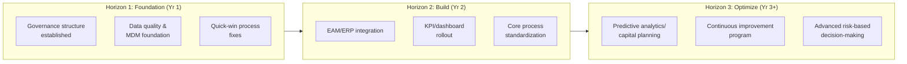
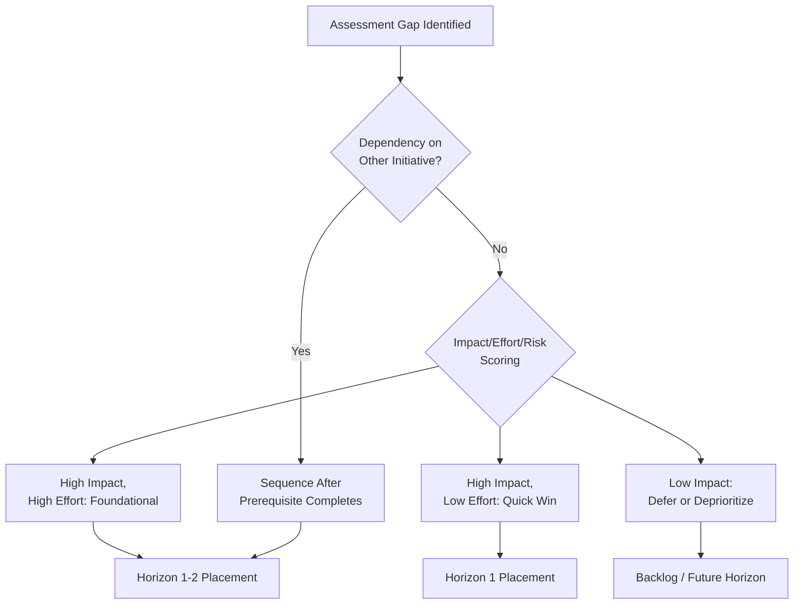

## Designing an Asset Management Implementation Roadmap


### Overview

An asset management implementation roadmap translates the gaps and priorities identified during an organizational assessment into a structured, sequenced plan of initiatives, milestones, and resource commitments spanning the transformation from current-state to target-state asset management maturity. It is the operational planning artifact that turns assessment findings into an executable program, defining not just *what* will be done but *when*, *in what order*, *by whom*, and *how success will be measured* at each stage.

**Key Points**

- The roadmap sits directly downstream of the organizational assessment — its initiatives should trace back to specific identified gaps rather than being generated independently.
- A credible roadmap balances ambition against realistic organizational capacity to absorb change, typically phased over multiple years rather than attempted as a single large-scale transformation.
- The roadmap is a living planning document, expected to be revisited and adjusted as initiatives complete, priorities shift, and reassessment cycles provide updated maturity data.

### Roadmap Design Principles

**Key Points**

- **Sequencing reflects dependency, not just priority** — some foundational initiatives (data governance, master data management) must generally precede initiatives that depend on them (predictive analytics, advanced dashboards), regardless of how urgently the dependent initiative is desired.
- **Phased delivery of value** — a well-designed roadmap delivers incremental, demonstrable value at each phase rather than requiring the full multi-year program to complete before any benefit is realized, supporting sustained organizational buy-in and funding.
- **Realistic pacing against organizational change capacity** — the number of concurrent major initiatives should reflect the organization's actual capacity to absorb process and system change, not simply the total list of identified gaps.
- **Explicit linkage to business outcomes** — each roadmap initiative should be traceable to a specific business benefit (risk reduction, cost avoidance, compliance achievement, reliability improvement) to sustain leadership support through the multi-year execution period.

### Roadmap Structure: Horizons and Phases

A commonly used structuring approach organizes roadmap initiatives into time-based horizons rather than a single flat initiative list:



**Key Points**

- **Horizon 1 (Foundation)** — establishing governance structures, data quality/master data foundations, and addressing quick-win process gaps identified in the assessment; this horizon typically prioritizes fixing the foundational issues that would otherwise undermine later, more advanced initiatives.
- **Horizon 2 (Build)** — system integration, standardized core processes, and operational reporting capability (KPIs, dashboards) built on the Horizon 1 foundation.
- **Horizon 3 (Optimize)** — advanced capabilities such as predictive analytics and capital planning sophistication, continuous improvement mechanisms, and increasingly risk-informed decision-making — generally only viable once the data and process foundations from earlier horizons are in place.
- This horizon structure directly mirrors the data/analytics maturity progression discussed elsewhere in this program (governance and data quality preceding predictive capability), applied at the whole-program level rather than solely within the data discipline.

### Roadmap Components

- **Initiative catalog** — the discrete set of projects/initiatives derived from assessment gaps, each with a defined scope, owner, and target horizon.
- **Milestones and timeline** — key delivery checkpoints for each initiative, sequenced against dependencies and organizational capacity.
- **Resource plan** — the people, budget, and technology investment required to execute each initiative, including whether execution relies on internal staff, external consultants/vendors, or a combination.
- **Success metrics per initiative** — defined measures (often linked to the KPIs and maturity scoring established in the assessment) used to confirm each initiative achieved its intended outcome.
- **Risk and dependency register** — documented risks to roadmap execution (resource constraints, competing organizational priorities, technology procurement timelines) and explicit dependencies between initiatives.
- **Governance and reporting cadence** — the mechanism (steering committee, program office) through which roadmap progress is tracked and reported to leadership.

**Example**

```json
{
  "initiativeId": "INIT-2027-003",
  "name": "Establish Asset Data Governance Program",
  "horizon": "Horizon 1 - Foundation",
  "sourceGapReference": "Assessment Finding: Data & Information - Maturity Level 2, Target Level 4",
  "owner": "Director of Asset Data Management",
  "timeline": { "start": "2027-Q1", "targetCompletion": "2027-Q3" },
  "dependencies": [],
  "enables": ["INIT-2027-005: MDM Platform Implementation", "INIT-2028-002: Predictive Capital Planning Pilot"],
  "successMetrics": [
    "Data governance council established and meeting monthly",
    "Data stewardship roles assigned for all core asset data domains",
    "Asset master completeness score improved from 61% to 85%"
  ],
  "estimatedInvestment": "Internal staff time + governance tooling license"
}
```

### Prioritization Methodology

**Key Points**

- **Impact vs. effort scoring** — initiatives are commonly plotted or scored on relative business impact against relative implementation effort/cost, favoring high-impact, lower-effort initiatives for earlier sequencing where dependency constraints allow.
- **Risk-weighted prioritization** — initiatives addressing gaps in high-consequence areas (safety, regulatory compliance, high-criticality asset reliability) are frequently weighted higher regardless of effort, reflecting the asymmetric cost of inaction in these areas.
- **Dependency-constrained sequencing** — regardless of impact/effort scoring, initiatives with hard technical or organizational dependencies must be sequenced after their prerequisites, even if the dependent initiative scores as high-impact/low-effort in isolation.
- **Quick wins as momentum builders** — deliberately including some lower-risk, rapidly achievable initiatives early in the roadmap to demonstrate tangible progress and sustain organizational and leadership confidence during a multi-year program.



### Illustrative Diagram: Multi-Year Roadmap Gantt View

<svg xmlns="http://www.w3.org/2000/svg" viewBox="0 0 760 380" font-family="sans-serif">
<text x="380" y="28" text-anchor="middle" font-size="18" font-weight="bold" fill="#1a1a2e">Implementation Roadmap Timeline (svg_diagram)</text>

<text x="40" y="60" font-size="11" fill="#333">Year 1</text>

<text x="290" y="60" font-size="11" fill="#333">Year 2</text>

<text x="540" y="60" font-size="11" fill="#333">Year 3</text>

<line x1="40" y1="70" x2="720" y2="70" stroke="#ccc" stroke-width="1" />

<rect x="40" y="90" width="180" height="30" rx="4" fill="#3b5bdb" />
<text x="130" y="110" text-anchor="middle" font-size="10" fill="#fff">Governance &amp; Data Foundation</text>
<rect x="200" y="130" width="150" height="30" rx="4" fill="#3b5bdb" />
<text x="275" y="150" text-anchor="middle" font-size="10" fill="#fff">Quick-Win Process Fixes</text>
<rect x="240" y="170" width="220" height="30" rx="4" fill="#d97706" />
<text x="350" y="190" text-anchor="middle" font-size="10" fill="#fff">EAM-ERP Integration</text>
<rect x="320" y="210" width="200" height="30" rx="4" fill="#d97706" />
<text x="420" y="230" text-anchor="middle" font-size="10" fill="#fff">KPI/Dashboard Rollout</text>
<rect x="450" y="250" width="260" height="30" rx="4" fill="#0f9960" />
<text x="580" y="270" text-anchor="middle" font-size="10" fill="#fff">Predictive Capital Planning</text>
<rect x="500" y="290" width="210" height="30" rx="4" fill="#0f9960" />
<text x="605" y="310" text-anchor="middle" font-size="10" fill="#fff">Continuous Improvement Program</text>

<text x="40" y="350" font-size="10" fill="`#3b5bdb`">■ Horizon 1</text>

<text x="150" y="350" font-size="10" fill="`#d97706`">■ Horizon 2</text>

<text x="260" y="350" font-size="10" fill="`#0f9960`">■ Horizon 3</text>

</svg>

### Governance and Execution Tracking

**Key Points**

- **Program steering committee** — a cross-functional governance body (often including the executive sponsor from the assessment stage) providing ongoing oversight, resolving cross-initiative conflicts, and approving significant roadmap adjustments.
- **Program/project management office (PMO)** — the operational coordination function tracking initiative status, dependencies, and resource allocation across the roadmap.
- **Regular progress reporting** — periodic (commonly monthly or quarterly) status reporting against roadmap milestones, typically incorporating both delivery status and the maturity/KPI metrics the roadmap is intended to move.
- **Change control for roadmap adjustments** — a defined process for formally revising roadmap scope, sequencing, or timeline as circumstances change, rather than informal, undocumented drift from the original plan.

### Reassessment and Roadmap Evolution

**Key Points**

- Periodic reassessment (as discussed in the organizational assessment discipline) provides updated maturity scoring used to validate whether roadmap initiatives are achieving their intended effect and to recalibrate subsequent-horizon priorities.
- A roadmap should be treated as directionally fixed but tactically adaptive — the overall multi-year vision and horizon structure typically remains stable, while specific initiative sequencing and scope within a horizon are adjusted based on execution learnings and changing organizational priorities.
- [Inference] Roadmaps that are never revisited after initial approval tend to become progressively less relevant as organizational priorities, technology options, and assessment findings evolve; a defined periodic roadmap review cadence (commonly aligned with the reassessment cycle) is generally considered good practice to keep the roadmap a genuinely useful planning tool rather than a static artifact.

### Common Implementation Pitfalls

**Key Points**

- **Roadmap disconnected from assessment findings** — building an initiative list based on generic best-practice templates rather than the organization's specific, evidenced gaps, reducing relevance and stakeholder buy-in.
- **Underestimating dependency constraints** — sequencing advanced initiatives (predictive analytics, sophisticated dashboards) before foundational data governance and quality work is complete, resulting in initiatives that underperform due to unreliable underlying data.
- **Overloading early horizons** — attempting too many concurrent major initiatives in Horizon 1, exceeding organizational capacity for simultaneous process and system change and risking execution failure across multiple fronts.
- **No defined success metrics per initiative** — launching initiatives without clear, measurable success criteria, making it difficult to confirm whether an initiative actually achieved its intended maturity or business impact.
- **Treating the roadmap as static** — failing to revisit and adjust the roadmap as initiatives complete and circumstances change, allowing it to become progressively disconnected from operational reality.
- **Insufficient quick wins** — a roadmap front-loaded entirely with long-duration foundational work, without early visible wins, risking loss of organizational and leadership confidence before initial value is demonstrated.

### Related Topics

- Change Management Strategies for Multi-Year Asset Management Transformation
- Program Governance Structures: Steering Committees and PMO Design
- Business Case and Funding Approval Processes for Roadmap Initiatives
- Impact/Effort Prioritization Frameworks for Program Planning
- Linking Roadmap Initiatives to Organizational KPIs and Maturity Scoring
- Dependency Mapping and Critical Path Analysis for Program Sequencing
- Designing a Periodic Roadmap Review and Adjustment Cadence