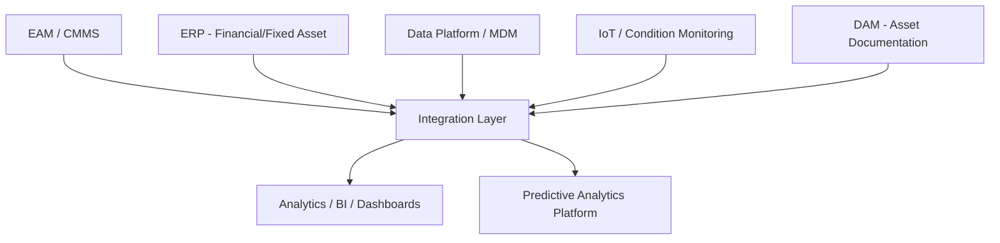
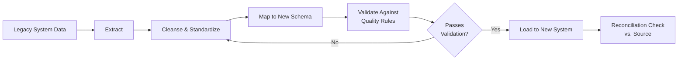

## Selecting and Deploying an Asset Management Technology Stack

### Overview

Selecting and deploying an asset management technology stack is the process of evaluating, choosing, and implementing the software systems that will support an organization's asset lifecycle processes — spanning EAM/CMMS, ERP financial integration, data governance/MDM tooling, analytics/BI platforms, and increasingly IoT/condition-monitoring infrastructure. This is typically a major Horizon 1–2 initiative within the broader implementation roadmap, since most other program capabilities (data quality, KPI reporting, predictive analytics) ultimately depend on the underlying technology foundation being sound.

**Key Points**

- Technology selection should follow, not precede, the organizational assessment and roadmap — selecting a technology stack before understanding actual process and data requirements is a common cause of misaligned, underutilized system investments.
- A technology stack is rarely a single monolithic product; it is typically a set of integrated systems (EAM, ERP, data platform, analytics, IoT) each serving a specialized function, connected via the integration architecture discussed elsewhere in this program.
- Deployment success depends as much on organizational change management, data migration quality, and process alignment as on the technical capability of the selected software itself.

### Core Components of an Asset Management Technology Stack

**Key Points**

- **EAM/CMMS** — the operational core for maintenance planning, work order management, and asset condition tracking.
- **ERP financial/fixed asset module** — financial lifecycle management, depreciation, procurement, and budgeting integration.
- **Data platform/MDM tooling** — master data management, data quality monitoring, and the reconciled golden record layer underlying cross-system reporting.
- **IoT/condition monitoring infrastructure** — sensors, edge devices, and telemetry platforms feeding real-time condition data into EAM and predictive models.
- **DAM** — repository for asset-related documentation, manuals, certificates, and media, as covered in the DAM-related discipline chapter.
- **Analytics/BI and predictive analytics platforms** — the consumption layer producing dashboards, scorecards, and forward-looking capital planning insight.

### Requirements Definition

**Key Points**

- Requirements should be derived directly from the organizational assessment's identified gaps and the implementation roadmap's prioritized initiatives, rather than generated independently from a generic feature checklist.
- **Functional requirements** — specific capability needs (e.g., mobile work order access for field technicians, multi-site asset hierarchy support, configurable approval workflows).
- **Non-functional requirements** — performance, scalability, security, uptime/availability expectations, and regulatory compliance needs (e.g., data residency requirements for certain industries).
- **Integration requirements** — explicit specification of which other systems (ERP, IoT platforms, DAM) the selected technology must integrate with, and via what mechanism (API, middleware, batch file).
- **User experience requirements** — usability considerations specific to the actual user population (e.g., field technicians using mobile devices in harsh environments have different UX needs than office-based planners).

### Build vs. Buy vs. Hybrid Decision

| Approach | Characteristics | When Typically Favored |
| --- | --- | --- |
| Commercial off-the-shelf (COTS) | Vendor-maintained, pre-built functionality, configuration over customization | Standard asset management needs well-served by mature market offerings |
| Custom-built | Purpose-built to exact organizational requirements | Highly specialized processes not well-served by available COTS options |
| Hybrid/composable | COTS core platforms with custom integration/extension layers | Most common in practice — leveraging mature COTS for core EAM/ERP while custom-building specific integration or analytics needs |

**Key Points**

- [Inference] Pure custom-built asset management platforms are relatively uncommon for core EAM/CMMS functionality given the maturity of the commercial market, with custom development more frequently applied to the integration layer, specific analytics/predictive capability, or organization-specific workflow extensions rather than the core platform itself; this varies by industry and the uniqueness of organizational requirements.
- Total cost of ownership comparisons between build and buy approaches should account for ongoing maintenance, upgrade, and support costs, not solely initial implementation cost, since custom-built systems typically carry higher long-term maintenance burden absent vendor support.

### Vendor Evaluation Process

1. **Market scan and longlist development** — identifying candidate vendors/platforms based on defined requirements and industry fit.
2. **Request for Information (RFI) / Request for Proposal (RFP)** — formal solicitation of vendor capability information and proposals against defined requirements.
3. **Shortlisting and demonstration** — narrowing to a small set of finalists for detailed product demonstrations, ideally using organization-specific use cases and data rather than generic vendor demos.
4. **Reference checks** — validating vendor claims against existing customer experiences, particularly organizations of similar size, industry, and asset complexity.
5. **Proof of concept / pilot** — where feasible, a limited-scope technical validation using real organizational data and processes before full commitment.
6. **Total cost of ownership analysis** — comparing licensing, implementation, integration, training, and ongoing support costs across finalists.
7. **Final selection and contract negotiation** — formal vendor selection, including negotiation of service level agreements, support terms, and implementation timelines.

**Key Points**

- Evaluating vendors against organization-specific use cases (rather than accepting standard vendor demonstrations at face value) is important for surfacing gaps between advertised capability and actual fit for the organization's specific asset types and processes.
- Reference checks with organizations of comparable scale and complexity tend to provide more reliable signal than vendor-provided case studies, which are selectively curated.

### Deployment Architecture Considerations

- **Cloud vs. on-premises vs. hybrid deployment** — cloud/SaaS deployment has become the dominant model for most modern EAM and analytics platforms, offering reduced infrastructure management burden, though on-premises or hybrid deployment may remain relevant for organizations with specific data residency, connectivity, or regulatory constraints.
- **Multi-site/multi-tenant configuration** — for organizations spanning multiple facilities or business units, deployment architecture must address whether a single shared instance or multiple instances (by site, region, or business unit) best serves organizational structure and data governance needs.
- **Integration architecture alignment** — the selected platform's deployment should align with the integration architecture patterns (point-to-point, middleware/iPaaS, batch) established elsewhere in the technology stack, avoiding a deployment that creates additional unplanned integration complexity.
- **Data migration planning** — a critical and often underestimated deployment workstream, involving extraction, cleansing, transformation, and load of legacy asset data into the new system, closely tied to the data governance and quality assurance practices covered elsewhere in this program.

**Key Points**

- Data migration is frequently one of the highest-risk and most time-consuming components of technology deployment, since it surfaces historical data quality issues (duplicates, incomplete records, inconsistent classification) that must be resolved before or during migration rather than simply carried forward into the new system.
- A reconciliation check comparing migrated record counts and key values against the legacy source is standard practice to validate migration completeness and accuracy before legacy system decommissioning.

### Illustrative Diagram: Technology Selection and Deployment Workflow

<svg xmlns="http://www.w3.org/2000/svg" viewBox="0 0 740 460" font-family="sans-serif">
<text x="370" y="28" text-anchor="middle" font-size="18" font-weight="bold" fill="#1a1a2e">Technology Stack Selection Workflow (svg_diagram)</text>
<rect x="40" y="60" width="150" height="50" rx="8" fill="#e8f0fe" stroke="#3b5bdb" stroke-width="1.5" />
<text x="115" y="90" text-anchor="middle" font-size="11" fill="#1e3a8a">Requirements Definition</text>
<rect x="230" y="60" width="150" height="50" rx="8" fill="#e8f0fe" stroke="#3b5bdb" stroke-width="1.5" />
<text x="305" y="90" text-anchor="middle" font-size="11" fill="#1e3a8a">RFI/RFP &amp; Shortlisting</text>
<rect x="420" y="60" width="150" height="50" rx="8" fill="#e8f0fe" stroke="#3b5bdb" stroke-width="1.5" />
<text x="495" y="90" text-anchor="middle" font-size="11" fill="#1e3a8a">Demo, Pilot, Reference Checks</text>
<rect x="610" y="60" width="110" height="50" rx="8" fill="#e8f0fe" stroke="#3b5bdb" stroke-width="1.5" />
<text x="665" y="90" text-anchor="middle" font-size="11" fill="#1e3a8a">Vendor Selection</text>
<line x1="190" y1="85" x2="230" y2="85" stroke="#333" stroke-width="1.5" marker-end="url(#a6)" />
<line x1="380" y1="85" x2="420" y2="85" stroke="#333" stroke-width="1.5" marker-end="url(#a6)" />
<line x1="570" y1="85" x2="610" y2="85" stroke="#333" stroke-width="1.5" marker-end="url(#a6)" />
<rect x="80" y="180" width="170" height="50" rx="8" fill="#fef3e2" stroke="#d97706" stroke-width="1.5" />
<text x="165" y="210" text-anchor="middle" font-size="11" fill="#92400e">Deployment Architecture &amp; Configuration</text>
<rect x="290" y="180" width="170" height="50" rx="8" fill="#fef3e2" stroke="#d97706" stroke-width="1.5" />
<text x="375" y="210" text-anchor="middle" font-size="11" fill="#92400e">Data Migration &amp; Reconciliation</text>
<rect x="500" y="180" width="170" height="50" rx="8" fill="#fef3e2" stroke="#d97706" stroke-width="1.5" />
<text x="585" y="210" text-anchor="middle" font-size="11" fill="#92400e">Integration Build &amp; Testing</text>
<line x1="665" y1="110" x2="500" y2="180" stroke="#333" stroke-width="1.5" />
<rect x="290" y="300" width="170" height="50" rx="8" fill="#e6f9f0" stroke="#0f9960" stroke-width="1.5" />
<text x="375" y="330" text-anchor="middle" font-size="11" fill="#065f46">Training &amp; Change Management</text>
<rect x="290" y="380" width="170" height="50" rx="8" fill="#e6f9f0" stroke="#0f9960" stroke-width="1.5" />
<text x="375" y="410" text-anchor="middle" font-size="11" fill="#065f46">Go-Live &amp; Hypercare Support</text>
<line x1="375" y1="230" x2="375" y2="300" stroke="#333" stroke-width="1.5" marker-end="url(#a6)" />
<line x1="375" y1="350" x2="375" y2="380" stroke="#333" stroke-width="1.5" marker-end="url(#a6)" />
</svg>

### Change Management and Training for Deployment

**Key Points**

- **User training** — role-specific training addressing how different user populations (field technicians, planners, finance staff, executives) will actually use the new system in their daily work, rather than generic feature training.
- **Champion/super-user network** — identifying and equipping influential users within each affected function to support peers and reinforce adoption post-go-live.
- **Communication plan** — proactive, ongoing communication throughout selection and deployment explaining rationale, timeline, and expected impact to affected staff, reducing resistance driven by uncertainty.
- **Process alignment** — ensuring operational processes are updated to reflect new system capability rather than forcing the new system to replicate legacy manual workarounds, which undermines much of the intended benefit.

### Post-Deployment Support and Optimization

**Key Points**

- **Hypercare period** — an intensified support period immediately following go-live, providing rapid issue resolution and close monitoring as users adapt to the new system.
- **Adoption monitoring** — tracking actual system usage against expected usage patterns to identify functions or user groups struggling with adoption, enabling targeted follow-up support.
- **Continuous configuration refinement** — many issues surfaced post-go-live are configuration rather than fundamental platform issues, requiring an iterative refinement period rather than a "set and forget" deployment approach.
- **Benefits realization tracking** — measuring whether the deployed technology is actually delivering the maturity improvements and business outcomes identified in the original roadmap business case, feeding back into the broader program's progress tracking.

### Common Implementation Pitfalls

**Key Points**

- **Technology-first selection** — choosing a platform based on vendor reputation or feature breadth without first clearly defining organization-specific requirements derived from the assessment and roadmap.
- **Underestimating data migration effort** — treating data migration as a mechanical technical task rather than recognizing it as a data quality remediation exercise requiring significant time and cross-functional effort.
- **Insufficient integration planning** — selecting a platform without adequately validating its integration capability against the organization's existing ERP, IoT, and analytics landscape, resulting in costly post-selection integration challenges.
- **Underinvesting in change management** — treating deployment as a purely technical project, resulting in low user adoption even when the underlying technology is capable and well-configured.
- **No post-go-live optimization plan** — treating go-live as the project's endpoint rather than planning for the ongoing configuration refinement and adoption monitoring needed to realize full value.
- **Vendor lock-in without exit consideration** — insufficient attention to data portability and contract terms governing eventual platform transition, creating difficulty if the vendor relationship needs to end in the future.

### Related Topics

- RFP/RFI Development and Structured Vendor Evaluation Criteria
- Data Migration Methodology and Legacy System Decommissioning
- Cloud vs. On-Premises Deployment Trade-offs for Asset Management Platforms
- Change Management and User Adoption Strategies for Enterprise System Rollouts
- Integration Architecture Patterns for EAM, ERP, and IoT Platforms
- Total Cost of Ownership Analysis for Technology Vendor Selection
- Benefits Realization Tracking and Post-Deployment Value Measurement