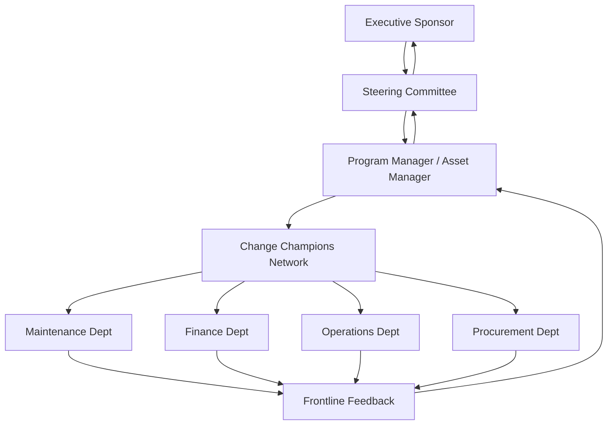

## Change Management and Stakeholder Buy-In for Program Launch


### Overview

Launching an Asset Lifecycle Management (ALM) program is fundamentally an organizational change initiative, not merely a technology or process rollout. Most ALM program failures stem not from poor asset data models or weak CMMS/EAM tooling, but from insufficient stakeholder alignment, unmanaged resistance, and lack of sustained leadership sponsorship. This topic covers the structured methodologies, stakeholder engagement frameworks, and governance mechanisms required to launch and sustain an ALM program across an organization.

### Why Change Management Is Critical to ALM Programs

ALM programs typically disrupt established ways of working across multiple functions: maintenance technicians who must now log work orders digitally, finance teams who must reconcile asset registers against depreciation schedules, operations managers who must accept condition-based prioritization over ad-hoc requests, and procurement teams who must align purchasing with lifecycle cost models rather than lowest upfront price.

**Key Points**

- ALM programs cut across silos: engineering, finance, operations, procurement, and IT all have competing priorities and definitions of "asset value."
- Resistance is often rooted in loss of autonomy (e.g., a maintenance supervisor losing informal scheduling control) rather than in the technology itself.
- Without active sponsorship, ALM initiatives regress to "shelf-ware": the EAM system is implemented but usage decays within 12–18 months. [Inference — decay timelines vary by organization and are not a universal constant, but this pattern is widely reported in asset management maturity literature.]
- Change management is not a one-time communication event; it is a continuous discipline that runs parallel to the technical implementation timeline.

### Foundational Change Management Models Applied to ALM

#### Prosci ADKAR Model

ADKAR (Awareness, Desire, Knowledge, Ability, Reinforcement) is one of the most commonly applied individual-level change models in ALM program launches because asset management change is ultimately about behavior change at the technician and supervisor level.

- **Awareness** — Why is the ALM program happening now? (e.g., regulatory pressure, asset failure costs, audit findings)
- **Desire** — What's in it for the individual? (e.g., less firefighting, clearer accountability, fewer after-hours emergency calls)
- **Knowledge** — Training on the EAM/CMMS system, new workflows, and lifecycle costing concepts
- **Ability** — Practical, supervised application of new skills in real work order processing
- **Reinforcement** — KPIs, recognition programs, and correction mechanisms to prevent reversion to old habits

#### Kotter's 8-Step Change Model

Kotter's model operates at the organizational level and maps well to ALM program phases:

1. Create urgency (e.g., present the cost of reactive maintenance vs. planned maintenance)
2. Build a guiding coalition (cross-functional steering committee)
3. Form a strategic vision (the Asset Management Policy and Strategic Asset Management Plan, per ISO 55001)
4. Enlist a volunteer army (asset champions in each department)
5. Enable action by removing barriers (e.g., legacy spreadsheet processes, conflicting data ownership)
6. Generate short-term wins (e.g., first successful preventive maintenance cycle, first accurate asset register reconciliation)
7. Sustain acceleration (expand pilot scope to additional asset classes or sites)
8. Institute change (embed ALM practices into job descriptions, SOPs, and org policy)

**Illustration — ADKAR mapped against Kotter's phases across an ALM launch timeline (svg_diagram):**

<svg xmlns="http://www.w3.org/2000/svg" viewBox="0 0 900 420">
\<style\>
.title { font: bold 16px sans-serif; fill: #1a1a2e; }
.axis { font: 12px sans-serif; fill: #444; }
.kotter { font: bold 11px sans-serif; fill: #ffffff; }
.adkar { font: bold 11px sans-serif; fill: #ffffff; }
.desc { font: 10px sans-serif; fill: #333; }
\</style\>
<text x="450" y="25" text-anchor="middle" class="title">Change Management Timeline for ALM Program Launch (svg_diagram)</text>
<line x1="60" y1="60" x2="860" y2="60" stroke="#999" stroke-width="2" />
<text x="60" y="50" class="axis">Pre-Launch</text>
<text x="420" y="50" class="axis">Launch</text>
<text x="740" y="50" class="axis">Post-Launch / Sustainment</text>
<rect x="60" y="80" width="180" height="50" rx="6" fill="#2b6cb0" />
<text x="150" y="100" text-anchor="middle" class="kotter">1. Create Urgency</text>
<text x="150" y="118" text-anchor="middle" class="kotter">2. Build Coalition</text>
<rect x="260" y="80" width="180" height="50" rx="6" fill="#2b6cb0" />
<text x="350" y="100" text-anchor="middle" class="kotter">3. Strategic Vision</text>
<text x="350" y="118" text-anchor="middle" class="kotter">4. Enlist Volunteers</text>
<rect x="460" y="80" width="180" height="50" rx="6" fill="#2b6cb0" />
<text x="550" y="100" text-anchor="middle" class="kotter">5. Enable Action</text>
<text x="550" y="118" text-anchor="middle" class="kotter">6. Short-Term Wins</text>
<rect x="660" y="80" width="180" height="50" rx="6" fill="#2b6cb0" />
<text x="750" y="100" text-anchor="middle" class="kotter">7. Sustain</text>
<text x="750" y="118" text-anchor="middle" class="kotter">8. Institutionalize</text>
<line x1="150" y1="130" x2="150" y2="160" stroke="#999" />
<line x1="350" y1="130" x2="350" y2="160" stroke="#999" />
<line x1="550" y1="130" x2="550" y2="160" stroke="#999" />
<line x1="750" y1="130" x2="750" y2="160" stroke="#999" />
<rect x="60" y="170" width="180" height="40" rx="6" fill="#38a169" />
<text x="150" y="195" text-anchor="middle" class="adkar">Awareness</text>
<rect x="260" y="170" width="180" height="40" rx="6" fill="#38a169" />
<text x="350" y="195" text-anchor="middle" class="adkar">Desire + Knowledge</text>
<rect x="460" y="170" width="180" height="40" rx="6" fill="#38a169" />
<text x="550" y="195" text-anchor="middle" class="adkar">Ability</text>
<rect x="660" y="170" width="180" height="40" rx="6" fill="#38a169" />
<text x="750" y="195" text-anchor="middle" class="adkar">Reinforcement</text>

<text x="150" y="230" text-anchor="middle" class="desc">Steering committee</text>

<text x="150" y="245" text-anchor="middle" class="desc">formed; cost-of-</text>

<text x="150" y="260" text-anchor="middle" class="desc">reactive-maint. case</text>

<text x="350" y="230" text-anchor="middle" class="desc">SAMP drafted;</text>

<text x="350" y="245" text-anchor="middle" class="desc">asset champions</text>

<text x="350" y="260" text-anchor="middle" class="desc">named per dept.</text>

<text x="550" y="230" text-anchor="middle" class="desc">Pilot site go-live;</text>

<text x="550" y="245" text-anchor="middle" class="desc">first PM cycle</text>

<text x="550" y="260" text-anchor="middle" class="desc">completed</text>

<text x="750" y="230" text-anchor="middle" class="desc">KPI dashboards live;</text>

<text x="750" y="245" text-anchor="middle" class="desc">roles updated in</text>

<text x="750" y="260" text-anchor="middle" class="desc">job descriptions</text>

<rect x="60" y="290" width="780" height="90" rx="6" fill="#fefcbf" stroke="#d69e2e" />
<text x="450" y="310" text-anchor="middle" class="desc" font-weight="bold">Risk of Regression Without Reinforcement</text>
<text x="450" y="330" text-anchor="middle" class="desc">If reinforcement (KPIs, audits, recognition) is skipped, technicians revert to</text>
<text x="450" y="345" text-anchor="middle" class="desc">informal work order logging within 6-12 months, and EAM/CMMS data</text>
<text x="450" y="360" text-anchor="middle" class="desc">accuracy degrades, undermining lifecycle cost and reliability reporting.</text>
</svg>

### Stakeholder Identification and Mapping

A structured stakeholder analysis should precede any communication plan. The **Power/Interest Grid** (Mendelow's Matrix) is the standard tool.

| Quadrant | Description | Typical ALM Stakeholders | Engagement Strategy |
| --- | --- | --- | --- |
| High Power, High Interest | Manage Closely | CFO, COO, Asset Manager, Head of Maintenance | Direct involvement in steering committee; co-own success metrics |
| High Power, Low Interest | Keep Satisfied | CEO/Board, IT Director | Periodic executive summaries; escalation path only |
| Low Power, High Interest | Keep Informed | Maintenance technicians, planners, warehouse staff | Frequent, practical communication; training; feedback loops |
| Low Power, Low Interest | Monitor | Peripheral departments, external auditors (until audit cycle) | Minimal, scheduled updates |

**Example — Stakeholder register entry:**

| Stakeholder | Role | Power | Interest | Key Concern | Engagement Action |
| --- | --- | --- | --- | --- | --- |
| Head of Maintenance | Operational owner | High | High | Loss of scheduling autonomy | Co-design new PM workflow; give sign-off authority on SOP changes |
| CFO | Budget owner | High | Medium | ROI justification | Monthly lifecycle cost savings report tied to capital planning |
| Field Technicians | End users | Low | High | Ease of use of mobile CMMS | Hands-on training; feedback channel; early involvement in UI testing |
| IT Security | System gatekeeper | High | Low | Data integration risk | Early architecture review; sign-off before go-live |

### RACI Matrix for ALM Program Governance

A RACI (Responsible, Accountable, Consulted, Informed) matrix clarifies decision rights, which is one of the most common sources of stalled ALM launches when ambiguous.

| Activity | Asset Manager | IT/EAM Admin | Maintenance Supervisor | Finance | Executive Sponsor |
| --- | --- | --- | --- | --- | --- |
| Define Asset Hierarchy | A | R | C | C | I |
| Approve Data Migration | A | R | I | C | I |
| Sign Off on Go-Live | C | C | C | I | A |
| Set Lifecycle Cost KPIs | R | I | C | A | I |
| Approve Budget for Program | C | I | I | R | A |

### Communication Planning

A phased communication plan should be structured around **audience, message, channel, frequency, and owner**.

**Example — Communication plan skeleton:**

```plaintext
Phase: Pre-Launch (T-90 to T-30 days)
Audience: All staff
Message: "Why we are changing how we manage assets" (burning platform + vision)
Channel: Town hall, email from executive sponsor
Frequency: Once, followed by FAQ document
Owner: Program Sponsor + Communications Lead

Phase: Launch Prep (T-30 to T-0)
Audience: Direct system users (technicians, planners)
Message: "What changes for you on day one" + training schedule
Channel: Department briefings, hands-on training sessions
Frequency: Weekly
Owner: Change Champions per department

Phase: Go-Live (T-0 to T+30)
Audience: All users
Message: Go-live confirmation, support escalation path, quick-reference guides
Channel: Daily stand-ups, help desk, on-floor "super users"
Frequency: Daily for first 2 weeks, then weekly
Owner: Program Manager

Phase: Sustainment (T+30 onward)
Audience: All stakeholders
Message: Wins achieved, KPI trends, upcoming enhancements
Channel: Monthly steering committee report, dashboard
Frequency: Monthly
Owner: Asset Manager
```

### Overcoming Resistance: Common Patterns and Mitigations

**Key Points**

- **Resistance from maintenance technicians** often centers on distrust of data being used for performance surveillance rather than asset improvement. Mitigation: transparently communicate that KPIs target asset/process performance, not individual punitive tracking, and involve technicians in defining what "good" looks like.
- **Resistance from middle management** often stems from perceived loss of control over budget or scheduling discretion. Mitigation: give supervisors a formal role in exception approval workflows (e.g., approving deviation from CBM-triggered work orders) rather than removing their judgment entirely.
- **Resistance from finance** often centers on unfamiliarity with lifecycle costing versus traditional capital budgeting. Mitigation: joint workshops translating Total Cost of Ownership (TCO) models into financial planning language they already use (NPV, depreciation schedules).
- **Passive resistance (non-adoption)** is more dangerous than vocal resistance because it is invisible until data quality audits reveal it. Mitigation: mandatory system usage reporting during the first 90 days with a defined escalation path for non-compliance, paired with the "burning platform" narrative for why the old way failed.

### Governance Structures for Sustained Buy-In

An ALM program launch typically requires a two-tier governance model:

1. **Executive Steering Committee** — Meets monthly to quarterly; approves budget, resolves cross-departmental conflicts, reviews strategic KPIs (aligned with ISO 55000/55001 leadership requirements).
2. **Working-Level Change Network** — Departmental "asset champions" who provide peer-level support, surface frontline issues, and act as a feedback conduit back to the program team. This mirrors Kotter's "volunteer army" concept and Prosci's local change agent network.

**Illustration — Governance and feedback loop structure:**



### Linking Change Management to ISO 55001 Requirements

ISO 55001 (the international standard for asset management systems) explicitly requires leadership commitment and demonstrable engagement of relevant functions in Clause 5 (Leadership), including the establishment of an Asset Management Policy and clear roles/responsibilities. A change management plan is therefore not optional "soft skills" work in a formal ALM program — it is often an **audit-relevant artifact** during ISO 55001 certification or surveillance audits.

- Clause 5.1 (Leadership and Commitment) — requires evidence of top management ensuring the asset management policy is compatible with organizational strategy.
- Clause 5.3 (Roles, Responsibilities, and Authorities) — directly maps to the RACI matrix above.
- Clause 7.3 (Awareness) — requires that persons doing work under the organization's control are aware of the asset management policy, their contribution to its effectiveness, and implications of not conforming. [Verified — this is a documented clause structure in ISO 55001; specific clause wording should be checked against the current published standard edition in use by the organization.]

### Measuring Change Adoption Success

| Metric | What It Measures | Target Pattern |
| --- | --- | --- |
| System login/usage rate | Actual adoption vs. mandated adoption | Should trend toward >90% of expected daily active users within 60–90 days |
| Work order closure via CMMS (%) | Displacement of shadow/paper processes | Should approach 100% within first quarter post-launch |
| Data completeness rate | Quality of asset register/attribute fields | Should trend upward; stagnation signals disengagement |
| Champion network retention | Sustainability of the change network | Attrition of champions signals waning organizational support |
| Stakeholder sentiment survey (pulse surveys) | Qualitative buy-in trend | Should show improving trend from pre-launch baseline to T+90 |

**Conclusion**

Change management and stakeholder buy-in are not peripheral to an ALM program launch — they are the primary determinant of whether the technical and process investments (EAM/CMMS systems, asset hierarchies, lifecycle costing models) actually translate into sustained organizational behavior change. Programs that pair a rigorous stakeholder map, clear governance/RACI structure, and a phased ADKAR/Kotter-based communication plan with visible executive sponsorship are substantially more likely to achieve durable adoption than those that treat change management as a final "training" step before go-live.

**Related Topics**

- Building the Business Case and Executive Sponsorship Model for ALM
- Asset Management Policy and Strategic Asset Management Plan (SAMP) Development per ISO 55001
- Designing a Change Champion Network and Training Cascade Model
- KPI and Balanced Scorecard Design for Asset Management Programs
- Data Governance and Ownership Models for Asset Registers
- Managing Cross-Functional Conflict Between Finance and Maintenance in TCO Adoption
- Post-Implementation Sustainment Audits and Continuous Improvement Loops (PDCA in ISO 55001 Context)