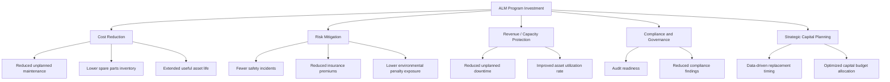

## Measuring Program ROI and Value Realization

### Overview

Measuring ROI and value realization for an Asset Lifecycle Management (ALM) program is the discipline of quantifying the financial, operational, and strategic returns generated by ALM investments — software, staffing, process redesign, and organizational change — against their total cost. Unlike a one-time capital project, an ALM program is continuous, which means value measurement must be structured as an ongoing management system rather than a single post-implementation calculation.

**Key Points**

- ROI measurement in ALM combines hard financial savings (cost avoidance, capital deferral) with soft/operational benefits (risk reduction, compliance, data quality) that require proxy metrics.
- Value realization is a lifecycle activity — baseline before implementation, track during rollout, and re-measure at defined intervals after go-live.
- Attribution is the central technical challenge: isolating ALM's contribution from concurrent initiatives, market conditions, or organizational changes.

### Why Standard ROI Formulas Are Insufficient

The textbook formula:

$$ROI = \frac{(Gain\ from\ Investment - Cost\ of\ Investment)}{Cost\ of\ Investment} \times 100$$

is necessary but not sufficient for ALM programs because:

1. **Benefit timing is staggered.** Data cleansing and asset register accuracy gains appear in months 1–6; downtime reduction and maintenance optimization gains appear in months 12–36; strategic capital-planning gains may take 3–5 years.
2. **Costs are multi-layered.** Software licensing, integration, change management, training, and ongoing governance staffing are frequently under-budgeted, especially recurring costs.
3. **Benefits are heterogeneous.** Some are directly monetizable (reduced spare-parts inventory), others require conversion via a value driver model (reduced unplanned downtime → estimated production value protected).

Because of this, mature ALM programs use a **value realization framework** layered on top of, not instead of, ROI.

### Core Financial Metrics

#### Net Present Value (NPV)

Preferred over simple ROI because ALM benefits are realized over multi-year horizons and must be discounted to account for the time value of money and cost of capital.

$$NPV = \sum_{t=0}^{n} \frac{CF_t}{(1+r)^t} - C_0$$

Where $CF_t$ is net cash flow in period $t$, $r$ is the discount rate (typically the organization's WACC), and $C_0$ is the initial investment.

#### Internal Rate of Return (IRR)

The discount rate at which $NPV = 0$; used to compare the ALM program against other competing capital investments using a single comparable percentage.

#### Payback Period

$$Payback\ Period = \frac{Initial\ Investment}{Average\ Annual\ Cash\ Flow}$$

Widely used by finance stakeholders as a simple screening metric, though it ignores cash flows beyond the breakeven point and the time value of money — a limitation that should be disclosed when payback is the headline metric.

#### Total Cost of Ownership (TCO) as the Denominator

A common failure mode is understating the cost side. A defensible TCO model includes:

| Cost Category | Examples |
| --- | --- |
| Acquisition | Software licenses, hardware, sensors/IoT tags |
| Implementation | Integration, data migration, configuration, consulting |
| Change Management | Training, communication, process redesign |
| Ongoing Operations | Support contracts, cloud hosting, subscription fees |
| Internal Staffing | Program governance, data stewardship, analyst FTEs |
| Opportunity Cost | Staff time diverted from other initiatives |

[Inference] Organizations that omit internal staffing and opportunity cost from TCO commonly overstate ROI by a significant margin, since these categories are frequently the largest recurring cost after year one; the exact magnitude varies by organization and is not a fixed industry constant.

### Value Driver Categories for ALM

A comprehensive measurement model maps program activities to distinct value driver categories rather than a single "savings" number.

#### 1. Cost Reduction

- **Maintenance cost per asset**: tracked before/after preventive and predictive maintenance program deployment.
- **Spare parts carrying cost**: inventory value reduction from improved demand forecasting tied to asset condition data.
- **Extended useful life**: deferred capital replacement, quantified as the NPV of delayed capital outlay.

#### 2. Risk Mitigation

- **Safety incident rate** (e.g., recordable incidents per 200,000 hours worked) correlated to asset condition monitoring maturity.
- **Regulatory penalty avoidance**, measured against historical baseline exposure.
- These are typically the hardest to attribute directly and are usually expressed as risk-adjusted value ranges rather than point estimates — appropriately labeled **[Inference]** when derived from modeled rather than observed outcomes.

#### 3. Revenue / Capacity Protection

- **Overall Equipment Effectiveness (OEE)** improvements attributable to reduced unplanned downtime.
- **Mean Time Between Failures (MTBF)** and **Mean Time To Repair (MTTR)** trend lines as leading indicators of capacity protection value.

#### 4. Compliance and Governance

- Audit finding counts, time-to-close on corrective actions, and asset data completeness/accuracy scores.

#### 5. Strategic Capital Planning

- Improved accuracy of capital forecasting (variance between planned vs. actual capital spend) as ALM data maturity increases.

### Building a Value Realization Framework

#### Step 1: Establish a Baseline

Before program launch or before each major phase, capture baseline metrics across all value driver categories. Without a documented baseline, later ROI claims are not defensible to finance or audit stakeholders.

**Example** baseline metrics to capture:

- Average unplanned downtime hours per month
- Maintenance cost as a percentage of Replacement Asset Value (RAV)
- Asset data accuracy/completeness rate
- Mean time to locate/retrieve asset records

#### Step 2: Define a Benefits Realization Register

A structured, living document — not a one-time business case — that tracks each expected benefit through its lifecycle.

| Field | Description |
| --- | --- |
| Benefit ID | Unique identifier |
| Description | What the benefit is and why it occurs |
| Driver Category | Cost reduction, risk, capacity, compliance, strategic |
| Baseline Value | Pre-program measurement |
| Target Value | Expected post-program measurement |
| Measurement Method | Data source, calculation, frequency |
| Owner | Accountable individual/team |
| Status | Not started / In progress / Realized / At risk |
| Attribution Confidence | High / Medium / Low, with rationale |

#### Step 3: Select Leading and Lagging Indicators

- **Leading indicators** predict future value (e.g., percentage of assets with complete condition data, percentage of work orders generated from predictive triggers vs. reactive).
- **Lagging indicators** confirm realized value (e.g., actual maintenance cost per asset, actual downtime hours).

Programs that report only lagging indicators tend to detect underperformance too late to course-correct; leading indicators should be reviewed monthly, lagging indicators quarterly or annually.

#### Step 4: Address Attribution

Because ALM programs run concurrently with other initiatives, isolate the program's contribution using one or more of:

- **Control group comparison**: comparing asset classes or facilities that adopted ALM practices against those that have not (where feasible).
- **Interrupted time-series analysis**: statistically testing for a structural break in a metric's trend at the point of ALM intervention.
- **Expert attribution panels**: structured stakeholder judgment (e.g., maintenance managers estimating percentage of improvement attributable to ALM) used when statistical isolation is impractical — this method should be explicitly labeled **[Inference]** in reporting, since it relies on subjective estimation rather than measured causation.

#### Step 5: Report Value in a Standardized Cadence

A recurring **Value Realization Report** typically includes:

1. Executive summary: cumulative value realized vs. target, cumulative cost vs. budget
2. Benefit-by-benefit status against the realization register
3. Leading indicator trend charts
4. Risks to future value realization
5. Recommended corrective actions

### Sample ROI Calculation Walkthrough

**Scenario**: A facilities organization implements a CMMS-integrated ALM program.

- Total 3-year investment (TCO): $1,200,000
- Year 1 realized benefit: $150,000 (data cleanup, early process gains)
- Year 2 realized benefit: $480,000 (predictive maintenance reduces downtime)
- Year 3 realized benefit: $620,000 (capital deferral from extended asset life)

Simple ROI over 3 years:

$$ROI = \frac{(150{,}000 + 480{,}000 + 620{,}000) - 1{,}200{,}000}{1{,}200{,}000} \times 100 = 4.2\%$$

Using NPV at a 8% discount rate ($r = 0.08$):

$$NPV = \frac{150{,}000}{1.08^1} + \frac{480{,}000}{1.08^2} + \frac{620{,}000}{1.08^3} - 1{,}200{,}000$$

$$NPV \approx 138{,}889 + 411{,}523 + 492{,}029 - 1{,}200{,}000 \approx -157{,}559$$

**Output**: On a simple undiscounted basis, the program shows a marginal positive ROI of 4.2% by year 3. However, on a discounted cash flow basis, the program has not yet achieved a positive NPV by year 3 — indicating that value realization continues to depend on benefits materializing in year 4 and beyond, which should be flagged to sponsors rather than presented as an unqualified success.

This illustrates why single-metric reporting (ROI alone) can mislead stakeholders; presenting NPV, IRR, payback period, and non-financial value drivers together gives a more complete and defensible picture.

### Common Pitfalls

- **Double-counting benefits** across categories (e.g., counting the same downtime reduction under both "cost reduction" and "revenue protection").
- **Ignoring the cost of measurement itself** — data collection and reporting infrastructure has its own TCO.
- **Presenting only aggregate ROI** without benefit-level traceability, which undermines credibility during budget renewal cycles.
- **Static baselines**: failing to re-baseline after major operational changes (e.g., facility expansion, fleet changes), which distorts year-over-year comparisons.
- **Survivorship bias in attribution**: only reporting on asset classes where the program succeeded, while quietly excluding underperforming areas.

### Governance and Organizational Roles

| Role | Responsibility in Value Measurement |
| --- | --- |
| Program Sponsor / Executive | Approves value targets, receives realization reports |
| ALM Program Manager | Owns the benefits realization register, coordinates measurement |
| Finance/FP&A Partner | Validates cost data, discount rate assumptions, audits calculations |
| Data/Analytics Lead | Builds dashboards, ensures data integrity for metrics |
| Asset/Operations Managers | Provide ground-truth validation of operational metrics |

### Illustrative Value Realization Timeline (svg_diagram)

<svg xmlns="http://www.w3.org/2000/svg" viewBox="0 0 800 340">
<text x="400" y="28" font-size="16" font-weight="bold" text-anchor="middle" fill="#1f2937">Asset Lifecycle Management Value Realization Timeline (svg_diagram)</text>
<line x1="60" y1="280" x2="740" y2="280" stroke="#374151" stroke-width="2" />
<line x1="140" y1="270" x2="140" y2="290" stroke="#374151" stroke-width="2" />
<text x="140" y="305" font-size="12" text-anchor="middle" fill="#374151">Month 0</text>
<text x="140" y="320" font-size="11" text-anchor="middle" fill="#6b7280">Baseline set</text>
<line x1="300" y1="270" x2="300" y2="290" stroke="#374151" stroke-width="2" />
<text x="300" y="305" font-size="12" text-anchor="middle" fill="#374151">Month 6</text>
<text x="300" y="320" font-size="11" text-anchor="middle" fill="#6b7280">Data quality gains</text>
<line x1="460" y1="270" x2="460" y2="290" stroke="#374151" stroke-width="2" />
<text x="460" y="305" font-size="12" text-anchor="middle" fill="#374151">Month 18</text>
<text x="460" y="320" font-size="11" text-anchor="middle" fill="#6b7280">Downtime reduction</text>
<line x1="620" y1="270" x2="620" y2="290" stroke="#374151" stroke-width="2" />
<text x="620" y="305" font-size="12" text-anchor="middle" fill="#374151">Month 30</text>
<text x="620" y="320" font-size="11" text-anchor="middle" fill="#6b7280">Capital deferral</text>

<path d="M 140 260 Q 220 250 300 230 Q 380 200 460 150 Q 540 100 620 60" fill="none" stroke="`#2563eb`" stroke-width="3" />

<circle cx="140" cy="260" r="5" fill="#2563eb" />
<circle cx="300" cy="230" r="5" fill="#2563eb" />
<circle cx="460" cy="150" r="5" fill="#2563eb" />
<circle cx="620" cy="60" r="5" fill="#2563eb" />

<text x="60" y="60" font-size="12" fill="`#374151`">Cumulative</text>

<text x="60" y="75" font-size="12" fill="`#374151`">Value ($)</text>

<line x1="60" y1="280" x2="60" y2="50" stroke="#374151" stroke-width="2" />
<line x1="140" y1="180" x2="740" y2="180" stroke="#d1d5db" stroke-width="1" stroke-dasharray="4" />
<text x="745" y="184" font-size="11" fill="#9ca3af">Breakeven</text>
</svg>

**Conclusion**: Measuring ROI and value realization in Asset Lifecycle Management requires moving beyond a single financial ratio toward an integrated framework — combining NPV/IRR/payback for financial rigor, a benefits realization register for traceability, leading/lagging indicators for early warning, and explicit attribution methodology for credibility. Programs that institutionalize this as a recurring governance cadence, rather than a one-time business case, sustain executive sponsorship and secure continued investment across the asset lifecycle.

**Related Topics**

- Total Cost of Ownership (TCO) Modeling for Physical Assets
- Building a Benefits Realization Register and Governance Cadence
- Leading vs. Lagging Indicators in Asset Performance Management
- Capital Planning and Asset Replacement Decision Models
- Overall Equipment Effectiveness (OEE) as an ALM Value Metric
- Data Quality Maturity Models for Asset Registers
- Stakeholder Reporting and Executive Dashboard Design for ALM Programs