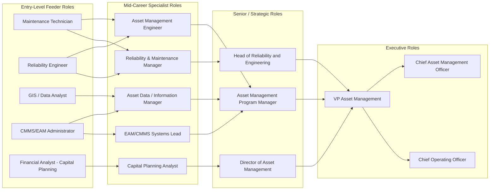
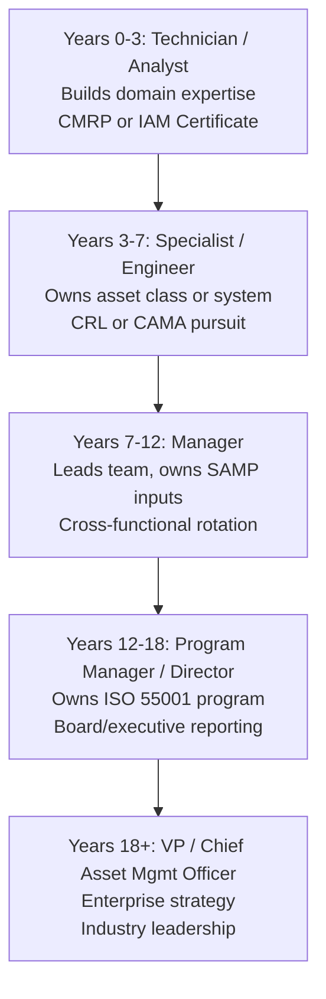

## Career Paths and Professional Development in Asset Management

### Overview

Asset Management (in the physical/infrastructure and Asset Lifecycle Management sense, distinct from financial asset management) has matured into a distinct professional discipline with defined career ladders, certifications, and cross-functional competency requirements. This section covers the typical career trajectories, required competencies at each level, certification pathways, and professional development strategies for individuals building or advancing a career in Asset Lifecycle Management (ALM).

**Key Points**

- Asset management careers span technical (engineering, reliability), analytical (data, GIS, CMMS/EAM systems), and managerial/strategic (program leadership, governance) tracks that often converge at senior levels.
- ISO 55001 has formalized asset management as an organizational management system, creating demand for dedicated Asset Management Professionals distinct from traditional maintenance roles.
- Professional development typically combines formal certification, cross-domain rotation (maintenance, reliability, finance, IT), and progressive scope of asset portfolio responsibility.

### The Asset Management Career Landscape

Asset management careers generally originate from one of several feeder disciplines and converge toward integrated program leadership roles over time.

### Core Career Tracks

#### 1. Technical / Engineering Track

Focuses on asset condition, reliability, and maintenance strategy.

- **Typical roles**: Reliability Engineer → Senior Reliability Engineer → Reliability Manager → Head of Engineering/Reliability
- **Core competencies**: Root cause analysis (RCA), Failure Modes and Effects Analysis (FMEA), Reliability-Centered Maintenance (RCM), condition monitoring technologies (vibration analysis, thermography, oil analysis)
- **Typical entry point**: Mechanical, electrical, or industrial engineering degree, or trades background with progression through maintenance roles

#### 2. Data and Information Management Track

Focuses on asset registers, GIS, CMMS/EAM platforms, and data governance.

- **Typical roles**: Asset Data Analyst → Asset Information Manager → Data/Information Systems Lead → Director of Asset Information
- **Core competencies**: Asset hierarchies and taxonomies, GIS platforms (e.g., Esri ArcGIS), CMMS/EAM systems (e.g., IBM Maximo, SAP PM/EAM, IFS), data quality frameworks, master data management
- **Typical entry point**: GIS, information systems, or data analytics background

#### 3. Financial and Capital Planning Track

Focuses on lifecycle costing, capital forecasting, and ROI/value realization (see related chapter item on Measuring Program ROI).

- **Typical roles**: Capital Planning Analyst → Asset Investment Planner → Manager of Capital Planning → Director of Finance/Asset Investment
- **Core competencies**: Total Cost of Ownership (TCO) modeling, Net Present Value (NPV) / Internal Rate of Return (IRR) analysis, levels-of-service frameworks, risk-based capital prioritization
- **Typical entry point**: Finance, accounting, or engineering economics background

#### 4. Program / Strategic Leadership Track

Integrates the above tracks into organization-wide asset management strategy and governance, typically aligned to ISO 55001.

- **Typical roles**: Asset Management Program Manager → Director of Asset Management → VP/Chief Asset Management Officer
- **Core competencies**: Strategic Asset Management Plan (SAMP) development, cross-functional governance, stakeholder management, organizational change leadership, ISO 55001 management system implementation

### Professional Certifications

| Certification | Issuing Body | Focus | Typical Career Stage |
| --- | --- | --- | --- |
| Certified Asset Management Assessor (CAMA) | Institute of Asset Management (IAM) | ISO 55001 conformity assessment | Mid to senior |
| IAM Certificate / Diploma in Asset Management | Institute of Asset Management | Broad asset management competency framework | Entry to senior |
| Certified Reliability Leader (CRL) | American Society for Quality (ASQ) | Reliability leadership | Mid-career |
| Certified Reliability Engineer (CRE) | American Society for Quality (ASQ) | Reliability engineering | Mid-career technical track |
| Certified Maintenance & Reliability Professional (CMRP) | Society for Maintenance & Reliability Professionals (SMRP) | Maintenance and reliability body of knowledge | Entry to senior |
| PAS 55 / ISO 55001 Lead Auditor | Various accredited bodies | Management system auditing | Senior technical/governance |
| Project Management Professional (PMP) | Project Management Institute (PMI) | Program/project delivery | Complementary at any stage |

[Unverified] Availability, exact naming, and version currency of individual certification programs should be confirmed directly with the issuing body, as certification bodies periodically revise exam blueprints, prerequisites, and continuing education requirements.

#### The IAM Competency Framework

The Institute of Asset Management (IAM) publishes a widely referenced competency framework organized around groupings such as:

1. **Strategy and Planning** — SAMP development, demand analysis, lifecycle strategy
2. **Asset Management Decision-Making** — capital investment decision-making, risk-based prioritization
3. **Lifecycle Delivery Activities** — design, procurement, maintenance delivery, operations
4. **Asset Information** — data and information strategy, systems, and standards
5. **Organization and People** — leadership, structure, competence management
6. **Risk and Review** — risk management, performance/health monitoring, management review, audit

This framework is frequently used by employers to structure job descriptions, competency assessments, and individual development plans (IDPs).

### Progression Timeline (Illustrative)

**Example** trajectory for the Program/Strategic Leadership track:

[Inference] These timeframes are illustrative approximations based on commonly observed progression patterns; actual advancement speed varies significantly by industry sector (utilities, transportation, municipal, manufacturing), organization size, and individual performance, and should not be treated as a guaranteed schedule.

### Cross-Functional Rotation as a Development Strategy

Because ALM inherently spans engineering, IT, finance, and operations, many organizations deliberately rotate high-potential staff across functions before promoting into program leadership roles.

**Example** rotation sequence for a reliability engineer targeting a program manager role:

1. 12–18 months in core reliability engineering (technical credibility)
2. 12 months in CMMS/EAM systems administration (data and systems fluency)
3. 6–12 months supporting capital planning/finance (financial fluency)
4. Assignment as deputy or team lead on an ISO 55001 implementation project (governance exposure)

This sequencing builds the "T-shaped" competency profile increasingly expected of asset management program leaders: deep expertise in one domain, working fluency across the rest.

### Professional Development Plan (PDP) Structure

A well-formed individual development plan for an asset management professional typically includes:

| Component | Description |
| --- | --- |
| Competency Gap Assessment | Mapped against IAM framework or organizational competency model |
| Certification Roadmap | Sequenced certifications aligned to career stage |
| Stretch Assignments | Cross-functional project or rotation exposure |
| Mentorship | Pairing with senior asset management leader |
| Conference/Community Engagement | IAM, SMRP, or regional asset management associations |
| Formal Education | Optional graduate coursework (asset management, engineering management, MBA) |

### Professional Communities and Ongoing Learning

- **Institute of Asset Management (IAM)** — global professional body, publishes the Asset Management Landscape and competency frameworks referenced above.
- **Society for Maintenance & Reliability Professionals (SMRP)** — North America-focused, maintains the CMRP body of knowledge.
- **Asset Management Council (AMC)** — regional bodies (e.g., Australia) with local certification and standards alignment.
- **ISO Technical Committee 251 (ISO/TC 251)** — maintains the ISO 55000 series standards; relevant for professionals pursuing standards/governance specialization.

**Conclusion**: Career progression in Asset Lifecycle Management is increasingly structured rather than incidental, anchored by the IAM competency framework and ISO 55001, and typically advances through a combination of deepening technical expertise, deliberate cross-functional rotation, and formal certification. Professionals aiming for program leadership or executive asset management roles benefit most from building fluency across the engineering, data/information, and financial tracks rather than remaining narrowly specialized.

**Next Steps**

- Building a Strategic Asset Management Plan (SAMP)
- ISO 55001 Management System Implementation
- Competency Frameworks and Skills Gap Assessment for Asset Teams
- Organizational Design and Governance Structures for Asset Management Programs
- Change Management for Asset Management Program Adoption
- Succession Planning for Asset Management Leadership Roles