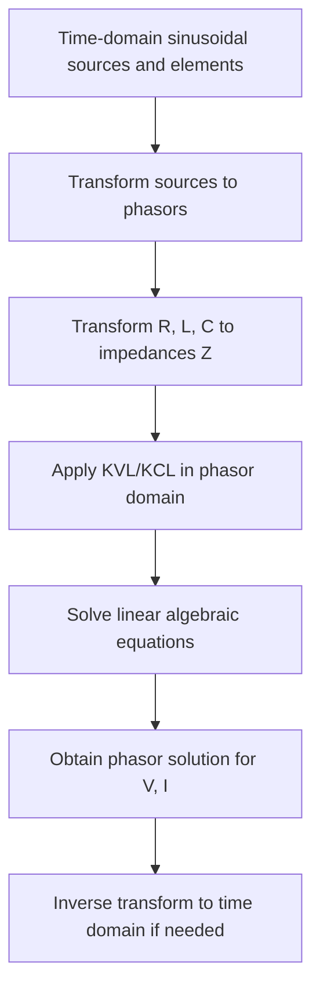

## Phasor Representation of AC Quantities

### Definition and Purpose

A phasor is a complex number representation of a sinusoidal waveform that encodes its magnitude and phase angle while suppressing the time-varying component. Phasors transform differential equations describing AC circuits into algebraic equations, drastically simplifying steady-state analysis of power systems operating at a single frequency.

For a sinusoidal voltage:

$$v(t) = V_m \cos(\omega t + \theta)$$

The corresponding phasor is:

$$\tilde{V} = V_m \angle \theta$$

or in rectangular form:

$$\tilde{V} = V_m \cos\theta + jV_m \sin\theta$$

**Key Points**

- Phasors exist only for steady-state sinusoidal signals at a single fixed frequency $\omega$
- The time dependence $e^{j\omega t}$ is implicit and dropped from the notation
- Phasors are complex numbers, not physical vectors, though they are often manipulated graphically like vectors on a phasor diagram
- RMS magnitude is conventionally used in power engineering rather than peak magnitude, so $\tilde{V} = V_{rms}\angle\theta$ is the standard grid-engineering convention

### Mathematical Foundation

The phasor concept relies on Euler's identity:

$$e^{j\theta} = \cos\theta + j\sin\theta$$

A real sinusoid is recovered as the real part of a rotating complex exponential:

$$v(t) = \text{Re}\left[V_m e^{j(\omega t + \theta)}\right] = \text{Re}\left[V_m e^{j\theta} e^{j\omega t}\right]$$

Since $e^{j\omega t}$ is common to every voltage and current in a linear circuit operating at frequency $\omega$, it can be factored out and tracked implicitly. What remains, $V_m e^{j\theta}$, is the phasor.

**Conversion Between Forms**

Rectangular to polar:

$$V_m = \sqrt{a^2 + b^2}, \quad \theta = \tan^{-1}\left(\frac{b}{a}\right)$$

where $\tilde{V} = a + jb$.

Polar to rectangular:

$$a = V_m\cos\theta, \quad b = V_m\sin\theta$$

### Phasor Diagrams

A phasor diagram plots phasors as arrows in the complex plane, with length proportional to magnitude and angle measured counterclockwise from the positive real axis. These diagrams are used extensively in grid engineering to visualize phase relationships between voltages and currents across generators, transformers, and transmission lines.

(svg_diagram) Phasor Diagram: Voltage Leading Current by 30°

<svg xmlns="http://www.w3.org/2000/svg" viewBox="0 0 400 400">
<text x="200" y="25" text-anchor="middle" font-size="16" font-family="sans-serif" font-weight="bold">Phasor Diagram: V Leading I by 30° (svg_diagram)</text>
<line x1="200" y1="200" x2="380" y2="200" stroke="#888" stroke-width="1" />
<line x1="200" y1="200" x2="20" y2="200" stroke="#888" stroke-width="1" />
<line x1="200" y1="200" x2="200" y2="20" stroke="#888" stroke-width="1" />
<line x1="200" y1="200" x2="200" y2="380" stroke="#888" stroke-width="1" />
<text x="385" y="205" font-size="12" font-family="sans-serif">Re</text>
<text x="205" y="18" font-size="12" font-family="sans-serif">Im</text>
<line x1="200" y1="200" x2="343" y2="130" stroke="#c0392b" stroke-width="3" marker-end="url(#arrowV)" />
<text x="350" y="125" font-size="14" font-family="sans-serif" fill="#c0392b" font-weight="bold">V (150∠30°)</text>
<line x1="200" y1="200" x2="330" y2="200" stroke="#2980b9" stroke-width="3" marker-end="url(#arrowI)" />
<text x="335" y="195" font-size="14" font-family="sans-serif" fill="#2980b9" font-weight="bold">I (100∠0°)</text>
<path d="M 250 200 A 50 50 0 0 0 243 179" fill="none" stroke="#27ae60" stroke-width="1.5" />
<text x="255" y="185" font-size="12" font-family="sans-serif" fill="#27ae60">30°</text>
</svg>

**Example**

For a voltage $v(t) = 150\cos(\omega t + 30°)$ V and current $i(t) = 100\cos(\omega t)$ A:

- $\tilde{V} = 150\angle 30°$ V
- $\tilde{I} = 100\angle 0°$ A
- Voltage leads current by 30°, indicating an inductive (lagging power factor) load from the source's perspective

### Phasor Arithmetic in Circuit Analysis

**Addition/Subtraction** — performed in rectangular form, since KVL and KCL require component-wise summation:

$$\tilde{V}_1 + \tilde{V}_2 = (a_1 + a_2) + j(b_1 + b_2)$$

**Multiplication/Division** — performed in polar form, common in impedance calculations:

$$\tilde{V}_1 \tilde{V}_2 = V_1 V_2 \angle(\theta_1 + \theta_2)$$

$$\frac{\tilde{V}_1}{\tilde{V}_2} = \frac{V_1}{V_2}\angle(\theta_1 - \theta_2)$$

**Derivative and Integral Relationships**

Differentiation in the time domain becomes multiplication by $j\omega$ in the phasor domain:

$$\frac{d}{dt}v(t) \Leftrightarrow j\omega\tilde{V}$$

Integration becomes division by $j\omega$:

$$\int v(t)\,dt \Leftrightarrow \frac{\tilde{V}}{j\omega}$$

This is the mathematical basis for defining impedance of inductors and capacitors.

### Phasor Impedance of Passive Elements

| Element | Time-Domain Relation | Phasor Impedance $\tilde{Z}$ |
| --- | --- | --- |
| Resistor | $v = Ri$ | $R$ |
| Inductor | $v = L\frac{di}{dt}$ | $j\omega L$ |
| Capacitor | $i = C\frac{dv}{dt}$ | $\dfrac{1}{j\omega C} = -j\dfrac{1}{\omega C}$ |

Ohm's law generalizes directly:

$$\tilde{V} = \tilde{Z}\tilde{I}$$

**Key Points**

- Inductive impedance has a positive imaginary component, causing current to lag voltage by 90° in a purely inductive element
- Capacitive impedance has a negative imaginary component, causing current to lead voltage by 90° in a purely capacitive element
- These relationships underpin reactive power behavior across transmission lines, transformers, and compensation devices in grid systems

### Application to Power System Analysis

In grid engineering, phasors are the foundation for:

- **Power flow calculations** — bus voltages are represented as phasors $\tilde{V}_k = V_k\angle\delta_k$, where $\delta_k$ is the voltage angle relative to a system reference (slack bus)
- **Synchrophasor measurement** — Phasor Measurement Units (PMUs) sample voltage and current waveforms and compute time-synchronized phasors (referenced to GPS time) across the grid, enabling wide-area situational awareness
- **Symmetrical components** — phasor algebra with the complex operator $a = 1\angle120°$ decomposes unbalanced three-phase systems into positive, negative, and zero sequence networks
- **Fault analysis** — pre-fault, during-fault, and post-fault conditions are all analyzed using phasor-based impedance networks
- **Stability studies** — rotor angle and bus voltage phasor trajectories are tracked to assess transient and steady-state stability

**Synchrophasor Angle Convention**

$$\tilde{V}_k = V_k e^{j\delta_k}, \quad \delta_k = \delta_k^{ref} - \delta_{sync}^{ref}$$

Angle differences between bus phasors, $\delta_i - \delta_j$, directly determine real power flow between buses:

$$P_{ij} \approx \frac{V_i V_j}{X_{ij}}\sin(\delta_i - \delta_j)$$

This is the DC power flow approximation, valid when line resistance is small relative to reactance and angle differences are modest. [Inference: the linearized form assumes $\sin(\delta_i-\delta_j)\approx\delta_i-\delta_j$ and negligible resistance, which does not hold for all network topologies or loading conditions.]

### Three-Phase Phasor Representation

Balanced three-phase voltages are represented as three phasors displaced by 120°:

$$\tilde{V}_a = V\angle0°, \quad \tilde{V}_b = V\angle{-120°}, \quad \tilde{V}_c = V\angle{-240°} = V\angle{120°}$$

(svg_diagram) Balanced Three-Phase Phasor Set

<svg xmlns="http://www.w3.org/2000/svg" viewBox="0 0 400 400">
<text x="200" y="25" text-anchor="middle" font-size="16" font-family="sans-serif" font-weight="bold">Balanced Three-Phase Phasors (svg_diagram)</text>
<circle cx="200" cy="210" r="150" fill="none" stroke="#ccc" stroke-width="1" stroke-dasharray="4,4" />
<line x1="200" y1="210" x2="200" y2="60" stroke="#c0392b" stroke-width="3" marker-end="url(#a1)" />
<text x="205" y="55" font-size="14" fill="#c0392b" font-family="sans-serif" font-weight="bold">Va (0°)</text>
<line x1="200" y1="210" x2="70" y2="285" stroke="#2980b9" stroke-width="3" marker-end="url(#a2)" />
<text x="20" y="300" font-size="14" fill="#2980b9" font-family="sans-serif" font-weight="bold">Vb (-120°)</text>
<line x1="200" y1="210" x2="330" y2="285" stroke="#27ae60" stroke-width="3" marker-end="url(#a3)" />
<text x="335" y="300" font-size="14" fill="#27ae60" font-family="sans-serif" font-weight="bold">Vc (120°)</text>
</svg>

For a balanced set, the phasor sum is zero:

$$\tilde{V}_a + \tilde{V}_b + \tilde{V}_c = 0$$

This property is exploited in symmetrical component transformation and in designing neutral/ground return paths, since a perfectly balanced system carries no neutral current.

### Phasor-Domain Circuit Solution Workflow

### Common Pitfalls

- **Mixing peak and RMS values** — power system phasors conventionally use RMS magnitude; mixing conventions leads to a factor-of-$\sqrt{2}$ error
- **Applying phasors to non-sinusoidal or transient signals** — phasor analysis is valid only for steady-state, single-frequency sinusoids; harmonics or switching transients require time-domain or multi-frequency analysis
- **Angle reference confusion** — all phasors in a given analysis must share a common time/angle reference; PMU-based systems anchor this reference to GPS-synchronized absolute time
- **Sign convention errors** — inconsistent use of $j\omega L$ vs $-j/(\omega C)$ signs is a frequent source of impedance calculation errors

### Practical Example: Series RL Circuit

For a series RL circuit with $R = 10\,\Omega$, $L = 30$ mH, $\omega = 377$ rad/s (60 Hz), and source $\tilde{V}_s = 120\angle0°$ V:

$$\tilde{Z} = R + j\omega L = 10 + j(377)(0.03) = 10 + j11.31\,\Omega$$

$$|\tilde{Z}| = \sqrt{10^2 + 11.31^2} = 15.09\,\Omega, \quad \angle\tilde{Z} = \tan^{-1}\left(\frac{11.31}{10}\right) = 48.5°$$

$$\tilde{I} = \frac{\tilde{V}_s}{\tilde{Z}} = \frac{120\angle0°}{15.09\angle48.5°} = 7.95\angle{-48.5°}\text{ A}$$

The negative current angle confirms current lags voltage, consistent with an inductive load — this lagging power factor is a central concern in grid var compensation and generator excitation control.

**Related Topics**

- Impedance and Admittance in AC Circuits
- Complex Power (S = P + jQ) and Power Triangle
- Symmetrical Components (Positive, Negative, Zero Sequence)
- Per-Unit System for Power System Analysis
- Phasor Measurement Units (PMUs) and Synchrophasor Standards (IEEE C37.118)
- Power Flow Equations and the DC Power Flow Approximation
- Three-Phase Circuit Analysis and Sequence Networks