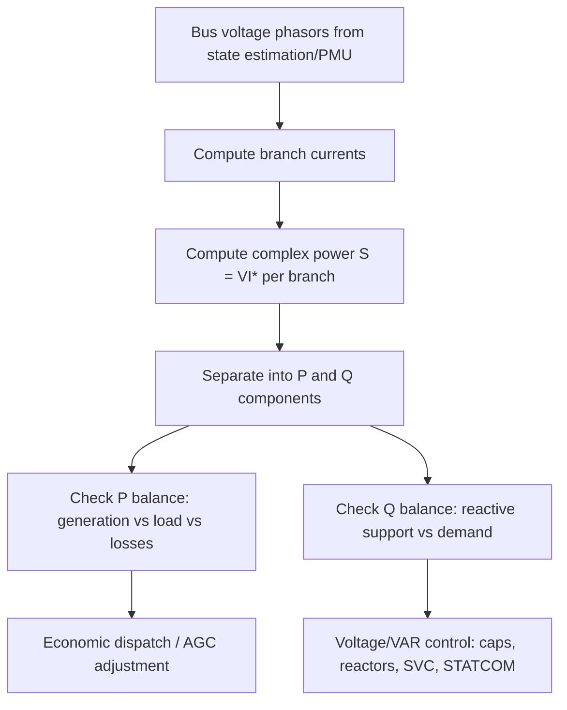

## Complex Power: Real, Reactive, and Apparent Power

### Definition and Purpose

Complex power unifies real (active) power, reactive power, and apparent power into a single complex quantity, enabling compact analysis of energy transfer and phase relationships in AC circuits. It is foundational to grid engineering for generator sizing, transmission capacity planning, reactive compensation design, and power flow studies.

$$\tilde{S} = \tilde{V}\tilde{I}^*$$

where $\tilde{V}$ is the RMS voltage phasor, $\tilde{I}^*$ is the complex conjugate of the RMS current phasor, and $\tilde{S}$ is expressed in volt-amperes (VA).

**Key Points**

- The conjugate on current is essential: without it, the cross term would not correctly separate into real and reactive components
- Complex power is a steady-state, single-frequency concept, consistent with the phasor framework it is built on
- Complex power is conserved at any node/bus in a network (Tellegen's theorem analog), making it the basis for power balance equations in load flow studies

### Mathematical Formulation

Given $\tilde{V} = V\angle\theta_v$ and $\tilde{I} = I\angle\theta_i$:

$$\tilde{S} = VI\angle(\theta_v - \theta_i) = VI\cos\phi + jVI\sin\phi$$

where $\phi = \theta_v - \theta_i$ is the power angle (impedance angle for a passive load).

This decomposes into:

$$\tilde{S} = P + jQ$$

| Quantity | Symbol | Formula | Unit |
| --- | --- | --- | --- |
| Real (Active) Power | $P$ | $VI\cos\phi$ | Watt (W) |
| Reactive Power | $Q$ | $VI\sin\phi$ | Volt-Ampere Reactive (VAR) |
| Apparent Power | $S$ | $VI = \sqrt{P^2+Q^2}$ | Volt-Ampere (VA) |
| Power Factor | $pf$ | $\cos\phi = P/S$ | Dimensionless |

### The Power Triangle

(svg_diagram) Power Triangle: P, Q, S Relationship

<svg xmlns="http://www.w3.org/2000/svg" viewBox="0 0 420 300">
<text x="210" y="25" text-anchor="middle" font-size="16" font-family="sans-serif" font-weight="bold">Power Triangle (svg_diagram)</text>
<line x1="60" y1="230" x2="300" y2="230" stroke="#c0392b" stroke-width="3" />
<text x="150" y="255" font-size="14" font-family="sans-serif" fill="#c0392b" font-weight="bold">P (Real Power, W)</text>
<line x1="300" y1="230" x2="300" y2="90" stroke="#2980b9" stroke-width="3" />
<text x="310" y="165" font-size="14" font-family="sans-serif" fill="#2980b9" font-weight="bold">Q (Reactive Power, VAR)</text>
<line x1="60" y1="230" x2="300" y2="90" stroke="#27ae60" stroke-width="3" />
<text x="130" y="140" font-size="14" font-family="sans-serif" fill="#27ae60" font-weight="bold">S (Apparent Power, VA)</text>
<path d="M 280 230 A 20 20 0 0 0 274 214" fill="none" stroke="#333" stroke-width="1.5" />
<text x="255" y="215" font-size="12" font-family="sans-serif">φ</text>
</svg>

For an **inductive load** (lagging power factor), $Q > 0$ (current lags voltage). For a **capacitive load** (leading power factor), $Q < 0$ (current leads voltage). This sign convention (IEEE/power engineering convention) is critical for correctly modeling compensation devices.

**Example**

A load draws $\tilde{V} = 240\angle0°$ V and $\tilde{I} = 15\angle{-30°}$ A:

$$\tilde{S} = \tilde{V}\tilde{I}^* = (240\angle0°)(15\angle30°) = 3600\angle30°\text{ VA}$$

$$P = 3600\cos30° = 3117.7\text{ W}, \quad Q = 3600\sin30° = 1800\text{ VAR (lagging)}$$

$$pf = \cos30° = 0.866\text{ lagging}$$

### Real Power (P)

Real power represents the net rate of energy transfer that performs useful work — mechanical torque, heat, light. It is the time-average of the instantaneous power waveform:

$$P = \frac{1}{T}\int_0^T v(t)i(t)\,dt = VI\cos\phi$$

In generation and load dispatch, $P$ is the quantity balanced by turbine-governor control and economic dispatch, and it is the basis of frequency regulation, since system frequency deviates when generation and load real power fail to match.

### Reactive Power (Q)

Reactive power represents the oscillating energy exchange between source and reactive elements (inductors and capacitors) that performs no net work but is essential for establishing the magnetic and electric fields required by inductive machinery (motors, transformers) and for maintaining system voltage levels.

$$Q = VI\sin\phi$$

**Key Points**

- Reactive power does not travel efficiently over long transmission distances; it is best supplied locally
- $Q$ is intimately tied to voltage magnitude in transmission networks — reactive power flows from high-voltage to low-voltage nodes, analogous to how real power flows from high-angle to low-angle nodes
- Reactive compensation devices (capacitor banks, shunt reactors, SVCs, STATCOMs) manage $Q$ to maintain voltage profiles and reduce losses

### Apparent Power (S)

Apparent power is the product of RMS voltage and RMS current magnitudes without regard to phase, and represents the total current-carrying/thermal loading a component must be rated for:

$$S = VI = |\tilde{S}| = \sqrt{P^2 + Q^2}$$

Equipment such as transformers and generators are rated in kVA or MVA (apparent power) rather than kW, because their thermal and insulation limits are governed by current magnitude, which is $S$-dependent, not by the real power alone.

### Instantaneous Power Derivation

For $v(t) = V_m\cos(\omega t)$ and $i(t) = I_m\cos(\omega t - \phi)$:

$$p(t) = v(t)i(t) = V_mI_m\cos(\omega t)\cos(\omega t - \phi)$$

Using the product-to-sum identity:

$$p(t) = \frac{V_mI_m}{2}\cos\phi\,[1+\cos(2\omega t)] + \frac{V_mI_m}{2}\sin\phi\,\sin(2\omega t)$$

$$p(t) = P[1+\cos(2\omega t)] + Q\sin(2\omega t)$$

This shows explicitly that $P$ is the average (DC) component of instantaneous power plus a pulsating term at twice line frequency, while $Q$ governs the amplitude of the purely oscillatory, zero-mean component. [Inference: this decomposition assumes ideal sinusoidal steady-state; distorted or harmonic-rich waveforms require the broader "power in nonsinusoidal systems" framework, which introduces distortion power $D$.]

### Power Factor and Its Grid Significance

$$pf = \cos\phi = \frac{P}{S}$$

- $pf = 1$: purely resistive load, $Q=0$, maximum real power transfer per unit current
- $pf < 1$ lagging: inductive load, common in motor-heavy industrial and residential loads
- $pf < 1$ leading: capacitive load, common with lightly loaded cables or over-compensated systems

Low power factor increases current for a given real power delivery ($I = P/(V\cdot pf)$), increasing $I^2R$ losses in lines and requiring larger conductor and equipment ratings. Utilities often penalize industrial customers for poor power factor and encourage or require local correction via capacitor banks.

### Complex Power Balance in Networks

At any bus $k$ in a power system, complex power balance requires:

$$\tilde{S}_{Gk} - \tilde{S}_{Dk} = \sum_{m} \tilde{S}_{km}$$

where $\tilde{S}_{Gk}$ is generated complex power, $\tilde{S}_{Dk}$ is demanded (load) complex power, and $\tilde{S}_{km}$ is power flowing out over each connected line. This balance, applied at every bus, forms the nonlinear system of equations solved in power flow (load flow) studies via methods such as Newton-Raphson or Gauss-Seidel.

**Power Flow Equations (Bus Injection Form)**

$$P_k = \sum_{n} V_kV_n(G_{kn}\cos\theta_{kn} + B_{kn}\sin\theta_{kn})$$

$$Q_k = \sum_{n} V_kV_n(G_{kn}\sin\theta_{kn} - B_{kn}\cos\theta_{kn})$$

where $G_{kn}$ and $B_{kn}$ are conductance and susceptance elements of the bus admittance matrix, and $\theta_{kn} = \delta_k - \delta_n$.

### Complex Power Flow Workflow in System Studies

### Three-Phase Complex Power

For a balanced three-phase system:

$$S_{3\phi} = 3V_{ph}I_{ph} = \sqrt{3}\,V_{LL}I_L$$

$$P_{3\phi} = \sqrt{3}\,V_{LL}I_L\cos\phi, \quad Q_{3\phi} = \sqrt{3}\,V_{LL}I_L\sin\phi$$

where $V_{LL}$ is line-to-line voltage and $I_L$ is line current. This is the standard form used for generator, transformer, and transmission line ratings (e.g., a 500 MVA, 230 kV transformer).

### Common Pitfalls

- **Forgetting the conjugate** — computing $\tilde{V}\tilde{I}$ instead of $\tilde{V}\tilde{I}^*$ produces an incorrect sign/value for $Q$
- **Sign convention inconsistency** — some references define lagging $Q$ as negative; grid engineering standard (IEEE) treats inductive/lagging $Q$ as positive
- **Confusing kVA and kW ratings** — sizing generation or transformer capacity using $P$ alone under-rates equipment when power factor is low
- **Applying single-phase formulas to three-phase systems without the $\sqrt{3}$ factor**

**Related Topics**

- Power Factor Correction and Capacitor Bank Sizing
- Reactive Power Compensation Devices (SVC, STATCOM, Synchronous Condensers)
- Power Flow (Load Flow) Analysis Methods
- Per-Unit System for Power System Analysis
- Voltage Stability and Reactive Power Limits
- Symmetrical Components and Unbalanced Power Calculations
- Transformer and Generator MVA Rating Fundamentals