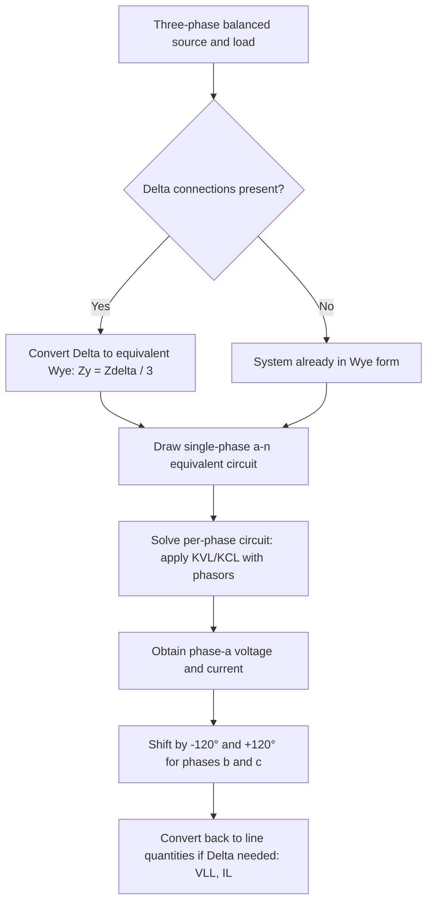

## Balanced Three-Phase Circuit Analysis

### Definition and Purpose

Balanced three-phase circuit analysis is the study of power systems where three sinusoidal sources of equal magnitude are displaced by 120° from each other, supplying identical (balanced) impedances. Nearly all bulk electrical generation, transmission, and large-scale distribution operates in three-phase form because it delivers constant instantaneous power, uses conductor material more efficiently than single-phase, and enables self-starting rotating machinery.

**Key Points**

- A three-phase system is balanced when all three source voltages are equal in magnitude and symmetrically displaced by 120°, and all three phase impedances are identical
- Balanced analysis permits **per-phase analysis**: solving a single equivalent single-phase circuit and applying the 120° phase relationships to obtain the other two phases
- Three-phase instantaneous power is constant (non-pulsating) under balanced conditions, unlike single-phase power which pulsates at twice line frequency

### Phase Sequence and Source Representation

**Positive Sequence (ABC)**

$$v_{an}(t) = V_m\cos(\omega t), \quad v_{bn}(t) = V_m\cos(\omega t - 120°), \quad v_{cn}(t) = V_m\cos(\omega t + 120°)$$

In phasor form:

$$\tilde{V}_{an} = V\angle0°, \quad \tilde{V}_{bn} = V\angle{-120°}, \quad \tilde{V}_{cn} = V\angle120°$$

**Negative Sequence (ACB)** reverses phase b and c ordering, producing rotation in the opposite direction — relevant for analyzing unbalanced faults and improperly connected equipment, and highly damaging to induction motors, which develop reverse-rotating torque components under negative-sequence excitation.

The complex operator $a = 1\angle120° = -0.5+j0.866$ compactly expresses phase relationships:

$$\tilde{V}_{bn} = a^2\tilde{V}_{an}, \quad \tilde{V}_{cn} = a\tilde{V}_{an}$$

with the identity $1 + a + a^2 = 0$, which is the algebraic reason balanced three-phase quantities sum to zero.

### Wye (Y) and Delta (Δ) Connections

(svg_diagram) Wye and Delta Source/Load Configurations

<svg xmlns="http://www.w3.org/2000/svg" viewBox="0 0 500 320">
<text x="250" y="25" text-anchor="middle" font-size="16" font-family="sans-serif" font-weight="bold">Wye vs Delta Configuration (svg_diagram)</text>
<text x="120" y="55" text-anchor="middle" font-size="14" font-family="sans-serif" font-weight="bold">Wye (Y)</text>
<line x1="120" y1="90" x2="120" y2="140" stroke="#333" stroke-width="2" />
<line x1="120" y1="140" x2="60" y2="220" stroke="#c0392b" stroke-width="2" />
<line x1="120" y1="140" x2="120" y2="230" stroke="#2980b9" stroke-width="2" />
<line x1="120" y1="140" x2="180" y2="220" stroke="#27ae60" stroke-width="2" />
<circle cx="120" cy="140" r="4" fill="#333" />
<text x="130" y="145" font-size="11" font-family="sans-serif">N (neutral)</text>
<text x="45" y="235" font-size="12" fill="#c0392b" font-family="sans-serif">a</text>
<text x="125" y="245" font-size="12" fill="#2980b9" font-family="sans-serif">b</text>
<text x="185" y="235" font-size="12" fill="#27ae60" font-family="sans-serif">c</text>
<text x="380" y="55" text-anchor="middle" font-size="14" font-family="sans-serif" font-weight="bold">Delta (Δ)</text>
<polygon points="380,90 320,220 440,220" fill="none" stroke="#333" stroke-width="2" />
<text x="380" y="80" font-size="12" fill="#c0392b" font-family="sans-serif">a</text>
<text x="300" y="235" font-size="12" fill="#2980b9" font-family="sans-serif">b</text>
<text x="445" y="235" font-size="12" fill="#27ae60" font-family="sans-serif">c</text>
</svg>

**Wye (Y) Connection**

Each phase source/load connects between a line terminal and a common neutral point.

$$V_{LL} = \sqrt{3}\,V_{ph}\angle30°, \quad I_L = I_{ph}$$

The line-to-line voltage leads the corresponding phase voltage by 30° in a positive-sequence Y system.

**Delta (Δ) Connection**

Each phase source/load connects directly between two line terminals; there is no neutral point.

$$V_{LL} = V_{ph}, \quad I_L = \sqrt{3}\,I_{ph}\angle{-30°}$$

The line current lags the corresponding phase current by 30°.

**Key Points**

- Y connections provide access to a neutral for grounding and enable line-to-neutral loads (e.g., residential single-phase service tapped from a three-phase system)
- Δ connections have no neutral but provide a closed path for triplen (3rd, 9th, 15th...) harmonic currents, effectively trapping them and preventing their flow onto the line
- Transmission systems predominantly use Y connections with grounded neutrals for protective relaying and insulation coordination; Δ is common in delta-wye transformer configurations, particularly on the low side of distribution transformers or to block zero-sequence currents

### Per-Phase Equivalent Circuit Method

Because a balanced three-phase system is symmetric, any Δ-connected source or load can be converted to an equivalent Y using:

$$Z_Y = \frac{Z_\Delta}{3}$$

Once converted, the analysis proceeds using only the "a-phase" (phase a to neutral) single-phase equivalent circuit, with phases b and c obtained by shifting the phase a result by $-120°$ and $+120°$ respectively.

**Example**

A balanced Y-connected source with $\tilde{V}_{an} = 2400\angle0°$ V supplies a balanced Y-connected load of $\tilde{Z} = 40+j30\,\Omega$ per phase, through a line impedance of $\tilde{Z}_{line} = 1+j2\,\Omega$ per phase.

Per-phase circuit: $\tilde{V}_{an} = \tilde{I}_a(\tilde{Z}_{line}+\tilde{Z}_{load})$

$$\tilde{Z}_{total} = (1+j2)+(40+j30) = 41+j32 = 51.97\angle37.98°\,\Omega$$

$$\tilde{I}_a = \frac{2400\angle0°}{51.97\angle37.98°} = 46.18\angle{-37.98°}\text{ A}$$

By symmetry:

$$\tilde{I}_b = 46.18\angle{-157.98°}\text{ A}, \quad \tilde{I}_c = 46.18\angle82.02°\text{ A}$$

Total three-phase real power delivered to the load:

$$P_{3\phi} = 3I_a^2R_{load} = 3(46.18)^2(40) = 256{,}000\text{ W} = 256\text{ kW}$$

### Power Calculations in Balanced Three-Phase Systems

$$S_{3\phi} = 3\tilde{V}_{ph}\tilde{I}_{ph}^* = \sqrt{3}\,V_{LL}I_L\angle\phi$$

$$P_{3\phi} = \sqrt{3}\,V_{LL}I_L\cos\phi, \quad Q_{3\phi} = \sqrt{3}\,V_{LL}I_L\sin\phi$$

where $\phi$ is the angle of the per-phase load impedance (angle between phase voltage and phase current), **not** the angle between line quantities. This is a frequently confused point since $V_{LL}$ and $I_L$ are used in the formula but $\phi$ still refers to the per-phase relationship.

### One-Line Diagram Convention

Because all three phases carry identical magnitude quantities differing only in phase angle, power system single-line (one-line) diagrams represent the entire three-phase system with a single line, annotated with three-phase ratings (MVA, kV line-to-line). This convention, combined with per-phase and per-unit analysis, is the standard simplification used throughout transmission and distribution system studies.

(svg_diagram) One-Line Diagram Representation

<svg xmlns="http://www.w3.org/2000/svg" viewBox="0 0 500 200">
<text x="250" y="25" text-anchor="middle" font-size="16" font-family="sans-serif" font-weight="bold">One-Line Diagram Simplification (svg_diagram)</text>
<circle cx="70" cy="110" r="25" fill="none" stroke="#333" stroke-width="2" />
<text x="70" y="115" text-anchor="middle" font-size="12" font-family="sans-serif">G</text>
<line x1="95" y1="110" x2="200" y2="110" stroke="#333" stroke-width="2" />
<polygon points="200,90 200,130 240,110" fill="none" stroke="#333" stroke-width="2" />
<line x1="240" y1="110" x2="380" y2="110" stroke="#333" stroke-width="2" />
<text x="310" y="100" text-anchor="middle" font-size="11" font-family="sans-serif">138 kV, 100 MVA</text>
<rect x="380" y="95" width="15" height="30" fill="none" stroke="#333" stroke-width="2" />
<text x="420" y="115" font-size="11" font-family="sans-serif">Load</text>
</svg>

### Unbalanced Deviations and When Balanced Assumptions Fail

Balanced analysis is an idealization. Real systems experience mild imbalance from unequal single-phase loading, untransposed transmission lines, and asymmetric faults. When imbalance is significant, **symmetrical component analysis** (decomposing into positive, negative, and zero sequence networks) must be used instead of the simplified per-phase method described here, since per-phase analysis is valid only under strict balance.

### Common Pitfalls

- **Using phase angle with line quantities incorrectly** — $\phi$ in the power formulas is always the per-phase voltage-current angle, not an angle "between" $V_{LL}$ and $I_L$ directly
- **Forgetting the 30° shift** — mixing up whether $V_{LL}$ leads or lags $V_{ph}$ by 30° (it leads in a positive-sequence Y system) causes angle errors when interfacing Y and Δ sides of a system
- **Applying balanced formulas to unbalanced systems** — per-phase analysis silently produces incorrect results if the source or load is actually unbalanced; verify balance assumptions before simplifying
- **Delta-Wye impedance conversion errors** — omitting the factor of 3 (or 1/3) when converting between Δ and Y equivalents

**Related Topics**

- Symmetrical Components (Positive, Negative, Zero Sequence)
- Per-Unit System for Power System Analysis
- Transformer Connections (Delta-Wye, Wye-Wye, Delta-Delta) and Phase Shift
- Unbalanced Three-Phase Fault Analysis
- One-Line Diagrams and System Modeling Conventions
- Complex Power: Real, Reactive, and Apparent Power
- Transmission Line Transposition and Impedance Balancing