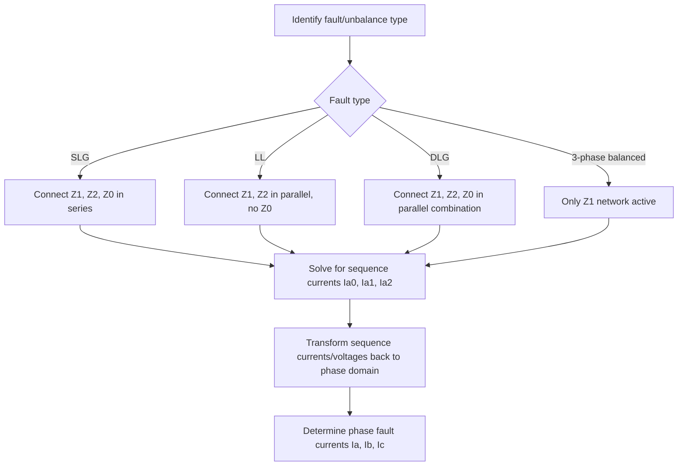

## Unbalanced Three-Phase System Analysis

### Definition and Purpose

Unbalanced three-phase system analysis addresses circuits where source voltages, load impedances, or both deviate from equal magnitude and 120° symmetry, making the per-phase simplification invalid. Since real power systems experience single-phase loading, asymmetric faults, open conductors, and untransposed lines, unbalanced analysis is essential for protective relay coordination, fault current calculation, and distribution system design.

**Key Points**

- Under imbalance, phase quantities cannot be obtained by simply shifting one phase's solution by ±120°; each phase must generally be solved as part of a coupled three-phase (or sequence-domain) system
- Unbalance produces neutral current in Y-connected systems, negative-sequence currents that heat rotating machinery, and possible zero-sequence currents that flow through ground/neutral paths
- The two dominant analytical approaches are **direct three-phase (phase-domain) analysis** and **symmetrical component (sequence-domain) analysis**; the latter is the standard tool for fault studies

### Sources of Imbalance

- Unequal single-phase loads distributed across three phases (common in low-voltage distribution)
- Asymmetric faults: single line-to-ground (SLG), line-to-line (LL), double line-to-ground (DLG)
- Untransposed transmission lines, producing unequal mutual coupling between phases
- Open-phase conditions (blown fuse, broken conductor, single-phase recloser operation)
- Unbalanced or partially loaded three-phase transformer banks

### Symmetrical Component Transformation

Fortescue's theorem states that any set of three unbalanced phasors can be resolved into three balanced sequence sets: positive, negative, and zero sequence.

$$\begin{bmatrix}\tilde{V}_a \\ \tilde{V}_b \\ \tilde{V}_c\end{bmatrix} = \begin{bmatrix}1 & 1 & 1 \\ 1 & a^2 & a \\ 1 & a & a^2\end{bmatrix}\begin{bmatrix}\tilde{V}_0 \\ \tilde{V}_1 \\ \tilde{V}_2\end{bmatrix}$$

where $a = 1\angle120°$. The inverse transformation extracts sequence components from phase quantities:

$$\begin{bmatrix}\tilde{V}_0 \\ \tilde{V}_1 \\ \tilde{V}_2\end{bmatrix} = \frac{1}{3}\begin{bmatrix}1 & 1 & 1 \\ 1 & a & a^2 \\ 1 & a^2 & a\end{bmatrix}\begin{bmatrix}\tilde{V}_a \\ \tilde{V}_b \\ \tilde{V}_c\end{bmatrix}$$

| Sequence | Description | Rotation |
| --- | --- | --- |
| Positive ($\tilde{V}_1$) | Balanced set, same phase order as the original system (a-b-c) | Normal direction |
| Negative ($\tilde{V}_2$) | Balanced set, reversed phase order (a-c-b) | Reverse direction |
| Zero ($\tilde{V}_0$) | All three phasors identical in magnitude and angle | No rotation; in-phase |

**Key Points**

- Zero-sequence current can only flow if a return path exists (grounded neutral, delta winding circulating path, or earth return); it does not exist in an ungrounded, unearthed three-wire system
- Negative-sequence current in rotating machines produces a reverse-rotating flux component that induces double-frequency rotor currents, causing localized heating and vibration — machine nameplate negative-sequence withstand limits (per NEMA/IEC standards) govern allowable imbalance
- Delta windings block zero-sequence current from passing through to the other side of a transformer while allowing it to circulate within the delta itself

(svg_diagram) Symmetrical Component Decomposition

<svg xmlns="http://www.w3.org/2000/svg" viewBox="0 0 560 260">
<text x="280" y="25" text-anchor="middle" font-size="16" font-family="sans-serif" font-weight="bold">Symmetrical Component Decomposition (svg_diagram)</text>
<text x="90" y="55" text-anchor="middle" font-size="13" font-family="sans-serif" font-weight="bold">Unbalanced Set</text>
<line x1="90" y1="150" x2="90" y2="80" stroke="#c0392b" stroke-width="2" />
<line x1="90" y1="150" x2="40" y2="190" stroke="#2980b9" stroke-width="2" />
<line x1="90" y1="150" x2="150" y2="200" stroke="#27ae60" stroke-width="2" />
<text x="90" y="235" text-anchor="middle" font-size="11" font-family="sans-serif">Va, Vb, Vc</text>
<text x="270" y="150" font-size="20" font-family="sans-serif">=</text>
<text x="360" y="55" text-anchor="middle" font-size="13" font-family="sans-serif" font-weight="bold">Positive Seq</text>
<line x1="360" y1="150" x2="360" y2="90" stroke="#c0392b" stroke-width="2" />
<line x1="360" y1="150" x2="308" y2="180" stroke="#2980b9" stroke-width="2" />
<line x1="360" y1="150" x2="412" y2="180" stroke="#27ae60" stroke-width="2" />
<text x="440" y="150" font-size="20" font-family="sans-serif">+</text>
<text x="480" y="55" text-anchor="middle" font-size="13" font-family="sans-serif" font-weight="bold">Negative Seq</text>
<line x1="480" y1="150" x2="480" y2="90" stroke="#c0392b" stroke-width="2" />
<line x1="480" y1="150" x2="428" y2="120" stroke="#2980b9" stroke-width="2" />
<line x1="480" y1="150" x2="532" y2="120" stroke="#27ae60" stroke-width="2" />
<text x="480" y="240" text-anchor="middle" font-size="11" font-family="sans-serif">+ Zero Seq (not shown to scale)</text>
</svg>

### Sequence Networks and Impedances

Each element in a power system (generator, transformer, transmission line) has three sequence impedances: $Z_0$, $Z_1$, $Z_2$.

| Element | $Z_1$ (Positive) | $Z_2$ (Negative) | $Z_0$ (Zero) |
| --- | --- | --- | --- |
| Synchronous Generator | Subtransient/transient/synchronous reactance | Approx. equal to $Z_1$ (often slightly different) | Typically small; depends on grounding |
| Transformer | Leakage impedance | Equal to $Z_1$ | Depends on winding connection (Y-grounded, Δ, Y-ungrounded) |
| Transmission Line | Positive-sequence series impedance | Equal to $Z_1$ (line is a static/passive element) | Significantly higher than $Z_1$ (typically 2–4×) due to earth return path |

[Inference: exact negative- and zero-sequence impedance values are equipment- and design-specific; the "approximately equal" and "2–4×" relationships are typical engineering rules of thumb rather than universal constants, and manufacturer/test data should be used for precise studies.]

Each sequence network is solved independently as a balanced single-phase network, then the results are combined based on the type of unbalance (fault type or asymmetric loading condition) via specific interconnection rules.

### Fault Analysis Using Sequence Networks

**Single Line-to-Ground (SLG) Fault**

Sequence networks are connected in **series**:

$$\tilde{I}_{a1} = \tilde{I}_{a2} = \tilde{I}_{a0} = \frac{\tilde{E}_a}{Z_1+Z_2+Z_0+3Z_f}$$

$$\tilde{I}_a = \tilde{I}_{a0}+\tilde{I}_{a1}+\tilde{I}_{a2} = 3\tilde{I}_{a1}$$

**Line-to-Line (LL) Fault**

Positive and negative sequence networks are connected in **parallel** (no zero-sequence involvement, since no ground path exists):

$$\tilde{I}_{a1} = -\tilde{I}_{a2} = \frac{\tilde{E}_a}{Z_1+Z_2+Z_f}$$

**Double Line-to-Ground (DLG) Fault**

All three sequence networks are connected in **parallel**:

$$\tilde{I}_{a1} = \frac{\tilde{E}_a}{Z_1+\dfrac{Z_2(Z_0+3Z_f)}{Z_2+Z_0+3Z_f}}$$

**Example**

A generator with $E_a = 1.0\angle0°$ pu, $Z_1 = j0.15$, $Z_2 = j0.15$, $Z_0 = j0.05$ pu experiences a bolted SLG fault ($Z_f=0$) at its terminals:

$$\tilde{I}_{a1} = \frac{1.0\angle0°}{j0.15+j0.15+j0.05} = \frac{1.0}{j0.35} = -j2.857\text{ pu}$$

$$\tilde{I}_a = 3\tilde{I}_{a1} = -j8.571\text{ pu}$$

This fault current is substantially larger than the corresponding three-phase symmetrical fault current would be for the same $Z_1$ alone, illustrating why SLG faults often produce the highest fault current in solidly grounded systems — a key consideration in breaker interrupting rating selection.

### Direct Phase-Domain (Coupled) Analysis

For unbalanced loading (rather than faults), an alternative to symmetrical components is direct phase-domain circuit analysis, writing coupled KVL/KCL equations for all three phases plus neutral simultaneously, typically using the bus admittance matrix in phase coordinates:

$$\begin{bmatrix}\tilde{I}_a \\ \tilde{I}_b \\ \tilde{I}_c\end{bmatrix} = [Y_{abc}]\begin{bmatrix}\tilde{V}_a \\ \tilde{V}_b \\ \tilde{V}_c\end{bmatrix}$$

This method is standard in modern **distribution system analysis** (e.g., unbalanced distribution power flow), since distribution feeders are inherently unbalanced due to single-phase laterals and taps, unlike transmission systems where symmetrical components remain the dominant tool. [Inference: the choice between sequence-domain and phase-domain methods is a modeling/tooling convention that varies by software platform and utility practice, not a strict universal rule.]

### Neutral and Ground Current Effects

In a 4-wire Y system with unbalanced single-phase loads, neutral current is the phasor sum of the three line currents:

$$\tilde{I}_N = \tilde{I}_a+\tilde{I}_b+\tilde{I}_c = 3\tilde{I}_{a0}$$

Excessive neutral current causes conductor overheating (a documented concern in distribution systems with high nonlinear/single-phase loading) and elevated neutral-to-ground voltage, which can create shock hazards and interfere with sensitive equipment.

### Effects on Rotating Machinery

Negative-sequence voltage unbalance as low as 1–2% can produce disproportionate negative-sequence current in induction motors (typically 6–10× the voltage unbalance percentage in current unbalance) due to the low negative-sequence impedance of the machine, leading to accelerated insulation aging and reduced motor life if sustained. [Inference: the 6–10× multiplier is a commonly cited approximate rule in motor engineering literature; actual sensitivity depends on individual machine design parameters.] NEMA MG-1 and IEC 60034 define voltage unbalance derating curves used to size motors for expected site imbalance conditions.

### Common Pitfalls

- **Applying per-phase (balanced) shortcuts to unbalanced problems** — this silently produces incorrect answers since the underlying symmetry assumption is violated
- **Mixing sequence and phase quantities without transformation** — sequence impedances and phase impedances are not interchangeable without the Fortescue transformation
- **Ignoring zero-sequence path availability** — assuming ground fault current flows without verifying a grounded neutral or delta circulating path exists
- **Underestimating negative-sequence heating in motors** — treating voltage unbalance as a minor issue when it disproportionately affects machine currents and lifespan

**Related Topics**

- Symmetrical Components (Positive, Negative, Zero Sequence) — Theoretical Foundations
- Transformer Connections and Zero-Sequence Path Behavior
- Short-Circuit / Fault Current Analysis Methods
- Protective Relaying for Unbalanced and Ground Faults
- Unbalanced Distribution Power Flow Methods
- Motor Derating for Voltage Unbalance (NEMA/IEC Standards)
- Grounding Practices and System Neutral Grounding Methods