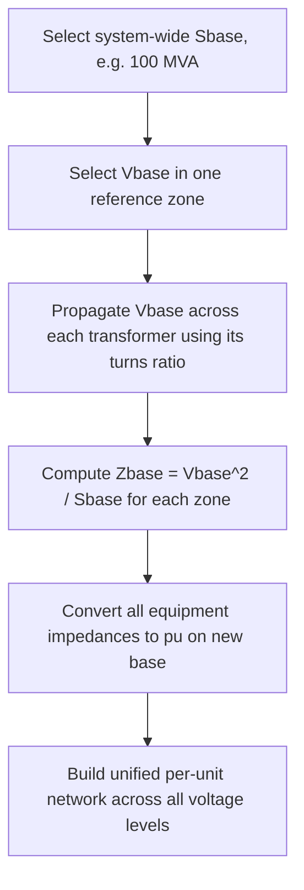

## The Per-Unit System and Base Value Selection

### Definition and Purpose

The per-unit (pu) system expresses electrical quantities — voltage, current, power, impedance — as fractions of chosen base values rather than in absolute physical units. It is the near-universal computational framework for power system analysis because it eliminates transformer turns-ratio effects across voltage levels, normalizes equipment parameters for direct comparison regardless of physical size, and simplifies numerical computation.

$$\text{Per-unit value} = \frac{\text{Actual value}}{\text{Base value}}$$

**Key Points**

- All per-unit quantities are dimensionless
- Typical per-unit values for normal operating conditions cluster near 1.0 (e.g., voltage 0.95–1.05 pu), making deviations from nominal immediately visible
- The per-unit system requires selecting a consistent set of base quantities; only two bases can be chosen independently per voltage zone (typically base power $S_B$ and base voltage $V_B$), with base current and base impedance derived from them

### Base Quantity Definitions

For a single-phase system:

$$I_B = \frac{S_B}{V_B}, \quad Z_B = \frac{V_B}{I_B} = \frac{V_B^2}{S_B}, \quad Y_B = \frac{1}{Z_B}$$

For a three-phase system, using line-to-line voltage and total three-phase apparent power as bases:

$$I_B = \frac{S_{B,3\phi}}{\sqrt{3}\,V_{B,LL}}, \quad Z_B = \frac{V_{B,LL}^2}{S_{B,3\phi}}$$

**Key Points**

- $S_B$ (base apparent power) is typically chosen as a single system-wide value (e.g., 100 MVA), common across all voltage levels
- $V_B$ (base voltage) is chosen separately for each voltage zone, matching the nominal voltage of that zone (e.g., 500 kV, 230 kV, 13.8 kV)
- Base current and base impedance are **not** independently chosen; they are derived and therefore differ in each voltage zone even though $S_B$ is common system-wide

### Why Per-Unit Simplifies Transformer Analysis

A key benefit: when base voltages on each side of a transformer are selected in the ratio of the transformer's voltage rating, the transformer's per-unit impedance is identical when referred from either side, and the ideal transformer's turns ratio effectively disappears from the equivalent circuit.

(svg_diagram) Per-Unit Transformer Equivalent Circuit

<svg xmlns="http://www.w3.org/2000/svg" viewBox="0 0 500 220">
<text x="250" y="25" text-anchor="middle" font-size="16" font-family="sans-serif" font-weight="bold">Per-Unit Transformer Simplification (svg_diagram)</text>
<text x="120" y="55" text-anchor="middle" font-size="12" font-family="sans-serif">Actual Circuit (turns ratio N1:N2)</text>
<line x1="40" y1="100" x2="90" y2="100" stroke="#333" stroke-width="2" />
<rect x="90" y="80" width="15" height="40" fill="none" stroke="#333" stroke-width="2" />
<rect x="135" y="80" width="15" height="40" fill="none" stroke="#333" stroke-width="2" />
<line x1="150" y1="100" x2="200" y2="100" stroke="#333" stroke-width="2" />
<text x="120" y="145" font-size="11" font-family="sans-serif">N1 : N2</text>
<text x="380" y="55" text-anchor="middle" font-size="12" font-family="sans-serif">Per-Unit Circuit (ratio removed)</text>
<line x1="320" y1="100" x2="360" y2="100" stroke="#333" stroke-width="2" />
<rect x="360" y="85" width="60" height="30" fill="none" stroke="#333" stroke-width="2" />
<text x="390" y="105" text-anchor="middle" font-size="11" font-family="sans-serif">Zpu</text>
<line x1="420" y1="100" x2="460" y2="100" stroke="#333" stroke-width="2" />
</svg>

This is the primary reason per-unit is standard practice: it allows a system spanning multiple voltage levels (generator terminals, step-up transformer, transmission line, step-down transformer, distribution) to be represented as a single simplified network without explicit turns-ratio scaling at every transformer.

### Converting Base Values Across Voltage Zones

When a system has multiple voltage levels connected by transformers, the base power $S_B$ remains constant throughout, but base voltage changes across each transformer according to its nameplate voltage ratio:

$$V_{B,2} = V_{B,1}\times\frac{V_{rated,2}}{V_{rated,1}}$$

### Changing Base for Equipment Ratings

Manufacturers typically supply impedance in per-unit or percent on the equipment's own nameplate base (its own rated MVA and kV), which usually differs from the system base chosen for a study. Conversion between bases uses:

$$Z_{pu,new} = Z_{pu,old}\times\left(\frac{V_{B,old}}{V_{B,new}}\right)^2\times\left(\frac{S_{B,new}}{S_{B,old}}\right)$$

**Example**

A transformer is rated 50 MVA, 138/13.8 kV, with nameplate impedance $Z_{pu} = 0.08$ pu on its own base. Convert to a system base of $S_B = 100$ MVA at the same voltage level (138 kV):

$$Z_{pu,new} = 0.08\times\left(\frac{138}{138}\right)^2\times\left(\frac{100}{50}\right) = 0.08\times1\times2 = 0.16\text{ pu}$$

Since the voltage base is unchanged in this case, only the power base ratio scales the impedance.

**Second Example — Full Base Change**

A generator is rated 200 MVA, 20 kV, with $X_1 = 0.20$ pu on its own base. Convert to a system base of $S_B = 100$ MVA, $V_B = 22$ kV:

$$X_{pu,new} = 0.20\times\left(\frac{20}{22}\right)^2\times\left(\frac{100}{200}\right) = 0.20\times0.8264\times0.5 = 0.0826\text{ pu}$$

### Worked System Example

A simple radial system: Generator (100 MVA, 13.8 kV, $X''=0.15$ pu on own base) → Step-up transformer (100 MVA, 13.8/138 kV, $X=0.10$ pu on own base) → Transmission line ($Z=15+j60\,\Omega$ actual) → Load.

**Step 1 — Select system base:** $S_B = 100$ MVA. Choose $V_{B1} = 13.8$ kV (generator zone).

**Step 2 — Propagate voltage base:** $V_{B2} = 13.8\times(138/13.8) = 138$ kV (transmission zone).

**Step 3 — Generator reactance** (already on 100 MVA, 13.8 kV — matches system base directly): $X''_{pu} = 0.15$ pu.

**Step 4 — Transformer reactance** (already on 100 MVA, matching voltage ratio): $X_{pu} = 0.10$ pu.

**Step 5 — Line impedance base:**

$$Z_{B,line} = \frac{V_{B2}^2}{S_B} = \frac{138^2}{100} = 190.44\,\Omega$$

$$Z_{line,pu} = \frac{15+j60}{190.44} = 0.0788+j0.3151\text{ pu}$$

All quantities are now expressed on a common 100 MVA base and can be combined directly in a single-line impedance diagram for fault or load flow studies, with no explicit transformer turns ratio appearing in the network.

### Advantages of the Per-Unit System

**Key Points**

- Removes the need to reflect impedances across transformers via the square of the turns ratio at every step
- Typical per-unit impedance ranges for a given equipment class (e.g., transformers: 0.05–0.15 pu; generators: 0.10–0.30 pu subtransient reactance) are relatively narrow regardless of physical MVA rating, aiding sanity-checking of study results and typographical error detection
- Three-phase quantities are handled without explicit $\sqrt{3}$ factors once in per-unit, since these factors are embedded in the base value definitions
- Simplifies computer-based power flow, short-circuit, and stability programs by keeping numerical values in a similar order of magnitude across a system spanning many voltage levels

### Common Pitfalls

- **Mismatched base pairs across a transformer** — voltage bases on either side of a transformer must respect its actual turns ratio; arbitrary independent selection breaks the simplification and introduces an implicit off-nominal tap
- **Confusing equipment (nameplate) base with system base** — using manufacturer-supplied pu impedance directly without converting to the study's system base produces incorrect network calculations
- **Applying single-phase base formulas to three-phase systems** — using $Z_B = V_B^2/S_B$ with a single-phase $S_B$ against a line-to-line $V_B$, or vice versa, introduces a factor-of-3 error
- **Forgetting to convert given percent impedance to per-unit** (%Z / 100) before use in calculations

### Per-Unit in Load Flow and Fault Studies

Per-unit forms the native computational basis for power flow (Newton-Raphson, Gauss-Seidel), short-circuit (symmetrical component fault calculations), and stability (swing equation) studies. Bus voltage magnitudes in load flow results are reported in per-unit (e.g., "bus voltage = 1.02 pu"), directly indicating deviation from nominal without needing to know the specific kV level of that bus, allowing quick cross-comparison of voltage performance across widely different voltage classes within the same study.

**Related Topics**

- Balanced Three-Phase Circuit Analysis
- Symmetrical Components and Unbalanced Fault Analysis
- Transformer Equivalent Circuits and Percent Impedance
- Power Flow (Load Flow) Analysis Methods
- Short-Circuit Current Calculation Methods
- One-Line Diagrams and System Modeling Conventions
- Generator Reactance Values (Subtransient, Transient, Synchronous)