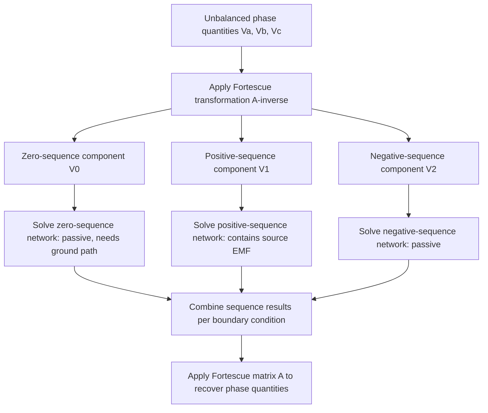

## Symmetrical Components Theory

### Definition and Purpose

Symmetrical components theory, formulated by Charles Fortescue in 1918, is a mathematical technique for resolving any set of unbalanced three-phase phasors into three independent sets of balanced phasors: positive, negative, and zero sequence. This transformation converts coupled, asymmetric three-phase problems into three decoupled, symmetric single-phase problems, making it the foundational analytical tool for fault analysis, protective relaying, and unbalanced system studies in grid engineering.

**Key Points**

- The technique applies to any unbalanced three-phase phasor set — voltages, currents, or impedances — provided the system operates at a single frequency
- Each sequence network can be analyzed independently as a balanced single-phase circuit, then combined according to the boundary conditions of the specific unbalance (fault type, unbalanced load, open conductor)
- Symmetrical components exploit the fact that most power system elements (generators, transformers, transmission lines) are largely symmetric in construction, so their sequence impedance matrices become diagonal (decoupled) in the sequence domain even though they are coupled in the phase domain

### The Complex Operator *a*

Symmetrical component mathematics relies on the unit phasor operator:

$$a = 1\angle120° = -\frac{1}{2}+j\frac{\sqrt{3}}{2}$$

with key properties:

$$a^2 = 1\angle240° = -\frac{1}{2}-j\frac{\sqrt{3}}{2}, \quad a^3 = 1\angle360° = 1$$

$$1+a+a^2 = 0$$

This last identity is the algebraic foundation for why balanced three-phase sets sum to zero, and why the transformation matrix constructed from $a$ successfully diagonalizes symmetric three-phase systems.

### Fortescue's Transformation

Any unbalanced phasor set $\tilde{V}_a, \tilde{V}_b, \tilde{V}_c$ can be expressed as the sum of three symmetrical sets:

$$\tilde{V}_a = \tilde{V}_{a0}+\tilde{V}_{a1}+\tilde{V}_{a2}$$

$$\tilde{V}_b = \tilde{V}_{a0}+a^2\tilde{V}_{a1}+a\tilde{V}_{a2}$$

$$\tilde{V}_c = \tilde{V}_{a0}+a\tilde{V}_{a1}+a^2\tilde{V}_{a2}$$

In matrix form:

$$\begin{bmatrix}\tilde{V}_a \\ \tilde{V}_b \\ \tilde{V}_c\end{bmatrix} = \begin{bmatrix}1 & 1 & 1 \\ 1 & a^2 & a \\ 1 & a & a^2\end{bmatrix}\begin{bmatrix}\tilde{V}_{a0} \\ \tilde{V}_{a1} \\ \tilde{V}_{a2}\end{bmatrix} = [A]\begin{bmatrix}\tilde{V}_{a0} \\ \tilde{V}_{a1} \\ \tilde{V}_{a2}\end{bmatrix}$$

**The Inverse Transformation**

$$\begin{bmatrix}\tilde{V}_{a0} \\ \tilde{V}_{a1} \\ \tilde{V}_{a2}\end{bmatrix} = [A]^{-1}\begin{bmatrix}\tilde{V}_a \\ \tilde{V}_b \\ \tilde{V}_c\end{bmatrix} = \frac{1}{3}\begin{bmatrix}1 & 1 & 1 \\ 1 & a & a^2 \\ 1 & a^2 & a\end{bmatrix}\begin{bmatrix}\tilde{V}_a \\ \tilde{V}_b \\ \tilde{V}_c\end{bmatrix}$$

Explicitly:

$$\tilde{V}_{a0} = \frac{1}{3}(\tilde{V}_a+\tilde{V}_b+\tilde{V}_c)$$

$$\tilde{V}_{a1} = \frac{1}{3}(\tilde{V}_a+a\tilde{V}_b+a^2\tilde{V}_c)$$

$$\tilde{V}_{a2} = \frac{1}{3}(\tilde{V}_a+a^2\tilde{V}_b+a\tilde{V}_c)$$

Convention: all sequence quantities are defined and computed with reference to **phase a**; phases b and c are recovered by rotation, never computed independently.

### Physical Interpretation of Each Sequence

(svg_diagram) Physical Rotation of Sequence Sets

<svg xmlns="http://www.w3.org/2000/svg" viewBox="0 0 560 260">
<text x="280" y="25" text-anchor="middle" font-size="16" font-family="sans-serif" font-weight="bold">Sequence Set Rotation Patterns (svg_diagram)</text>
<text x="100" y="55" text-anchor="middle" font-size="13" font-family="sans-serif" font-weight="bold">Zero Sequence</text>
<line x1="100" y1="150" x2="100" y2="90" stroke="#c0392b" stroke-width="2" />
<line x1="100" y1="150" x2="100" y2="90" stroke="#2980b9" stroke-width="2" stroke-dasharray="2,2" />
<line x1="100" y1="150" x2="100" y2="90" stroke="#27ae60" stroke-width="2" stroke-dasharray="4,4" />
<text x="100" y="235" text-anchor="middle" font-size="11" font-family="sans-serif">Va0=Vb0=Vc0</text>
<text x="280" y="55" text-anchor="middle" font-size="13" font-family="sans-serif" font-weight="bold">Positive Sequence</text>
<line x1="280" y1="150" x2="280" y2="90" stroke="#c0392b" stroke-width="2" />
<line x1="280" y1="150" x2="228" y2="180" stroke="#2980b9" stroke-width="2" />
<line x1="280" y1="150" x2="332" y2="180" stroke="#27ae60" stroke-width="2" />
<text x="280" y="235" text-anchor="middle" font-size="11" font-family="sans-serif">a-b-c order</text>
<text x="460" y="55" text-anchor="middle" font-size="13" font-family="sans-serif" font-weight="bold">Negative Sequence</text>
<line x1="460" y1="150" x2="460" y2="90" stroke="#c0392b" stroke-width="2" />
<line x1="460" y1="150" x2="408" y2="120" stroke="#2980b9" stroke-width="2" />
<line x1="460" y1="150" x2="512" y2="120" stroke="#27ae60" stroke-width="2" />
<text x="460" y="235" text-anchor="middle" font-size="11" font-family="sans-serif">a-c-b order</text>
</svg>

| Sequence | Phasor Relationship | Physical Effect |
| --- | --- | --- |
| Positive ($\tilde{V}_1$) | Equal magnitude, 120° apart, a-b-c rotation | Produces the normal forward-rotating field in machines; present in all balanced and most unbalanced conditions |
| Negative ($\tilde{V}_2$) | Equal magnitude, 120° apart, a-c-b (reversed) rotation | Produces a reverse-rotating field in machines, inducing double-frequency rotor currents and heating; indicates imbalance |
| Zero ($\tilde{V}_0$) | Equal magnitude, in phase (0° apart) | Requires a return path (ground/neutral); indicates ground involvement in a fault or system asymmetry |

### Sequence Impedance Networks

Because power system elements are (ideally) symmetric in their three phases, their impedance in the sequence domain decouples into three independent networks — the practical payoff of the transformation. Each network is characterized by its own driving-point impedance:

$$\tilde{V}_{a0} = -\tilde{I}_{a0}Z_0, \quad \tilde{V}_{a1} = \tilde{E}_a-\tilde{I}_{a1}Z_1, \quad \tilde{V}_{a2} = -\tilde{I}_{a2}Z_2$$

Only the positive-sequence network contains an active source (the internal EMF $\tilde{E}_a$ of a generator), since generators are designed to produce only positive-sequence voltage internally; negative- and zero-sequence "sources" arise only from external unbalance, not from the machine's own generation.

### Sequence Network Interconnection by Fault/Condition Type

The three independently solved sequence networks are connected together at the point of unbalance according to boundary conditions specific to the disturbance type:

| Condition | Network Interconnection | Zero-Sequence Involved? |
| --- | --- | --- |
| Three-phase balanced fault/condition | Only $Z_1$ network active | No |
| Single line-to-ground (SLG) fault | $Z_0, Z_1, Z_2$ in **series** | Yes |
| Line-to-line (LL) fault | $Z_1, Z_2$ in **parallel** | No |
| Double line-to-ground (DLG) fault | $Z_0, Z_1, Z_2$ in **parallel** | Yes |
| Open-conductor (one phase open) | Networks connected in **parallel** across the break | Yes (if grounded) |

This table summarizes results derivable directly from applying boundary conditions (e.g., $I_b=I_c=0$ for an SLG fault) to the Fortescue equations — the interconnection patterns are a consequence of the transformation, not an independent postulate. [Inference: derivation details for each fault type require additional boundary-condition algebra beyond the transformation itself, which is covered under dedicated fault-analysis treatment.]

### Sequence Power Relationships

Complex power in terms of sequence quantities:

$$S_{3\phi} = 3(\tilde{V}_{a0}\tilde{I}_{a0}^*+\tilde{V}_{a1}\tilde{I}_{a1}^*+\tilde{V}_{a2}\tilde{I}_{a2}^*)$$

Under balanced conditions, $\tilde{V}_{a0}=\tilde{V}_{a2}=0$ and $\tilde{I}_{a0}=\tilde{I}_{a2}=0$, reducing this to the familiar $S_{3\phi}=3\tilde{V}_{a1}\tilde{I}_{a1}^*$, confirming consistency between symmetrical component power and standard balanced three-phase power formulas.

### Worked Example: Extracting Sequence Components

Given unbalanced phase voltages $\tilde{V}_a = 100\angle0°$, $\tilde{V}_b = 90\angle{-100°}$, $\tilde{V}_c = 110\angle130°$ V:

$$\tilde{V}_{a0} = \frac{1}{3}(100\angle0°+90\angle{-100°}+110\angle130°)$$

Converting to rectangular: $100\angle0° = 100+j0$; $90\angle{-100°}=-15.63-j88.63$; $110\angle130°=-70.71+j84.25$

$$\tilde{V}_{a0} = \frac{1}{3}(13.66-j4.38) = 4.55\angle{-17.8°}\text{ V}$$

$$\tilde{V}_{a1} = \frac{1}{3}(\tilde{V}_a+a\tilde{V}_b+a^2\tilde{V}_c)$$

Computing each term with $a=1\angle120°$, $a^2=1\angle240°$:

$$a\tilde{V}_b = 1\angle120°\times90\angle{-100°} = 90\angle20°, \quad a^2\tilde{V}_c = 1\angle240°\times110\angle130° = 110\angle10°$$

$$\tilde{V}_{a1} = \frac{1}{3}(100\angle0°+90\angle20°+110\angle10°) \approx 99.8\angle9.6°\text{ V}$$

$$\tilde{V}_{a2} = \tilde{V}_a-\tilde{V}_{a0}-\tilde{V}_{a1}$$

The dominant positive-sequence magnitude (~99.8 V) relative to smaller zero- and negative-sequence magnitudes confirms this phase set is only mildly unbalanced, with $\tilde{V}_{a1}$ carrying nearly all the power-delivering content.

### Verification and Consistency Checks

A valid symmetrical component decomposition must satisfy:

$$\tilde{V}_a+\tilde{V}_b+\tilde{V}_c = 3\tilde{V}_{a0}$$

This provides a quick sanity check: summing the three original phase quantities directly yields three times the zero-sequence component, useful for verifying hand or software calculations without redoing the full transformation.

### Common Pitfalls

- **Sign/rotation confusion between $a$ and $a^2$** — reversing these in the transformation matrix silently swaps positive- and negative-sequence results
- **Applying sequence impedances as if independent of frequency assumptions** — the technique is strictly valid only for steady-state single-frequency phasors; transient or multi-frequency waveforms require different treatment
- **Assuming symmetrical components decouple for all equipment** — decoupling relies on the equipment being symmetric in its three phases; asymmetric equipment (e.g., certain untransposed lines) produces off-diagonal coupling between sequence networks, violating the simple independent-network assumption [Inference: the degree of coupling depends on the specific asymmetry present and is typically small but not always negligible for precise studies]
- **Confusing "zero sequence" with "no current"** — zero sequence is a specific balanced, in-phase phasor set, not merely "nothing happening"

**Related Topics**

- Unbalanced Three-Phase System Analysis and Fault Types
- Sequence Impedances of Generators, Transformers, and Transmission Lines
- Single Line-to-Ground, Line-to-Line, and Double Line-to-Ground Fault Calculations
- Transformer Winding Connections and Zero-Sequence Path Behavior
- Protective Relaying Using Sequence Components
- Per-Unit System and Base Value Selection
- Negative-Sequence Protection for Rotating Machinery