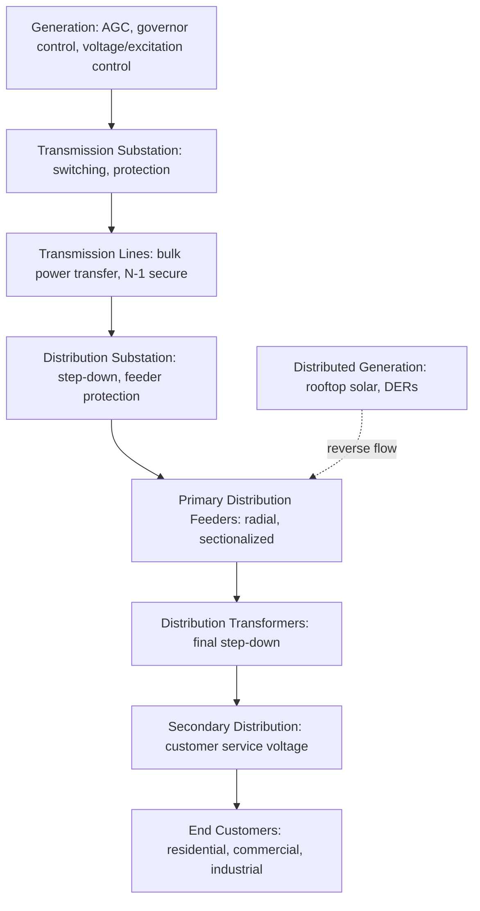

## Generation-Transmission-Distribution Hierarchy

### Definition and Purpose

The generation-transmission-distribution hierarchy is the layered physical and organizational structure through which electrical energy moves from large-scale production facilities to end consumers. This hierarchy exists because economically efficient generation occurs at scale and often far from load centers, while safe, practical delivery to individual customers requires progressively stepping voltage down and dispersing capacity across a widening geographic and electrical footprint.

**Key Points**

- Voltage is stepped up after generation to minimize $I^2R$ transmission losses over long distances, then stepped down in multiple stages as power approaches end users
- The hierarchy is typically divided into four functional layers: generation, transmission, sub-transmission, and distribution
- Historically vertically integrated utilities owned all layers; many jurisdictions have since restructured generation into competitive markets while keeping transmission and distribution as regulated natural monopolies [Unverified: market structure varies significantly by country and region and is subject to ongoing regulatory change; verify current structure for the applicable jurisdiction.]

### Overall System Structure

(svg_diagram) Generation-Transmission-Distribution Hierarchy

<svg xmlns="http://www.w3.org/2000/svg" viewBox="0 0 560 420">
<text x="280" y="25" text-anchor="middle" font-size="16" font-family="sans-serif" font-weight="bold">Power Delivery Hierarchy (svg_diagram)</text>
<rect x="200" y="45" width="160" height="45" fill="none" stroke="#8e44ad" stroke-width="2" />
<text x="280" y="72" text-anchor="middle" font-size="13" font-family="sans-serif">Generation (11–25 kV)</text>
<line x1="280" y1="90" x2="280" y2="115" stroke="#333" stroke-width="2" marker-end="url(#dn1)" />
<text x="330" y="105" font-size="11" font-family="sans-serif">Step-up XFMR</text>
<rect x="180" y="115" width="200" height="45" fill="none" stroke="#c0392b" stroke-width="2" />
<text x="280" y="142" text-anchor="middle" font-size="13" font-family="sans-serif">Transmission (115–765 kV)</text>
<line x1="280" y1="160" x2="280" y2="185" stroke="#333" stroke-width="2" marker-end="url(#dn2)" />
<text x="345" y="175" font-size="11" font-family="sans-serif">Step-down XFMR</text>
<rect x="160" y="185" width="240" height="45" fill="none" stroke="#2980b9" stroke-width="2" />
<text x="280" y="212" text-anchor="middle" font-size="13" font-family="sans-serif">Sub-Transmission (34.5–138 kV)</text>
<line x1="280" y1="230" x2="280" y2="255" stroke="#333" stroke-width="2" marker-end="url(#dn3)" />
<text x="345" y="245" font-size="11" font-family="sans-serif">Distribution Sub.</text>
<rect x="140" y="255" width="280" height="45" fill="none" stroke="#27ae60" stroke-width="2" />
<text x="280" y="282" text-anchor="middle" font-size="13" font-family="sans-serif">Primary Distribution (4–35 kV)</text>
<line x1="280" y1="300" x2="280" y2="325" stroke="#333" stroke-width="2" marker-end="url(#dn4)" />
<text x="345" y="315" font-size="11" font-family="sans-serif">Service XFMR</text>
<rect x="120" y="325" width="320" height="45" fill="none" stroke="#e67e22" stroke-width="2" />
<text x="280" y="352" text-anchor="middle" font-size="13" font-family="sans-serif">Secondary Distribution (120/240/480 V)</text>
<line x1="280" y1="370" x2="280" y2="395" stroke="#333" stroke-width="2" marker-end="url(#dn5)" />
<text x="280" y="415" text-anchor="middle" font-size="12" font-family="sans-serif" font-weight="bold">End Customers</text>
</svg>

### Generation Layer

Power plants (thermal, nuclear, hydro, wind, solar, gas turbine) produce electrical energy typically at 11–25 kV at the generator terminals — a voltage limited by generator winding insulation practicality rather than efficiency considerations. A generator step-up (GSU) transformer immediately raises this to transmission voltage.

**Key Points**

- Central station generation is sited based on fuel/resource availability (coal seams, rivers, wind corridors, solar irradiance, nuclear siting requirements), which is frequently distant from major load centers, motivating high-voltage transmission
- Distributed generation (rooftop solar, small-scale wind, combined heat and power) increasingly injects power directly at the distribution level, partially inverting the traditional one-directional hierarchy
- Generator real power output is coordinated system-wide via economic dispatch and automatic generation control (AGC) to maintain frequency and interchange schedules

### Transmission Layer

Transmission lines operate at high voltage (typically 115 kV–765 kV, with some HVDC links exceeding 800 kV) to move bulk power over long distances with minimized $I^2R$ losses for a given power transfer, since losses scale with $I^2$ while $I = P/(\sqrt{3}V\cdot pf)$ decreases as voltage increases.

$$P_{loss} = 3I^2R = \frac{P^2R}{V^2(pf)^2}$$

**Key Points**

- Transmission networks are typically meshed (interconnected in loops), providing redundancy so that loss of any single line does not necessarily interrupt service, unlike the largely radial structure common at distribution
- Transmission is planned and operated to withstand the loss of any single major element (the "N-1 criterion") without cascading failure or unacceptable overloads
- Transmission-level assets are typically owned and operated by regulated transmission utilities or independent system operators (ISOs/RTOs) in restructured markets, separate from generation ownership

### Sub-Transmission Layer

An intermediate voltage tier (commonly 34.5–138 kV, though exact ranges vary by utility and region) that bridges bulk transmission substations to distribution substations, and often also serves large industrial customers directly. Not all utilities use a formally distinct sub-transmission classification; some treat this simply as lower-voltage transmission. [Inference: sub-transmission voltage boundaries are utility- and region-specific conventions rather than a fixed universal standard.]

### Distribution Layer

**Primary Distribution** (typically 4–35 kV) carries power from distribution substations along feeders to neighborhoods and commercial areas, predominantly in radial configurations (a single path from substation to load) rather than meshed, trading redundancy for lower cost given the much larger number of distribution circuits compared to transmission lines.

**Secondary Distribution** steps down further at pole-mounted or pad-mounted distribution transformers to utilization voltage (commonly 120/240 V single-phase in North American residential contexts, or 230/400 V three-phase in many other regions) for direct connection to customer premises. [Unverified: exact utilization voltages vary substantially by country; verify local standards for a specific region.]

**Key Points**

- Radial distribution feeders are simpler and cheaper but mean a single fault typically interrupts all downstream customers until isolated and restored, motivating reclosers, sectionalizers, and (in some systems) automated feeder reconfiguration
- Distribution automation and smart grid technologies increasingly add limited meshing, automatic switching, and fault location capability to reduce outage duration and scope
- Distributed energy resources (DERs) connected at this layer can cause power to flow "backward" toward the substation under high generation/low load conditions, a scenario the traditional radial, one-directional distribution design did not originally anticipate [Inference: the degree of reverse power flow challenge depends on penetration level and specific feeder characteristics, and utility mitigation approaches vary]

### Substations as Hierarchy Transition Points

Substations are the physical nodes where voltage transformation and switching occur between hierarchy layers, housing transformers, circuit breakers, protective relays, and control/monitoring equipment (SCADA/RTUs). Major substation types include:

| Substation Type | Function |
| --- | --- |
| Generating Step-Up (GSU) | Raises generator voltage to transmission level |
| Transmission Substation | Interconnects transmission lines, switches bulk power, may include step-down to sub-transmission |
| Distribution Substation | Steps sub-transmission/transmission voltage down to primary distribution voltage |
| Customer/Industrial Substation | Serves a single large customer directly from transmission or sub-transmission |

### Functional Data/Control Flow Across the Hierarchy

### Voltage Class Summary

| Layer | Typical Voltage Range | Configuration |
| --- | --- | --- |
| Generation | 11–25 kV | Point source |
| Transmission | 115–765 kV | Meshed, N-1 secure |
| Sub-Transmission | 34.5–138 kV | Meshed or loop |
| Primary Distribution | 4–35 kV | Predominantly radial |
| Secondary Distribution | 120–600 V | Radial, direct customer connection |

[Inference: specific voltage boundaries between categories vary by utility, country, and historical system design; the ranges shown reflect common industry practice rather than a fixed international standard.]

### System Planning and Operational Implications

Each layer is planned and operated with different priorities: generation planning centers on resource adequacy and economic dispatch; transmission planning centers on reliability (N-1, N-1-1 criteria), congestion management, and long-term capacity expansion; distribution planning centers on load growth, reliability metrics (SAIDI, SAIFI), and increasingly on hosting capacity for distributed generation and electric vehicle charging. Protection philosophy also differs by layer — transmission protection emphasizes fast fault clearing and system stability preservation, while distribution protection emphasizes selective coordination (fuses, reclosers, relays) to minimize the number of customers affected by any single fault.

### Common Pitfalls

- **Assuming a fixed, universal voltage boundary between layers** — voltage classifications vary meaningfully between utilities and countries
- **Treating distribution as inherently redundant like transmission** — most distribution remains radial, so loss of a single feeder section typically causes an outage until switching/repair occurs
- **Overlooking bidirectional power flow from distributed generation** — legacy protection and voltage regulation schemes designed for one-directional power flow may require modification as DER penetration increases
- **Conflating "sub-transmission" terminology across utilities** — some utilities do not use this category at all, folding it into either transmission or distribution nomenclature

**Related Topics**

- Substation Design and Equipment (Transformers, Breakers, Protection)
- Transmission System Planning and the N-1 Reliability Criterion
- Distribution System Design: Radial vs. Meshed Topologies
- Distributed Energy Resources and Grid Integration Challenges
- SCADA and Grid Control Center Architecture
- Reliability Indices: SAIDI, SAIFI, CAIDI
- Electricity Market Structure and Vertical Unbundling