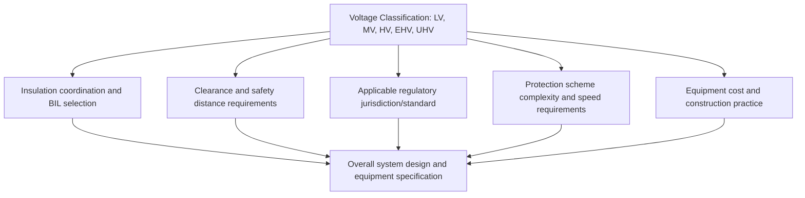

## Standard Voltage Levels and System Classification

### Definition and Purpose

Standard voltage levels are the discrete, standardized nominal voltages at which power system equipment is designed, manufactured, and interconnected. Voltage classification systems organize these standard levels into categories (low, medium, high, extra-high, ultra-high voltage) to guide insulation coordination, equipment design, safety practices, and regulatory treatment across generation, transmission, and distribution.

**Key Points**

- Standardization allows equipment from different manufacturers to interoperate and enables interconnection between neighboring utility systems
- Nominal voltage is a reference value; actual operating voltage is permitted to vary within a defined tolerance band (commonly ±5% or ±10% depending on standard and voltage class) around nominal
- Voltage standards differ between major regions (notably IEC-based systems common outside North America versus ANSI/IEEE-based systems common in North America), so equipment rated to one standard is not automatically compatible with the other [Unverified: specific voltage values and tolerance bands are defined by evolving standards documents; verify current values against the applicable IEC or ANSI/IEEE standard for a specific project.]

### Voltage Classification Categories

| Classification | Common Abbreviation | Typical Range (Line-to-Line) | Primary Use |
| --- | --- | --- | --- |
| Low Voltage | LV | Below 1 kV | Customer utilization, secondary distribution |
| Medium Voltage | MV | 1 kV – 35 kV | Primary distribution |
| High Voltage | HV | 35 kV – 230 kV | Sub-transmission, transmission |
| Extra-High Voltage | EHV | 230 kV – 800 kV | Bulk transmission |
| Ultra-High Voltage | UHV | Above 800 kV | Very long-distance bulk transmission |

[Inference: the exact numerical boundaries between these categories vary between standards bodies, countries, and even individual utilities; the ranges shown represent commonly cited industry convention rather than a single universally binding definition.]

### IEEE/ANSI Standard Voltage Classes (North America)

IEEE Std 141 and related ANSI standards define preferred nominal voltage values for North American systems:

| Category | Nominal Voltages (Common Examples) |
| --- | --- |
| Low Voltage (utilization) | 120/240 V, 208Y/120 V, 480Y/277 V, 600 V |
| Medium Voltage (distribution) | 2.4 kV, 4.16 kV, 12.47 kV, 13.8 kV, 34.5 kV |
| High Voltage (transmission) | 69 kV, 115 kV, 138 kV, 161 kV, 230 kV |
| Extra-High Voltage | 345 kV, 500 kV, 765 kV |

[Unverified: specific voltage values listed reflect commonly deployed North American standards but should be cross-checked against current IEEE/ANSI documents for a specific application, as regional variations and updates exist.]

### IEC Standard Voltage Classes (International)

IEC 60038 defines standard voltages widely used outside North America:

| Category | Nominal Voltages (Common Examples) |
| --- | --- |
| Low Voltage | 230/400 V |
| Medium Voltage | 6.6 kV, 11 kV, 22 kV, 33 kV |
| High Voltage | 66 kV, 110 kV, 132 kV, 220 kV |
| Extra-High Voltage | 400 kV, 500 kV, 765 kV |

[Unverified: specific IEC voltage values shown are illustrative of common practice; the full IEC 60038 standard and national deviations should be consulted for precise design work in a given country.]

### Voltage Tolerance and Regulation Standards

Utilization voltage standards (e.g., ANSI C84.1 in North America) define acceptable operating ranges to protect customer equipment:

$$V_{min} \leq V_{operating} \leq V_{max}$$

ANSI C84.1 defines two service voltage ranges for utilization voltage:

- **Range A**: typically ±5% of nominal, representing normal operating conditions utilities should maintain most of the time
- **Range B**: a wider band (occasionally exceeding ±5–8.3% depending on voltage class) permitted for limited durations under abnormal conditions

[Unverified: exact percentage values and their applicability differ by specific voltage class within the standard; consult the current edition of ANSI C84.1 for precise figures.]

(svg_diagram) Voltage Tolerance Band Concept

<svg xmlns="http://www.w3.org/2000/svg" viewBox="0 0 480 220">
<text x="240" y="25" text-anchor="middle" font-size="16" font-family="sans-serif" font-weight="bold">Voltage Tolerance Band (svg_diagram)</text>
<line x1="60" y1="180" x2="420" y2="180" stroke="#333" stroke-width="1" />
<line x1="60" y1="60" x2="420" y2="60" stroke="#e74c3c" stroke-width="1.5" stroke-dasharray="4,4" />
<text x="425" y="65" font-size="11" font-family="sans-serif" fill="#e74c3c">Vmax (Range B)</text>
<line x1="60" y1="90" x2="420" y2="90" stroke="#e67e22" stroke-width="1.5" stroke-dasharray="3,3" />
<text x="425" y="95" font-size="11" font-family="sans-serif" fill="#e67e22">Vmax (Range A)</text>
<line x1="60" y1="120" x2="420" y2="120" stroke="#27ae60" stroke-width="2" />
<text x="425" y="125" font-size="11" font-family="sans-serif" fill="#27ae60">Vnominal</text>
<line x1="60" y1="150" x2="420" y2="150" stroke="#e67e22" stroke-width="1.5" stroke-dasharray="3,3" />
<text x="425" y="155" font-size="11" font-family="sans-serif" fill="#e67e22">Vmin (Range A)</text>
<line x1="60" y1="170" x2="420" y2="170" stroke="#e74c3c" stroke-width="1.5" stroke-dasharray="4,4" />
<text x="425" y="175" font-size="11" font-family="sans-serif" fill="#e74c3c">Vmin (Range B)</text>
</svg>

### Preferred Voltage Ratios Between System Levels

Standard voltage levels are frequently chosen in ratios that align with common transformer turns ratios (e.g., 138/13.8 kV = 10:1), simplifying transformer manufacturing standardization and per-unit base propagation across a system. Not all adjacent voltage levels follow a clean ratio, however, since historical system development, legacy equipment, and regional practice all influence the specific voltage chosen at a given location. [Inference: the degree to which any specific system follows clean ratio conventions depends on its historical development and is not guaranteed.]

### Equipment Voltage Rating Terminology

- **Nominal system voltage**: the reference designation of a voltage class (e.g., "138 kV system")
- **Maximum system voltage** (or "highest voltage for equipment," per IEC): the highest voltage at which equipment is designed to operate continuously, always somewhat above nominal (e.g., equipment rated 145 kV for a 138 kV nominal system)
- **Rated voltage / rated insulation level**: determines dielectric withstand requirements (BIL — basic insulation level) for equipment such as transformers, breakers, and insulators, governing clearances and insulation design

$$\text{BIL (kV)} \propto f(\text{system nominal voltage, surge arrester protective level, safety margin})$$

BIL values are tabulated in standards (IEEE C57.12.00 for transformers, ANSI C37 series for breakers) as discrete standard levels associated with each voltage class rather than computed from a single formula. [Inference: exact BIL selection also depends on altitude, pollution level, and specific insulation coordination study results for a given installation.]

### Classification Impacts on Engineering Practice

**Key Points**

- Higher voltage classifications generally require larger physical clearances, more sophisticated insulation, and faster protection schemes due to the greater energy involved in a fault and reduced tolerance for sustained arcing
- Regulatory oversight often differs by voltage class — in many jurisdictions, transmission-level facilities (typically HV and above) fall under different regulatory bodies or rate structures than distribution-level (LV/MV) facilities [Unverified: specific regulatory boundaries are jurisdiction-dependent and subject to change; verify current regulatory framework for a specific region.]
- Worker safety standards (e.g., OSHA in the U.S., or equivalent bodies elsewhere) define different approach distances and PPE requirements scaled to voltage classification

### Common Pitfalls

- **Assuming voltage classification boundaries are universal** — LV/MV/HV/EHV boundaries vary between standards bodies and individual utility practice
- **Mixing IEC and ANSI/IEEE voltage values without verification** — equipment and system voltages are not universally interchangeable between the two standard families
- **Confusing nominal, maximum, and rated voltage** — specifying equipment based on nominal system voltage alone without accounting for maximum system voltage can result in inadequate insulation margin
- **Treating voltage tolerance ranges as fixed percentages across all classes** — permissible tolerance bands can differ by voltage class and standard; a blanket "±5% everywhere" assumption may not hold

**Related Topics**

- Generation-Transmission-Distribution Hierarchy
- Insulation Coordination and Basic Insulation Level (BIL)
- Transformer Voltage Ratings and Tap Changers
- Electrical Safety Standards and Approach Distances
- Per-Unit System and Base Value Selection
- Substation Design and Equipment Ratings
- International Grid Interconnection Standards