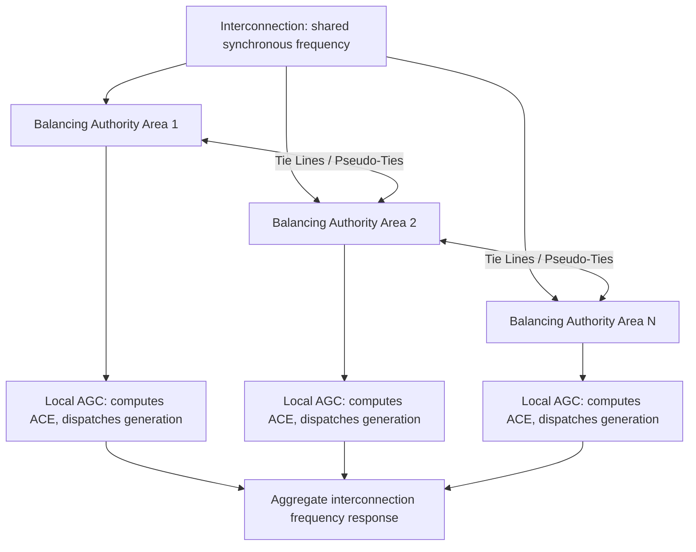

## Interconnections, Balancing Authorities, and Control Areas

### Definition and Purpose

Interconnections and balancing authorities form the organizational and electrical framework through which large-scale power grids maintain synchronism, balance generation with load, and coordinate operations across multiple ownership boundaries. This structure exists because the electric grid must be operated as a continuously balanced physical system in real time, even though it is owned, controlled, and financially managed by many separate entities.

**Key Points**

- An **interconnection** is a large synchronous AC region where all generators operate at the same electrical frequency and are electrically tied together, either directly or through synchronous AC connections
- A **balancing authority (BA)** is the entity responsible for maintaining real-time generation-load-interchange balance within a defined metered footprint and supporting interconnection frequency, a role historically referred to as a "control area operator" before NERC terminology replaced the term "control area" with "balancing authority." [Energy KnowledgeBase](https://www.energyknowledgebase.com/post/balancing-authority)
- A balancing authority integrates resource plans ahead of time, maintains load-interchange-generation balance within its balancing authority area, and supports interconnection frequency in real time. [U.S. Energy Information Administration](https://www.eia.gov/tools/glossary/index.php?id=Balancing+authority+%28electric%29)

### North American Interconnections

North America is divided into a small number of large synchronous interconnections, each operating independently at its own frequency reference (nominally 60 Hz) with only asynchronous (DC) ties between them:

| Interconnection | Approximate Coverage |
| --- | --- |
| Eastern Interconnection | Eastern two-thirds of the continental U.S. and Canada |
| Western Interconnection | Western U.S., western Canada, northern Baja California |
| ERCOT (Texas Interconnection) | Most of Texas |
| Quebec Interconnection | Quebec, Canada |

These interconnections include the Eastern Interconnection, Western Interconnection, ERCOT, and Quebec. Interconnections are electrically isolated from one another at the fundamental-frequency (synchronous) level — power is exchanged between them only through high-voltage DC (HVDC) back-to-back ties, since AC synchronous interconnection would require identical frequency and phase angle control across the entire combined region. [Inference: the number and boundaries of interconnections reflect historical grid development and remain broadly stable, but any DC tie configuration or asynchronous exchange point is subject to specific engineering and regulatory arrangements.] [NERC](https://www.nerc.com/globalassets/standards/reliability-standards/glossary_of_terms.pdf)

(svg_diagram) North American Interconnection Regions (Conceptual)

<svg xmlns="http://www.w3.org/2000/svg" viewBox="0 0 500 300">
<text x="250" y="25" text-anchor="middle" font-size="16" font-family="sans-serif" font-weight="bold">Interconnections and DC Ties (svg_diagram)</text>
<rect x="40" y="60" width="150" height="180" fill="none" stroke="#2980b9" stroke-width="2" />
<text x="115" y="150" text-anchor="middle" font-size="13" font-family="sans-serif">Western Interconnection</text>
<rect x="220" y="60" width="200" height="180" fill="none" stroke="#c0392b" stroke-width="2" />
<text x="320" y="150" text-anchor="middle" font-size="13" font-family="sans-serif">Eastern Interconnection</text>
<rect x="240" y="200" width="90" height="40" fill="none" stroke="#27ae60" stroke-width="2" />
<text x="285" y="225" text-anchor="middle" font-size="11" font-family="sans-serif">ERCOT</text>
<line x1="190" y1="150" x2="220" y2="150" stroke="#e67e22" stroke-width="3" stroke-dasharray="6,3" />
<text x="205" y="140" font-size="9" font-family="sans-serif" fill="#e67e22" text-anchor="middle">DC</text>
<line x1="240" y1="200" x2="240" y2="180" stroke="#e67e22" stroke-width="3" stroke-dasharray="6,3" />
<text x="255" y="190" font-size="9" font-family="sans-serif" fill="#e67e22">DC</text>
</svg>

### Balancing Authorities and Balancing Authority Areas

A balancing authority is the entity responsible for maintaining system frequency for an area comprising a collection of generation, transmission, and loads within metered boundaries, defined as a balancing authority area. The balancing authority area means the collection of generation, transmission, and loads within the metered boundaries of the balancing authority, and the balancing authority maintains load-resource balance within this area. [Energy KnowledgeBase](https://www.energyknowledgebase.com/post/balancing-authority)[lawinsider](https://www.lawinsider.com/dictionary/balancing-authority-area)

**Key Points**

- A single interconnection contains many balancing authority areas, each responsible for its own local generation-load balance while collectively supporting the shared interconnection frequency
- Balancing authorities can range from large regional transmission organizations covering multiple states/provinces to individual utilities serving a single service territory
- Balancing authority area footprints can change over time, and coordination processes exist to manage such footprint changes within the ERO Enterprise framework. [NERC](https://www.nerc.com/globalassets/who-we-are/standing-committees/rstc/4_-balancing-authority-area-footprint-reference-document-clean.pdf)

### Area Control Error (ACE) and Frequency Regulation

Each balancing authority continuously computes Area Control Error, the real-time metric driving Automatic Generation Control (AGC), reflecting the combined deviation of actual interchange from scheduled interchange and actual frequency from scheduled frequency:

$$ACE = (NI_A - NI_S) - 10B_i(F_A - F_S) - I_{ME}$$

where Actual Net Interchange (NIA) is the algebraic sum of actual megawatt transfers across all tie lines, including pseudo-ties, to and from all adjacent balancing authority areas within the same interconnection, and Scheduled Net Interchange (NIS) is the algebraic sum of all scheduled megawatt transfers, including dynamic schedules, to and from all adjacent balancing authority areas. Actual Frequency (FA) is the interconnection frequency measured in Hertz. $B_i$ is the balancing authority's frequency bias setting, expressed in MW per 0.1 Hz. [BAL‐005‐1 – Balancing Authority Control +3](https://www.nerc.com/globalassets/standards/projects/2010-14.2.1/bal-005-1_draft_standard_redline_01282016.pdf)

**Key Points**

- ACE drives each BA's AGC system to adjust generator setpoints, correcting both frequency deviation and interchange schedule deviation simultaneously
- Frequency bias settings are also aggregated at the interconnection level, with Bs representing the sum of the frequency bias settings for the entire interconnection. [NERC](https://www.nerc.com/globalassets/standards/reliability-standards/glossary_of_terms.pdf)
- A balancing authority is compliance-obligated to keep its Reporting ACE within bounds defined by applicable reliability standards, with supporting evidence such as voice recordings or transcripts, operator logs, and electronic communications used to demonstrate a common data source with adjacent balancing authorities. [NERC](https://www.nerc.com/globalassets/standards/reliability-standards/bal/bal-005-1.pdf)

### Tie Lines, Pseudo-Ties, and Dynamic Schedules

Balancing authority areas are electrically interconnected via **tie lines** — physical transmission circuits crossing BA boundaries. Beyond physical ties, BAs use administrative mechanisms to shift generation or load between areas without new physical infrastructure:

- **Pseudo-ties**: metering arrangements that treat a remote resource as if physically tied to a different BA for accounting purposes
- **Dynamic transfers**: a process where a balancing authority brings generation or load into its effective control boundaries through a dynamic transfer from the native balancing authority. [Certrec](https://www.certrec.com/resources/nerc-primer/nerc-glossary/)
- **Inadvertent Interchange Management (IIM)**: a frequency-neutral exchange program where multiple participating balancing authorities achieve reductions in generation control and reporting ACE through offsets to net interchange components, bringing the ACE value closer to zero for each participant. [Certrec](https://www.certrec.com/resources/nerc-primer/nerc-glossary/)

### Regional Reliability Oversight Structure

The North American bulk power system is made up of six Regional Entities operating under the Electric Reliability Organization (ERO) Enterprise, comprised of NERC and the six Regional Entities, with the vision of a highly reliable, resilient, and secure North American bulk power system. NERC's mission is to assure the effective and efficient reduction of risks to the reliability and security of the grid. [NERC](https://www.nerc.com/globalassets/who-we-are/standing-committees/rstc/4_-balancing-authority-area-footprint-reference-document-clean.pdf)[NERC](https://www.nerc.com/globalassets/who-we-are/standing-committees/rstc/4_-balancing-authority-area-footprint-reference-document-clean.pdf)

**Key Points**

- Some load-serving entities participate in one Regional Entity while their associated transmission owners/operators participate in another, creating overlapping regional footprints. [NERC](https://www.nerc.com/globalassets/who-we-are/standing-committees/rstc/4_-balancing-authority-area-footprint-reference-document-clean.pdf)
- Reliability standards such as the BAL series (e.g., BAL-003, BAL-005) govern balancing authority frequency response and control performance obligations across all interconnections
- NERC Reliability Standard BAL-003-1 has been implemented and enforced since April 2016, establishing frequency bias and frequency response obligations for balancing authorities [NERC](https://www.nerc.com/globalassets/who-we-are/standing-committees/rstc/4_-balancing-authority-area-footprint-reference-document-clean.pdf)

### Interchange and Wholesale Market Coordination

Balancing authorities coordinate scheduled power transfers through interchange transactions and, in restructured regions, through Independent System Operators (ISOs) or Regional Transmission Organizations (RTOs) that may perform both balancing authority and market operator functions simultaneously. Systems exist to track interchange transactions over specific flowgates, including databases of all interchange transactions and distribution factor matrices for regions such as the Eastern Interconnection. [NERC](https://www.nerc.com/globalassets/standards/reliability-standards/glossary_of_terms.pdf)

**Key Points**

- ISOs/RTOs (e.g., PJM, MISO, CAISO, ERCOT, SPP, ISO-NE, NYISO in the North American context) often serve as the balancing authority for their footprint while also operating competitive wholesale energy and ancillary service markets
- Interconnection agreements for new generating facilities specify obligations to the relevant balancing authority; interconnection customers are typically required to notify the responsible ISO/RTO and participating transmission owner of the balancing authority area in which a large generating facility intends to be located, well before initial synchronization. [lawinsider](https://www.lawinsider.com/dictionary/balancing-authority-area)
- Balancing authorities administer voltage schedules and require that sources of reactive power within their area are treated equitably and not unduly discriminatorily. [lawinsider](https://www.lawinsider.com/dictionary/balancing-authority-area)

### Limiting Elements and System Constraints

Within a balancing authority's operational footprint, transmission constraints are tracked via limiting elements: a limiting element is the element that is either operating at its appropriate rating or would be following the limiting contingency, thus establishing a system limit. This concept underlies congestion management and available transfer capability (ATC) calculations used in scheduling interchange between balancing authorities. [NERC](https://www.nerc.com/globalassets/standards/reliability-standards/glossary_of_terms.pdf)

### Protection System Performance Terminology

Balancing authority and reliability standard frameworks also define protection system performance terms relevant to interconnection-wide event analysis: a misoperation includes failure to trip for a fault condition the protection system was designed to clear, though failure of a protection system component is not considered a misoperation as long as the composite protection system performs correctly overall, and also includes failure to trip for reasons other than a fault. This terminology matters because major interconnection-wide disturbances are frequently traced to protection system misoperations cascading across multiple balancing authority areas. [NERC](https://www.nerc.com/globalassets/standards/reliability-standards/glossary_of_terms.pdf)

### Common Pitfalls

- **Conflating "control area" and "balancing authority" as different concepts** — these terms refer to the same functional role, with "balancing authority" being the current NERC terminology that replaced the older "control area operator" designation. [Energy KnowledgeBase](https://www.energyknowledgebase.com/post/balancing-authority)
- **Assuming interconnections can exchange AC power directly** — interconnections are synchronously isolated; any exchange occurs through asynchronous DC ties, not direct AC connection
- **Ignoring pseudo-ties and dynamic schedules when analyzing interchange** — actual net interchange calculations must include these administrative mechanisms, not just physical tie line flows
- **Assuming BA area boundaries are static** — balancing authority area footprints undergo formal change processes and are not permanently fixed [NERC](https://www.nerc.com/globalassets/who-we-are/standing-committees/rstc/4_-balancing-authority-area-footprint-reference-document-clean.pdf)

**Related Topics**

- Automatic Generation Control (AGC) and Frequency Regulation
- Independent System Operators (ISOs) and Regional Transmission Organizations (RTOs)
- Available Transfer Capability (ATC) and Congestion Management
- NERC Reliability Standards Framework (BAL, TOP, PRC Series)
- High-Voltage DC (HVDC) Interties Between Interconnections
- Frequency Response and Primary Frequency Control
- Wholesale Electricity Markets and Ancillary Services