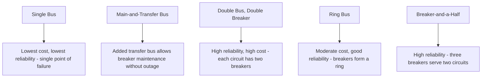
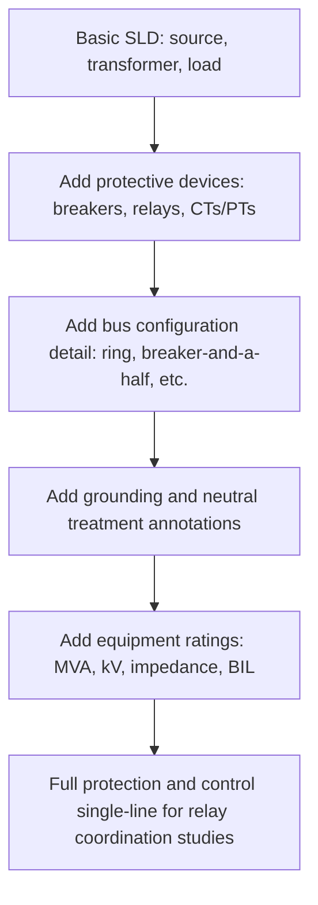

## Single-Line Diagram Conventions

### Definition and Purpose

A single-line diagram (SLD), also called a one-line diagram, is a simplified schematic representation of a three-phase power system using a single line to represent all three phases, along with standardized symbols for generators, transformers, breakers, buses, and loads. Single-line diagrams are the primary communication tool in grid engineering for system design, protection coordination, operations, and regulatory documentation, because they convey the electrical topology and equipment ratings of a system without the visual clutter of drawing all three phases explicitly.

**Key Points**

- Single-line diagrams rely on the balanced three-phase assumption for their simplification; unbalanced conditions are annotated separately (e.g., through notes on grounding or sequence impedance) rather than drawn out
- Standard symbol sets are defined by IEEE Std 315 (Graphic Symbols for Electrical and Electronics Diagrams) and complementary ANSI/IEEE device function numbering (IEEE C37.2) for protective devices [Unverified: exact standard designations and current revision status should be verified against the latest published editions.]
- A well-constructed SLD typically shows voltage levels, equipment ratings (MVA, kV, impedance), bus configurations, protective device locations, and connectivity, but omits detailed wiring, control circuits, and physical layout

### Core Symbol Set

(svg_diagram) Standard Single-Line Diagram Symbols

<svg xmlns="http://www.w3.org/2000/svg" viewBox="0 0 560 380">
<text x="280" y="25" text-anchor="middle" font-size="16" font-family="sans-serif" font-weight="bold">Common SLD Symbols (svg_diagram)</text>
<circle cx="70" cy="80" r="25" fill="none" stroke="#333" stroke-width="2" />
<text x="70" y="85" text-anchor="middle" font-size="12" font-family="sans-serif">G</text>
<text x="70" y="125" text-anchor="middle" font-size="11" font-family="sans-serif">Generator</text>
<circle cx="180" cy="70" r="18" fill="none" stroke="#333" stroke-width="2" />
<circle cx="180" cy="95" r="18" fill="none" stroke="#333" stroke-width="2" />
<text x="180" y="130" text-anchor="middle" font-size="11" font-family="sans-serif">Transformer (2-wdg)</text>
<rect x="255" y="70" width="30" height="15" fill="#333" stroke="#333" stroke-width="2" />
<text x="270" y="105" text-anchor="middle" font-size="11" font-family="sans-serif">Breaker (CB)</text>
<line x1="330" y1="60" x2="360" y2="90" stroke="#333" stroke-width="2" />
<line x1="330" y1="90" x2="360" y2="60" stroke="#333" stroke-width="2" />
<text x="345" y="115" text-anchor="middle" font-size="11" font-family="sans-serif">Disconnect Sw</text>
<line x1="420" y1="55" x2="420" y2="100" stroke="#333" stroke-width="6" />
<text x="420" y="120" text-anchor="middle" font-size="11" font-family="sans-serif">Bus</text>
<path d="M 480 60 L 495 85 L 465 85 Z" fill="none" stroke="#333" stroke-width="2" />
<text x="480" y="105" text-anchor="middle" font-size="11" font-family="sans-serif">Load (Delta)</text>
<line x1="60" y1="220" x2="60" y2="260" stroke="#333" stroke-width="2" />
<path d="M 55 255 L 65 255 L 60 270 Z" fill="#333" />
<text x="60" y="290" text-anchor="middle" font-size="11" font-family="sans-serif">Load (arrow)</text>
<circle cx="180" cy="240" r="15" fill="none" stroke="#333" stroke-width="2" />
<line x1="180" y1="225" x2="180" y2="255" stroke="#333" stroke-width="1.5" />
<line x1="180" y1="255" x2="170" y2="270" stroke="#333" stroke-width="1.5" />
<line x1="180" y1="255" x2="190" y2="270" stroke="#333" stroke-width="1.5" />
<text x="180" y="295" text-anchor="middle" font-size="11" font-family="sans-serif">Grounded Wye</text>
<path d="M 280 220 L 280 260 M 270 260 L 290 260 M 265 265 L 295 265 M 270 270 L 290 270" stroke="#333" stroke-width="2" />
<text x="280" y="290" text-anchor="middle" font-size="11" font-family="sans-serif">Ground</text>
<rect x="360" y="220" width="40" height="20" fill="none" stroke="#333" stroke-width="2" transform="rotate(0)" />
<path d="M 365 225 L 395 235 M 365 235 L 395 225" stroke="#333" stroke-width="1" />
<text x="380" y="260" text-anchor="middle" font-size="11" font-family="sans-serif">Current Transformer</text>
<circle cx="470" cy="230" r="15" fill="none" stroke="#333" stroke-width="2" />
<text x="470" y="235" text-anchor="middle" font-size="10" font-family="sans-serif">51</text>
<text x="470" y="265" text-anchor="middle" font-size="11" font-family="sans-serif">Relay (device #)</text>
</svg>

### Symbol Reference Table

| Symbol | Element | Notes |
| --- | --- | --- |
| Circle with "G" | Generator | Often annotated with MVA, kV, and reactance values |
| Two overlapping circles | Two-winding transformer | Additional circles for three-winding units; winding connection (Y/Δ) noted alongside |
| Filled rectangle | Circuit breaker | May include ANSI device number (e.g., 52 for AC circuit breaker) |
| X-shaped lines | Disconnect switch | Non-load-break isolation device |
| Thick horizontal/vertical line | Bus | Represents the common connection point for multiple circuits |
| Triangle or arrow | Load | Arrow typically denotes a generic feeder/load; specific load types may use dedicated symbols |
| Y with ground symbol | Grounded wye connection | Distinguishes grounded, ungrounded, and impedance-grounded configurations |
| Zigzag/ground symbol | System or equipment ground | Indicates grounding point and type |
| Small rectangle with taps | Current transformer (CT) | Used for metering/protection current sensing |
| Circle with number | Protective relay | Number follows IEEE C37.2 device function numbering |

### ANSI/IEEE Device Function Numbers

Protective devices and control functions on single-line diagrams are commonly labeled with standardized numeric codes per ANSI/IEEE C37.2, allowing engineers across organizations to interpret protection schemes without ambiguity regardless of manufacturer-specific naming.

| Device Number | Function |
| --- | --- |
| 21 | Distance (impedance) relay |
| 25 | Synchronizing/synchronism-check device |
| 27 | Undervoltage relay |
| 32 | Directional power relay |
| 46 | Negative-sequence current relay |
| 50 | Instantaneous overcurrent relay |
| 51 | Time-delay overcurrent relay |
| 52 | AC circuit breaker |
| 59 | Overvoltage relay |
| 67 | Directional overcurrent relay |
| 79 | Reclosing relay |
| 81 | Frequency relay |
| 87 | Differential protective relay |

[Unverified: this is a partial, commonly used subset; the complete standard defines a much larger set of numbers and suffix letter conventions, and specific project drawings should be checked against the current edition of ANSI/IEEE C37.2.]

### Bus Configuration Conventions

Single-line diagrams depict several standard substation bus arrangements, each with characteristic reliability/cost tradeoffs:

**Key Points**

- Bus configuration choice reflects a reliability-versus-cost tradeoff and is typically standardized by utility practice for a given voltage class and criticality level
- Breaker-and-a-half and ring bus schemes are common at higher-reliability transmission substations, while single or main-and-transfer bus schemes are more typical at lower-voltage or less critical distribution substations
- The single-line diagram must clearly show how each bus section connects to feeders, transformers, and tie breakers to support both planning studies and field switching operations

### Annotation Conventions

Single-line diagrams conventionally annotate:

- **Voltage level** at each bus or circuit segment (e.g., "138 kV")
- **Equipment ratings**: transformer MVA and impedance (e.g., "50 MVA, Z=8%"), generator MVA and reactances, line conductor type and length
- **Breaker/switch status**: normally open (NO) or normally closed (NC), often shown with the symbol drawn in its normal operating state
- **Grounding type**: solidly grounded, resistance grounded, ungrounded, with resistance/reactance value if applicable
- **Protective device numbers**: per ANSI/IEEE C37.2, positioned adjacent to the associated breaker or relay
- **Feeder/circuit identifiers**: names or numbers matching operational nomenclature used by the utility

**Example**

A typical annotation string next to a transformer symbol might read: `T1: 50/67/83 MVA (OA/FA/FA), 138-13.8 kV, Δ-Yg, Z=8.5%`, indicating a transformer with staged cooling-class ratings, primary and secondary voltage, delta-wye-grounded connection, and percent impedance — all information needed for load flow and fault study input without consulting a separate datasheet.

### Progression from Simple to Complex Diagrams

### Relationship to Other System Diagrams

Single-line diagrams are complemented by, but distinct from, other standard drawing types:

- **Three-line diagrams**: show all three phases explicitly, used when phase-specific detail matters (unbalanced systems, detailed relay wiring, metering circuits)
- **Impedance/reactance diagrams**: derived from the single-line diagram for load flow and fault studies, replacing physical symbols with per-unit impedance values in a network suitable for computation
- **Sequence network diagrams**: separate positive-, negative-, and zero-sequence networks derived from the single-line diagram for symmetrical component fault analysis
- **Geographic/physical layout drawings**: show actual equipment placement and conductor routing, complementing the electrically-focused single-line diagram

### Software and Digital Conventions

Modern power system analysis software (e.g., PSS/E, PowerWorld, ETAP, CYME) uses digital single-line diagrams as the primary user interface for model building, automatically deriving impedance diagrams and running load flow, short-circuit, and stability studies from the same underlying SLD-based model. [Inference: specific software feature sets and terminology vary by vendor and product version; consult current vendor documentation for a specific platform's exact conventions.]

### Common Pitfalls

- **Omitting normal breaker/switch state** — failing to indicate normally open versus normally closed status can cause misinterpretation of actual system topology during a specific operating condition
- **Inconsistent device numbering across drawings** — using non-standard or inconsistent device numbers between related diagrams complicates protection coordination review and field troubleshooting
- **Treating the SLD as sufficient for unbalanced analysis** — the single-line simplification inherently assumes balance; unbalanced studies require supplementary sequence or phase-domain models
- **Missing or outdated equipment ratings** — annotations that are not kept current with actual installed equipment can lead to incorrect study inputs and unsafe protection settings

**Related Topics**

- Substation Bus Configurations and Reliability Tradeoffs
- ANSI/IEEE Device Function Numbers and Protective Relay Coordination
- Impedance Diagrams for Load Flow and Fault Studies
- Balanced Three-Phase Circuit Analysis
- Symmetrical Components Theory
- Grounding Practices and System Neutral Grounding Methods
- Power System Modeling Software and Digital Twin Concepts