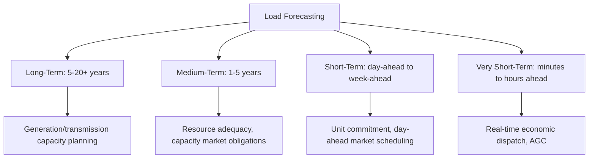

## Load Characteristics and Demand Curves

### Definition and Purpose

Load characteristics describe how electrical demand varies in magnitude, timing, and composition, while demand curves visualize this variation over time. Understanding load characteristics is fundamental to grid engineering because generation must be planned, dispatched, and reserved to match a constantly fluctuating demand in real time, and because load composition (resistive, inductive, capacitive, nonlinear) affects voltage stability, power factor, and harmonic content across the system.

**Key Points**

- Electrical load cannot be economically stored in bulk at grid scale (with limited exceptions like pumped hydro and growing battery storage), so generation must track demand essentially instantaneously
- Load varies on multiple time scales simultaneously: seconds (fluctuations), minutes-to-hours (daily load curve), days (weekday/weekend patterns), and months (seasonal patterns)
- Aggregate system load is the sum of highly diverse individual loads, and this diversity itself is a key planning parameter, since not all customers reach their individual peak demand simultaneously

### The Daily Load Curve

The most fundamental demand curve plots system load (MW) against time of day, typically showing a characteristic double-hump or single-peak pattern depending on customer mix and climate.

(svg_diagram) Typical Daily Load Curve

<svg xmlns="http://www.w3.org/2000/svg" viewBox="0 0 520 320">
<text x="260" y="25" text-anchor="middle" font-size="16" font-family="sans-serif" font-weight="bold">Typical Daily Load Curve (svg_diagram)</text>
<line x1="60" y1="270" x2="480" y2="270" stroke="#333" stroke-width="1.5" />
<line x1="60" y1="270" x2="60" y2="50" stroke="#333" stroke-width="1.5" />
<text x="270" y="300" text-anchor="middle" font-size="12" font-family="sans-serif">Time of Day (0-24h)</text>
<text x="25" y="160" text-anchor="middle" font-size="12" font-family="sans-serif" transform="rotate(-90 25 160)">Load (MW)</text>
<path d="M 60 220 Q 100 210 130 180 Q 170 130 200 100 Q 230 90 260 110 Q 290 140 310 150 Q 350 100 390 70 Q 420 60 450 90 Q 470 130 480 180" fill="none" stroke="#c0392b" stroke-width="3" />
<line x1="60" y1="240" x2="480" y2="240" stroke="#2980b9" stroke-width="2" stroke-dasharray="6,3" />
<text x="490" y="245" font-size="11" font-family="sans-serif" fill="#2980b9">Base Load</text>
<line x1="60" y1="65" x2="480" y2="65" stroke="#e67e22" stroke-width="1" stroke-dasharray="3,3" />
<text x="490" y="70" font-size="11" font-family="sans-serif" fill="#e67e22">Peak</text>
<text x="200" y="85" font-size="10" font-family="sans-serif">Morning Ramp</text>
<text x="380" y="55" font-size="10" font-family="sans-serif">Evening Peak</text>
</svg>

**Key Points**

- **Base load** is the minimum continuous demand level, typically occurring overnight, served by baseload generation (nuclear, large coal, run-of-river hydro) with low marginal operating cost and limited ramping flexibility
- **Peak load** is the maximum demand, typically occurring during morning and/or evening periods, served by a combination of intermediate and peaking generation (natural gas peakers, hydro with storage, increasingly battery storage)
- **Load factor** relates average to peak demand: $\text{Load Factor} = \dfrac{\text{Average Load}}{\text{Peak Load}}$, with higher values indicating more efficient utilization of generation and transmission capacity

### Load Duration Curve

A load duration curve reorders the chronological load curve by magnitude rather than time, plotting load against the number of hours per year that load level is equaled or exceeded, providing a direct view of how much capacity is needed for how many hours.

$$\text{Energy}_{annual} = \int_0^{8760} L(t)\,dt = \text{Area under the load duration curve}$$

(svg_diagram) Load Duration Curve

<svg xmlns="http://www.w3.org/2000/svg" viewBox="0 0 520 300">
<text x="260" y="25" text-anchor="middle" font-size="16" font-family="sans-serif" font-weight="bold">Load Duration Curve (svg_diagram)</text>
<line x1="60" y1="250" x2="480" y2="250" stroke="#333" stroke-width="1.5" />
<line x1="60" y1="250" x2="60" y2="50" stroke="#333" stroke-width="1.5" />
<text x="270" y="280" text-anchor="middle" font-size="12" font-family="sans-serif">Hours per Year (0-8760)</text>
<text x="25" y="150" text-anchor="middle" font-size="12" font-family="sans-serif" transform="rotate(-90 25 150)">Load (MW)</text>
<path d="M 60 70 Q 120 90 160 130 Q 220 180 300 210 Q 380 230 480 240" fill="none" stroke="#8e44ad" stroke-width="3" />
<text x="120" y="60" font-size="10" font-family="sans-serif">Peaking units</text>
<text x="300" y="200" font-size="10" font-family="sans-serif">Intermediate units</text>
<text x="400" y="245" font-size="10" font-family="sans-serif">Baseload units</text>
</svg>

**Key Points**

- The load duration curve directly informs generation capacity planning: baseload plants are sized to cover the flat right-hand tail (near-constant duty), while peaking units cover only the small area under the steep left-hand portion (few hours per year)
- Capacity factor for a generating unit relates its actual energy output to what it would produce running at full rated capacity continuously: $\text{Capacity Factor} = \dfrac{\text{Actual Energy Output}}{\text{Rated Capacity}\times\text{Hours}}$
- The shape of the load duration curve (how "peaky" versus "flat" it is) directly affects the economic generation mix a system requires

### Load Classification by Customer Sector

| Sector | Characteristic Load Shape | Notes |
| --- | --- | --- |
| Residential | Morning and evening peaks, strong seasonal (HVAC) sensitivity | High diversity between individual customers |
| Commercial | Daytime-dominant, business-hours peak | More predictable, weekday/weekend distinction pronounced |
| Industrial | Often flatter, process-driven, may run continuously (24/7 shifts) | Lower diversity, larger individual load blocks |
| Agricultural | Highly seasonal, irrigation-driven peaks | Can create localized distribution feeder stress |

**Key Points**

- Aggregate utility system load curves are the superposition of all sector load curves weighted by their proportion of total system demand, so the overall system shape shifts as the customer mix (e.g., increasing electrification, data center growth) evolves
- Sector-specific load research (metering studies, load surveys) supports rate design, distribution planning, and demand forecasting by characterizing typical load shapes for each customer class
- Time-of-use and demand-charge rate structures are designed partly around these characteristic sector load shapes to send price signals that encourage shifting or reducing peak demand

### Load Composition and Electrical Characteristics

Beyond timing, load composition describes the electrical nature of demand — the mix of resistive, inductive, capacitive, and nonlinear elements — which affects power factor, voltage sensitivity, and harmonic content.

| Load Type | Electrical Behavior | Example |
| --- | --- | --- |
| Constant Impedance (Z) | Power varies with voltage squared: $P\propto V^2$ | Incandescent lighting, resistive heating |
| Constant Current (I) | Power varies linearly with voltage: $P\propto V$ | Some motor and rectifier loads |
| Constant Power (P) | Power independent of voltage (within limits) | Many electronic and variable-speed drive loads |
| ZIP Model | Weighted combination of Z, I, P components | Standard composite load representation for studies |

$$P(V) = P_0\left[a_p\left(\frac{V}{V_0}\right)^2+b_p\left(\frac{V}{V_0}\right)+c_p\right]$$

where $a_p+b_p+c_p=1$ and $P_0$, $V_0$ are the power and voltage at nominal conditions. This ZIP model (and its reactive power analog) is the standard representation used in power flow and dynamic stability software to capture how aggregate load actually responds to voltage variation, rather than assuming a single fixed load type.

**Key Points**

- Constant-power loads are the most challenging for voltage stability, since their current draw increases as voltage drops (to maintain constant power), potentially exacerbating a voltage decline rather than self-limiting it
- Modern loads increasingly include power-electronic interfaces (variable frequency drives, LED drivers, switch-mode power supplies) that behave closer to constant-power characteristics and introduce harmonic content, shifting aggregate load behavior away from older, more resistive/inductive-dominated load mixes [Inference: the degree of this shift varies by region and customer mix and continues to evolve as electrification and power-electronic device penetration increases.]
- Load composition studies feed directly into voltage stability analysis, motor starting studies, and harmonic assessment

### Demand Forecasting Time Horizons

**Key Points**

- Different forecasting horizons rely on different input variables and methods: long-term forecasts emphasize economic growth, electrification trends, and demographic change, while short-term forecasts emphasize weather, calendar effects (weekday/holiday), and recent load history
- Weather sensitivity, particularly temperature-driven HVAC load, is often the dominant explanatory variable for short-term load forecast accuracy in many climates
- Forecast error directly translates into operational risk: under-forecasting peak demand can lead to inadequate reserve margins, while over-forecasting leads to unnecessarily high reserve procurement costs

### Coincidence and Diversity Factors

Because individual customer peaks do not occur simultaneously, aggregate feeder or system peak demand is less than the sum of individual customer peak demands:

$$\text{Diversity Factor} = \frac{\sum \text{Individual Peak Demands}}{\text{Coincident Peak Demand}}$$

$$\text{Coincidence Factor} = \frac{1}{\text{Diversity Factor}} = \frac{\text{Coincident Peak Demand}}{\sum \text{Individual Peak Demands}}$$

**Example**

A distribution feeder serves 100 residential customers, each with an individual peak demand of 5 kW (though not all peaking simultaneously). If the measured coincident feeder peak is 250 kW:

$$\text{Diversity Factor} = \frac{100\times5\text{ kW}}{250\text{ kW}} = \frac{500}{250} = 2.0$$

This diversity factor of 2.0 means the feeder and its upstream equipment can be sized for 250 kW rather than the full 500 kW sum of individual peaks, directly reducing required transformer and conductor capacity — a foundational concept in distribution system sizing.

### Common Pitfalls

- **Sizing infrastructure based on summed individual peak demands** — ignoring diversity/coincidence factors leads to significant over-sizing and unnecessary capital cost
- **Assuming a fixed load type (e.g., all constant-impedance) in voltage stability studies** — modern load composition increasingly includes constant-power characteristics that behave very differently under voltage disturbance
- **Confusing load factor and capacity factor** — load factor relates a load's average to its own peak, while capacity factor relates a generator's actual output to its rated capacity; conflating the two produces incorrect conclusions
- **Neglecting seasonal and weather sensitivity in short-term forecasting** — treating load as purely calendar-driven without weather inputs typically degrades forecast accuracy, especially for temperature-sensitive climates

**Related Topics**

- Load Forecasting Methods and Weather Sensitivity
- Generation Dispatch: Baseload, Intermediate, and Peaking Units
- ZIP Load Models and Voltage Stability Analysis
- Distribution System Sizing and Diversity Factors
- Demand Response and Time-of-Use Rate Design
- Capacity Markets and Resource Adequacy Planning
- Harmonic Distortion from Nonlinear and Power-Electronic Loads