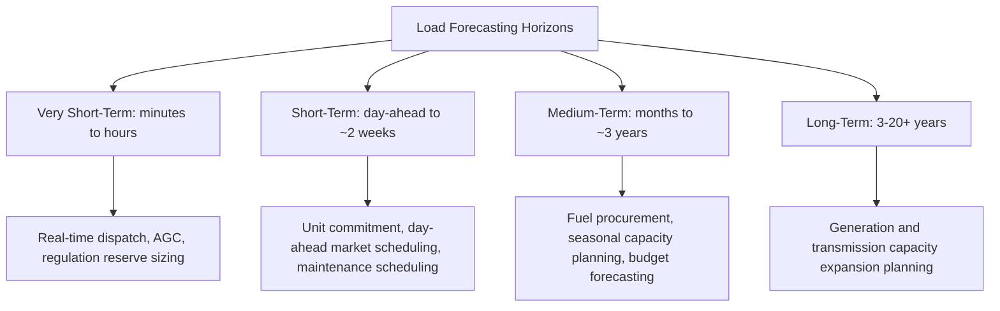
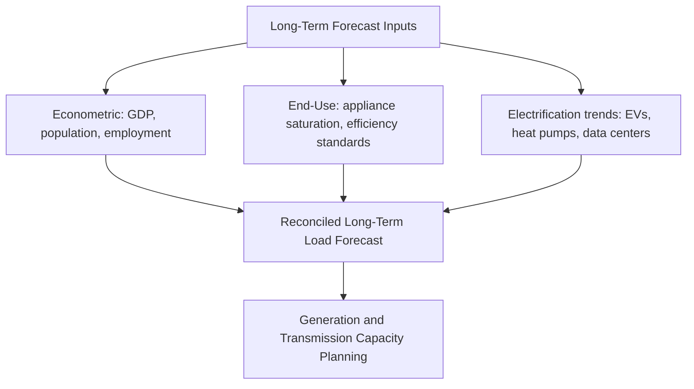

## Load Forecasting Methods

### Definition and Purpose

Load forecasting is the process of predicting future electrical demand across various time horizons to support generation planning, unit commitment, transmission expansion, and real-time system operations. Accurate forecasting underpins nearly every major grid engineering and operational decision, since both under-forecasting (risking inadequate capacity and reliability events) and over-forecasting (causing unnecessary capital and operating expenditure) carry significant economic and reliability consequences.

**Key Points**

- Load forecasts are categorized by time horizon — very short-term, short-term, medium-term, and long-term — each using different input variables, models, and update frequencies appropriate to their purpose
- Weather, particularly temperature, is typically the dominant explanatory variable for short-term forecast accuracy in most climates, especially where HVAC load is a large fraction of total demand
- No single model type is universally superior; utilities often deploy an ensemble of methods and reconcile results, since forecast accuracy requirements and available data differ substantially by horizon and application

### Forecasting Time Horizons

| Horizon | Typical Span | Primary Drivers | Key Application |
| --- | --- | --- | --- |
| Very Short-Term (VSTLF) | Minutes to a few hours | Recent load trend, real-time weather, ramping patterns | Automatic generation control, regulation reserves |
| Short-Term (STLF) | Day-ahead to ~2 weeks | Weather forecast, calendar (weekday/holiday), recent load history | Unit commitment, day-ahead scheduling |
| Medium-Term (MTLF) | Months to a few years | Seasonal patterns, economic indicators, historical trends | Fuel procurement, maintenance scheduling, budgeting |
| Long-Term (LTLF) | 3–20+ years | Economic growth, demographics, electrification trends, policy | Generation/transmission capacity expansion planning |

### Statistical and Regression-Based Methods

**Multiple Linear Regression**

Models load as a linear function of explanatory variables such as temperature, humidity, day type, and time of day:

$$L(t) = \beta_0+\beta_1T(t)+\beta_2T(t)^2+\beta_3D(t)+\beta_4H(t)+\epsilon(t)$$

where $T(t)$ is temperature (often including a quadratic term to capture both heating and cooling load response), $D(t)$ is a day-type indicator (weekday/weekend/holiday), $H(t)$ is hour-of-day, and $\epsilon(t)$ is the residual error term.

**Key Points**

- The quadratic or piecewise temperature term captures the characteristic "U-shaped" or "V-shaped" relationship between temperature and load, since both heating (cold weather) and cooling (hot weather) increase demand relative to a mild-weather baseline
- Regression coefficients are typically re-estimated periodically as new data accumulates and as underlying load composition shifts (e.g., increasing electrification or air conditioning saturation)
- Regression methods are computationally simple and interpretable, making them a common baseline against which more complex methods are benchmarked

**Time Series Methods (ARIMA and Variants)**

AutoRegressive Integrated Moving Average (ARIMA) models forecast load based on its own historical patterns and past forecast errors:

$$L(t) = c+\sum_{i=1}^{p}\phi_iL(t-i)+\sum_{j=1}^{q}\theta_j\epsilon(t-j)+\epsilon(t)$$

Seasonal ARIMA (SARIMA) extends this to explicitly capture daily, weekly, and annual periodicity common in load data.

**Key Points**

- Time series methods excel at capturing autocorrelation and periodicity inherent in load data without requiring explicit weather input, though accuracy typically degrades without exogenous variables during unusual weather events
- ARIMAX (ARIMA with exogenous inputs) variants incorporate weather and calendar variables alongside the autoregressive structure, often improving accuracy over pure time-series or pure regression approaches
- Model order selection ($p$, $d$, $q$ parameters) requires statistical diagnostic tools (autocorrelation/partial autocorrelation analysis) and is sensitive to the specific load series characteristics

### Machine Learning and AI-Based Methods

Modern load forecasting increasingly employs machine learning techniques capable of capturing nonlinear relationships and complex interactions among weather, calendar, and historical load variables.

| Method | Characteristics |
| --- | --- |
| Artificial Neural Networks (ANN) | Capture nonlinear input-output relationships; require substantial training data |
| Support Vector Regression (SVR) | Effective with smaller datasets; robust to some outliers |
| Random Forest / Gradient Boosted Trees | Handle mixed variable types well; provide feature importance insight |
| Recurrent Neural Networks (LSTM/GRU) | Explicitly model sequential/temporal dependencies in load data |
| Ensemble/Hybrid Models | Combine multiple model types to improve robustness and reduce variance |

**Key Points**

- Machine learning methods generally require larger, higher-quality historical datasets and more careful feature engineering (lagged load values, weather variables, calendar encodings) than traditional statistical methods
- Model interpretability tends to decrease as model complexity increases (e.g., deep neural networks versus linear regression), which can complicate operator trust and regulatory justification of forecasts used in critical decisions
- Overfitting risk is a persistent concern with complex ML models, particularly for extreme or rare events (unusual weather, economic shocks) that are underrepresented in historical training data [Inference: the degree of overfitting risk depends on specific model architecture, training data volume, and validation methodology employed.]

### Weather Normalization and Design Conditions

For medium- and long-term forecasting, historical load is often "weather-normalized" to remove the effect of unusually hot or cold years, isolating the underlying trend from weather-driven variability:

$$L_{normalized} = L_{actual}-f(T_{actual}-T_{normal})$$

where $f(\cdot)$ is an estimated weather-response function and $T_{normal}$ represents typical/average weather conditions for the period. Peak demand planning additionally uses **design weather conditions** (e.g., a specified extreme percentile temperature, such as the temperature exceeded only 1% of hours historically) to establish a conservative planning peak rather than relying on average conditions alone. [Unverified: specific design percentile conventions vary by utility and regulatory jurisdiction.]

### End-Use and Econometric Methods

**End-Use Modeling**

Builds forecasts bottom-up from appliance/equipment saturation and usage patterns (e.g., number of air conditioners × average AC energy use × saturation rate), useful for long-term forecasting and for explicitly modeling the impact of energy efficiency programs, electrification (EVs, heat pumps), and appliance standards.

**Econometric Modeling**

Links load growth to macroeconomic variables such as GDP, population, employment, and electricity prices, commonly used for long-term system-wide forecasts where economic drivers dominate over short-term weather variability.

### Probabilistic and Scenario-Based Forecasting

Rather than a single deterministic forecast, modern practice increasingly produces probabilistic forecasts expressing a range of outcomes with associated likelihoods, or multiple discrete scenarios (e.g., low/reference/high growth cases) to support risk-informed planning decisions.

**Key Points**

- Probabilistic forecasts support resource adequacy studies by quantifying the likelihood of demand exceeding available capacity under a distribution of possible future conditions, rather than a single point estimate
- Scenario-based approaches are particularly valuable for long-term planning given deep uncertainty in variables such as electrification pace, distributed generation adoption, and policy direction
- Extreme weather scenario stress-testing has gained emphasis following major weather-driven grid events, prompting forecasts that explicitly examine tail-risk conditions rather than only central-tendency outcomes [Inference: the specific extent and methodology of extreme-event stress testing varies by planning authority and is an evolving area of practice.]

### Forecast Accuracy Evaluation

Forecast performance is commonly assessed using standard error metrics:

$$\text{MAPE} = \frac{1}{n}\sum_{t=1}^{n}\left|\frac{L_{actual}(t)-L_{forecast}(t)}{L_{actual}(t)}\right|\times100\%$$

$$\text{RMSE} = \sqrt{\frac{1}{n}\sum_{t=1}^{n}(L_{actual}(t)-L_{forecast}(t))^2}$$

Mean Absolute Percentage Error (MAPE) and Root Mean Square Error (RMSE) are widely used, with MAPE offering intuitive percentage-based interpretation and RMSE penalizing larger errors more heavily. [Inference: acceptable error thresholds vary significantly by forecast horizon and system size — short-term hourly forecasts for large systems often achieve single-digit MAPE, while peak-day or long-term forecasts typically carry higher uncertainty — and specific benchmark values should not be assumed to generalize across all systems.]

### Emerging Challenges in Load Forecasting

Several structural shifts are increasing forecasting complexity relative to historical practice:

- **Distributed generation (behind-the-meter solar)**: net load (gross load minus behind-the-meter generation) can decouple substantially from weather-driven gross demand patterns, requiring separate modeling of solar output alongside underlying consumption
- **Electric vehicle charging**: introduces new, potentially controllable load with charging patterns influenced by driver behavior, time-of-use rates, and charging infrastructure availability
- **Data center and large flexible load growth**: large individual loads with distinct operational characteristics can materially shift system-level demand patterns and forecast uncertainty in ways not well captured by traditional aggregate statistical approaches [Inference: the specific magnitude of this effect is highly region- and system-specific depending on data center concentration.]
- **Demand response and dynamic pricing**: customer response to price signals introduces feedback loops between forecasted price, dispatched resources, and realized demand that complicate straightforward historical-pattern-based forecasting

### Common Pitfalls

- **Using a single model type across all forecast horizons** — methods well-suited to short-term operational forecasting (time series, weather regression) are often poorly suited to long-term capacity planning, which depends more on economic and structural drivers
- **Ignoring weather normalization in trend analysis** — comparing raw historical peak demand across years without weather normalization can produce misleading trend conclusions driven by weather variability rather than underlying growth
- **Underestimating net load complexity from distributed generation** — treating gross and net load as interchangeable can lead to significant forecast errors as behind-the-meter solar penetration increases
- **Over-relying on complex ML models without adequate historical data** — machine learning approaches generally need substantial, representative training data; applying them to short or non-representative datasets can produce misleadingly confident but inaccurate forecasts

**Related Topics**

- Load Characteristics and Demand Curves
- Resource Adequacy and Capacity Markets
- Distributed Energy Resources and Net Load Modeling
- Unit Commitment and Economic Dispatch
- Demand Response and Time-of-Use Rate Design
- Weather Normalization Techniques for Utility Planning
- Transmission and Generation Capacity Expansion Planning