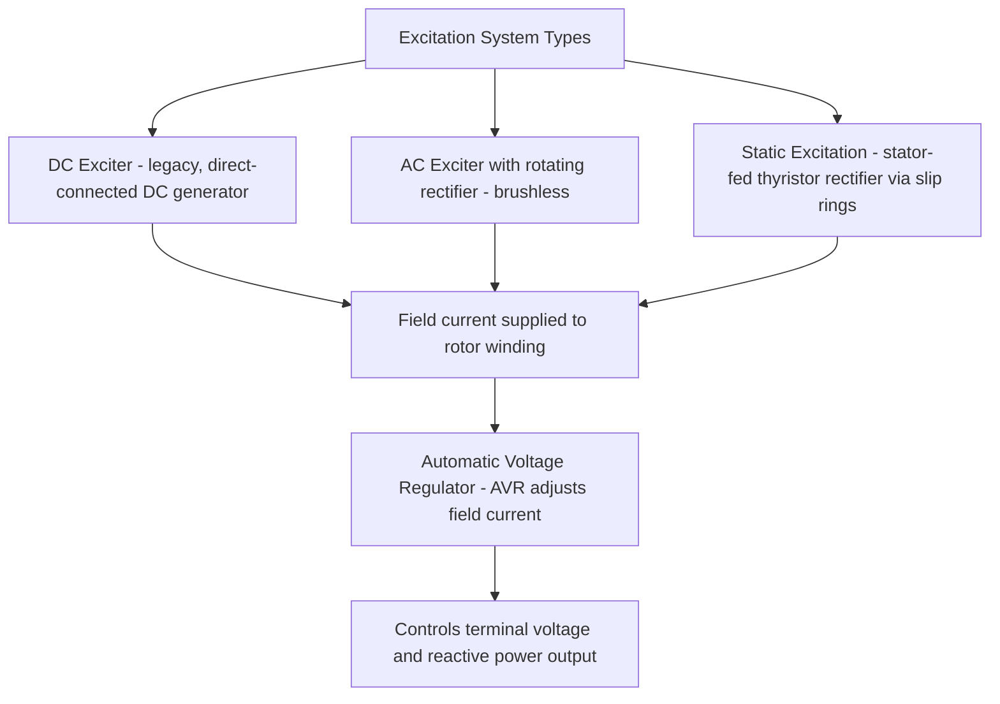

## Synchronous Generator Construction and Operating Principles

### Definition and Purpose

A synchronous generator (alternator) is a rotating electrical machine that converts mechanical energy into three-phase AC electrical energy, operating at a speed precisely synchronized to the electrical frequency it produces. Synchronous generators are the dominant source of bulk electrical energy worldwide, used in virtually all conventional thermal, nuclear, and hydroelectric power plants, and their electromechanical behavior fundamentally shapes grid stability, frequency regulation, and fault response characteristics.

**Key Points**

- Synchronous speed is rigidly tied to electrical frequency and the number of magnetic poles: $n_s = \dfrac{120f}{P}$, where $n_s$ is speed in RPM, $f$ is frequency in Hz, and $P$ is the number of poles
- Unlike induction machines, synchronous generators require a separate DC excitation source to establish rotor magnetic field, and their rotor operates at exactly synchronous speed with zero slip under steady-state conditions
- The synchronous generator's internal EMF, combined with its synchronous reactance, forms the basis for virtually all power system stability, fault analysis, and voltage control studies involving generation

### Basic Construction

(svg_diagram) Synchronous Generator Cross-Section (Conceptual)

<svg xmlns="http://www.w3.org/2000/svg" viewBox="0 0 480 380">
<text x="240" y="25" text-anchor="middle" font-size="16" font-family="sans-serif" font-weight="bold">Synchronous Generator Cross-Section (svg_diagram)</text>
<circle cx="240" cy="210" r="150" fill="none" stroke="#333" stroke-width="3" />
<text x="240" y="80" text-anchor="middle" font-size="12" font-family="sans-serif">Stator (Armature)</text>
<circle cx="240" cy="210" r="90" fill="none" stroke="#c0392b" stroke-width="2" />
<text x="240" y="150" text-anchor="middle" font-size="11" font-family="sans-serif" fill="#c0392b">Air Gap</text>
<ellipse cx="240" cy="210" rx="70" ry="45" fill="none" stroke="#2980b9" stroke-width="3" />
<text x="240" y="215" text-anchor="middle" font-size="12" font-family="sans-serif" fill="#2980b9">Rotor (Field)</text>
<text x="180" y="185" font-size="11" font-family="sans-serif" fill="#27ae60">N</text>
<text x="300" y="240" font-size="11" font-family="sans-serif" fill="#27ae60">S</text>
<line x1="90" y1="210" x2="60" y2="210" stroke="#333" stroke-width="2" />
<text x="50" y="205" font-size="10" font-family="sans-serif">Stator Slots</text>
<line x1="240" y1="210" x2="240" y2="320" stroke="#333" stroke-width="3" />
<text x="240" y="345" text-anchor="middle" font-size="11" font-family="sans-serif">Shaft (from prime mover)</text>
</svg>

**Stator (Armature)**

- Consists of a laminated ferromagnetic core containing slots for the three-phase armature windings, spatially distributed 120 electrical degrees apart
- Laminated construction reduces eddy current losses in the iron core; the armature windings carry the generator's output current and are subject to significant thermal, mechanical, and electromagnetic stress under fault conditions
- Stator winding insulation systems are rated according to voltage class and thermal class, with larger utility-scale generators often employing direct water or hydrogen cooling for the highest capacity ratings

**Rotor (Field)**

- Carries the DC-excited field winding that produces the rotating magnetic field; rotates at synchronous speed and is mechanically coupled to the prime mover (turbine)
- Two principal rotor constructions are used depending on application, detailed below
- Field current is supplied via slip rings and brushes (older designs) or brushless exciter systems (predominant in modern large machines), avoiding the maintenance and reliability concerns of physical brush contact

### Rotor Construction Types

| Type | Description | Typical Application |
| --- | --- | --- |
| Round Rotor (Cylindrical/Non-Salient Pole) | Smooth cylindrical rotor with distributed field windings in slots; mechanically robust at high speed | High-speed machines: steam and gas turbine generators (2-pole or 4-pole, 3000/3600 RPM) |
| Salient Pole Rotor | Rotor with distinct protruding poles carrying concentrated field windings | Low-speed machines: hydroelectric generators (many poles, lower RPM) |

**Key Points**

- Round rotor construction suits high-speed applications because its cylindrical shape withstands the large centrifugal stresses at 3000–3600 RPM without the pole-piece attachment challenges salient construction would present
- Salient pole construction is practical and economical for lower-speed, higher-pole-count machines (hydro generators may have dozens of poles running at a few hundred RPM), where centrifugal stress is far lower
- The rotor type has direct electromagnetic consequences: salient pole machines exhibit different reactance along the pole axis versus the interpolar axis (saliency), producing distinct direct-axis and quadrature-axis reactances ($X_d$, $X_q$), while round rotor machines have approximately equal reactance in all directions

### Excitation Systems

The field winding requires a controlled DC current source (the exciter) to establish and regulate rotor flux, directly controlling generator terminal voltage and reactive power output.

**Key Points**

- Brushless excitation systems mount a small AC generator (exciter armature) on the main rotor shaft, with output rectified by rotating diodes/thyristors mounted on the shaft itself, eliminating slip rings and brushes for the main field circuit
- Static excitation systems draw power from the generator's own terminals (or an auxiliary source), rectify it via stationary thyristors, and deliver it to the rotor field winding through slip rings — offering faster response than rotating exciter schemes in many designs [Inference: relative response speed comparisons depend on specific system design and are not universal across all implementations.]
- The Automatic Voltage Regulator (AVR) continuously adjusts field current to maintain terminal voltage setpoint and manage reactive power output, forming a critical control loop for grid voltage support and transient stability

### Operating Principle: EMF Generation

As the rotor field rotates past the stationary armature windings, it induces a sinusoidal EMF in each stator phase per Faraday's law, with frequency determined by rotor speed and pole count:

$$f = \frac{P\cdot n_s}{120}$$

The induced RMS EMF per phase depends on the field flux, winding turns, and speed:

$$E = 4.44\,k_w\,f\,N_{ph}\,\Phi$$

where $k_w$ is the winding factor (accounting for distributed and short-pitched winding effects), $N_{ph}$ is turns per phase, and $\Phi$ is the flux per pole. This is the standard EMF equation for AC rotating machines, analogous in form to the transformer EMF equation.

### Synchronous Reactance and the Equivalent Circuit

Under steady-state balanced operation, a round-rotor synchronous generator is modeled per phase as an internal EMF source behind synchronous reactance and armature resistance:

$$\tilde{E} = \tilde{V}+\tilde{I}(R_a+jX_s)$$

where $\tilde{E}$ is the internal generated EMF (per phase), $\tilde{V}$ is terminal voltage, $\tilde{I}$ is armature current, $R_a$ is armature resistance (often small relative to reactance), and $X_s$ is synchronous reactance, which combines the armature leakage reactance and the armature reaction reactance representing the demagnetizing/magnetizing effect of armature current on the air-gap flux.

(svg_diagram) Synchronous Generator Per-Phase Equivalent Circuit

<svg xmlns="http://www.w3.org/2000/svg" viewBox="0 0 460 180">
<text x="230" y="25" text-anchor="middle" font-size="16" font-family="sans-serif" font-weight="bold">Round-Rotor Equivalent Circuit (svg_diagram)</text>
<circle cx="70" cy="100" r="25" fill="none" stroke="#333" stroke-width="2" />
<text x="70" y="105" text-anchor="middle" font-size="14" font-family="sans-serif">E</text>
<line x1="95" y1="100" x2="150" y2="100" stroke="#333" stroke-width="2" />
<rect x="150" y="85" width="40" height="30" fill="none" stroke="#333" stroke-width="2" />
<text x="170" y="105" text-anchor="middle" font-size="11" font-family="sans-serif">Ra</text>
<line x1="190" y1="100" x2="230" y2="100" stroke="#333" stroke-width="2" />
<path d="M 230 100 q 8 -12 16 0 t 16 0 t 16 0 t 16 0" fill="none" stroke="#333" stroke-width="2" />
<text x="270" y="80" text-anchor="middle" font-size="11" font-family="sans-serif">jXs</text>
<line x1="298" y1="100" x2="360" y2="100" stroke="#333" stroke-width="2" />
<line x1="360" y1="70" x2="360" y2="130" stroke="#333" stroke-width="2" />
<text x="380" y="105" font-size="14" font-family="sans-serif">V</text>
</svg>

**Key Points**

- Synchronous reactance $X_s$ is typically the dominant term in the equivalent circuit (armature resistance $R_a$ is often neglected in approximate analysis, though it matters for loss calculations)
- The load angle $\delta$, the angle between $\tilde{E}$ and $\tilde{V}$, directly determines real power output and is a central quantity in transient stability analysis
- Salient pole machines require the more detailed two-reactance (direct-axis $X_d$ and quadrature-axis $X_q$) model rather than the single synchronous reactance model, since their air-gap reluctance varies with rotor position

### Power-Angle Relationship

For a round-rotor generator connected to an infinite bus (neglecting armature resistance):

$$P = \frac{EV}{X_s}\sin\delta$$

$$Q = \frac{EV\cos\delta-V^2}{X_s}$$

**Key Points**

- Real power output increases with load angle $\delta$ up to a theoretical maximum at $\delta=90°$ (the steady-state stability limit for a round-rotor machine); beyond this point, further increasing mechanical input causes the machine to lose synchronism
- Reactive power output is controlled primarily by field excitation: increasing field current increases $E$, increasing $Q$ delivered to the system (over-excited operation); decreasing field current below the level needed to match $V$ causes the generator to absorb reactive power (under-excited operation)
- This power-angle relationship is the foundation of transient stability analysis via the equal-area criterion and swing equation, since $\delta$ evolves dynamically following disturbances

### Prime Mover Types and Governor Control

| Prime Mover | Typical Speed | Rotor Type | Response Characteristics |
| --- | --- | --- | --- |
| Steam Turbine | 3000/3600 RPM (2-pole) | Round rotor | Slower ramping, high thermal inertia |
| Gas Turbine | 3000/3600 RPM | Round rotor | Faster start/ramp than steam |
| Hydro Turbine | Variable (often low, many poles) | Salient pole | Fast response, good for regulation/peaking |
| Nuclear (Steam) | 1500/1800 or 3000/3600 RPM | Round rotor | Very high inertia, minimal ramping flexibility |

Governors regulate prime mover mechanical power input in response to speed (frequency) deviation, forming the primary frequency response mechanism at the individual generator level, which aggregates across all online generators to provide system-wide primary frequency response following a generation-load imbalance.

### Generator Capability Curve

Synchronous generators have an operating envelope, the capability curve, bounding allowable real and reactive power combinations based on:

- **Armature current (stator) thermal limit**: bounds total apparent power output regardless of power factor
- **Field current (rotor) thermal limit**: bounds maximum over-excited reactive power output
- **Stator end-region heating / underexcitation limit**: bounds maximum under-excited (absorbing) reactive power operation, particularly relevant at low real power output
- **Prime mover / turbine limit**: bounds maximum real power output based on mechanical input capability

[Inference: the exact shape and binding constraint of a specific generator's capability curve depends on its individual design parameters and must be obtained from manufacturer test data for precise operational limits; the general categories of limiting constraints described are standard across synchronous machine theory.]

### Grounding and Neutral Treatment

Generator neutral grounding method (solidly grounded, high-resistance grounded, or ungrounded) affects ground fault current magnitude and protection scheme design. High-resistance grounding is common for generator step-up transformer configurations to limit stator ground fault current and associated iron core damage, a widely used practice for unit-connected generators. [Inference: specific grounding method selection depends on system voltage class, generator size, and protection philosophy, and varies across individual utility and plant design standards.]

### Common Pitfalls

- **Confusing synchronous speed with slip-dependent operation** — unlike induction machines, synchronous generators operate at exactly synchronous speed in steady state; there is no slip in normal operation
- **Applying the single-reactance round-rotor model to salient pole machines** — salient pole machines require the two-axis ($X_d$, $X_q$) model for accurate power-angle and stability analysis
- **Assuming reactive power output is controlled by mechanical (governor) input** — real power is controlled by prime mover mechanical input via the governor, while reactive power is controlled by field excitation via the AVR; conflating these two independent control loops is a common conceptual error
- **Neglecting capability curve constraints in operational planning** — dispatching a generator based on nameplate MVA alone without considering the full capability curve can lead to exceeding rotor or stator thermal limits under certain power factor conditions

**Related Topics**

- Synchronous Generator Steady-State Equivalent Circuit (Round Rotor vs. Salient Pole)
- Generator Excitation Systems and Automatic Voltage Regulators (AVR)
- Power-Angle Curves and the Equal-Area Criterion for Transient Stability
- Generator Capability Curves and Reactive Power Limits
- Swing Equation and Rotor Angle Dynamics
- Generator Grounding Methods and Ground Fault Protection
- Governor Control and Primary Frequency Response