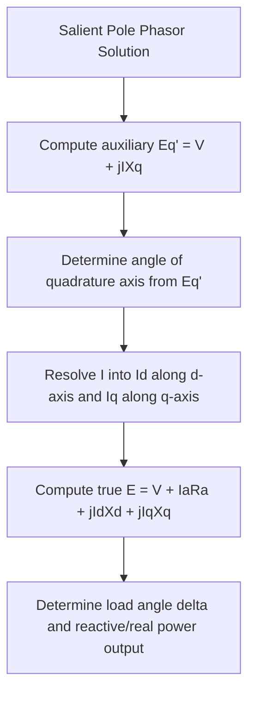

## Generator Equivalent Circuit and Phasor Diagram Analysis

### Definition and Purpose

The generator equivalent circuit and its associated phasor diagram provide the analytical framework for quantifying the steady-state relationship between a synchronous generator's internal excitation voltage, terminal voltage, armature current, and internal reactance. This framework is essential in grid engineering for determining generator loading limits, voltage regulation behavior, reactive power capability, and stability margins under varying operating conditions.

**Key Points**

- Two distinct equivalent circuit models exist depending on rotor construction: the single-reactance model for round-rotor (cylindrical) machines, and the two-reactance ($X_d$, $X_q$) model for salient-pole machines
- Phasor diagrams provide a graphical solution method that parallels the algebraic equivalent circuit equations, offering intuitive insight into how excitation and loading changes affect operating point
- All quantities in these models are per-phase, RMS values, consistent with standard power system phasor convention

### Round-Rotor (Cylindrical) Equivalent Circuit

For a round-rotor synchronous generator, the per-phase equivalent circuit consists of the internal EMF source behind armature resistance and synchronous reactance:

$$\tilde{E} = \tilde{V}+\tilde{I}(R_a+jX_s)$$

Since $R_a \ll X_s$ for most machines above small sizes, a common simplification neglects armature resistance for angle and reactive power calculations (though $R_a$ remains relevant for loss and efficiency calculations):

$$\tilde{E} \approx \tilde{V}+j\tilde{I}X_s$$

(svg_diagram) Round-Rotor Equivalent Circuit

<svg xmlns="http://www.w3.org/2000/svg" viewBox="0 0 460 180">
<text x="230" y="25" text-anchor="middle" font-size="16" font-family="sans-serif" font-weight="bold">Round-Rotor Equivalent Circuit (svg_diagram)</text>
<circle cx="70" cy="100" r="25" fill="none" stroke="#333" stroke-width="2" />
<text x="70" y="105" text-anchor="middle" font-size="14" font-family="sans-serif">E</text>
<line x1="95" y1="100" x2="150" y2="100" stroke="#333" stroke-width="2" />
<rect x="150" y="85" width="40" height="30" fill="none" stroke="#333" stroke-width="2" />
<text x="170" y="105" text-anchor="middle" font-size="11" font-family="sans-serif">Ra</text>
<line x1="190" y1="100" x2="230" y2="100" stroke="#333" stroke-width="2" />
<path d="M 230 100 q 8 -12 16 0 t 16 0 t 16 0 t 16 0" fill="none" stroke="#333" stroke-width="2" />
<text x="270" y="80" text-anchor="middle" font-size="11" font-family="sans-serif">jXs</text>
<line x1="298" y1="100" x2="360" y2="100" stroke="#333" stroke-width="2" />
<line x1="360" y1="70" x2="360" y2="130" stroke="#333" stroke-width="2" />
<text x="380" y="105" font-size="14" font-family="sans-serif">V</text>
<text x="220" y="145" font-size="12" font-family="sans-serif">I →</text>
</svg>

### Phasor Diagram: Lagging Power Factor (Overexcited)

(svg_diagram) Phasor Diagram — Lagging Power Factor

<svg xmlns="http://www.w3.org/2000/svg" viewBox="0 0 460 380">
<text x="230" y="25" text-anchor="middle" font-size="16" font-family="sans-serif" font-weight="bold">Phasor Diagram: Lagging PF (svg_diagram)</text>
<line x1="80" y1="320" x2="420" y2="320" stroke="#888" stroke-width="1" />
<line x1="80" y1="320" x2="80" y2="60" stroke="#888" stroke-width="1" />
<line x1="80" y1="320" x2="300" y2="320" stroke="#e67e22" stroke-width="3" marker-end="url(#mV)" />
<text x="200" y="340" font-size="13" fill="#e67e22" font-family="sans-serif" font-weight="bold">V (ref, 0°)</text>
<line x1="80" y1="320" x2="240" y2="230" stroke="#2980b9" stroke-width="3" marker-end="url(#mI)" />
<text x="150" y="255" font-size="13" fill="#2980b9" font-family="sans-serif" font-weight="bold">I (lagging φ)</text>
<line x1="300" y1="320" x2="300" y2="130" stroke="#27ae60" stroke-width="2" stroke-dasharray="4,2" />
<text x="305" y="200" font-size="12" fill="#27ae60" font-family="sans-serif">jIXs</text>
<line x1="80" y1="320" x2="300" y2="130" stroke="#c0392b" stroke-width="3" marker-end="url(#mE)" />
<text x="260" y="115" font-size="14" fill="#c0392b" font-family="sans-serif" font-weight="bold">E</text>
<path d="M 130 320 A 50 50 0 0 0 108 288" fill="none" stroke="#333" stroke-width="1" />
<text x="125" y="300" font-size="11" font-family="sans-serif">φ</text>
<path d="M 180 320 A 100 100 0 0 0 190 235" fill="none" stroke="#333" stroke-width="1" />
<text x="190" y="290" font-size="11" font-family="sans-serif">δ</text>
</svg>

**Key Points**

- For a lagging (inductive) power factor load, $E > V$ in magnitude — the generator must be **overexcited** to supply reactive power to the system, consistent with typical grid operation supplying inductive loads
- The load angle $\delta$ (between $E$ and $V$) increases with real power delivered; the power factor angle $\phi$ (between $V$ and $I$) is set by the connected load's reactive demand
- The phasor $jIX_s$ is drawn perpendicular to (leading) the current phasor $I$, then added to $V$ to construct $E$ — this geometric construction directly mirrors the algebraic equation $\tilde{E}=\tilde{V}+j\tilde{I}X_s$

### Phasor Diagram: Leading Power Factor (Underexcited)

(svg_diagram) Phasor Diagram — Leading Power Factor

<svg xmlns="http://www.w3.org/2000/svg" viewBox="0 0 460 320">
<text x="230" y="25" text-anchor="middle" font-size="16" font-family="sans-serif" font-weight="bold">Phasor Diagram: Leading PF (svg_diagram)</text>
<line x1="80" y1="260" x2="420" y2="260" stroke="#888" stroke-width="1" />
<line x1="80" y1="260" x2="80" y2="60" stroke="#888" stroke-width="1" />
<line x1="80" y1="260" x2="300" y2="260" stroke="#e67e22" stroke-width="3" marker-end="url(#nV)" />
<text x="200" y="280" font-size="13" fill="#e67e22" font-family="sans-serif" font-weight="bold">V (ref, 0°)</text>
<line x1="80" y1="260" x2="270" y2="180" stroke="#2980b9" stroke-width="3" marker-end="url(#nI)" />
<text x="180" y="200" font-size="13" fill="#2980b9" font-family="sans-serif" font-weight="bold">I (leading φ)</text>
<line x1="300" y1="260" x2="220" y2="90" stroke="#27ae60" stroke-width="2" stroke-dasharray="4,2" />
<text x="230" y="170" font-size="12" fill="#27ae60" font-family="sans-serif">jIXs</text>
<line x1="80" y1="260" x2="220" y2="90" stroke="#c0392b" stroke-width="3" marker-end="url(#nE)" />
<text x="180" y="80" font-size="14" fill="#c0392b" font-family="sans-serif" font-weight="bold">E</text>
</svg>

For a leading (capacitive) power factor load, $E$ can be smaller in magnitude than $V$ or only slightly larger, corresponding to **underexcited** operation where the generator absorbs reactive power from the system — a condition requiring careful monitoring due to stator end-region heating and reduced steady-state stability margin.

### Worked Example: Round-Rotor Generator

A 3-phase, Y-connected synchronous generator has per-phase synchronous reactance $X_s = 2.5\,\Omega$ (armature resistance neglected), rated terminal voltage $V = 2400$ V (line-to-neutral), delivering rated current $I = 400$ A at $0.85$ power factor lagging.

**Step 1 — Establish reference and current phasor:**

$$\tilde{V} = 2400\angle0°\text{ V}, \quad \phi = \cos^{-1}(0.85) = 31.79°\text{ (lagging)}$$

$$\tilde{I} = 400\angle{-31.79°}\text{ A}$$

**Step 2 — Compute the reactive drop:**

$$j\tilde{I}X_s = (400\angle{-31.79°})(2.5\angle90°) = 1000\angle58.21°\text{ V}$$

Converting to rectangular: $1000\angle58.21° = 525.6+j849.6$ V

**Step 3 — Compute internal EMF:**

$$\tilde{E} = \tilde{V}+j\tilde{I}X_s = (2400+j0)+(525.6+j849.6) = 2925.6+j849.6\text{ V}$$

$$|\tilde{E}| = \sqrt{2925.6^2+849.6^2} = 3047.4\text{ V}, \quad \delta = \tan^{-1}\left(\frac{849.6}{2925.6}\right) = 16.19°$$

The internal EMF magnitude of 3047.4 V (per phase) exceeds terminal voltage of 2400 V, confirming overexcited operation consistent with supplying a lagging power factor load, and the 16.19° load angle indicates substantial margin remains before the round-rotor steady-state stability limit at 90°.

**Step 4 — Real and reactive power delivered:**

$$P = 3VI\cos\phi = 3(2400)(400)(0.85) = 2{,}448{,}000\text{ W} = 2.448\text{ MW}$$

$$Q = 3VI\sin\phi = 3(2400)(400)(0.527) = 1{,}517{,}760\text{ VAR} = 1.518\text{ MVAR}$$

### Salient-Pole (Two-Reactance) Equivalent Circuit

Salient pole machines exhibit different reluctance along the direct axis (aligned with the field pole) versus the quadrature axis (between poles), requiring decomposition of armature current into direct-axis and quadrature-axis components:

$$\tilde{E} = \tilde{V}+I_aR_a+jI_dX_d+jI_qX_q$$

where $I_d$ and $I_q$ are the direct-axis and quadrature-axis components of armature current, and $X_d > X_q$ typically, since the direct axis has a smaller effective air gap (through the pole face) than the quadrature axis (between poles) in most salient designs.

**Key Points**

- The two-reactance model requires first locating the direction of $\tilde{E}$ (which lies along the quadrature axis) before decomposing $\tilde{I}$ into $I_d$ and $I_q$, making the phasor construction more involved than the single-reactance round-rotor case
- A common solution technique first computes an auxiliary voltage $\tilde{E}_q' = \tilde{V}+j\tilde{I}X_q$ to locate the angle of the quadrature axis, then resolves the actual current into $I_d$ and $I_q$ relative to that axis before computing the true internal EMF
- The power-angle equation for a salient pole machine includes an additional reluctance torque term beyond the round-rotor form:

$$P = \frac{EV}{X_d}\sin\delta+\frac{V^2(X_d-X_q)}{2X_dX_q}\sin2\delta$$

### Voltage Regulation

Voltage regulation quantifies how much terminal voltage would rise if load were removed while holding field current constant, a standard performance metric for generator design comparison:

$$\text{VR}(\%) = \frac{E-V_{rated}}{V_{rated}}\times100\%$$

Using the worked example above: $\text{VR} = \dfrac{3047.4-2400}{2400}\times100\% = 27.0\%$

**Key Points**

- Higher synchronous reactance generally produces higher voltage regulation (greater voltage rise on load rejection), reflecting a larger internal voltage drop under load
- Voltage regulation is computed at constant field current (open-circuit-like condition after load removal), distinguishing it from the AVR's normal closed-loop terminal-voltage-holding behavior during actual operation
- Modern generators rely on the AVR to actively counteract this voltage change in real operation, so the open-circuit voltage regulation figure primarily serves as a design/comparison metric rather than describing normal operational behavior

### Determining Synchronous Reactance from Test Data

Synchronous reactance (unsaturated) is commonly derived from two standard no-load/short-circuit tests:

$$X_s = \frac{\text{Open-Circuit Voltage (line-to-neutral) at rated field current}}{\text{Short-Circuit Current at the same field current}}$$

This ratio, combined with the **Short-Circuit Ratio (SCR)** — defined as the ratio of field current needed for rated open-circuit voltage to field current needed for rated short-circuit armature current — provides standard design and commissioning parameters correlated with machine stability characteristics and physical size. [Inference: the precise relationship between SCR and stability margin depends on additional machine-specific parameters beyond synchronous reactance alone, and manufacturer test certificates should be consulted for definitive machine characteristics.]

### Common Pitfalls

- **Applying the single-reactance model to a salient-pole machine** — this omits the reluctance torque term and produces measurably inaccurate power-angle predictions for salient designs, particularly at larger load angles
- **Neglecting armature resistance where losses or angle precision matter** — while often small, $R_a$ affects efficiency calculations and introduces a small phase shift the pure-reactance approximation omits
- **Confusing load angle $\delta$ with power factor angle $\phi$** — $\delta$ is measured between $E$ and $V$ (an internal machine quantity reflecting loading/torque), while $\phi$ is measured between $V$ and $I$ (reflecting the connected load's reactive characteristic); these are generally different angles
- **Misinterpreting voltage regulation as an operational voltage deviation** — VR describes a specific no-load-versus-rated-load comparison at fixed field current, not the AVR-corrected terminal voltage behavior seen during normal grid-connected operation

**Related Topics**

- Synchronous Generator Construction and Operating Principles
- Power-Angle Curves and the Equal-Area Criterion for Transient Stability
- Generator Capability Curves and Reactive Power Limits
- Salient Pole Machine Direct-Axis and Quadrature-Axis Theory
- Short-Circuit Ratio and Generator Design Parameters
- Automatic Voltage Regulators and Excitation Control
- Synchronous Machine Parallel Operation and Synchronizing