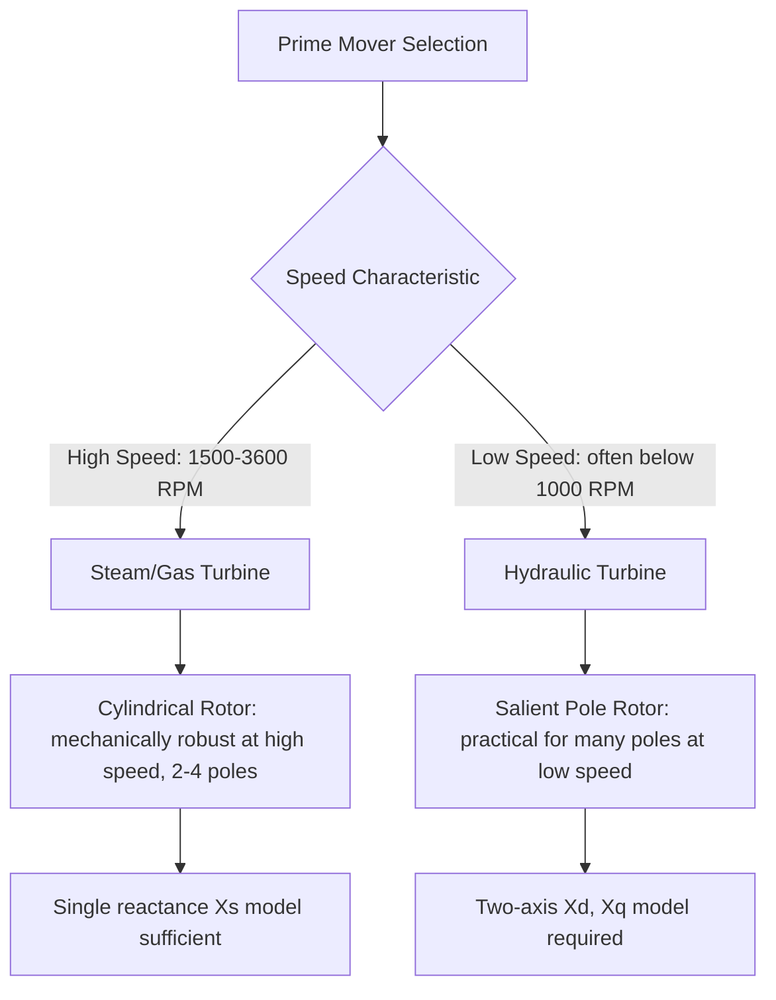

## Salient-Pole versus Cylindrical-Rotor Machine Behavior

### Definition and Purpose

Salient-pole and cylindrical-rotor (round-rotor) machines represent two fundamentally different synchronous generator rotor geometries, each producing distinct electromagnetic behavior due to non-uniform versus uniform air-gap reluctance. Understanding these differences is essential in grid engineering because rotor construction directly determines the appropriate equivalent circuit model, power-angle characteristics, transient stability behavior, and fault response of a given generator.

**Key Points**

- The fundamental distinction is air-gap uniformity: cylindrical rotors present a uniform air gap to the armature regardless of rotor position, while salient-pole rotors present a non-uniform air gap that varies with rotor angle
- This geometric difference produces two distinct magnetic reluctance paths in salient machines — direct axis (d-axis, aligned with the pole) and quadrature axis (q-axis, between poles) — requiring a two-reactance model, whereas cylindrical rotors are adequately described by a single synchronous reactance
- Rotor type selection is driven primarily by speed and pole-count requirements dictated by the prime mover, not by arbitrary design preference

### Physical Construction Comparison

(svg_diagram) Cylindrical vs Salient Pole Rotor Cross-Sections

<svg xmlns="http://www.w3.org/2000/svg" viewBox="0 0 560 300">
<text x="280" y="25" text-anchor="middle" font-size="16" font-family="sans-serif" font-weight="bold">Rotor Geometry Comparison (svg_diagram)</text>
<text x="140" y="55" text-anchor="middle" font-size="13" font-family="sans-serif" font-weight="bold">Cylindrical (Round) Rotor</text>
<circle cx="140" cy="170" r="100" fill="none" stroke="#333" stroke-width="2" />
<circle cx="140" cy="170" r="65" fill="none" stroke="#2980b9" stroke-width="3" />
<text x="140" y="175" text-anchor="middle" font-size="11" font-family="sans-serif" fill="#2980b9">Uniform Air Gap</text>
<line x1="140" y1="105" x2="140" y2="235" stroke="#888" stroke-width="1" stroke-dasharray="3,3" />
<text x="145" y="100" font-size="10" font-family="sans-serif">Distributed field slots</text>
<text x="420" y="55" text-anchor="middle" font-size="13" font-family="sans-serif" font-weight="bold">Salient Pole Rotor</text>
<circle cx="420" cy="170" r="100" fill="none" stroke="#333" stroke-width="2" />
<path d="M 420 105 L 400 130 L 400 210 L 440 210 L 440 130 Z" fill="none" stroke="#c0392b" stroke-width="2" />
<path d="M 355 170 L 380 150 L 460 150 L 485 170 L 460 190 L 380 190 Z" fill="none" stroke="#27ae60" stroke-width="1" stroke-dasharray="4,2" />
<text x="420" y="230" text-anchor="middle" font-size="10" font-family="sans-serif" fill="#c0392b">d-axis (through pole)</text>
<text x="500" y="175" font-size="10" font-family="sans-serif" fill="#27ae60">q-axis</text>
</svg>

| Characteristic | Cylindrical (Round) Rotor | Salient-Pole Rotor |
| --- | --- | --- |
| Air gap | Uniform around circumference | Non-uniform; smaller under pole face, larger between poles |
| Typical pole count | 2 or 4 poles | Many poles (often 6 to 60+) |
| Typical speed | High (1500/1800 or 3000/3600 RPM) | Low to moderate (below ~1000 RPM) |
| Mechanical robustness | High — withstands large centrifugal stress | Lower — pole pieces limit maximum safe speed |
| Typical prime mover | Steam turbine, gas turbine | Hydraulic turbine, diesel/reciprocating engine |
| Reactance model | Single synchronous reactance $X_s$ | Two-axis: $X_d$ and $X_q$ |

### Origin of the Two-Reactance Model

In a salient-pole machine, magnetic flux following the direct axis (through the pole, where the air gap is small) encounters much lower reluctance than flux following the quadrature axis (between poles, where the effective air gap is large due to interpolar gaps). This produces two distinct reactance values:

$$X_d = X_{leakage}+X_{ad}, \quad X_q = X_{leakage}+X_{aq}$$

where $X_{ad}$ and $X_{aq}$ are the direct-axis and quadrature-axis armature reaction reactances, with $X_{ad} > X_{aq}$ since the direct-axis magnetic path has lower reluctance. For a cylindrical rotor, the air gap is uniform in all directions, so $X_d \approx X_q = X_s$, collapsing the two-axis model to the familiar single synchronous reactance.

**Key Points**

- Typical salient-pole machines exhibit $X_q/X_d$ ratios in the range of roughly 0.6–0.7, though exact values are design-specific [Inference: this ratio range reflects commonly cited textbook values; actual machine designs vary and manufacturer data should be consulted for precise parameters.]
- Cylindrical rotor machines have $X_d$ and $X_q$ so close in value that the distinction is neglected in standard analysis, justifying the simpler single-reactance treatment
- The saliency ratio ($X_d/X_q$) directly determines the magnitude of the reluctance torque component present in salient machines but absent in round-rotor machines

### Power-Angle Characteristic Comparison

**Cylindrical Rotor:**

$$P = \frac{EV}{X_s}\sin\delta$$

**Salient-Pole Rotor:**

$$P = \frac{EV}{X_d}\sin\delta+\frac{V^2(X_d-X_q)}{2X_dX_q}\sin2\delta$$

(svg_diagram) Power-Angle Curve Comparison

<svg xmlns="http://www.w3.org/2000/svg" viewBox="0 0 500 320">
<text x="250" y="25" text-anchor="middle" font-size="16" font-family="sans-serif" font-weight="bold">Power-Angle Curves (svg_diagram)</text>
<line x1="60" y1="270" x2="460" y2="270" stroke="#333" stroke-width="1.5" />
<line x1="60" y1="270" x2="60" y2="50" stroke="#333" stroke-width="1.5" />
<text x="260" y="295" text-anchor="middle" font-size="12" font-family="sans-serif">Load Angle δ (0-180°)</text>
<text x="25" y="160" text-anchor="middle" font-size="12" font-family="sans-serif" transform="rotate(-90 25 160)">Power P</text>
<path d="M 60 270 Q 160 90 260 90 Q 360 90 460 270" fill="none" stroke="#2980b9" stroke-width="3" />
<text x="360" y="80" font-size="11" fill="#2980b9" font-family="sans-serif">Round Rotor (sin δ)</text>
<path d="M 60 270 Q 140 100 200 70 Q 260 60 320 90 Q 380 130 460 270" fill="none" stroke="#c0392b" stroke-width="3" />
<text x="180" y="55" font-size="11" fill="#c0392b" font-family="sans-serif">Salient Pole (sin δ + sin 2δ term)</text>
<line x1="260" y1="270" x2="260" y2="50" stroke="#888" stroke-width="1" stroke-dasharray="3,3" />
<text x="260" y="285" text-anchor="middle" font-size="10" font-family="sans-serif">90°</text>
</svg>

**Key Points**

- The reluctance torque term ($\sin 2\delta$) shifts the salient-pole machine's peak power point to an angle **less than 90°** (typically around 60–70° depending on the specific $X_d/X_q$ ratio), unlike the round-rotor machine whose peak occurs precisely at 90°
- This means the steady-state stability limit for a salient-pole machine occurs at a smaller load angle than for an equivalent round-rotor machine, an important distinction for stability margin assessment
- The reluctance torque component exists even with zero field excitation ($E=0$), since it arises purely from the rotor's magnetic asymmetry — this is the same physical principle exploited by reluctance motors

### Behavior Under Fault Conditions

Both rotor types exhibit transient and subtransient reactance values ($X_d'$, $X_d''$) that are smaller than steady-state synchronous reactance, governing the initial high-magnitude fault current that decays toward the steady-state short-circuit value as the fault persists. [Inference: the specific relative magnitudes and decay time constants for $X_d'$, $X_d''$, and associated time constants are machine-design-specific and require manufacturer data for precise fault studies, though the general pattern of decaying fault current applies broadly across both rotor types.]

**Key Points**

- Salient-pole machines, due to their distributed damper windings (amortisseur windings) commonly embedded in the pole faces, often exhibit different subtransient behavior in the d-axis versus q-axis, requiring both $X_d''$ and $X_q''$ for complete fault analysis
- Damper windings serve an additional critical function beyond fault response: providing damping torque during transient oscillations and enabling asynchronous starting torque, particularly important for salient-pole machines connected to weaker systems
- Round-rotor machines, with their solid or slotted rotor forgings, provide inherent eddy-current damping paths analogous in function to discrete damper windings in salient designs

### Application Context and Selection Rationale

**Key Points**

- The choice of rotor type is fundamentally driven by the mechanical speed dictated by the prime mover: high-speed steam and gas turbines pair naturally with 2-pole or 4-pole cylindrical rotors, while low-speed hydraulic turbines pair naturally with many-pole salient designs where cylindrical construction would be mechanically impractical
- Hydroelectric plants, due to relatively low turbine speeds (dictated by water head and turbine design), require a large number of poles to achieve standard grid frequency, naturally leading to salient-pole construction where individual poles can be economically manufactured and mounted
- Diesel and reciprocating-engine generators, similarly operating at moderate-to-low speeds, also typically employ salient-pole construction

### Worked Comparison Example

Two hypothetical generators, both rated 100 MVA, 13.8 kV, deliver rated real power to an infinite bus with $E=1.15$ pu, $V=1.0$ pu:

**Round-rotor case** ($X_s = 1.0$ pu):

$$P_{max} = \frac{EV}{X_s} = \frac{1.15\times1.0}{1.0} = 1.15\text{ pu, occurring at }\delta=90°$$

**Salient-pole case** ($X_d = 1.0$ pu, $X_q = 0.65$ pu):

$$P(\delta) = \frac{1.15\times1.0}{1.0}\sin\delta+\frac{1.0^2(1.0-0.65)}{2(1.0)(0.65)}\sin2\delta = 1.15\sin\delta+0.269\sin2\delta$$

Evaluating at several angles: at $\delta=60°$, $P=1.15(0.866)+0.269(0.866)=1.230$ pu; at $\delta=90°$, $P=1.15(1.0)+0.269(0)=1.150$ pu. The salient-pole case reaches a higher peak power at an angle below 90° (numerically closer to 60–70° for this parameter set) before declining, illustrating the practical effect of the reluctance torque term on the operating characteristic. [Inference: the exact peak angle location depends on the specific $E$, $X_d$, and $X_q$ values used; the calculated values above are specific to this illustrative parameter set, not universal constants.]

### Common Pitfalls

- **Applying $X_s$ alone to a salient-pole machine** — this omits the reluctance torque contribution and produces an inaccurate power-angle curve, particularly noticeable near and beyond the round-rotor-equivalent stability limit
- **Assuming the peak power angle is always 90°** — this holds only for round-rotor machines; salient-pole machines peak at a smaller angle due to the reluctance torque term
- **Neglecting damper winding effects in stability studies** — damper windings materially affect transient response and asynchronous behavior, particularly relevant during fault recovery and out-of-step conditions
- **Assuming rotor type correlates directly with generator size** — rotor type selection is driven by required speed (hence pole count) for the specific prime mover, not by generator MVA rating alone; both large hydro (salient) and large thermal (round-rotor) units exist across a wide range of capacities

**Related Topics**

- Generator Equivalent Circuit and Phasor Diagram Analysis
- Power-Angle Curves and the Equal-Area Criterion for Transient Stability
- Transient and Subtransient Reactance in Fault Analysis
- Damper Windings and Asynchronous Starting Behavior
- Synchronous Generator Construction and Operating Principles
- Reluctance Torque and Reluctance Motor Principles
- Swing Equation and Rotor Angle Dynamics