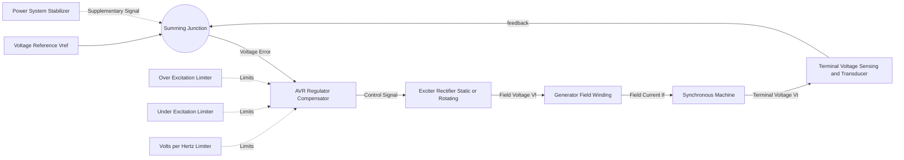

## Excitation Systems and Automatic Voltage Regulation

### Overview

The excitation system supplies direct current to the field winding of a synchronous generator, establishing the rotor magnetic field required for electromechanical energy conversion. The Automatic Voltage Regulator (AVR) is the control subsystem that continuously adjusts this field current to hold terminal voltage at a设定 (set) reference despite load changes, disturbances, and system faults. Together, these systems govern reactive power output, terminal voltage regulation, steady-state and transient stability, and overexcitation/underexcitation protection.

### Functional Role in Generator Operation

**Key Points**

- Controls terminal voltage magnitude by regulating field (rotor) current $I_f$
- Determines reactive power ($Q$) contribution/absorption of the generator
- Provides the primary means of enhancing transient stability through fast field forcing
- Supplies protective limiting functions (over-excitation, under-excitation, V/Hz)
- Participates in power system voltage/reactive power (Var) coordination

The relationship between field current and internal EMF is approximately linear in the unsaturated region of the machine's magnetization curve:

$$E_f = k \cdot I_f \cdot \omega$$

where $E_f$ is the internal generated EMF, $I_f$ is field current, $\omega$ is rotor angular speed, and $k$ is a machine-specific constant dependent on winding turns and magnetic circuit geometry. Because $\omega$ is held near synchronous speed by the prime mover's governor, $I_f$ becomes the dominant control variable for $E_f$, and hence for terminal voltage and reactive power.

### Excitation System Types

#### DC Excitation Systems (Type DC)

Uses a DC generator (often mounted on the same shaft) as the source of field power, feeding the main generator's field winding through slip rings or a direct connection. This is largely a legacy technology in new installations.

**Key Points**

- Utilizes a rotating DC exciter, typically driven from the same shaft
- Represented in stability studies by the IEEE Type DC1A/DC2A models
- Relatively slow response due to the exciter's own field time constant
- [Unverified] Modern grids retain a decreasing but non-trivial population of these systems on older units still in service

#### AC Excitation Systems (Type AC)

Uses an AC alternator (pilot exciter or main exciter) whose output is rectified — typically via a rotating rectifier assembly — to supply DC to the main field. This eliminates brushes and slip rings when a rotating rectifier (brushless) configuration is used.

**Key Points**

- Rotating armature AC exciter + rotating diode rectifier bridge (brushless configuration is common)
- No brushes/slip rings in brushless designs, reducing maintenance
- Modeled by IEEE Type AC1A, AC2A, AC3A, AC4A, AC5A families depending on rectifier type (controlled/uncontrolled) and feedback structure
- Ceiling voltage limited by rotating rectifier and exciter alternator saturation characteristics
- Field current cannot be measured directly in brushless designs (no slip rings), complicating some protection schemes [Inference] — this is why brushless units often rely on indirect field current estimation or exciter-side sensing

#### Static Excitation Systems (Type ST)

Derives excitation power directly from the generator terminals (or a separate auxiliary source) through a step-down transformer and a thyristor/SCR-based controlled rectifier bridge, delivering DC field current to the main field winding via brushes and slip rings.

**Key Points**

- Fast response — thyristor bridges permit sub-cycle to few-cycle firing angle adjustment
- Requires brushes/slip rings for DC field current delivery
- High ceiling voltage achievable (often 1.5–2x rated field voltage or higher), giving strong field-forcing capability
- Modeled by IEEE Type ST1A, ST2A, ST3A, ST4B, ST5B (differing by rectifier configuration, potential/compound source, and feedback structure)
- Dependent on terminal voltage for excitation power — a severe terminal short circuit reduces available excitation voltage precisely when field forcing is most needed; compound source (potential + current) variants of ST systems mitigate this by drawing part of the excitation source from stator current transformers

### Comparison Table

| Type | Excitation Source | Response Speed | Brushes/Slip Rings | Typical IEEE Model |
| --- | --- | --- | --- | --- |
| DC | Rotating DC exciter | Slow | Yes | DC1A, DC2A |
| AC (brushless) | Rotating AC exciter + rotating rectifier | Moderate | No | AC1A–AC5A |
| Static | Generator terminals/aux source + static rectifier | Fast | Yes | ST1A–ST5B |

### AVR Control Loop Architecture

The AVR forms a closed-loop feedback controller regulating terminal voltage $V_t$ to a reference $V_{ref}$.

#### Core Blocks

- **Voltage Transducer and Load Compensation**: Senses three-phase terminal voltage, rectifies/filters it, and optionally applies line-drop or reactive-current compensation to simulate voltage regulation at a remote point (useful for generators sharing a bus)
- **Comparator/Summing Junction**: Computes voltage error $\Delta V = V_{ref} - V_t$
- **Regulator (Compensator)**: A PI or lead-lag controller (varies by manufacturer/model) that shapes the error signal into a control command, balancing response speed against stability margins
- **Exciter**: Power-amplification stage converting the low-power control signal into the field voltage/current delivered to the machine
- **Power System Stabilizer (PSS)**: Injects a supplementary signal (derived from speed, power, or frequency deviation) into the AVR summing junction to damp low-frequency electromechanical oscillations (typically 0.1–3 Hz)

### Simplified AVR Transfer Function Model

A commonly used simplified representation for the exciter/regulator combination in stability studies is a first-order lag:

$$G_{AVR}(s) = \frac{K_A}{1 + sT_A}$$

where $K_A$ is regulator gain and $T_A$ is the regulator time constant. The exciter itself is often modeled with its own first-order dynamics plus a saturation function $S_E$:

$$G_{EX}(s) = \frac{1}{K_E + sT_E}$$

with $K_E$ representing the exciter self-excitation constant and $T_E$ the exciter time constant. Saturation effects, represented by $S_E(E_{fd})$, account for magnetic nonlinearity at high field voltage — a factual, well-documented feature of standard exciter models (e.g., IEEE Std 421.5).

### Limiter and Protection Functions

#### Over-Excitation Limiter (OEL) / Field Current Limiter

**Key Points**

- Prevents sustained field current above the thermal rating of the rotor winding
- Typically has an inverse-time characteristic — permits brief overexcitation for transient support before ramping the setpoint down
- Engages during severe voltage dips or reactive power demand spikes to protect rotor insulation from overheating

#### Under-Excitation Limiter (UEL)

**Key Points**

- Prevents operation too far into the underexcited (absorbing Var) region, which risks:
  - Loss of synchronism due to reduced synchronizing torque
  - Stator end-core heating from increased flux fringing at low/leading power factor
- Typically shaped as a curve in the $P$–$Q$ plane, activating as reactive absorption increases with active power output

#### Volts-per-Hertz (V/Hz) Limiter/Protection

**Key Points**

- Guards against core overfluxing, since flux is proportional to $V/f$
- Especially relevant during startup, shutdown, or off-frequency operation when voltage may be present at reduced frequency
- Overfluxing causes excessive core losses and localized heating, risking insulation damage

#### Power System Stabilizer Interaction

While not strictly a limiter, the PSS is functionally part of the same control cluster, and its output is typically limited in magnitude to prevent it from driving the AVR into destabilizing excursions during large disturbances.

### Reactive Capability and the AVR

The AVR's action directly determines where the generator operates on its reactive capability curve. Field current limits (via the OEL), stator current limits, and prime mover limits jointly bound the achievable $P$–$Q$ operating region.

$$Q_{max}(P) = \sqrt{\left(\frac{E_f V_t}{X_s}\right)^2 - P^2} - \frac{V_t^2}{X_s}$$

[Inference] This is a simplified round-rotor approximation neglecting saliency and saturation; salient-pole machines and saturated conditions require correction terms not captured in this expression.

### Steady-State and Transient Stability Contribution

Fast excitation response with high ceiling voltage improves first-swing transient stability by rapidly restoring internal EMF (and hence synchronizing torque) following a fault. The synchronizing power coefficient benefits from higher $E_f$ during the post-fault recovery period.

**Example**

Following a nearby three-phase fault clearance, a static exciter with a ceiling voltage of 2.0 per unit and near-instantaneous response can drive field voltage to its ceiling within a few cycles, whereas a DC exciter with a large field time constant may take several seconds to approach its (typically lower) ceiling — a materially slower contribution to post-fault synchronizing torque. [Behavior may vary with specific exciter parameters, machine saturation characteristics, and system impedance.]

### IEEE Standard Modeling Framework

**Key Points**

- IEEE Std 421.5 defines standardized block-diagram models (DC1A/DC2A, AC1A–AC5A, ST1A–ST5B, and others) used by power system stability simulation tools (e.g., PSS/E, PowerWorld, DIgSILENT PowerFactory)
- Standardization allows interoperable exchange of excitation system data between utilities, vendors, and reliability coordinators for interconnection studies
- Model selection depends on matching the physical exciter topology (rotating vs. static, controlled vs. uncontrolled rectification) to the appropriate block diagram
- [Unverified] Specific parameter values (gains, time constants) are manufacturer- and unit-specific and are typically obtained through field testing per IEEE Std 421.2 guidelines rather than assumed from generic defaults

### Typical AVR Response Diagram (svg_diagram)

<svg xmlns="http://www.w3.org/2000/svg" viewBox="0 0 640 320">
<text x="320" y="20" text-anchor="middle" font-size="14" font-weight="bold">AVR Step Response to Voltage Reference Change (svg_diagram)</text>
<line x1="60" y1="270" x2="600" y2="270" stroke="black" stroke-width="1.5" />
<line x1="60" y1="270" x2="60" y2="40" stroke="black" stroke-width="1.5" />
<text x="600" y="290" font-size="12">Time</text>
<text x="20" y="45" font-size="12">Vt (pu)</text>
<line x1="60" y1="150" x2="600" y2="150" stroke="gray" stroke-width="1" stroke-dasharray="4,4" />
<text x="605" y="153" font-size="11">Vref</text>
<path d="M 60 150 L 100 150 L 110 60 L 140 100 L 170 140 L 200 155 L 230 148 L 260 151 L 290 150 L 600 150" fill="none" stroke="#1a5276" stroke-width="2" />
<text x="115" y="55" font-size="11">Overshoot</text>
<text x="230" y="175" font-size="11">Settling</text>
<line x1="100" y1="270" x2="100" y2="260" stroke="black" />
<text x="95" y="285" font-size="11">t0 (step applied)</text>
</svg>

### Practical Field Considerations

**Key Points**

- Slip ring maintenance (brush wear, carbon dust) is a recurring operational item for DC and static (non-brushless) systems
- Rotating rectifier diode failures in brushless AC systems require monitoring (e.g., via flux monitoring or vibration/wear indicators) since direct field current measurement is unavailable
- AVR tuning (gain, time constants) is performed to balance fast voltage recovery against oscillatory stability, often validated via step-response and frequency-response testing per IEEE Std 421.2
- Redundant/dual-channel AVR configurations are common in critical generating units to avoid single-point-of-failure loss of excitation

### Loss of Excitation

**Key Points**

- A field circuit open circuit, exciter failure, or AVR malfunction can cause loss of excitation
- The generator draws reactive power from the grid to sustain the magnetic field, shifting into an induction-generator-like mode
- Detected via loss-of-excitation (LOE) protection, typically an offset-mho impedance relay (ANSI device 40) monitoring the trajectory of apparent impedance seen at the generator terminals
- Left uncleared, this risks pole slipping, stator/rotor overheating, and potential impact on system voltage stability, particularly for larger units relative to system strength [Inference — severity is system- and unit-size-dependent]

### Related Topics

- Power System Stabilizer (PSS) design and tuning
- Generator reactive capability curves (D-curves)
- Loss of Excitation Protection (ANSI 40)
- Synchronous machine saturation characteristics (open-circuit and short-circuit tests)
- IEEE Std 421.5 excitation system models in detail
- Volts-per-Hertz protection and overfluxing phenomena
- Power system voltage stability and Var/voltage control coordination
- Synchronizing power coefficients and transient stability analysis
- Field testing procedures for excitation system parameter verification (IEEE Std 421.2)