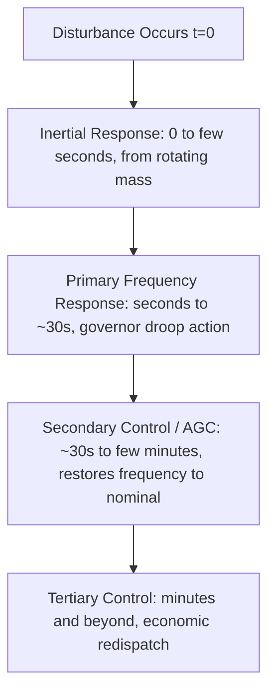

## Governor Systems and Speed-Droop Control

### Overview

The governor is the control system that regulates the mechanical power input to a synchronous generator's prime mover (steam turbine, gas turbine, hydro turbine, or diesel engine) in response to deviations in shaft speed (and thus system frequency). Speed-droop control is the characteristic proportional control law that allows multiple generators to share load changes in a stable, predictable manner across an interconnected power system. Together, governors and droop characteristics form the primary mechanism of primary frequency control in power systems.

### Functional Role in Frequency Control

**Key Points**

- Regulates prime mover mechanical power $P_m$ in response to speed/frequency deviation $\Delta f$
- Provides primary frequency response (fast, automatic, local) within seconds of a generation-load imbalance
- Establishes load-sharing proportions among parallel-connected generators via droop settings
- Works in a control hierarchy beneath secondary frequency control (AGC — Automatic Generation Control) and tertiary control (economic dispatch)

The fundamental physical relationship driving governor action is the swing equation, which links net accelerating power to rotor speed deviation:

$$2H \frac{d\Delta\omega}{dt} = P_m - P_e$$

where $H$ is the per-unit inertia constant, $\Delta\omega$ is the per-unit speed deviation, $P_m$ is mechanical input power, and $P_e$ is electrical output power. When $P_e > P_m$ (e.g., after a load increase), the rotor decelerates, and the governor responds by increasing $P_m$ to arrest the frequency decline.

### Speed-Droop Characteristic

#### Definition

Droop (or speed regulation, $R$) defines the steady-state relationship between frequency deviation and change in mechanical power output. It is expressed as a percentage:

$$R = \frac{-\Delta f / f_0}{\Delta P_m / P_{rated}} \times 100\%$$

A typical droop setting is 4–5% (sometimes 5–6% depending on standard and jurisdiction), meaning a 4–5% frequency deviation from nominal would, in principle, drive the unit from zero to full output if frequency were the sole input and no other limits intervened.

#### Governor Droop Equation

The steady-state governor control law is commonly expressed as:

$$\Delta P_m = -\frac{1}{R} \Delta f$$

This creates a negative feedback relationship: as frequency falls (indicating a generation deficit), the governor commands more mechanical power; as frequency rises (generation surplus), it commands less.

#### Droop Characteristic Diagram (svg_diagram)

<svg xmlns="http://www.w3.org/2000/svg" viewBox="0 0 640 360">
<text x="320" y="20" text-anchor="middle" font-size="14" font-weight="bold">Speed-Droop Characteristic (svg_diagram)</text>
<line x1="80" y1="300" x2="580" y2="300" stroke="black" stroke-width="1.5" />
<line x1="80" y1="300" x2="80" y2="40" stroke="black" stroke-width="1.5" />
<text x="585" y="304" font-size="12">Power Output (pu)</text>
<text x="20" y="45" font-size="12">Frequency (pu)</text>
<line x1="80" y1="100" x2="580" y2="100" stroke="gray" stroke-dasharray="4,4" />
<text x="30" y="103" font-size="11">1.05</text>
<line x1="80" y1="170" x2="580" y2="170" stroke="gray" stroke-dasharray="4,4" />
<text x="30" y="173" font-size="11">1.00 (f0)</text>
<line x1="80" y1="240" x2="580" y2="240" stroke="gray" stroke-dasharray="4,4" />
<text x="30" y="243" font-size="11">0.95</text>
<line x1="120" y1="100" x2="480" y2="240" stroke="#1a5276" stroke-width="2.5" />
<text x="130" y="90" font-size="11">No-load frequency setpoint</text>
<line x1="300" y1="300" x2="300" y2="170" stroke="black" stroke-dasharray="2,3" />
<line x1="80" y1="170" x2="300" y2="170" stroke="black" stroke-dasharray="2,3" />
<text x="290" y="315" font-size="11">0.5 pu</text>
<text x="480" y="315" font-size="11">1.0 pu</text>
<text x="70" y="315" font-size="11">0</text>
</svg>

### Governor Block Diagram

```mermaid
flowchart LR
    FREF[Reference Speed/Load Setpoint] --> SUM((Summing Junction))
    OMEGA[Measured Shaft Speed] -->|feedback| SUM
    SUM -->|Speed Error| DROOP[Droop Compensation 1/R]
    DROOP --> GOV[Governor Controller PID or Mechanical-Hydraulic]
    GOV -->|Valve/Gate Position Command| ACT[Actuator Servo]
    ACT -->|Steam Valve or Gate Opening| PM[Prime Mover Turbine]
    PM -->|Mechanical Power Pm| SHAFT[Generator Shaft]
    SHAFT -->|Speed| OMEGA
    LFC[Load Frequency Control / AGC] -.->|Setpoint Bias| FREF
```

### Types of Governors by Technology

#### Mechanical-Hydraulic Governors

**Key Points**

- Legacy technology using flyball/centrifugal mechanisms and hydraulic amplification (dashpots, pilot valves)
- Droop is set mechanically via linkage adjustment
- Slower response, limited flexibility for supplementary control signals
- [Unverified] Largely superseded by electronic governors in modern installations, though some legacy hydro and steam units retain mechanical-hydraulic systems

#### Electro-Hydraulic Governors (EHG)

**Key Points**

- Electronic control logic (analog or digital) drives a hydraulic actuator (servo valve) to position steam/gate control elements
- Combines electronic flexibility (easy tuning, supplementary inputs like AGC signals) with hydraulic actuator force capacity needed for large valves/gates
- Standard on most modern large steam and hydro units

#### Digital Electronic Governors (DEG)

**Key Points**

- Fully digital control implemented in a turbine control system (e.g., programmable logic controllers or dedicated turbine controllers)
- Enables complex control laws: PID with gain scheduling, load-limiting functions, valve management logic, and communication with plant DCS/SCADA
- Common on modern gas turbines and combined-cycle plants

### Prime-Mover-Specific Governor Considerations

#### Steam Turbine Governors

**Key Points**

- Control steam admission via governor (control) valves
- Must coordinate with boiler-following or turbine-following control philosophy depending on unit design
- Fast valving and intercept valve control can be used for transient stability enhancement following severe faults
- Reheat cycle introduces significant time lag between control valve action and full power response due to reheater volume

#### Hydraulic (Hydro) Turbine Governors

**Key Points**

- Control wicket gate (or blade pitch, for Kaplan units) position
- Water column dynamics in the penstock create a non-minimum-phase response — an increase in gate opening initially reduces power output slightly before increasing it, due to water inertia and pressure wave effects
- Dashpot (transient droop) compensation is used to prevent instability caused by this water hammer effect, using a temporary higher effective droop that decays over time
- Governor tuning must account for penstock length, surge tank presence, and water starting time constant $T_w$

#### Gas Turbine Governors

**Key Points**

- Regulate fuel flow (and sometimes inlet guide vanes) to control power
- Faster response than steam units due to lower thermal/mechanical lag, though subject to firing temperature and compressor surge limits
- Often include temperature control loops that can override speed/load control near operational limits

### Transient (Temporary) Droop for Hydro Governors

To stabilize the water-hammer-influenced response of hydro units, a transient droop term is added, typically implemented via a dashpot (rate feedback) circuit:

$$G_{td}(s) = \frac{R_t \cdot T_r \cdot s}{1 + T_r \cdot s}$$

where $R_t$ is the transient droop and $T_r$ is the reset (dashpot) time constant. This provides high effective droop (stabilizing) during fast transients while allowing the permanent droop $R$ to govern steady-state behavior. [Behavior may vary with specific governor tuning and hydraulic plant parameters.]

### Load Sharing Among Parallel Generators

When multiple generators with droop characteristics $R_1, R_2, \ldots, R_n$ operate in parallel on an interconnected system, a system-wide frequency deviation $\Delta f$ causes each unit to change output according to its own droop setting:

$$\Delta P_i = -\frac{1}{R_i} \Delta f$$

Units with lower droop (stiffer characteristic) pick up proportionally more of a load change than units with higher droop, assuming similar per-unit bases. This proportional sharing is the foundation of stable parallel operation without requiring explicit inter-unit communication.

**Example**

Two units, each with 5% droop but different ratings (100 MW and 200 MW), experience a system frequency drop. On a per-unit-of-own-rating basis, both units move the same percentage of their own capacity, meaning the 200 MW unit picks up twice the absolute MW as the 100 MW unit for the same frequency deviation, since droop is normalized to each unit's own rated output. [Illustrative numeric example; actual response depends on governor dead bands, valve limits, and unit-specific dynamics.]

### Governor Dead Band

**Key Points**

- A small range around nominal frequency within which the governor does not act, to avoid excessive valve/gate movement from normal system frequency noise
- Regulatory standards (e.g., NERC in North America) specify maximum allowable dead band for units providing primary frequency response
- [Unverified] Specific dead band limits and measurement methodologies are jurisdiction-dependent and subject to periodic reliability standard revisions

### Relationship to Load-Frequency Control (Secondary Control)

**Key Points**

- Primary control (governor/droop) arrests frequency decline but leaves a steady-state frequency error (since droop is proportional, not integral, control)
- Secondary control (AGC) eliminates this steady-state error by adjusting governor load reference setpoints (raising or lowering the droop line) based on Area Control Error (ACE)
- ACE typically combines frequency deviation and net interchange deviation for the control area:

$$ACE = (P_{actual} - P_{scheduled}) - 10B(f_{actual} - f_{scheduled})$$

where $B$ is the frequency bias setting (MW/0.1 Hz) for the control area. [Inference] The specific frequency bias sign convention and scaling factor (commonly 10B in North American practice) can vary by regional reliability coordinator documentation.

### System Frequency Response and Governor Contribution

**Key Points**

- The aggregate droop response of all governing units, combined with load's natural frequency sensitivity (load damping, denoted $D$), determines a system's overall Frequency Response characteristic
- Larger interconnections with more governing capacity online generally exhibit smaller frequency deviations for a given generation-load imbalance, all else equal
- Reduced governing capacity (e.g., due to units operating at full output with no governor headroom, or renewable generation without frequency response capability) can degrade system frequency response [Inference — magnitude of degradation is system-composition-dependent]

### Governor Response Timeline

### Practical Tuning and Testing Considerations

**Key Points**

- Governor droop and response settings are subject to periodic verification testing under many reliability frameworks (e.g., primary frequency response testing mandates)
- PID gains in electronic governors must be tuned to the specific prime mover's dynamics (thermal lag for steam/gas units, water column dynamics for hydro) to avoid instability or sluggish response
- Coordination between governor response and other plant controls (boiler master control, AVR/PSS interaction, load limiters) is necessary to avoid conflicting control actions during disturbances

### Related Topics

- Automatic Generation Control (AGC) and Area Control Error (ACE)
- System inertia, Rate of Change of Frequency (RoCoF), and inertial response
- Swing equation and rotor angle stability
- Load damping constant and frequency-dependent load characteristics
- Water hammer and penstock surge dynamics in hydro governor design
- Fast valving and turbine bypass for transient stability enhancement
- Primary Frequency Response (PFR) reliability standards and testing requirements
- Under-frequency load shedding (UFLS) coordination with governor response
- Frequency response obligations for inverter-based resources (synthetic inertia)