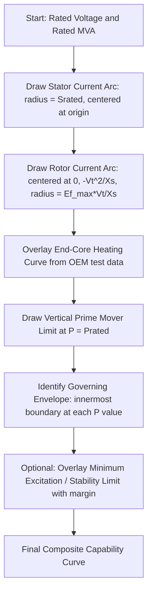

## Generator Capability Curves and Operating Limits

### Overview

The generator capability curve (also called the D-curve, due to its characteristic shape) defines the boundary of safe steady-state operation for a synchronous generator in the real power ($P$) versus reactive power ($Q$) plane. It is constructed from multiple physical constraints — stator winding heating, rotor (field) winding heating, and stator end-core heating — each of which limits a different region of the operating envelope. Understanding and respecting these limits is essential for safe dispatch, voltage support, and coordination with the excitation and governor systems.

### Purpose and Significance

**Key Points**

- Defines the maximum continuous $P$–$Q$ operating envelope for a given generator
- Used by plant operators and system operators (dispatchers) to determine how much reactive power a unit can supply or absorb at a given active power output
- Referenced during voltage/reactive power (Volt/VAR) dispatch and during reactive capability studies for interconnection
- Directly informs settings for excitation limiters (OEL/UEL) discussed in AVR control

### Axes and Sign Convention

By convention:

- The horizontal axis represents active power $P$ (MW), typically only the positive (generating) region shown
- The vertical axis represents reactive power $Q$ (MVAr), with positive $Q$ representing reactive power delivered (overexcited, lagging power factor) and negative $Q$ representing reactive power absorbed (underexcited, leading power factor)

### The Three Governing Limits

#### 1. Stator (Armature) Current Limit

**Key Points**

- Determined by the thermal rating of the stator winding conductors and insulation
- Independent of power factor — it is a limit on the magnitude of apparent power $S = \sqrt{P^2 + Q^2}$
- Appears on the capability curve as an arc of constant radius centered at the origin

$$S_{max} = \sqrt{P^2 + Q^2} \leq S_{rated}$$

This defines a semicircular arc of radius $S_{rated}$ (the generator's rated MVA) centered at the origin of the $P$–$Q$ plane.

#### 2. Rotor (Field) Current Limit

**Key Points**

- Determined by the thermal rating of the field winding, which carries DC excitation current
- Becomes the binding constraint in the overexcited (lagging, $Q > 0$) region, particularly at lower active power output
- Appears as an arc, but centered off-origin (offset along the negative $Q$ axis, at a point related to machine reactance), reflecting the nonlinear relationship between field current and terminal MVA output

For a round-rotor machine (simplified, neglecting saturation), the rotor limit arc can be approximated from the phasor relationship between internal EMF $E_f$, terminal voltage $V_t$, and synchronous reactance $X_s$:

$$Q = \frac{E_f V_t}{X_s}\sin\delta \cdot \frac{V_t}{X_s}\cos\delta \; - \; \frac{V_t^2}{X_s}$$

More commonly expressed via the locus equation, the rotor limit arc is centered at $\left(0, -\dfrac{V_t^2}{X_s}\right)$ with radius $\dfrac{E_{f,max} V_t}{X_s}$:

$$P^2 + \left(Q + \frac{V_t^2}{X_s}\right)^2 = \left(\frac{E_{f,max} V_t}{X_s}\right)^2$$

[Inference] This is the standard round-rotor (cylindrical rotor) approximation; salient-pole machines require a modified two-reactance ($X_d$, $X_q$) formulation that does not reduce to a simple circular arc.

#### 3. Stator End-Core (End-Region) Heating Limit

**Key Points**

- Becomes binding in the underexcited (leading, $Q < 0$) region
- Caused by flux fringing at the ends of the stator core when the machine operates significantly underexcited, inducing eddy currents and localized heating in the stator end-laminations and structural components
- This limit is generally derived from manufacturer testing/design analysis rather than a simple closed-form equation, and is typically supplied by the OEM as a curve segment rather than derived analytically
- [Unverified] The precise shape of this limit is highly design-specific (rotor/stator geometry, end-shield construction) and generic formulas are considered approximate at best

### Composite Capability Curve Diagram (svg_diagram)

<svg xmlns="http://www.w3.org/2000/svg" viewBox="0 0 640 480">
<text x="320" y="20" text-anchor="middle" font-size="14" font-weight="bold">Generator Capability Curve — D-Curve (svg_diagram)</text>
<line x1="60" y1="240" x2="600" y2="240" stroke="black" stroke-width="1.5" />
<line x1="320" y1="440" x2="320" y2="40" stroke="black" stroke-width="1.5" />
<text x="600" y="260" font-size="12">P (MW)</text>
<text x="330" y="45" font-size="12">+Q Overexcited (MVAr)</text>
<text x="330" y="435" font-size="12">-Q Underexcited (MVAr)</text>
<path d="M 320 40 A 200 200 0 0 1 520 240" fill="none" stroke="#1a5276" stroke-width="2.5" />
<text x="470" y="90" font-size="11" fill="#1a5276">Stator Current Limit</text>
<path d="M 320 40 A 260 200 0 0 0 200 240" fill="none" stroke="#c0392b" stroke-width="2.5" />
<text x="150" y="90" font-size="11" fill="#c0392b">Rotor Current Limit</text>
<path d="M 200 240 Q 280 340 320 400" fill="none" stroke="#117864" stroke-width="2.5" />
<text x="180" y="380" font-size="11" fill="#117864">End-Core Heating Limit</text>
<path d="M 320 400 A 160 160 0 0 1 520 240" fill="none" stroke="#7d3c98" stroke-width="2.5" stroke-dasharray="5,3" />
<text x="480" y="330" font-size="11" fill="#7d3c98">Prime Mover Limit</text>
<line x1="320" y1="240" x2="320" y2="40" stroke="gray" stroke-dasharray="3,3" />
</svg>

### Prime Mover (Mechanical) Power Limit

**Key Points**

- A vertical line on the capability curve at $P = P_{rated}$ (or the maximum power the turbine/engine can deliver)
- Independent of reactive power — purely a mechanical/thermal limit of the prime mover (turbine, engine) rather than the electrical machine
- Sets the practical ceiling on active power output regardless of remaining electrical (stator/rotor) headroom

### Minimum Excitation Limit and Stability Boundary

Beyond the end-core heating limit, a separate steady-state stability limit exists, related to the maximum power transfer angle:

$$P_{max} = \frac{E_f V_t}{X_s}$$

Operating too far underexcited reduces $E_f$, which reduces the theoretical maximum synchronizing power and risks loss of synchronism if the rotor angle $\delta$ approaches 90°. In practice, the Under-Excitation Limiter (UEL) in the AVR is set with a margin inside this theoretical stability limit to account for measurement/tuning uncertainty, transient disturbances, and system strength variation. [Inference] The specific margin applied is a plant-engineering decision informed by system studies rather than a universal fixed value.

### Constructing the Full Capability Curve

### Effect of Ambient Conditions (Hydrogen Pressure, Cooling)

**Key Points**

- For hydrogen-cooled generators, capability curves are often published for multiple hydrogen pressure levels, since higher gas pressure improves cooling and allows higher current ratings
- Cooling water temperature and ambient air temperature (for air-cooled units) similarly shift the effective capability envelope
- Manufacturers typically supply a family of capability curves corresponding to different cooling conditions, with the nameplate rating corresponding to standard/reference conditions

### Operational Use in System Operations

**Key Points**

- System operators use aggregated generator reactive capability data (often as $P$–$Q$ or $P$–$V$ curves) for voltage stability studies and reactive power planning
- Reactive power dispatch instructions from the transmission operator must respect the unit's capability curve; operating beyond it risks thermal damage even though no immediate protective trip may occur
- During voltage emergencies, operators may request units to move toward maximum lagging (overexcited) output, subject to OEL settings and available margin

**Example**

A 100 MVA generator rated at 0.85 lagging power factor has a rated reactive capability of approximately $Q = S\sin(\cos^{-1}(0.85)) \approx 100 \times 0.527 \approx 52.7$ MVAr at full active power output ($P = 85$ MW, corresponding to $\cos^{-1}(0.85) \approx 31.8°$). At reduced active power output, the rotor current limit typically allows greater reactive power output than at rated $P$, since less field current is needed for stator current alone, leaving margin for higher $Q$. [Illustrative numeric example based on nameplate power factor rating; actual achievable Q depends on the specific rotor-limit arc geometry and terminal voltage.]

### Interaction with Excitation Limiters

**Key Points**

- The Over-Excitation Limiter (OEL) is set to protect the rotor thermal limit arc, generally with an inverse-time characteristic to allow brief excursions beyond the continuous limit
- The Under-Excitation Limiter (UEL) is set to protect against the stability limit and/or end-core heating limit, whichever is more restrictive at a given $P$
- Coordination between capability curve limits and limiter settings is a standard part of excitation system commissioning and periodic review

### Related Topics

- Excitation Systems and Automatic Voltage Regulation (OEL/UEL derivation)
- Synchronous machine reactances ($X_d$, $X_q$, $X_d'$, $X_d''$) and their role in capability curve shape
- Salient-pole vs. round-rotor capability curve differences
- Voltage stability analysis and reactive power reserve margins
- Hydrogen cooling systems and generator thermal rating classes
- Steady-state stability limit and power-angle curves
- Reactive power compensation devices (SVC, STATCOM) as complements to generator VAR support
- Generator testing standards for capability verification (e.g., IEEE Std 67, IEC 60034)