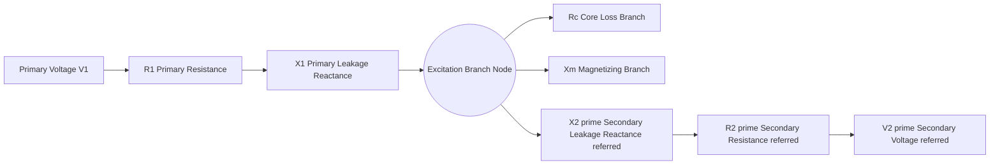
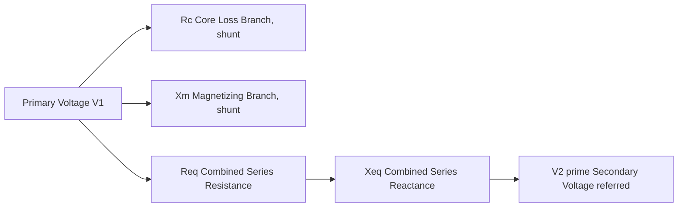
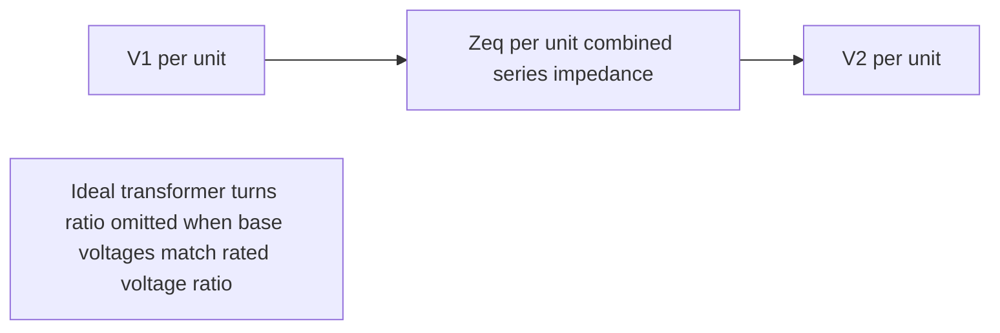

## Transformer Equivalent Circuits and Per-Unit Modeling

### Overview

The equivalent circuit of a power transformer represents its electrical behavior — winding resistances, leakage reactances, and magnetizing branch effects — as a lumped-parameter model suitable for power system analysis. Per-unit modeling normalizes transformer (and broader system) quantities to a common base system, simplifying multi-voltage-level network analysis by eliminating the need to reflect impedances across transformer turns ratios explicitly. Together, these tools form the foundation for load flow studies, fault analysis, and protection coordination involving transformers.

### The Ideal Transformer and Real Transformer Departures

**Key Points**

- An ideal transformer transfers power with no losses and infinite magnetizing inductance, related by turns ratio $a = N_1/N_2$
- Real transformers deviate from ideal behavior due to: winding resistance ($I^2R$ losses), leakage flux (reactance), finite core permeability (magnetizing current), and core losses (hysteresis and eddy currents)
- The equivalent circuit captures these departures as discrete circuit elements added to the ideal transformer core

### Exact Equivalent Circuit

The full transformer equivalent circuit, referred to the primary side, consists of:

- $R_1$, $X_1$: primary winding resistance and leakage reactance
- $R_2'$, $X_2'$: secondary winding resistance and leakage reactance, referred to the primary side
- $R_c$ (or $G_c$): core loss (excitation) resistance, representing hysteresis and eddy current losses
- $X_m$ (or $B_m$): magnetizing reactance, representing the magnetizing (excitation) current

Referral of secondary-side quantities to the primary side uses the turns ratio $a = N_1/N_2$:

$$R_2' = a^2 R_2, \quad X_2' = a^2 X_2, \quad V_2' = a V_2, \quad I_2' = \frac{I_2}{a}$$

### Approximate Equivalent Circuit

**Key Points**

- For most power system studies, the excitation (magnetizing) branch is moved to the input terminals rather than kept between the primary and secondary impedance, simplifying series-parallel circuit analysis
- Since the excitation current is typically only a small percentage of rated current (often 1–3% for large power transformers, though this varies with core design and manufacturer), this approximation introduces negligible error for most load-flow and fault studies
- The series impedance elements are combined:

$$R_{eq} = R_1 + R_2', \quad X_{eq} = X_1 + X_2', \quad Z_{eq} = R_{eq} + jX_{eq}$$

### Simplified (Short-Circuit) Equivalent Circuit

**Key Points**

- For fault analysis and short-circuit studies, the excitation branch is often neglected entirely, since it carries negligible current relative to fault currents
- The transformer is represented purely by its series impedance $Z_{eq} = R_{eq} + jX_{eq}$, obtained directly from the short-circuit (impedance) test
- This simplified model is the standard representation used in most power system fault-current and load-flow software for transformer branches

### Determining Equivalent Circuit Parameters: Standard Tests

#### Open-Circuit (No-Load) Test

**Key Points**

- Performed with rated voltage applied to one winding (typically the low-voltage side, for practical voltage source limitations) and the other winding open-circuited
- Measures core losses (via a wattmeter) and excitation current, since negligible current flows in the open winding and series impedance drop is negligible under near-zero current
- Yields the magnetizing branch parameters $R_c$ (or $G_c$) and $X_m$ (or $B_m$)

$$G_c = \frac{P_{oc}}{V_{oc}^2}, \quad Y_m = \frac{I_{oc}}{V_{oc}}, \quad B_m = \sqrt{Y_m^2 - G_c^2}$$

#### Short-Circuit Test

**Key Points**

- Performed with one winding short-circuited and a reduced voltage applied to the other winding, sufficient to circulate rated current
- Since applied voltage is low, core loss and excitation current are negligible, meaning essentially all measured power loss and impedance is attributable to the series winding impedance
- Yields the equivalent series resistance and reactance

$$R_{eq} = \frac{P_{sc}}{I_{sc}^2}, \quad Z_{eq} = \frac{V_{sc}}{I_{sc}}, \quad X_{eq} = \sqrt{Z_{eq}^2 - R_{eq}^2}$$

### Per-Unit System: Motivation and Definition

**Key Points**

- Power systems span many voltage levels connected via transformers; per-unit normalization removes the need to repeatedly reflect impedances across each transformer's turns ratio
- A per-unit quantity is defined as the ratio of the actual quantity to a chosen base quantity of the same dimension:

$$Q_{pu} = \frac{Q_{actual}}{Q_{base}}$$

- Base quantities are chosen for a three-phase system typically as: base power $S_{base}$ (MVA) and base voltage $V_{base}$ (kV, line-to-line), from which base current and base impedance follow:

$$I_{base} = \frac{S_{base}}{\sqrt{3}\,V_{base}}, \qquad Z_{base} = \frac{V_{base}^2}{S_{base}}$$

### Selecting Consistent Base Values Across a Transformer

**Key Points**

- $S_{base}$ is chosen as a single common value for the entire system (often the rated MVA of a major piece of equipment or a round number like 100 MVA)
- $V_{base}$ must change across each transformer according to its voltage (turns) ratio, so that the same per-unit voltage/impedance values apply on both sides
- The rule: $V_{base}$ on each side of a transformer must be in the same ratio as the transformer's rated voltage ratio

$$\frac{V_{base,1}}{V_{base,2}} = \frac{V_{rated,1}}{V_{rated,2}}$$

This selection rule is what allows a transformer's per-unit impedance to remain the same value regardless of which side it is referred from — one of the principal benefits of per-unit analysis.

### Transformer Impedance in Per-Unit — Side Independence

**Key Points**

- When base voltages are chosen consistently with the transformer's turns ratio (as above), the transformer's per-unit impedance is identical whether calculated from primary-side or secondary-side actual quantities
- This eliminates the turns ratio from appearing explicitly in the per-unit equivalent circuit — the ideal transformer "disappears" from the per-unit model (assuming base voltages on each side match the nominal transformer ratio)

$$Z_{pu} = \frac{Z_{actual}}{Z_{base}} = \frac{Z_{actual}}{V_{base}^2 / S_{base}}$$

### Nameplate Impedance and Base Conversion

**Key Points**

- Transformer nameplates specify impedance in percent (or per-unit) on the transformer's own rated MVA and voltage base — this is the value obtained from the short-circuit test
- When incorporating a transformer into a system-wide per-unit study using a different system base MVA, the nameplate per-unit impedance must be converted using the base-change formula:

$$Z_{pu,new} = Z_{pu,old} \times \left(\frac{S_{base,new}}{S_{base,old}}\right) \times \left(\frac{V_{base,old}}{V_{base,new}}\right)^2$$

**Example**

A transformer rated 50 MVA with a nameplate impedance of 8% (on its own 50 MVA base) is being incorporated into a system study using a 100 MVA system base, with matching voltage bases. The converted impedance is:

$$Z_{pu,new} = 0.08 \times \frac{100}{50} \times \left(\frac{V_{base,old}}{V_{base,new}}\right)^2 = 0.08 \times 2 \times 1^2 = 0.16 \text{ pu} = 16\%$$

assuming voltage bases match (ratio = 1). [Illustrative numeric example; actual conversion requires confirming both MVA and voltage base changes.]

### Per-Unit Transformer Equivalent Circuit

### Three-Phase Transformer Considerations

**Key Points**

- Per-unit impedance values are unaffected by whether windings are connected wye or delta, provided base quantities are defined consistently on a per-phase (or equivalently, three-phase) basis — this is a key simplifying advantage of per-unit analysis for three-phase systems
- Actual (ohmic) impedance values, by contrast, differ substantially depending on winding connection (delta vs. wye) due to different voltage/current relationships at the winding terminals
- Phase-shift introduced by certain winding configurations (e.g., delta-wye) must still be tracked separately in per-unit models when phase angle information matters, such as in unbalanced fault analysis

### Autotransformer Equivalent Circuit Note

**Key Points**

- Autotransformers (with electrically connected windings rather than fully isolated windings) exhibit a lower effective per-unit impedance relative to their rated MVA compared to a two-winding transformer of similar physical size, due to the "common winding" carrying only part of the total transformed power
- [Inference] This characteristic must be accounted for when applying generic two-winding equivalent circuit assumptions to autotransformer applications, as fault current levels can be correspondingly higher through the lower impedance path

### Application in Load Flow and Fault Studies

**Key Points**

- Load flow (power flow) studies represent transformers as a series impedance branch (approximate or simplified equivalent circuit) between two per-unit voltage buses, sometimes including an off-nominal tap ratio for tap-changing transformers
- Off-nominal turns ratios (from tap changers) are represented in per-unit models via a modified $\pi$-equivalent circuit incorporating the tap ratio deviation from the base-matching assumption
- Fault studies use the simplified series-impedance-only model, combined with system source impedances, to compute fault current magnitudes at various system locations

### Related Topics

- Transformer tap-changing and off-nominal turns ratio modeling ($\pi$-equivalent with tap)
- Three-phase transformer winding connections (delta-wye, phase shift, zero-sequence behavior)
- Symmetrical components and sequence impedance networks for transformers
- Autotransformer design and per-unit impedance characteristics
- Short-circuit and open-circuit test procedures (IEEE/IEC standards)
- Load flow (power flow) analysis methods using per-unit network models
- Transformer protection coordination (differential protection, through-fault withstand)
- Parallel transformer operation and circulating current considerations