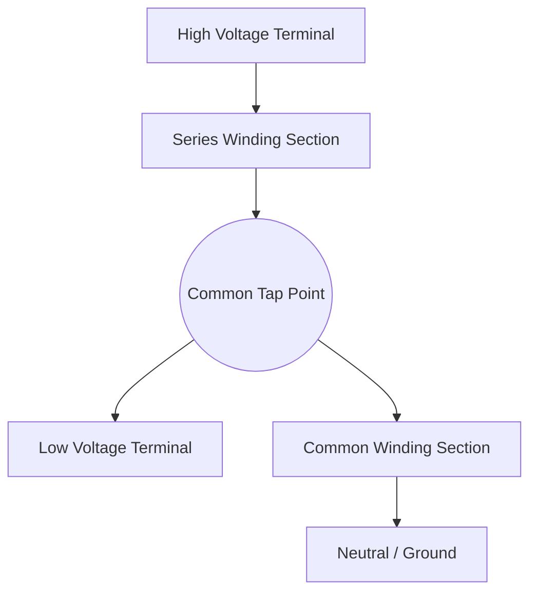
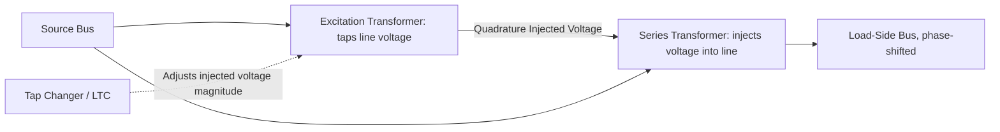

## Autotransformers and Phase-Shifting Transformers

### Overview

Autotransformers and phase-shifting transformers are specialized transformer configurations used in power systems for voltage transformation with reduced material cost and for controlling active power flow on parallel transmission paths, respectively. An autotransformer achieves voltage transformation through a single, electrically continuous winding (rather than fully isolated primary and secondary windings), while a phase-shifting transformer (PST) intentionally introduces a controllable phase angle difference between its input and output voltages to regulate power flow.

### Autotransformers

#### Basic Structure

**Key Points**

- Consists of a single continuous winding, tapped at an intermediate point, shared between the "common" and "series" sections
- The common winding is shared by both the high-voltage and low-voltage circuits; the series winding carries only the current difference between the two sides
- Electrically connected (galvanic connection) between primary and secondary — unlike a conventional two-winding transformer, there is no electrical isolation between the high and low voltage circuits

#### Power Rating Advantage

**Key Points**

- Because only the series winding portion carries the difference current, and part of the power is transferred conductively (through direct electrical connection) rather than purely inductively, an autotransformer of a given physical size can handle a higher-rated MVA than an equivalent two-winding transformer
- The ratio of transformed (inductive) power to total throughput power is characterized by the "auto-transformer benefit" or co-ratio, related to the voltage ratio between high and low sides

For a voltage ratio $a = V_H / V_L$, the fraction of power transferred inductively (through the transformer action) versus conductively (through direct electrical connection) is approximately:

$$\frac{S_{transformed}}{S_{total}} = \frac{a - 1}{a}$$

**Example**

For an autotransformer with $V_H = 345$ kV and $V_L = 230$ kV, the ratio $a = 345/230 = 1.5$. The transformed fraction is $(1.5-1)/1.5 \approx 0.33$, meaning roughly one-third of the total throughput power is transformed inductively, with the remainder passing conductively — allowing the unit's core and winding material to be sized for a much smaller "internal" MVA than the rated throughput MVA. [Illustrative calculation based on the standard autotransformer power-ratio approximation; actual design margins and loss allocation are manufacturer-specific.]

#### Lower Impedance Characteristic

**Key Points**

- As a consequence of the reduced effective winding material per unit of throughput MVA, autotransformers exhibit a lower per-unit impedance than an equivalent-rated two-winding transformer of similar voltage class
- This lower impedance results in higher fault current contribution for a given system fault, which must be accounted for in protection coordination and breaker interrupting duty studies

#### Tertiary Winding

**Key Points**

- Autotransformers used in transmission applications commonly include a third, delta-connected tertiary winding, electrically isolated from the main autotransformer winding
- The tertiary winding serves multiple purposes: providing a path for third-harmonic and zero-sequence current circulation (stabilizing the neutral and suppressing harmonic voltage distortion), supplying auxiliary/station power, and sometimes connecting reactive compensation equipment (shunt reactors, capacitor banks, or SVCs)
- [Unverified] Tertiary winding MVA rating is typically sized for the specific auxiliary or stabilizing duty required, generally lower than the main winding rating, though exact sizing practices vary by utility and application

#### Limitations

**Key Points**

- Lack of electrical isolation means a fault or overvoltage on one side can directly transfer to the other side, which is a significant consideration for insulation coordination and surge protection design
- Voltage ratio flexibility is more limited than a two-winding transformer, since large ratio changes reduce the material-saving benefit and can approach the characteristics of a conventional two-winding unit
- Neutral grounding and insulation coordination require careful design given the direct electrical connection between windings

### Phase-Shifting Transformers (PST)

#### Purpose

**Key Points**

- Used to control active power flow on parallel transmission paths (or parallel transformer paths) by introducing a controllable phase angle shift between input and output voltage
- Since active power flow between two points on an AC system is strongly dependent on the sine of the phase angle difference between them, a phase-shifting transformer can be used to actively redirect power flow toward underutilized paths and away from overloaded ones

The simplified real power flow relationship across a transmission element is:

$$P = \frac{V_1 V_2}{X} \sin(\delta_1 - \delta_2)$$

By inserting a controllable phase shift $\Delta\delta$ via a PST, the effective angle difference — and hence the power flow through that path — can be actively adjusted independent of the natural impedance-based flow distribution.

#### Basic Construction Types

**Key Points**

- **Symmetric (quadrature) type**: Uses a separate excitation transformer to inject a voltage in quadrature (90°) with the main line voltage into a series unit, producing a phase shift with minimal magnitude change
- **Asymmetric type**: Simpler construction where the injected voltage is not in quadrature, resulting in phase shift accompanied by some voltage magnitude change
- **Single-core vs. two-core designs**: Some PSTs combine excitation and series windings in a single tank; others use a separate excitation transformer and series transformer unit

#### Phase-Shift Control Mechanism

**Key Points**

- The magnitude of phase shift is controlled by adjusting the tap position on the excitation winding, typically via an on-load tap changer (LTC), allowing dynamic, under-load adjustment of the phase angle
- Larger tap steps or a wider tap range provide greater phase-shift control range, at the cost of increased transformer complexity, size, and cost
- Some designs allow bidirectional phase shift (advancing or retarding phase in either direction) depending on tap changer configuration

#### Quadrature Booster Terminology

**Key Points**

- In some regions/literature, the symmetric quadrature-type phase-shifting transformer is referred to as a "quadrature booster" (QB), reflecting the quadrature relationship of the injected voltage
- [Unverified] Terminology conventions ("phase-shifting transformer" vs. "quadrature booster" vs. "phase angle regulator") vary by region and are sometimes used interchangeably or with subtly different scope depending on the source

### Comparative Summary

| Feature | Autotransformer | Phase-Shifting Transformer |
| --- | --- | --- |
| Primary Purpose | Voltage transformation with reduced size/cost | Active power flow control via phase angle |
| Isolation | No (galvanic connection) | Varies by design (often includes isolation via series unit) |
| Key Benefit | Higher throughput MVA per unit size/cost | Controllable redirection of power flow on parallel paths |
| Typical Application | Transmission voltage transformation (e.g., 345/230 kV) | Interconnections, parallel line/transformer flow control |
| Special Feature | Tertiary delta winding (harmonic/zero-sequence path, aux power) | On-load tap changer for dynamic phase adjustment |

### System Applications

#### Autotransformer Applications

**Key Points**

- Common at transmission voltage interfaces where the ratio between high and low voltage is relatively modest (e.g., 500/230 kV, 345/138 kV), since the material-saving benefit is greatest for lower voltage ratios
- Widely used in bulk transmission substations as the primary voltage-transformation link between transmission voltage classes

#### Phase-Shifting Transformer Applications

**Key Points**

- Deployed at locations with parallel transmission paths of differing impedance where natural (impedance-based) power flow distribution causes undesirable loop flows or overloading of lower-impedance paths
- Used at some international/regional interconnections to manage scheduled power flow and limit unscheduled ("loop") flows through neighboring systems
- Increasingly relevant in systems with growing renewable generation, where power flow patterns can shift significantly from historical patterns, motivating more active flow-control tools

### Protection and Modeling Considerations

**Key Points**

- Autotransformer protection (differential relaying) must account for the shared winding structure, tap position (if equipped with an LTC on the common or series winding), and tertiary winding connections
- Phase-shifting transformers require specialized differential protection schemes that account for the phase shift between measured currents on each side, since standard differential protection assumes no phase displacement across the protected zone
- Power flow modeling of PSTs in load-flow software typically uses a controllable phase-shift device model, distinct from the fixed-ratio and fixed-phase representation used for standard transformers

### Related Topics

- Transformer Equivalent Circuits and Per-Unit Modeling
- Three-Phase Transformer Connections and Vector Groups
- Tap-changing transformers and on-load tap changer (LTC) mechanisms
- Transformer differential protection principles
- Power flow control devices: FACTS, series compensation, HVDC as alternatives/complements to PSTs
- Loop flow and parallel path power flow analysis in interconnected systems
- Insulation coordination for galvanically connected (autotransformer) windings
- Tertiary winding sizing and reactive compensation integration