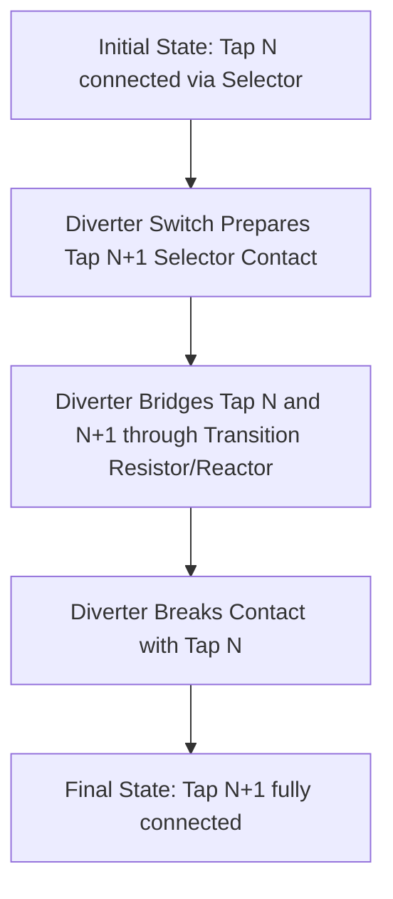
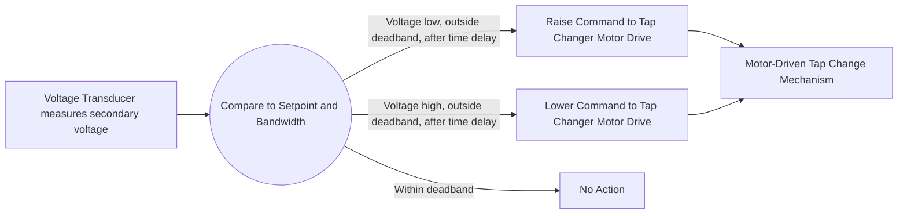

## On-Load Tap Changers and Voltage Control

### Overview

On-load tap changers (OLTCs, also called load tap changers or LTCs) are electromechanical or electronic devices that adjust a transformer's effective turns ratio while the transformer remains energized and carrying load current. This capability allows transformers to compensate for voltage variations caused by changing load conditions and system configurations, making OLTCs a primary tool for automatic voltage regulation across transmission and distribution networks.

### Purpose and Functional Role

**Key Points**

- Maintains secondary-side voltage within acceptable limits despite variations in primary-side voltage and load current (which causes voltage drop across source and transformer impedance)
- Enables voltage regulation without interrupting power delivery, unlike de-energized tap changers (DETCs) which require the transformer to be switched off
- Commonly deployed on distribution substation transformers, transmission autotransformers, and generator step-up transformers requiring active voltage control
- Complements generator AVR action and reactive compensation devices (capacitor banks, SVCs) as part of overall system voltage/VAR management

### Basic Tap-Changing Principle

**Key Points**

- Taps are connection points along a winding (typically the higher-voltage winding, to minimize current handled by the tap changer switching mechanism) that allow the effective number of active turns to be changed
- Changing the active turns changes the transformer's effective turns ratio, and hence the voltage transformation ratio, in discrete steps
- Typical tap ranges are commonly in the range of ±10% to ±15% of nominal voltage, divided into a number of discrete steps (often 16–33 steps total, meaning roughly 0.625%–1.25% per step) [Unverified — specific range and step count are design- and application-dependent]

### On-Load Tap Changer Mechanism

#### The Make-Before-Break Challenge

**Key Points**

- The central engineering challenge of an OLTC is changing taps without interrupting load current and without momentarily short-circuiting adjacent tap sections
- Simply breaking contact with one tap before making contact with the next would interrupt load current, causing arcing damage to the switching contacts under load
- Simply bridging two adjacent taps simultaneously (make-before-break) would short-circuit the winding turns between them, driving a large circulating current

#### Transition Impedance Solution

**Key Points**

- OLTCs use a transition impedance (either a resistor or a center-tapped reactor) temporarily inserted in the circuit during the tap-change sequence to limit the circulating current when bridging between two adjacent taps
- This allows a brief "bridging" period where both taps are momentarily connected through the transition impedance, avoiding both current interruption and unlimited circulating current
- The full tap-change sequence typically completes in well under a second, involving multiple switching stages executed by a motor-driven mechanism

#### Selector Switches vs. Diverter Switches

**Key Points**

- The **tap selector** (or selector switch) chooses which tap winding connection to prepare, but does not interrupt load current directly — it operates off-load in a sequenced manner relative to the diverter
- The **diverter switch** performs the actual current-carrying transition between taps, including the transition impedance bridging step, and is the component subject to arcing and contact wear
- Diverter switch contacts typically operate in an oil-filled compartment (in traditional designs) that is separated from the main tank oil to contain arcing byproducts (carbon, gas) and simplify maintenance

#### Vacuum Interrupter OLTCs

**Key Points**

- Modern OLTC designs increasingly use vacuum interrupters for the diverter switching function instead of oil-immersed contacts
- Vacuum interrupters reduce arcing byproduct contamination of transformer oil, extend maintenance intervals, and reduce fire risk associated with oil-based arcing
- [Unverified] Adoption rates and specific design details vary by manufacturer; vacuum OLTC technology has become increasingly common in new installations but oil-type diverter switches remain in service on many existing units

### Reactor-Type vs. Resistor-Type Transition

**Key Points**

- **Resistor-type** transition: uses resistors to limit circulating current during the brief bridging period; the bridging period is kept very short (typically milliseconds) to limit resistor heating
- **Reactor-type** transition: uses a center-tapped reactor, allowing a longer bridging period with both taps connected (sometimes providing an intermediate operating position), historically more common in certain regions/designs
- [Unverified] Preference between resistor-type and reactor-type transition design varies by manufacturer, region, and historical practice rather than a strict universal standard

### Automatic Voltage Control Scheme

#### Voltage Regulating Relay

**Key Points**

- An automatic voltage regulating relay (AVR relay — distinct from a generator AVR) monitors secondary-side voltage and issues raise/lower commands to the tap changer's motor drive mechanism when voltage deviates outside a defined bandwidth
- A deliberate time delay is built into the control logic to avoid unnecessary tap operations from transient voltage fluctuations, since each mechanical tap change contributes to component wear
- The bandwidth (deadband) setting balances voltage regulation tightness against tap changer mechanical wear and operating life

#### Line Drop Compensation (LDC)

**Key Points**

- Line drop compensation adjusts the effective voltage regulation setpoint to compensate for voltage drop along the distribution feeder between the substation and a representative load point, rather than regulating strictly at the transformer terminals
- Implemented by modeling an equivalent feeder resistance and reactance in the regulating relay, using measured load current to estimate and compensate for the additional voltage drop downstream
- Allows the substation transformer to deliver higher voltage during heavy load periods (when downstream voltage drop is greatest) while avoiding overvoltage at the substation during light load

### Parallel Transformer Tap Coordination

**Key Points**

- Transformers operating in parallel with independent tap changers require coordination (via master-follower control, circulating current control, or negative reactance compensation schemes) to prevent tap position mismatch from driving large circulating currents between units
- Mismatched tap positions between parallel transformers create a voltage difference that circulates reactive (and to a lesser extent, active) current between the units even under balanced external loading
- Common coordination schemes include: designating one unit as "master" with others following its tap position, or using circulating current bias schemes where each transformer's regulator considers the measured circulating current)

### Impact on Transformer Design and Impedance

**Key Points**

- Tap position affects the transformer's actual (ohmic) impedance and, indirectly, its per-unit impedance when referred to a fixed base, since winding turns (and hence leakage flux geometry) change with tap position
- Transformer nameplate impedance is typically specified at the nominal (mid-range) tap position, with impedance variation across the tap range documented separately in test reports
- [Unverified] The magnitude of impedance variation across the tap range is design-specific; it is generally a secondary effect but can be significant enough to require explicit modeling in detailed fault studies for units with wide tap ranges

### Modeling in Power Flow and Fault Studies

**Key Points**

- Load flow software typically models tap-changing transformers using an off-nominal turns ratio parameter, represented via a modified $\pi$-equivalent circuit that accounts for the deviation from the base-matching voltage ratio, as referenced in Transformer Equivalent Circuits and Per-Unit Modeling
- Tap position can be modeled as fixed (for snapshot studies) or as a controlled variable (for studies incorporating automatic voltage regulation response, such as long-term dynamic simulations)
- Fault studies generally use a fixed tap position (often nominal or a specified worst-case position) since OLTC response is too slow (seconds, due to time-delay settings) to act within the timeframe of fault clearing

### Maintenance Considerations

**Key Points**

- Diverter switch contacts experience gradual erosion from arcing during each tap-change operation, requiring periodic inspection and eventual contact replacement based on operation count or condition assessment
- Oil-filled diverter compartments require periodic oil testing/replacement due to arcing byproduct accumulation (carbon particles, dissolved gas)
- Dissolved gas analysis (DGA) monitoring, both of the main tank oil and (where applicable) the separate diverter switch compartment oil, is used to detect abnormal tap changer wear or developing faults

### Related Topics

- Transformer Equivalent Circuits and Per-Unit Modeling
- Voltage/VAR optimization and coordinated substation voltage control
- Excitation Systems and Automatic Voltage Regulation (generator-side voltage control)
- Distribution voltage regulators (single-phase step-voltage regulators)
- Dissolved gas analysis (DGA) for transformer condition monitoring
- Parallel transformer operation and circulating current management
- De-energized tap changers (DETC) versus on-load tap changers
- Power flow modeling of tap-changing and phase-shifting transformers