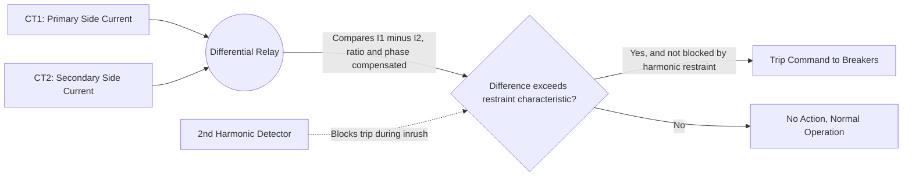
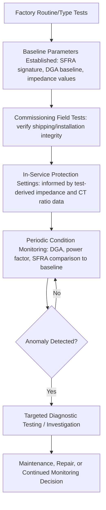

## Transformer Testing, Protection, and Condition Monitoring

### Overview

Transformer testing, protection, and condition monitoring together form the lifecycle assurance framework for power transformers — from factory verification of design and manufacturing quality, through in-service protective relaying that detects and isolates internal faults, to ongoing diagnostic monitoring that tracks insulation and mechanical condition over decades of operation. These three domains are interdependent: test data establishes baseline parameters used in protection settings, and condition monitoring trends often trigger targeted diagnostic testing.

### Factory and Commissioning Tests

#### Routine Tests

**Key Points**

- Performed on every unit as standard quality verification, per applicable standards (IEEE C57.12.90, IEC 60076 series)
- Include: winding resistance measurement, turns ratio test, polarity and phase relationship verification, no-load (open-circuit) loss and excitation current measurement, load (short-circuit) loss and impedance measurement, and dielectric (withstand) tests
- Turns ratio testing verifies the actual voltage transformation ratio matches nameplate values across all tap positions, detecting shorted turns or incorrect tap connections

#### Type and Special Tests

**Key Points**

- **Type tests**: performed on a representative unit of a given design (not necessarily every unit), including temperature rise tests and lightning impulse withstand tests, to verify the design meets thermal and dielectric performance requirements
- **Special tests**: performed by agreement between purchaser and manufacturer for specific application needs, potentially including zero-sequence impedance measurement, sound level (noise) testing, or short-circuit withstand capability verification
- Impulse testing (lightning impulse and, for higher voltage classes, switching impulse) verifies insulation withstand against transient overvoltages, typically using a standardized impulse waveform per applicable standard

#### Dielectric (Insulation) Tests

**Key Points**

- **Applied voltage test**: verifies insulation between windings and between windings and ground can withstand a specified overvoltage for a short duration
- **Induced voltage test**: verifies inter-turn insulation by exciting the transformer at elevated frequency and voltage (to avoid core saturation at higher voltage) to stress the winding's internal turn-to-turn insulation
- **Partial discharge measurement**: often performed concurrently with induced voltage testing to detect incipient insulation weaknesses that produce localized discharge activity before full breakdown

### Field/On-Site Testing (Commissioning and Periodic)

**Key Points**

- **Insulation resistance (megger) testing**: measures resistance between windings and ground, and between windings, as a basic insulation health indicator; often combined with polarization index calculation (ratio of 10-minute to 1-minute resistance reading) to assess moisture/contamination condition
- **Sweep Frequency Response Analysis (SFRA)**: measures the transformer's frequency response signature to detect winding deformation or displacement (e.g., from through-fault mechanical stress or shipping damage), by comparing the measured response against a baseline (factory) signature or a sister-unit signature
- **Dissolved Gas Analysis (DGA)**: analyzes gases dissolved in insulating oil to detect and characterize incipient faults (thermal, electrical) — covered in detail below
- **Power factor (dissipation factor) testing**: measures insulation dielectric losses as an indicator of insulation aging, moisture content, or contamination

### Protection Schemes

#### Differential Protection

**Key Points**

- The primary internal fault protection scheme for power transformers, comparing current entering and leaving the protected zone (the transformer) and operating when the difference exceeds a threshold, indicating an internal fault
- Must accommodate normal, non-fault sources of apparent current difference: magnetizing inrush current (a large but harmless transient at energization), transformer turns ratio (compensated via current transformer ratio matching and/or software ratio correction), and vector group phase shift (compensated via appropriate CT connection or software phase compensation)
- **Second-harmonic restraint** (or blocking) is commonly used to distinguish magnetizing inrush (which contains significant second-harmonic content) from genuine internal faults (which do not), preventing nuisance tripping during normal energization
- **Percentage (biased) differential** characteristics apply a restraining slope proportional to through-current magnitude, accommodating CT accuracy errors and tap-changer-induced ratio mismatch that would otherwise cause false operation at high through-fault currents

#### Overcurrent Protection

**Key Points**

- Serves as backup protection for the transformer and as primary protection for external faults on connected lines/buses, typically using time-overcurrent relays coordinated with downstream and upstream protection
- Includes both phase overcurrent and ground (neutral) overcurrent elements, the latter particularly important for detecting ground faults given the vector group and grounding configuration discussed in Three-Phase Transformer Connections and Vector Groups

#### Restricted Earth Fault (REF) Protection

**Key Points**

- A sensitive differential-type scheme specifically for detecting ground faults within a wye-connected (grounded) winding, comparing neutral current against the sum of phase currents on that winding
- Provides significantly higher sensitivity to internal ground faults near the neutral end of the winding than standard phase differential protection, which is inherently less sensitive to faults close to the neutral due to the low fault current magnitude at low percentages of winding from neutral

#### Mechanical/Non-Electrical Protection

**Key Points**

- **Buchholz relay** (gas-accumulator relay): installed in the pipe between the main tank and conservator on oil-filled transformers, detecting gas accumulation from slow-developing faults (alarm stage) and rapid oil surge from severe internal faults (trip stage)
- **Pressure relief device**: mechanically releases excessive internal pressure resulting from a severe fault, preventing tank rupture
- **Sudden pressure relay**: detects rapid rate-of-rise of internal pressure (as opposed to accumulated gas), providing fast tripping for severe internal faults, including some fault types that may not generate substantial gas accumulation quickly enough for Buchholz detection
- **Winding and oil temperature indicators**: provide alarm and trip functions based on measured (or thermally modeled) temperature exceeding preset thresholds

#### Overexcitation (Volts-per-Hertz) Protection

**Key Points**

- Protects against core overfluxing from excessive voltage-to-frequency ratio, which causes core saturation, excessive core losses, and localized structural heating
- Particularly relevant during generator startup/shutdown transients (when frequency may be below nominal while voltage is present) and during system disturbances causing overvoltage at reduced frequency

### Dissolved Gas Analysis (DGA) in Detail

**Key Points**

- Based on the principle that different fault types (thermal faults of varying temperature, partial discharge, arcing) decompose insulating oil and paper into characteristic combinations and ratios of gases
- Key gases monitored include: hydrogen ($H_2$), methane ($CH_4$), ethane ($C_2H_6$), ethylene ($C_2H_4$), acetylene ($C_2H_2$), carbon monoxide (CO), and carbon dioxide ($CO_2$)
- Interpretive methods (e.g., Duval Triangle, Rogers Ratio, IEEE/IEC key gas methods) use relative gas concentrations and ratios to classify likely fault type: low-temperature thermal fault, high-temperature thermal fault, low-energy discharge (partial discharge), or high-energy discharge (arcing)
- **Acetylene** presence is generally considered a particularly significant indicator, as it is typically associated with high-temperature arcing faults rather than normal aging processes [Unverified — interpretation thresholds and significance levels are standard- and condition-specific, and should be assessed per the applicable DGA interpretation guide rather than a single fixed threshold]

### Online (Continuous) Condition Monitoring

**Key Points**

- **Online DGA monitors**: continuously or periodically sample and analyze dissolved gases without requiring manual oil sampling, enabling earlier trend detection compared to periodic manual sampling
- **Fiber-optic hot-spot temperature sensors**: directly measure winding hot-spot temperature at embedded locations, providing more accurate thermal data than calculated/estimated hot-spot models
- **Bushing monitoring**: tracks bushing power factor and capacitance trends online to detect developing bushing insulation degradation, which is a significant contributor to major transformer failures
- **Partial discharge monitoring**: ongoing or periodic acoustic or electrical PD measurement to detect developing insulation weaknesses before they progress to failure
- [Inference] The trend toward increased online/continuous monitoring reflects a broader industry shift from time-based (calendar) maintenance toward condition-based maintenance strategies, though adoption levels and specific technology choices vary considerably by utility and asset criticality

### Test-to-Protection-to-Monitoring Lifecycle

### Fault Location and Post-Event Investigation

**Key Points**

- Following a protection operation (trip), diagnostic testing (DGA, SFRA, insulation resistance, visual/internal inspection) is typically performed before re-energization to confirm the transformer's condition and rule out (or characterize) internal damage
- SFRA comparison against a pre-event baseline is particularly valuable for detecting winding displacement following a through-fault event, since such mechanical displacement may not be immediately apparent from electrical tests alone
- [Unverified] Specific post-trip testing protocols and re-energization decision criteria vary by utility policy and the nature of the protective operation (e.g., differential trip vs. external fault clearing by backup protection)

### Related Topics

- Transformer Equivalent Circuits and Per-Unit Modeling
- Three-Phase Transformer Connections and Vector Groups (differential protection phase compensation)
- Transformer Losses, Efficiency, and Thermal Loading (hot-spot temperature and aging context)
- On-Load Tap Changers and Voltage Control (tap changer-specific monitoring and diagnostics)
- Protective relay coordination principles for power systems
- Insulating oil testing and moisture/oxygen contamination effects
- Bushing design and bushing failure mechanisms
- Asset management and condition-based maintenance strategies for power transformers