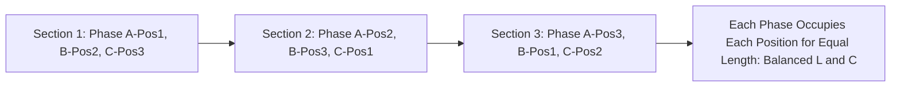

## Series Resistance and Inductance of Transmission Lines

### Overview

Transmission line series parameters — resistance and inductance — form the fundamental series impedance that governs voltage drop, power flow capability, and fault current magnitude along a transmission line. Unlike lumped-parameter equipment such as transformers, these parameters are distributed continuously along the line's length and depend on conductor material, geometry, and the physical arrangement of conductors relative to each other and to ground.

### Series Resistance

#### DC Resistance

**Key Points**

- Determined by conductor material resistivity, cross-sectional area, and length, following the basic resistance relationship:

$$R_{DC} = \rho \frac{l}{A}$$

where $\rho$ is conductor resistivity, $l$ is length, and $A$ is cross-sectional area.

- Most transmission conductors use aluminum (or aluminum alloy) due to its favorable strength-to-weight and cost characteristics compared to copper, often reinforced with a steel core for mechanical strength (ACSR — Aluminum Conductor Steel Reinforced)
- Resistivity increases with temperature, following an approximately linear relationship over normal operating temperature ranges:

$$R_{T2} = R_{T1} \left[\frac{T_2 + T}{T_1 + T}\right]$$

where $T$ is a material-specific temperature constant (differing for aluminum and copper), and $T_1$, $T_2$ are the reference and operating temperatures respectively.

#### AC Resistance and Skin Effect

**Key Points**

- AC resistance exceeds DC resistance due to skin effect — the tendency of alternating current to concentrate near the conductor surface, effectively reducing the conductor's usable cross-sectional area for current flow
- Skin effect increases with frequency, conductor diameter, and conductor permeability, making it more pronounced in ferrous materials (such as the steel core of ACSR conductors, though the steel core typically carries negligible current at power frequency due to its higher resistivity and the current redistribution effect) than in the aluminum strands
- At standard power system frequencies (50/60 Hz), skin effect increases resistance by a modest amount for typical conductor sizes, though the effect grows more significant for very large-diameter conductors [Unverified — the specific percentage increase is conductor-size- and construction-dependent, and precise values are obtained from manufacturer conductor tables rather than a simple universal formula]

#### Bundle Conductors and Resistance

**Key Points**

- For bundled conductors (multiple sub-conductors per phase, common at higher transmission voltages), the effective resistance per phase is the parallel combination of the sub-conductor resistances, approximately $R_{bundle} = R_{single}/n$ for $n$ identical, equally spaced sub-conductors carrying equal current
- Bundling is primarily employed to reduce reactance and corona effects (discussed in Line Charging Capacitance and Corona Effects, where applicable) rather than primarily for resistance reduction, though the resistance benefit is a secondary advantage

### Series Inductance — Physical Basis

**Key Points**

- Inductance arises from the magnetic flux linkage created by current flow in the conductors, comprising both internal flux linkage (within the conductor itself) and external flux linkage (in the space surrounding the conductor, extending toward and interacting with other phase conductors)
- Because transmission lines carry three-phase current with conductors in a specific geometric arrangement, the mutual flux linkage between phases (and the conductor's self-geometry) determines the overall per-phase inductance

#### Inductance of a Single-Phase Two-Wire Line

For a simple two-conductor single-phase line, the per-phase inductance (accounting for internal and external flux) is:

$$L = 2 \times 10^{-7} \ln\left(\frac{D}{GMR}\right) \text{ H/m}$$

where $D$ is the spacing between conductors and $GMR$ (Geometric Mean Radius) is a conductor-specific parameter that accounts for internal flux linkage without requiring separate calculation of the internal inductance term (i.e., $GMR = r \cdot e^{-1/4}$ for a solid round conductor, where $r$ is the physical conductor radius).

#### Inductance of Three-Phase Lines: GMD Method

**Key Points**

- For a three-phase line with conductors at unequal spacing (the common case for most practical configurations), exact per-phase inductance would differ between phases unless conductor transposition is used to average out the asymmetry
- The Geometric Mean Distance (GMD) simplifies the calculation by representing the equivalent spacing among the three phase conductors:

$$GMD = \sqrt[3]{D_{ab} \cdot D_{bc} \cdot D_{ca}}$$

where $D_{ab}$, $D_{bc}$, $D_{ca}$ are the pairwise spacings between the three phase conductors.

The per-phase inductance for a transposed three-phase line is then:

$$L = 2 \times 10^{-7} \ln\left(\frac{GMD}{GMR}\right) \text{ H/m}$$

#### Conductor Transposition

**Key Points**

- Transposition involves physically rotating the positions of the three phase conductors at intervals along the line's length (typically at one or more transposition towers/structures), so each phase occupies each physical position for an equal fraction of the total line length
- This equalizes the mutual inductance and capacitance seen by each phase, eliminating (or substantially reducing) the inherent electrical asymmetry between phases that would otherwise result from unequal geometric spacing
- [Unverified] Many modern transmission lines, particularly shorter ones, are constructed without physical transposition, since the resulting asymmetry can be small enough (or otherwise acceptably managed) relative to line length — practice varies with line length, voltage class, and utility design standards

### Bundle Conductor Effect on Inductance

**Key Points**

- Bundled conductors (2, 3, or 4 sub-conductors per phase, spaced by a bundle spacer) effectively increase the geometric mean radius of the phase conductor as a whole, since the bundle's equivalent GMR is calculated from the sub-conductor GMR and the bundle geometry
- A larger equivalent GMR reduces per-phase inductance (per the $\ln(GMD/GMR)$ relationship), which is a primary motivation for bundling at extra-high-voltage (EHV) transmission levels — reduced series reactance improves power transfer capability and reduces voltage drop
- The equivalent bundle GMR for $n$ sub-conductors arranged symmetrically on a circle of radius $A$ is:

$$GMR_{bundle} = \left(n \cdot GMR_{sub} \cdot A^{n-1}\right)^{1/n}$$

**Example**

A two-conductor bundle with sub-conductor GMR of 0.0133 m and bundle spacing $A$ of 0.4 m has an equivalent bundle GMR of $\left(2 \times 0.0133 \times 0.4^{1}\right)^{1/2} \approx \sqrt{0.01064} \approx 0.103$ m — substantially larger than the single sub-conductor GMR, illustrating the inductance-reduction benefit of bundling. [Illustrative numeric example using representative values; actual sub-conductor GMR is obtained from conductor manufacturer tables for the specific conductor type and size.]

### Series Impedance Model

**Key Points**

- The combined series impedance per unit length is $z = r + j\omega L$ (ohms per unit length), forming the series branch of the line's per-unit-length equivalent circuit
- For per-unit system studies, as discussed in Transformer Equivalent Circuits and Per-Unit Modeling, the same per-unit base conversion principles apply to transmission line impedance, using the system's chosen $S_{base}$ and the line's nominal voltage as $V_{base}$

### Typical Reactance Values

**Key Points**

- Series inductive reactance $X_L = \omega L$ for typical overhead transmission lines commonly falls in the range of approximately 0.3–0.5 $\Omega$/km (or roughly 0.5–0.8 $\Omega$/mile) at 60 Hz, though this varies with conductor size, spacing, bundling, and voltage class [Unverified — presented as a general industry range; specific line designs require calculation from actual geometry and conductor data]
- Higher voltage (EHV) lines with bundled conductors and wider phase spacing generally exhibit lower per-unit-length reactance than lower-voltage single-conductor lines, due to the combined effect of increased equivalent GMR (from bundling) and design optimization for power transfer capability

### Effect of Line Geometry on Inductance

**Key Points**

- Wider phase spacing (larger GMD) increases inductance, since it increases the effective flux linkage path length between phase conductors
- Compact line designs (reduced phase spacing) reduce inductance and reactance, which can improve power transfer capability but require careful insulation coordination given the reduced electrical clearance
- Vertical, horizontal, and triangular (delta) conductor configurations on transmission towers each produce different GMD values for otherwise similar span dimensions, influencing the specific per-phase inductance for a given tower design

### Underground Cable Considerations

**Key Points**

- Underground cables exhibit substantially closer phase conductor spacing than overhead lines (constrained by cable and duct/trench geometry), resulting in significantly lower series inductance per unit length compared to overhead lines of similar voltage class
- [Inference] This lower inductance, combined with substantially higher shunt capacitance (addressed separately under line charging), fundamentally changes the electrical behavior of cable circuits relative to overhead lines, particularly regarding reactive power generation and maximum practical transmission distance without reactive compensation

### Related Topics

- Line Charging Capacitance and Corona Effects
- Transmission Line Models: Short, Medium, and Long Line Representations
- Surge Impedance Loading and Power Transfer Capability
- Bundle conductor design and corona/electric field considerations
- Symmetrical components and sequence impedance of transmission lines
- Conductor selection and ampacity (current-carrying capacity) determination
- Ground wire and shield wire effects on line impedance
- Transposition practices and phase imbalance mitigation