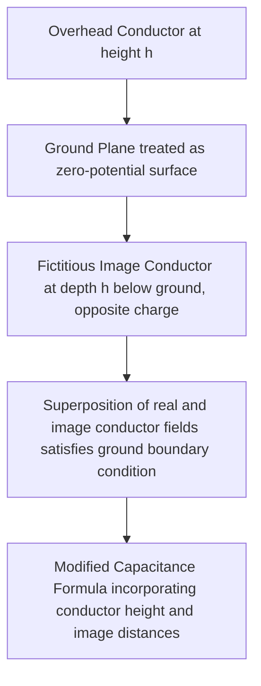

## Shunt Capacitance and Conductance

### Overview

Shunt capacitance and shunt conductance form the parallel (admittance) branch of a transmission line's distributed electrical model, complementing the series resistance and inductance covered in Series Resistance and Inductance of Transmission Lines. Shunt capacitance arises from the potential difference between conductors and between conductors and ground, producing a charging current that flows even under no-load conditions. Shunt conductance represents leakage current paths, primarily through insulator surfaces and air, and is generally a much smaller and less consistently characterized quantity.

### Shunt Capacitance — Physical Basis

**Key Points**

- Arises from the electric field established between phase conductors and between each conductor and ground (or, for underground cables, between conductor and grounded shield/sheath)
- Produces a charging current that flows through the line whenever voltage is applied, independent of load current — this current flows even with the receiving end open-circuited
- Represented as a shunt admittance element ($y = g + j\omega C$) distributed along the line length, forming the shunt branch of the line's per-unit-length equivalent circuit

### Capacitance of a Single-Phase Two-Wire Line

For a simple two-conductor configuration, the capacitance between conductors (line-to-line) is:

$$C_{ab} = \frac{\pi \varepsilon_0}{\ln(D/r)} \text{ F/m}$$

where $D$ is conductor spacing, $r$ is conductor radius, and $\varepsilon_0$ is the permittivity of free space. For line-to-neutral capacitance (used in per-phase power system analysis), the capacitance is doubled:

$$C_n = \frac{2\pi \varepsilon_0}{\ln(D/r)} \text{ F/m}$$

### Capacitance of Three-Phase Lines: GMD Method

**Key Points**

- Analogous to the inductance calculation, three-phase line capacitance to neutral uses the Geometric Mean Distance (GMD) among the phase conductors, but uses the actual conductor radius $r$ rather than the inductive GMR, since capacitance depends on the conductor's physical surface geometry (where charge resides) rather than internal flux linkage

$$C_n = \frac{2\pi \varepsilon_0}{\ln(GMD/r)} \text{ F/m}$$

- This is a key distinction from inductance calculations: capacitance uses the actual outer radius $r$, while inductance uses the Geometric Mean Radius ($GMR$), which is smaller than $r$ for stranded conductors — a common point of confusion for those learning the parallel derivations

### Effect of Earth (Ground Plane) — Method of Images

**Key Points**

- The presence of the earth beneath overhead conductors modifies the effective capacitance, since ground acts as a conducting plane that influences the electric field distribution
- Handled analytically using the method of images: each real conductor is paired with a fictitious "image" conductor located at an equal depth below the earth's surface, carrying opposite charge, which allows the boundary condition at the ground surface (zero tangential field) to be satisfied
- Including the earth effect generally increases capacitance to neutral above the simplified conductor-only calculation, more significantly for conductors at lower height above ground relative to their spacing

### Bundle Conductor Effect on Capacitance

**Key Points**

- Bundled conductors increase the effective radius term used in the capacitance formula (analogous to, but distinct from, the equivalent GMR used for inductance), which reduces the $\ln(GMD/r_{eq})$ denominator term and therefore increases capacitance per phase relative to a single conductor of the same total cross-section
- Increased capacitance from bundling is generally a beneficial side effect for reducing surface electric field gradient (helping to mitigate corona, discussed below) even though the resulting higher capacitance increases reactive charging current — the corona-mitigation benefit is usually the primary design driver

### Shunt Capacitive Reactance and Charging Current

**Key Points**

- Shunt capacitance is often expressed as a capacitive reactance $X_C = 1/(\omega C)$ (ohm-length product, e.g., $\Omega \cdot$km), representing the reactance of a one-unit-length segment
- The charging current per unit length flowing due to shunt capacitance under normal operating voltage is:

$$I_{charging} = \omega C \cdot V_{LN}$$

- Total line charging current increases with line length, becoming a significant factor in reactive power balance for long transmission lines — long lightly loaded lines can generate substantial reactive power (behaving like an equivalent shunt capacitor), potentially requiring shunt reactor compensation to avoid excessive receiving-end overvoltage (the Ferranti effect)

**Example**

A 200 km, 500 kV line with a capacitive reactance of approximately 250 kΩ·km per phase (illustrative value) has a total line-to-neutral capacitive reactance of $250{,}000 / 200 = 1{,}250 \, \Omega$. At a line-to-neutral voltage of $500{,}000/\sqrt{3} \approx 288{,}675$ V, the charging current is approximately $288{,}675 / 1{,}250 \approx 231$ A. [Illustrative numeric example using representative parameter values; actual reactance depends on the specific conductor geometry, bundling, and configuration of the line in question.]

### Shunt Conductance

**Key Points**

- Represents leakage current paths, primarily across insulator surfaces (influenced by contamination, moisture, and insulator design) and, to a much smaller degree, through the air itself via corona-related leakage
- In practice, shunt conductance is typically extremely small relative to shunt susceptance ($\omega C$) for overhead transmission lines under normal (clean, dry) conditions, and is commonly neglected entirely in standard power system analysis models
- [Unverified] Under contaminated or wet insulator conditions, leakage conductance can increase measurably, but standard planning-level line models generally omit the conductance term as a simplifying assumption rather than modeling it explicitly
- For underground cables, dielectric losses in the cable insulation (represented by the loss tangent of the insulating material) provide an analogous, generally more significant, shunt loss mechanism compared to overhead line leakage conductance

### Corona Effect

**Key Points**

- Corona occurs when the electric field at the conductor surface exceeds the disruptive critical voltage gradient of the surrounding air, causing localized ionization and a visible/audible discharge phenomenon
- Corona produces several undesirable effects: additional power loss (corona loss), radio and television interference (RI/TVI), audible noise, and the production of ozone and nitrogen oxides
- Corona onset is influenced by conductor surface condition (smoothness, presence of nicks/scratches, moisture/rain, which lowers the corona onset threshold), conductor diameter (larger diameter reduces surface field gradient for a given voltage), and atmospheric conditions (air density, humidity)
- Bundle conductor designs are a primary mitigation strategy, since bundling reduces the effective surface electric field gradient for a given phase voltage and total conductor cross-section, raising the corona onset threshold

### Corona Loss Characteristics

**Key Points**

- Corona loss increases sharply once the conductor surface voltage gradient exceeds the critical corona onset gradient, and is strongly influenced by weather conditions — foul weather (rain, fog, high humidity) substantially increases corona loss compared to fair weather conditions for the same line
- [Unverified] Specific corona loss magnitudes are highly dependent on conductor type, bundle configuration, surface condition, and weather, and are typically estimated using empirical formulas (e.g., Peek's formula for corona onset gradient) validated against test-line or in-service measurement data rather than derived from first principles alone

### Shunt Admittance Model Summary

**Key Points**

- The complete shunt branch per unit length is represented as $y = g + j\omega C$, though $g$ is commonly neglected in standard planning and operational studies for overhead lines as noted above
- This shunt admittance forms the basis for the $\pi$-equivalent circuit representation used in medium and long transmission line models, distributing the total line capacitance as two lumped shunt elements at each end of the modeled line section

### Sequence Capacitance Considerations

**Key Points**

- Positive- and negative-sequence capacitance for a transposed three-phase line are equal, and typically equal to the calculated per-phase capacitance to neutral described above
- Zero-sequence capacitance differs from positive/negative-sequence capacitance due to the influence of ground return and (where present) shield/ground wires, generally requiring separate zero-sequence capacitance calculation for accurate unbalanced fault and harmonic studies

### Related Topics

- Series Resistance and Inductance of Transmission Lines
- Transmission Line Models: Short, Medium, and Long Line Representations
- Ferranti effect and long-line receiving-end overvoltage
- Shunt reactor compensation for reactive power management
- Corona loss estimation methods (Peek's formula) and mitigation strategies
- Radio and television interference (RI/TVI) from overhead transmission lines
- Symmetrical components and sequence capacitance/impedance networks
- Underground cable dielectric characteristics and charging current considerations